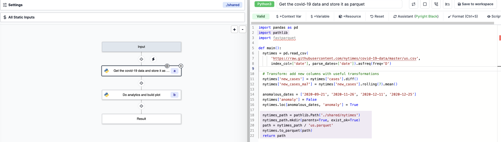

# Settings

The flow settings are divided into four tabs:

- [Metadata](#metadata)
- [Schedule](#schedule)
- [Shared Directory](#shared-directory)

## Metadata

The metadata tab allows you to configure the flow name, summary, and description.
Permissions can be configured in two ways:

- by User: select a user
- by Folder: select a folder

## Schedule

Flows can be triggered by any schedules, their webhooks or their UI but they only have only one primary schedules with which they share the same path. The primary schedule can be set here.

A CRON expression is used to define the schedule. Schedules can also be disabled.

:::tip

Have more details on how to schedule automatic flows [here](https://www.windmill.dev/blog/cron-job-schedules).

:::

## Shared Directory

Flows on Windmill are by default based on a result basis. A step will take as inputs the results of previous steps. And this works fine for lightweight automation.

For heavier ETLs, you might want to use the `Shared Directory` to share data between steps. Steps will share a folder at `./shared` in which they can store heavier data and pass them to the next step.

Beware that the `./shared` folder is not preserved across suspends and sleeps. The directory is temporary and active for the time of the execution.

To enable the shared directory, on the `Settings` menu, go to `Shared Directory` and toggle on `Shared Directory on './shared'`.

To use the shared directory, just load outputs using `./shared/${path}` and call it for following steps.

:::tip Example from the Demo workspace _Same worker example of using the './shared' folder_

Loading output

 

Calling as input

This flow can be found on the Demo workspace/.

:::

Another example is to be found from the [Hub](https://hub.windmill.dev/flows/32/same-worker-example-of-using-the-'.%2Fshared'-folder).