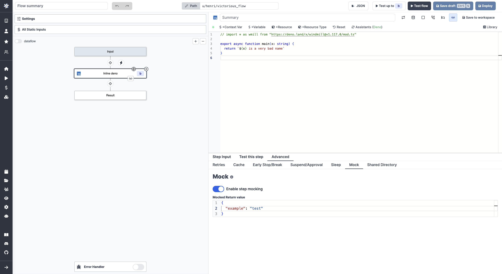

# Step Mocking

Step mocking allows faster iteration while building flows. When a step is mocked, it will immediately return the mocked value without performing any computation.

<video
    className="border-2 rounded-xl object-cover w-full h-full"
    autoPlay
    controls
    id="main-video"
    src="/videos/step_mocking.mp4"
/>

 

On a step, go to the `Advanced` menu and pick the "Mock" tab.

"Enable step mocking" and customize the Mocked Return value.

:::tip Cache for steps

The [cache for steps feature](./4_cache.mdx) allows you to cache the results of a step for a specified number of seconds, thereby reducing the need for redundant computations when re-running the same step with identical input.

:::
