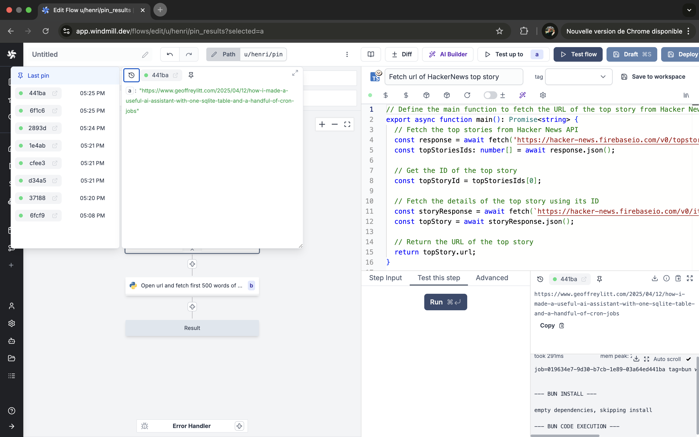
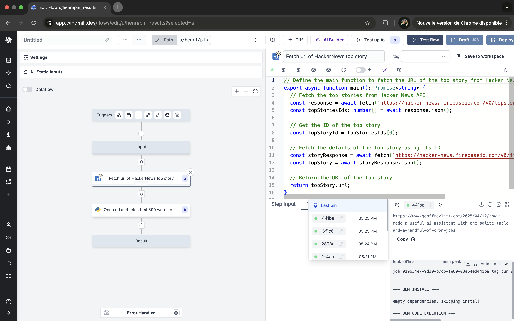
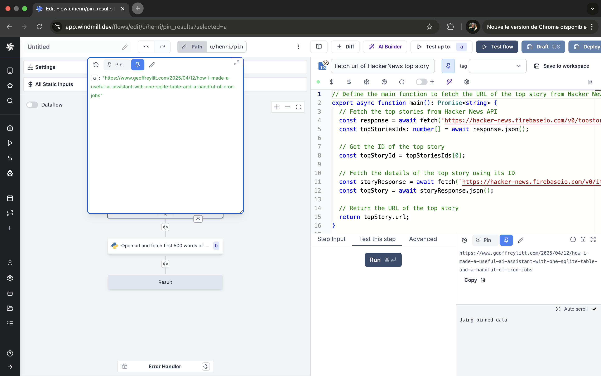
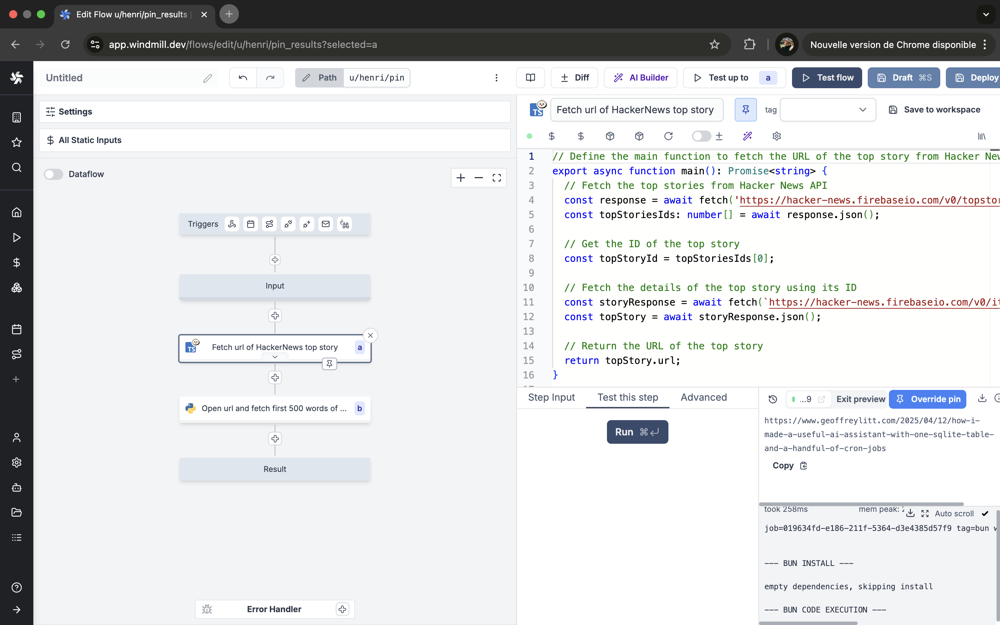
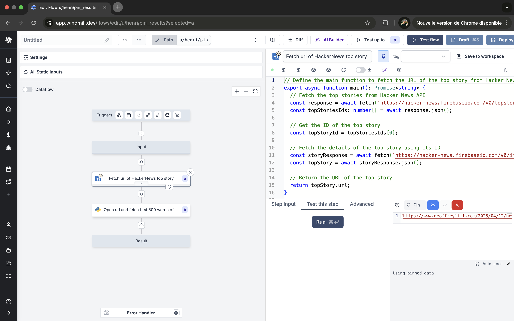

# Step mocking / Pin result

Step mocking and pinning results allows faster iteration while building flows. When a step is mocked or pinned, it will immediately return the specified value without performing any computation.

<iframe
	style={{ aspectRatio: '16/9' }}
	src="https://www.youtube.com/embed/-cATEh8saqU"
	title="YouTube video player"
	frameBorder="0"
	allow="accelerometer; autoplay; clipboard-write; encrypted-media; gyroscope; picture-in-picture; web-share"
	allowFullScreen
	className="border-2 rounded-lg object-cover w-full dark:border-gray-800"
></iframe>

 

## Mocking vs Pinning

There are two ways to control step execution:

1. **Mocking**: Set a custom return value that will be used instead of running the step.
2. **Pinning**: Use a previous successful run result as the return value.

## Accessing step results

You can access and manage step results in two ways:
1. Directly by clicking on the step bottom arrow in the flow view for quick access.

2. From the step's `Test this step` menu.

## Features

### History exploration
- Use the history button to explore previous step results.
- View and select from past successful runs.
- Imported flows and scripts retain their run history.

### Pinning results

Pin any successful run result to reuse it.

You can edit pinned data by overriding pin functionality (you can still test the step).

  

### Mocking

You can also edit the mocked value directly.

  
  
[Test step](./18_test_flows.mdx) functionality remains available even with pinned results.

:::tip Cache for steps

The [cache for steps feature](./4_cache.mdx) allows you to cache the results of a step for a specified number of seconds, thereby reducing the need for redundant computations when re-running the same step with identical input.

:::
