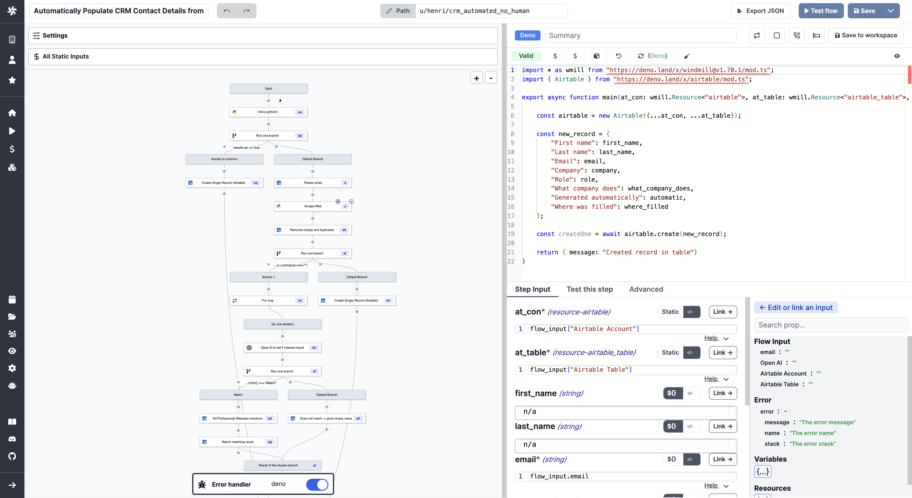

# Error Handler

The error handler is a special flow step that is executed when an error occurs in the flow.

If defined, the error handler will take as input, the result of the step that errored (which has its error in the 'error field').

<video
    className="border-2 rounded-xl object-cover w-full h-full dark:border-gray-800"
    autoPlay
    loop
    controls
    id="main-video"
    src="/videos/error_handler.mp4"
/>

 

Steps are retried until they succeed, or until the maximum number of retries defined for that spec is reached, at which point the error handler is called.

You can write error handler scripts in:

- [Python](https://docs.windmill.dev/docs/getting_started/scripts_quickstart/python/)
- [Typescript](https://docs.windmill.dev/docs/getting_started/scripts_quickstart/typescript/)
- [Go](https://docs.windmill.dev/docs/getting_started/scripts_quickstart/go/)

On the Hub, two examples of error handlers are provided:

- [Slack error handler](https://hub.windmill.dev/scripts/slack/1525/send-error-to-slack-channel-slack): sends a message to a Slack channel when an error occurs.
- [Discord error handler](https://hub.windmill.dev/scripts/discord/1523/send-the-error-to-discord-discord): sends a message to a Discord channel when an error occurs.

:::info Example

For instance, when building a workflow to [automatically populate a CRM details from an email](https://www.windmill.dev/blog/automatically-populate-crm), it was decided to set an Error Handler to still add the email on the CRM in case of error and not lose the contact's email.

 

:::
