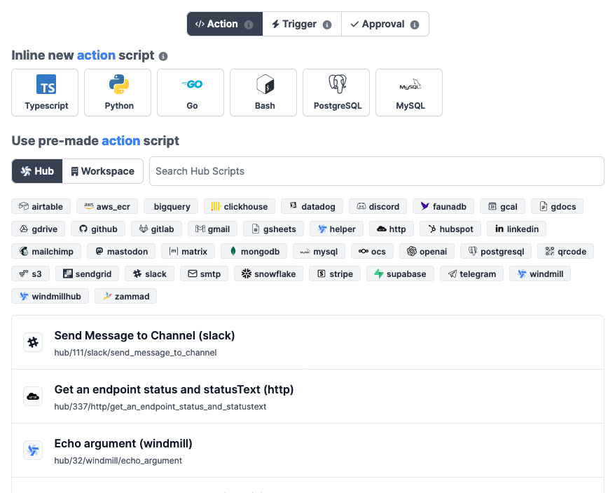

# Flow Actions

An action script is simply a script that is neither a trigger nor an approval
script. Those are the majority of the scripts.

There are two ways to create an action script:

- Write it directly in the flow editor
- Import it from the Hub
- Import it from the workspace

## Inline action script

You can either create a new action script in:

- [Python](/docs/getting_started/scripts_quickstart/python): Windmill provides a Python 3.11 environment.
- [Typescript](/docs/getting_started/scripts_quickstart/typescript): Windmill uses Deno as the TypeScript runtime.
- [Go](/docs/getting_started/scripts_quickstart/go)
- [Bash](/docs/getting_started/scripts_quickstart/bash)

There are two special kind of scripts:

- [Postgres](/docs/getting_started/scripts_quickstart/sql)
- [MySQL](/docs/getting_started/scripts_quickstart/sql)

These are essentially Typescript template to easily write queries to a database.

## Importing an action script from the Hub

You can import an action script from the Hub.

## Importing an action script from the workspace

You can import an action script from the workspace.

