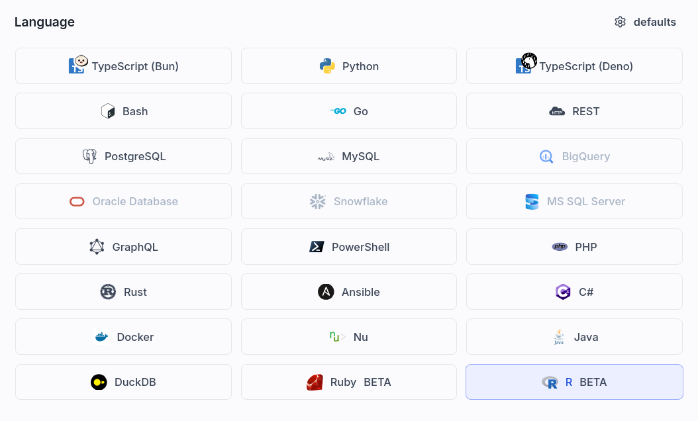
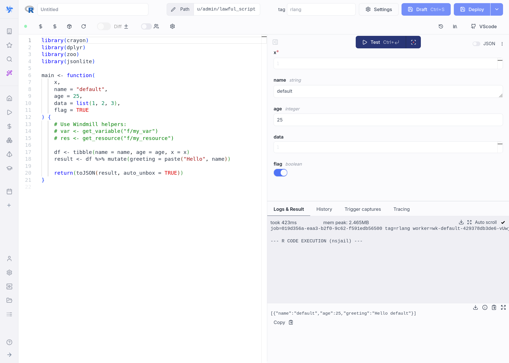
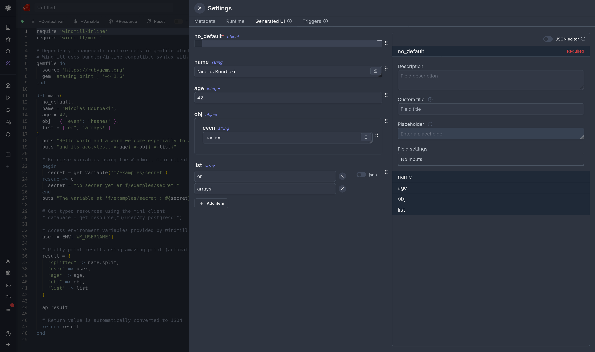

import DocCard from '@site/src/components/DocCard';

# R quickstart

In this quick start guide, we will write our first script in [R](https://www.r-project.org/).

{/* Placeholder: Add demo video for R scripts when available */}
{/* <div className="mb-4">
	<video
		className="border-2 rounded-xl object-cover w-full h-full dark:border-gray-800"
		autoPlay
		loop
		controls
		src="/videos/r.mp4"
		alt="R Demo"
		muted
	/>
</div> */}

<div className="grid grid-cols-2 gap-6 mb-4">
	<DocCard
		title="Local development"
		description="Develop from various environments such as your terminal, VS Code, and JetBrains IDEs."
		href="/docs/advanced/local_development"
	/>
	<DocCard
		title="Dependencies in R"
		description="How to manage dependencies in R scripts."
		href="/docs/getting_started/scripts_quickstart/r#dependencies-management"
	/>
</div>

Scripts are the basic building blocks in Windmill. They can be [run and scheduled](../../8_triggers/index.mdx) as standalone, chained together to create [Flows](../../../flows/1_flow_editor.mdx) or displayed with a personalized User Interface as [Apps](../../7_apps_quickstart/index.mdx).

<div className="grid grid-cols-2 gap-6 mb-4">
	<DocCard
		title="Script editor"
		description="All the details on scripts."
		href="/docs/script_editor"
	/>
	<DocCard
		title="Triggers"
		description="Trigger scripts and flows on-demand, by schedule or on external events."
		href="/docs/getting_started/triggers"
	/>
</div>

Scripts consist of 2 parts:

- [Code](#code): for R scripts, they must have a `main` function defined as `main <- function(...)`.
- [Settings](#settings): settings & metadata about the Script such as its path, summary, description, [jsonschema](../../../core_concepts/13_json_schema_and_parsing/index.mdx) of its inputs (inferred from its signature).

When stored in a code repository, these 2 parts are stored separately at `<path>.r` and `<path>.script.yaml`

Windmill automatically manages [dependencies](/docs/getting_started/scripts_quickstart/r#dependencies-management) for you.
When you use packages in your R script through `library()` or `require()` calls,
Windmill parses these dependencies upon saving the script and automatically resolves versions from CRAN,
ensuring that the same version of the script is always executed with the same versions of its dependencies.

This is a simple example of a script built in R with Windmill:

```r
library(httr)
library(jsonlite)

main <- function(url = "https://httpbin.org/get", message = "Hello from Windmill!") {
  response <- GET(url, query = list(message = message))

  list(
    status = status_code(response),
    body = content(response, as = "parsed"),
    message = "Request completed successfully"
  )
}
```

In this quick start guide, we'll create a script that greets the operator running it.

From the Home page, click `+Script`. This will take you to the first step of script creation: Metadata.

## Settings



As part of the [settings](../../../script_editor/settings.mdx) menu, each script has metadata associated with it, enabling it to be defined and configured in depth.

- **Path** is the Script's unique identifier that consists of the
  [script's owner](../../../core_concepts/16_roles_and_permissions/index.mdx), and the script's name.
  The owner can be either a user, or a group ([folder](../../../core_concepts/8_groups_and_folders/index.mdx#folders)).
- **Summary** (optional) is a short, human-readable summary of the Script. It
  will be displayed as a title across Windmill. If omitted, the UI will use the `path` by
  default.
- **Language** of the script.
- **Description** is where you can give instructions through the [auto-generated UI](../../../core_concepts/6_auto_generated_uis/index.mdx)
  to users on how to run your Script. It supports markdown.
- **Script kind**: Action (by default), [Trigger](../../../flows/10_flow_trigger.mdx), [Approval](../../../flows/11_flow_approval.mdx) or [Error handler](../../../flows/7_flow_error_handler.md). This acts as a tag to filter appropriate scripts from the [flow editor](../../6_flows_quickstart/index.mdx).

This menu also has additional settings on [Runtime](../../../script_editor/settings.mdx#runtime), [Generated UI](#generated-ui) and [Triggers](../../../script_editor/settings.mdx#triggers).

<div className="grid grid-cols-2 gap-6 mb-4">
	<DocCard
		title="Settings"
		description="Each script has metadata & settings associated with it, enabling it to be defined and configured in depth."
		href="/docs/script_editor/settings"
	/>
</div>

Now click on the code editor on the left side, and let's build our Hello World!

## Code

Windmill provides an online editor to work on your Scripts. The left-side is
the editor itself. The right-side [previews the UI](../../../core_concepts/6_auto_generated_uis/index.mdx) that Windmill will
generate from the Script's signature - this will be visible to the users of the
Script. You can preview that UI, provide input values, and [test your script](#instant-preview--testing) there.



<div className="grid grid-cols-2 gap-6 mb-4">
	<DocCard
		title="Code editor"
		description="The code editor is Windmill's integrated development environment."
		href="/docs/code_editor"
	/>
	<DocCard
		title="Auto-generated UIs"
		description="Windmill creates auto-generated user interfaces for scripts and flows based on their parameters."
		href="/docs/core_concepts/auto_generated_uis"
	/>
</div>

As we picked `R` for this example, Windmill provided some R
boilerplate. Let's take a look:

```r
library(crayon)
library(dplyr)
library(zoo)
library(jsonlite)

main <- function(
  x,
  name = "default",
  age = 25,
  data = list(1, 2, 3),
  flag = TRUE
) {
  # Use Windmill helpers:
  # var <- get_variable("f/my_var")
  # res <- get_resource("f/my_resource")

  df <- tibble(name = name, age = age, x = x)
  result <- df %>% mutate(greeting = paste("Hello", name))

  return(toJSON(result, auto_unbox = TRUE))
}
```

In Windmill, R scripts must have a `main` function defined as `main <- function(...)` that will be the script's
entrypoint. There are a few important things to note about the `main` function:

- The main arguments are used for generating
  1.  the [input spec](../../../core_concepts/13_json_schema_and_parsing/index.mdx) of the Script
  2.  the [frontend](../../../core_concepts/6_auto_generated_uis/index.mdx) that you see when running the Script as a standalone app.
- Default values are used to infer argument types and generate the UI form. String defaults create string inputs, numeric defaults create number inputs, list/vector defaults create appropriate JSON inputs, etc.
- You can customize the UI in later steps (but not change the input type!).

<div className="grid grid-cols-2 gap-6 mb-4">
	<DocCard
		title="JSON schema and parsing"
		description="JSON Schemas are used for defining the input specification for scripts and flows, and specifying resource types."
		href="/docs/core_concepts/json_schema_and_parsing"
	/>
</div>

Back to our Hello World. We can clean up the boilerplate, change the
main to take in the user's name. Let's also return the `name`, maybe we can use
this later if we use this Script within a [flow](../../../flows/1_flow_editor.mdx) or [app](../../../apps/0_app_editor/index.mdx) and need to pass its result on.

```r
main <- function(name = "World") {
  print(paste("Hello", name, "! Greetings from R!"))
  name
}
```

## Accessing variables and resources

R scripts can access Windmill [variables](../../../core_concepts/2_variables_and_secrets/index.mdx) and [resources](../../../core_concepts/3_resources_and_types/index.mdx) using built-in helper functions:

```r
library(httr)
library(jsonlite)

main <- function() {
  # Get a variable
  secret <- get_variable("f/examples/secret")

  # Get a resource (returns a list/object)
  db_config <- get_resource("f/examples/postgres")

  # Access context variables from environment
  user <- Sys.getenv("WM_USERNAME")
  workspace <- Sys.getenv("WM_WORKSPACE")

  list(
    secret = secret,
    db_host = db_config$host,
    user = user,
    workspace = workspace
  )
}
```

## Instant preview & testing

Look at the UI preview on the right: it was updated to match the input
signature. Run a test (`Ctrl` + `Enter`) to verify everything works.

You can change how the UI behaves by changing the main signature. For example,
if you remove the default for the `name` argument, the UI will consider this field
as required.

```r
main <- function(name)
```

<div className="grid grid-cols-2 gap-6 mb-4">
	<DocCard
		title="Instant preview & testing"
		description="On top of its integrated editors, Windmill allows users to see and test what they are building directly from the editor, even before deployment."
		href="/docs/core_concepts/instant_preview"
	/>
</div>

Now let's go to the last step: the "Generated UI" settings.

## Generated UI

From the Settings menu, the "Generated UI" tab lets you customize the script's arguments.

The UI is generated from the Script's main function signature, but you can add additional constraints here. For example, we could use the `Customize property`: add a regex by clicking on `Pattern` to make sure users are providing a name with only alphanumeric characters: `^[A-Za-z0-9]+$`. Let's still allow numbers in case you are some tech billionaire's kid.



<div className="grid grid-cols-2 gap-6 mb-4">
	<DocCard
		title="Script kind"
		description="You can attach additional functionalities to Scripts by specializing them into specific Script kinds."
		href="/docs/script_editor/script_kinds"
	/>
	<DocCard
		title="Generated UI"
		description="main function's arguments can be given advanced settings that will affect the inputs' auto-generated UI and JSON Schema."
		href="/docs/script_editor/customize_ui"
	/>
</div>

## Run!

We're done! Now let's look at what users of the script will do. Click on the [Deploy](../../../core_concepts/0_draft_and_deploy/index.mdx) button
to load the script. You'll see the user input form we defined earlier.

Note that Scripts are [versioned](../../../core_concepts/34_versioning/index.mdx#script-versioning) in Windmill, and
each script version is uniquely identified by a hash.

Fill in the input field, then hit "Run". You should see a run view, as well as
your logs. All script runs are also available in the [Runs](../../../core_concepts/5_monitor_past_and_future_runs/index.mdx) menu on
the left.

You can also choose to [run the script from the CLI](../../../advanced/3_cli/index.mdx) with the pre-made Command-line interface call.

<div className="grid grid-cols-2 gap-6 mb-4">
	<DocCard
		title="Triggers"
		description="Trigger scripts and flows on-demand, by schedule or on external events."
		href="/docs/getting_started/triggers"
	/>
</div>

## Dependencies management

R dependencies are automatically detected from `library()` and `require()` calls in your script. Windmill resolves package versions from CRAN:

```r
library(httr)
library(jsonlite)
library(dplyr)
library(ggplot2)

main <- function(data_url = "https://example.com/data.csv") {
  # Use httr for HTTP requests
  response <- GET(data_url)

  # Parse JSON responses
  data <- fromJSON(content(response, as = "text"))

  # Use dplyr for data manipulation
  result <- data %>%
    filter(!is.na(value)) %>%
    summarise(mean_value = mean(value))

  result
}
```

Windmill will automatically:
- Parse your `library()` and `require()` calls when you save the script
- Resolve versions from CRAN (with 3-day TTL caching for lockfiles)
- Install packages to a shared cache directory
- Cache dependencies for faster execution

### Verbose mode

By default, renv output is suppressed during package installation. To enable verbose output for debugging, add a `#verbose` annotation at the top of your script:

```r
#verbose

library(httr)
library(jsonlite)

main <- function() {
  # Your code here
}
```

## Caching

Every R package dependency is cached on disk by default. Furthermore if you use the [Distributed cache storage](../../../misc/13_s3_cache/index.mdx), it will be available to every other worker, allowing fast startup for every worker.

## What's next?

This script is a minimal working example, but there's a few more steps that can be useful in a real-world use case:

- Pass [variables and secrets](../../../core_concepts/2_variables_and_secrets/index.mdx)
  to a script.
- Connect to [resources](../../../core_concepts/3_resources_and_types/index.mdx).
- [Trigger that script](../../8_triggers/index.mdx) in many ways.
- Compose scripts in [Flows](../../../flows/1_flow_editor.mdx), [low-code apps](../../../apps/0_app_editor/index.mdx) or [full-code apps](../../../full_code_apps/index.mdx).
- You can [share your scripts](../../../misc/1_share_on_hub/index.md) with the community on [Windmill Hub](https://hub.windmill.dev). Once
  submitted, they will be verified by moderators before becoming available to
  everyone right within Windmill.

Scripts are immutable and there is a hash for each deployment of a given script. Scripts are never overwritten and referring to a script by path is referring to the latest deployed hash at that path.

<div className="grid grid-cols-2 gap-6 mb-4">
	<DocCard
		title="Versioning"
		description="Scripts, when deployed, can have a parent script identified by its hash."
		href="/docs/core_concepts/versioning#script-versioning"
	/>
</div>

For each script, a UI is autogenerated from the jsonschema inferred from the script signature, and can be customized further as standalone or embedded into rich UIs using the [App builder](../../7_apps_quickstart/index.mdx).

<div className="grid grid-cols-2 gap-6 mb-4">
	<DocCard
		title="Auto-generated UIs"
		description="Windmill creates auto-generated user interfaces for scripts and flows based on their parameters."
		href="/docs/core_concepts/auto_generated_uis"
	/>
	<DocCard
		title="Generated UI"
		description="main function's arguments can be given advanced settings that will affect the inputs' auto-generated UI and JSON Schema."
		href="/docs/script_editor/customize_ui"
	/>
</div>

In addition to the UI, sync and async [webhooks](../../../core_concepts/4_webhooks/index.mdx) are generated for each deployment.

<div className="grid grid-cols-2 gap-6 mb-4">
	<DocCard
		title="Webhooks"
		description="Trigger scripts and flows from webhooks."
		href="/docs/core_concepts/webhooks"
	/>
</div>
