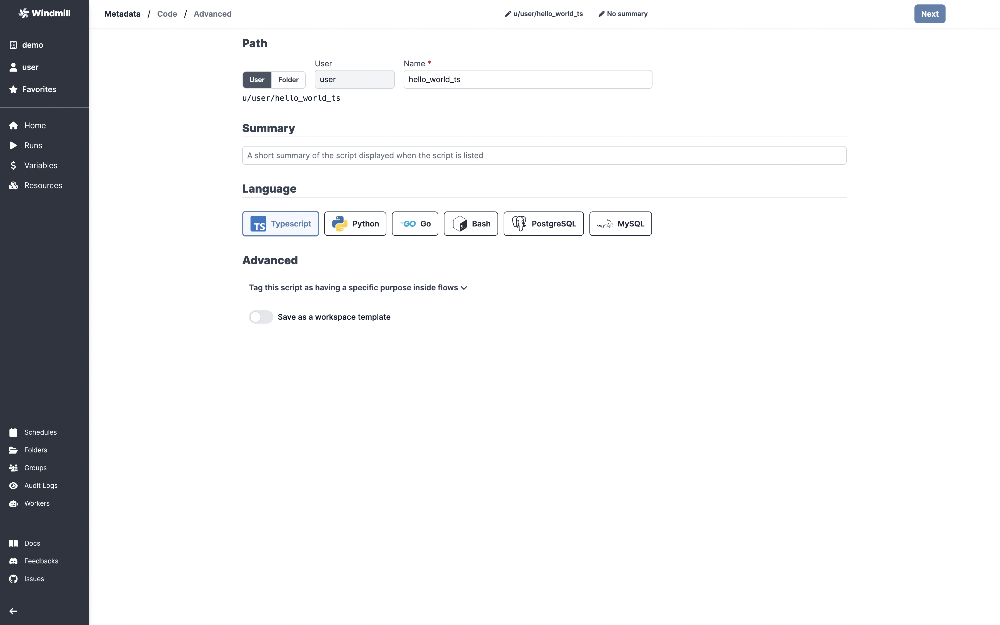

# TypeScript Quickstart

In this quick start guide, we will write our first script in TypeScript.
Windmill uses [Deno](https://deno.land/) as the TypeScript runtime.


<video
    className="border-2 rounded-xl object-cover w-full h-full"
    autoPlay
    loop
    controls
    id="main-video"
    src="/videos/typescrit_quickstart.mp4"
/>

<br/>

Scripts are the basic building blocks in Windmill. They can be run as standalone
apps, chained together to create [Flows][flows].

[This](https://hub.windmill.dev/scripts/gmail/1291/-send-email-gmail) is a simple example of a script built in TypeScript with Windmill.

In Windmill, Scripts consist of three parts:

- **Metadata**: information about the Script such as its path, description, and
  author, as well as configuration.
- **Logic**: the code.
- **UI**: a UI autogenerated from the script signature, that can be customized.

For more information about how Scripts and Flows are represented within
Windmill, also see the [OpenFlow Spec.][openflow]

In this quick start guide, we'll create a Script that greets the operator
running it. From the **Home** page, click "+Script". This will take you to the
first step of script creation: metadata.



## Metadata

- **Path** is the Script's unique identifier that consist of the
  [script's owner](../../../reference/index.md#owner), and the script's name.
  The owner can be either a user, or a group (folder). This defines the permissions on
  Windmill: selecting user will keep the script _private_ to the selected
  account, while selecting group will make it available to all users of the
  given group. Let's save this script under your path, and call it
  `hello_world_ts`.
- **Summary** (optional) is a short, human-readable summary of the Script. It
  will be displayed across Windmill. If omitted, the UI will use the `path` by
  default. Let's use "Greet the user by name".
- **Language** the language of the script. Windmill supports TypeScript, Python,
  Go, Bash and SQL. <!-- You can read more about environments.  -->Let's pick
  TypeScript!
- **Advanced** gives you access to more options, such as creating
  [specialized scripts](../../../reference/index.md) and saving the script as a
  template. We won't go into this in this quickstart.

Now hit "Next" in the top right corner, and let's build our Hello World!

## Code

**Windmill gives you an online editor** to work on your Scripts. The left-side is
the editor itself. The right-side lets you **preview the UI** that Windmill will
generate from the Script's signature - this will be visible to the users of the
Script. You can easily preview that UI, provide input values, and test your
script there.


As we picked `typescript` for this example, Windmill provided some TypeScript
boilerplate. Let's take a look:

```typescript
// Ctrl+. to cache dependencies on imports hover, Ctrl+S to format.

// import { toWords } from "npm:number-to-words@1"
// import * as wmill from "https://deno.land/x/windmill@v1.61.1/mod.ts"

export async function main(
  a: number,
  b: "my" | "enum",
  d = "inferred type string from default arg",
  c = { nested: "object" },
  //e: wmill.Base64
) {
  // let x = await wmill.getVariable('u/user/foo')
  return { foo: a };
}
```

In Windmill, scripts need to have a `main` function that will be the script's
entrypoint. There are a few important things to note about the `main`.

- The main arguments are used for generating 1. the input spec of the Script, and 2.
  the frontend that you see when running the Script as a standalone app.
- Type annotations are used to generate the UI form, and help pre-validate
  inputs. While not mandatory, they are highly recommended. You can customize
  the UI in later steps (but not change the input type!).

Also take a look at the import statement lines that are commented out. You can
use NPM imports directly in Windmill. The last import line imports the Windmill
client, that is needed for example to access
[variables](../../../core_concepts/2_variables_and_secrets/index.md) or
[resources](../../../core_concepts/3_resources_and_types/index.md). We won't go
into that here.

Back to our Hello World. We can clear up unused import statements, change the
main to take in the user's name. Let's also return the `name`, maybe we can use
this later if we use this Script within a Flow and need to pass it on.

```typescript
export async function main(name: string) {
  console.log("Hello world! Oh, it's you %s? Greetings!", name);
  return { name };
}
```

Look at the UI preview on the right: it was updated to match the input
signature. Run a preview to verify everything works.

You can change how the UI behaves by changing the main signature. For example,
if you add a default for the `name` argument, the UI won't consider this field
as required anymore.

```typescript
main(name: string = "you")
```

Now let's go to the last step: the "Advanced" settings.

## Advanced settings

In this step, you can:

- Add a **Description** to the Script. This is where you can give instructions
  to users on how to run your Script. It supports markdown!
- Customize the Script **Arguments**. The UI is generated from the Script's main
  function signature, but you can add additional constraints here. For example,
  we could use the `Format` add a regex here to make sure users are providing a
  name with only alphanumeric characters: `^[A-Za-z0-9]*$`. Let's still allow
  numbers in case you're some tech billionaire's kid.


We're done! Save your script. Note that Scripts are versioned in Windmill, and
each script version is uniquely identified by a hash.

## Run!

Now let's look at what users of this script will do. Click on the **Run** button
to load this script. You'll see the user input form we defined earlier.

Fill in the input field, then hit "Run". You should see a run view, as well as
your logs. All script runs are also available in the [Runs][app-runs] menu on
the left.


You can also chose to **run your script from the CLI** with the pre-made Command-Line Interface call.

## What's next?

This script is a minimal working example, but there's a few more steps we need
in a real-world use case:

- Pass
  [variables and secrets](../../../core_concepts/2_variables_and_secrets/index.md)
  to a script.
- Connect to [resources](../../../core_concepts/3_resources_and_types/index.md).
- Run scripts or flows on a
  [schedule](../../../getting_started/8_scheduling_scripts_flows/index.md).
- Compose scripts in [Flows][flows].
- You can [share your scripts](https://docs.windmill.dev/docs/misc/share_on_hub/) with the community on [Windmill Hub][wm-hub]. Once
  submitted, they will be verified by moderators before becoming available to
  everyone right within Windmill.

<!-- Resources -->

[flows]: ../../../getting_started/6_flows_quickstart/index.md
[app-runs]: https://app.windmill.dev/runs
[app-scripts]: https://app.windmill.dev/scripts
[deno]: https://deno.land/
[openflow]: ../../../openflow/index.md
[python]: https://www.python.org/
[wm-hub]: https://hub.windmill.dev
