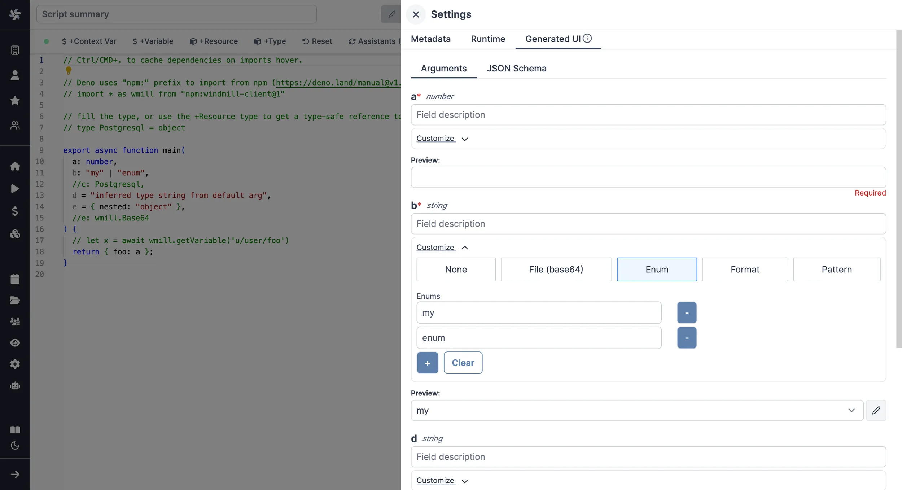

import DocCard from '@site/src/components/DocCard';

# TypeScript Quickstart

In this quick start guide, we will write our first script in TypeScript. Windmill uses [Deno](https://deno.land/) and [Bun](https://bun.sh/) as the TypeScript runtime.

<video
	className="border-2 rounded-xl object-cover w-full h-full dark:border-gray-800"
	autoPlay
	controls
	id="main-video"
	src="/videos/typescript_quickstart.mp4"
/>

<br />

Scripts are the basic building blocks in Windmill. They can be [run and scheduled](../../8_trigger_scripts/index.mdx) as standalone, chained together to create [Flows][flows] or displayed with a personalized User Interface as [Apps](../../7_apps_quickstart/index.mdx).

<div class="grid grid-cols-2 gap-6 mb-4">
	<DocCard
		title="Script Editor"
		description="All the details on scripts."
		href="/docs/script_editor"
	/>
	<DocCard
		title="Triggering Scripts"
		description="Trigger flows on-demand, by schedule or on external events."
		href="/docs/getting_started/trigger_scripts"
	/>
</div>

Scripts consist of 2 parts:

- [Code](#code): for typescript scripts, it must have at least a main function.
- [Metadata](#metadata): metadata about the Script such as its path, summary, description, [jsonschema](../../../core_concepts/13_json_schema_and_parsing/index.md) of its inputs (inferred from its signature).

When stored in a code repository, those 2 parts are stored separately at `<path>.ts` and `<path>.script.yaml`.

[This](https://hub.windmill.dev/scripts/slack/1284/send-message-to-channel-slack) is a simple example of a script built in TypeScript with Windmill:

```ts
import { WebClient } from "https://deno.land/x/slack_web_api@1.0.0/mod.ts";

type Slack = {
  token: string;
};
export async function main(text: string, channel: string, slack: Slack) {
  const web = new WebClient(slack.token);

  await web.chat.postMessage({
    channel,
    text,
  });
```

In this quick start guide, we'll create a script that greets the operator running it.

From the Home page, click `+Script`. This will take you to the
first step of script creation: Metadata.

## Metadata


Each script has metadata associated with it, enabling it to be defined and configured in depth.

- **Path** is the Script's unique identifier that consist of the
  [script's owner](../../../core_concepts/16_roles_and_permissions/index.mdx), and the script's name.
  The owner can be either a user, or a group ([folder](../../../core_concepts/8_groups_and_folders/index.mdx#folders)).
- **Summary** (optional) is a short, human-readable summary of the Script. It
  will be displayed as a title across Windmill. If omitted, the UI will use the `path` by
  default.
- **Language** of the script.
- **Description**: this is where you can give instructions
  to users on how to run your Script. It supports markdown!
- **[Concurrency limits](../../../script_editor/concurrency_limit.mdx)**: it allows you to define concurrency limits for scripts and inline scripts within flows to prevent exceeding the API Limit of the targeted API.
- **[Worker group tag](../../../core_concepts/9_worker_groups/index.md)**, if you want to run some scripts on a GPU machine.

<div class="grid grid-cols-2 gap-6 mb-4">
	<DocCard
		title="Metadata"
		description="Each script has metadata associated with it, enabling it to be defined and configured in depth."
		href="/docs/script_editor/metadata"
	/>
</div>

Now click on the code editor on the left side.

## Code

Windmill gives you an online editor to work on your Scripts. The left-side is
the editor itself. The right-side lets you [preview the UI](../../../core_concepts/6_auto_generated_uis/index.md) that Windmill will
generate from the Script's signature - this will be visible to the users of the
Script. You can easily preview that UI, provide input values, and test your
script there.


<div class="grid grid-cols-2 gap-6 mb-4">
	<DocCard
		title="Code Editor"
		description="The code editor is Windmill's integrated development environment."
		href="/docs/code_editor"
	/>
	<DocCard
		title="Auto-generated UIs"
		description="Windmill creates auto-generated user interfaces for scripts and flows based on their parameters."
		href="/docs/core_concepts/auto_generated_uis"
	/>
</div>

There are two options for runtimes in TypeScript:
- [Deno](#deno)
- [Bun](#bun) (compatible 1:1 with Node.js)

### Deno

As we picked `TypeScript (Deno)` for this example, Windmill provided some TypeScript
boilerplate. Let's take a look:

```typescript
// Ctrl/CMD+. to cache dependencies on imports hover.

// import { toWords } from "npm:number-to-words@1"
// import * as wmill from "https://deno.land/x/windmill@v1.147.3/mod.ts"

// fill the type, or use the +Resource type to get a type-safe reference to a resource
// type Postgresql = object

export async function main(
  a: number,
  b: "my" | "enum",
  //c: Postgresql,
  d = "inferred type string from default arg",
  e = { nested: "object" },
  //e: wmill.Base64
) {
  // let x = await wmill.getVariable('u/user/foo')
  return { foo: a };
}
```

In Windmill, scripts need to have a `main` function that will be the script's
entrypoint. There are a few important things to note about the `main`.

- The main arguments are used for generating
	1. the [input spec](../../../core_concepts/13_json_schema_and_parsing/index.md) of the Script
	2. the [frontend](../../../core_concepts/6_auto_generated_uis/index.md) that you see when running the Script as a standalone app.
- Type annotations are used to generate the UI form, and help pre-validate
  inputs. While not mandatory, they are highly recommended. You can customize
  the UI in later steps (but not change the input type!).

<div class="grid grid-cols-2 gap-6 mb-4">
	<DocCard
		title="JSON Schema and Parsing"
		description="JSON Schemas are used for defining the input specification for scripts and flows, and specifying resource types."
		href="/docs/core_concepts/json_schema_and_parsing"
	/>
</div>

Also take a look at the [import](../../../advanced/6_imports/index.md) statement lines that are commented out.
In Typescript, dependencies and their versions are contained in the script and hence there is no need for any additional steps.
The resolution is done by [deno](https://deno.com/runtime).
You can use NPM imports directly in Windmill. The last import line imports the Windmill
client, that is needed for example, to access
[variables](../../../core_concepts/2_variables_and_secrets/index.mdx) or
[resources](../../../core_concepts/3_resources_and_types/index.mdx). We won't go
into that here.

<div class="grid grid-cols-2 gap-6 mb-4">
	<DocCard
		title="Dependency Management & Imports"
		description="Windmill's strength lies in its ability to run scripts without having to deal with separate dependency files."
		href="/docs/advanced/imports"
	/>
	<DocCard
		title="TypeScript Client"
		description="The TypeScript client for Windmill allows you to interact with the Windmill platform using TypeScript in Deno / Bun runtime."
		href="/docs/advanced/clients/ts_client"
	/>
</div>

Back to our "Hello World". We can clear up unused import statements, change the
main to take in the user's name. Let's also return the `name`, maybe we can use
this later if we use this Script within a [flow](../../../flows/1_flow_editor.mdx) or [app](../../../apps/0_app_editor/index.mdx) and need to pass its result on.

```typescript
export async function main(name: string) {
	console.log("Hello world! Oh, it's you %s? Greetings!", name);
	return { name };
}
```

### Bun

As we picked `TypeScript (Bun)` for this example, Windmill provided some TypeScript
boilerplate. Let's take a look:

```typescript
// import { toWords } from "number-to-words@1"
import * as wmill from "windmill-client@1.147.3"

// fill the type, or use the +Resource type to get a type-safe reference to a resource
// type Postgresql = object

export async function main(
  a: number,
  b: "my" | "enum",
  //c: Postgresql,
  d = "inferred type string from default arg",
  e = { nested: "object" },
) {
  // let x = await wmill.getVariable('u/user/foo')
  return { foo: a };
}
```

In Windmill, scripts need to have a `main` function that will be the script's
entrypoint. There are a few important things to note about the `main`.

- The main arguments are used for generating
	1. the [input spec](../../../core_concepts/13_json_schema_and_parsing/index.md) of the Script
	2. the [frontend](../../../core_concepts/6_auto_generated_uis/index.md) that you see when running the Script as a standalone app.
- Type annotations are used to generate the UI form, and help pre-validate
  inputs. While not mandatory, they are highly recommended. You can customize
  the UI in later steps (but not change the input type!).

<div class="grid grid-cols-2 gap-6 mb-4">
	<DocCard
		title="JSON Schema and Parsing"
		description="JSON Schemas are used for defining the input specification for scripts and flows, and specifying resource types."
		href="/docs/core_concepts/json_schema_and_parsing"
	/>
</div>

Also take a look at the [import](../../../advanced/6_imports/index.md) statement lines that are commented out.
In Typescript, The dependencies and their versions are contained in the script and hence there is no need for any additional steps.
The TypeScript runtime is Bun, which is 100% compatible with Node.js without any code modifications.
You can use NPM imports directly in Windmill. The last import line imports the Windmill
client, that is needed for example, to access
[variables](../../../core_concepts/2_variables_and_secrets/index.mdx) or
[resources](../../../core_concepts/3_resources_and_types/index.mdx). We won't go
into that here.

<div class="grid grid-cols-2 gap-6 mb-4">
	<DocCard
		title="Dependency Management & Imports"
		description="Windmill's strength lies in its ability to run scripts without having to deal with separate dependency files."
		href="/docs/advanced/imports"
	/>
	<DocCard
		title="TypeScript Client"
		description="The TypeScript client for Windmill allows you to interact with the Windmill platform using TypeScript in Deno / Bun runtime."
		href="/docs/advanced/clients/ts_client"
	/>
</div>

Back to our "Hello World". We can clear up unused import statements, change the
main to take in the user's name. Let's also return the `name`, maybe we can use
this later if we use this Script within a [flow](../../../flows/1_flow_editor.mdx) or [app](../../../apps/0_app_editor/index.mdx) and need to pass its result on.

```typescript
export async function main(name: string) {
	console.log("Hello world! Oh, it's you %s? Greetings!", name);
	return { name };
}
```

## Instant Preview & Testing

Look at the UI preview on the right: it was updated to match the input
signature. Run a test (`Ctrl` + `Enter`) to verify everything works.

<video
    className="border-2 rounded-xl object-cover w-full h-full dark:border-gray-800"
    controls
    src="/videos/auto_g_ui_landing.mp4"
/>

<br/>

You can change how the UI behaves by changing the main signature. For example,
if you add a default for the `name` argument, the UI won't consider this field
as required anymore.

```typescript
main(name: string = "you")
```
<div class="grid grid-cols-2 gap-6 mb-4">
	<DocCard
		title="Instant Preview & Testing"
		description="On top of its integrated editors, Windmill allows users to test what they are building directly from the editor, even before deployment."
		href="/docs/core_concepts/instant_preview"
	/>
</div>

Now let's go to the last step: the "Customise" settings.

## Customize Settings

In this menu, you can:

- Give a **script kind**: Action (by default), [Trigger](../../../flows/10_flow_trigger.md), [Approval](../../../flows/11_flow_approval.md) or [Error Handler](../../../flows/7_flow_error_handler.md). This acts as a tag to filter appropriate scripts from the [flow editor](../../6_flows_quickstart/index.mdx).
- Customize the script's **Arguments**. The UI is generated from the Script's main function signature, but you can add additional constraints here. For example, we could use the `Customize property`: add a regex by clicking on `Pattern` to make sure users are providing a name with only alphanumeric characters: `^[A-Za-z0-9]+$`. Let's still allow numbers in case you are some tech billionaire's kid.



We're done! Save your script. Note that Scripts are versioned in Windmill, and
each script version is uniquely identified by a hash.

<div class="grid grid-cols-2 gap-6 mb-4">
	<DocCard
		title="Script Kinds"
		description="You can attach additional functionalities to Scripts by specializing them into specific Script kinds."
		href="/docs/script_editor/script_kinds"
	/>
	<DocCard
		title="Customize Arguments"
		description="Some arguments' types can be given advanced settings that will affect the inputs' auto-generated UI and JSON Schema."
		href="/docs/script_editor/customize_arguments"
	/>
</div>

## Run!

Now let's look at what users of the script will do. Click on the [Deploy](../../../core_concepts/0_draft_and_deploy/index.mdx) button
to load the script. You'll see the user input form we defined earlier.

Fill in the input field, then hit "Run". You should see a run view, as well as
your logs. All script runs are also available in the [Runs](../../../core_concepts/5_monitor_past_and_future_runs/index.mdx) menu on
the left.


You can also chose to [run the script from the CLI](../../../advanced/3_cli/index.mdx) with the pre-made Command-Line Interface call.

<div class="grid grid-cols-2 gap-6 mb-4">
	<DocCard
		title="Triggering Scripts"
		description="Trigger flows on-demand, by schedule or on external events."
		href="/docs/getting_started/trigger_scripts"
	/>
</div>

## What's next?

This script is a minimal working example, but there's a few more steps that can be useful in a real-world use case:

- Pass [variables and secrets](../../../core_concepts/2_variables_and_secrets/index.mdx)
  to a script.
- Connect to [resources](../../../core_concepts/3_resources_and_types/index.mdx).
- [Trigger that script](../../8_trigger_scripts/index.mdx) in many ways.
- Compose scripts in [Flows][flows] or [Apps](../../7_apps_quickstart/index.mdx).
- You can [share your scripts](../../../misc/1_share_on_hub/index.md) with the community on [Windmill Hub](https://hub.windmill.dev). Once
  submitted, they will be verified by moderators before becoming available to
  everyone right within Windmill.

Scripts are immutable and there is an hash for each deployment of a given script. Scripts are never overwritten and referring to a script by path is referring to the latest deployed hash at that path.

<div class="grid grid-cols-2 gap-6 mb-4">
	<DocCard
		title="Versioning"
		description="Scripts, when deployed, can have a parent script identified by its hash."
		href="/docs/script_editor/versioning"
	/>
</div>

For each script, a UI is autogenerated from the jsonchema inferred from the script signature, and can be customized further as standalone or embedded into rich UIs using the [App builder](../../7_apps_quickstart/index.mdx).

<div class="grid grid-cols-2 gap-6 mb-4">
	<DocCard
		title="Auto-generated UIs"
		description="Windmill creates auto-generated user interfaces for scripts and flows based on their parameters."
		href="/docs/core_concepts/auto_generated_uis"
	/>
	<DocCard
		title="Customize Arguments"
		description="Some arguments' types can be given advanced settings that will affect the inputs' auto-generated UI and JSON Schema."
		href="/docs/script_editor/customize_arguments"
	/>
</div>

In addition to the UI, sync and async [webhooks](../../../core_concepts/4_webhooks/index.md) are generated for each deployment.

<div class="grid grid-cols-2 gap-6 mb-4">
	<DocCard
		title="Webhooks"
		description="Trigger scripts and flows from webhooks."
		href="/docs/core_concepts/webhooks"
	/>
</div>
