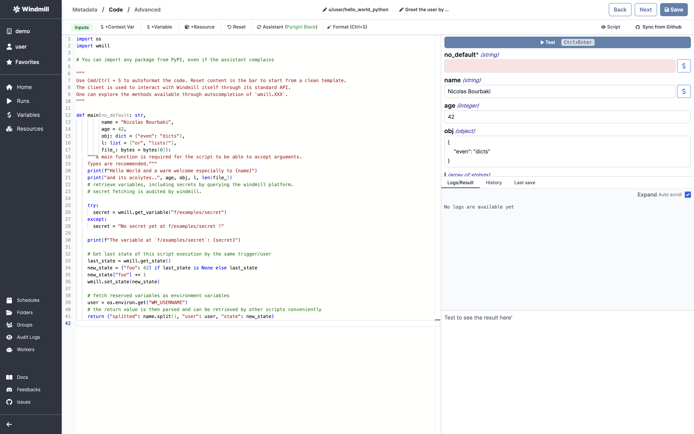

# Python Quickstart

In this quick start guide, we will write our first script in Python. Windmill provides a Python `3.11` environment.

<video
    className="border-2 rounded-xl object-cover w-full h-full"
    autoPlay
    loop
    controls
    id="main-video"
    src="/videos/python_quickstart.mp4"
/>

<br/>

Scripts are the basic building blocks in Windmill. They can be [run and scheduled](../../8_trigger_scripts/index.md) as standalone, chained together to create [Flows][flows] or displayed with a personalized UI as [Apps](../../7_apps_quickstart/index.md).

In Windmill, Scripts consist of three parts:

- **Metadata**: information about the Script such as its path, description, and
  author, as well as configuration.
- **Logic**: the code.
- **UI**: a UI autogenerated from the script signature, that can be customized.

For more information about how Scripts and Flows are represented within
Windmill, also see the [OpenFlow Spec][openflow].

[This](https://hub.windmill.dev/scripts/gmail/1291/-send-email-gmail) is a simple example of a script built in TypeScript with Windmill.

In this quick start guide, we'll create a Script that greets the operator running it.

From the **Home** page, click `+Script`. This will take you to the
first step of script creation: Metadata.


## Metadata

- **Path** is the Script's unique identifier that consist of the
  [script's owner](../../../reference/index.md#owner), and the script's name.
  The owner can be either a user, or a group ([folder](../../../core_concepts/8_groups_and_folders/index.md#folders)).
- **Summary** (optional) is a short, human-readable summary of the Script. It
  will be displayed as a title across Windmill. If omitted, the UI will use the `path` by
  default.
- **Language** the language of the script. Windmill supports TypeScript, Python,
  Go, Bash and SQL. Let's pick Python!
- **Description**: this is where you can give instructions
  to users on how to run your Script. It supports markdown!
- **[Worker group tag](../../../core_concepts/9_worker_groups/index.md)**, if you want to run some scripts on a GPU machine.

Now click on the code editor on the left side, and let's build our Hello World!

## Code

**Windmill gives you an online editor** to work on your Scripts. The left-side is
the editor itself. The right-side lets you **preview the UI** that Windmill will
generate from the Script's signature - this will be visible to the users of the
Script. You can easily preview that UI, provide input values, and test your
script there.



:::tip Auto-complete code with AI

Note that you can have [AI suggest code on Windmill](../../../misc/11_code_autocompletion/index.md):

<br/>

<video
    className="border-2 rounded-xl object-cover w-full h-full"
    controls
    id="main-video"
    src="/videos/codeium_example.mp4"
/>

:::

As we picked `python` for this example, Windmill provided some python
boilerplate. Let's take a look:

```python
import os
import wmill

# You can import any package from PyPI, even if the assistant complains

"""
Use Cmd/Ctrl + S to autoformat the code. Reset content in the bar to start from a clean template.
The client is used to interact with Windmill itself through its standard API.
One can explore the methods available through autocompletion of `wmill.XXX`.
"""

def main(no_default: str,
         name = "Nicolas Bourbaki",
         age = 42,
         obj: dict = {"even": "dicts"},
         l: list = ["or", "lists!"],
         file_: bytes = bytes(0)):
    """A main function is required for the script to be able to accept arguments.
    Types are recommended."""
    print(f"Hello World and a warm welcome especially to {name}")
    print("and its acolytes..", age, obj, l, len(file_))
    # retrieve variables, including secrets by querying the windmill platform.
    # secret fetching is audited by windmill.

    try:
      secret = wmill.get_variable("f/examples/secret")
    except:
      secret = "No secret yet at f/examples/secret !"

    print(f"The variable at `f/examples/secret`: {secret}")
    
    # Get last state of this script execution by the same trigger/user
    last_state = wmill.get_state()
    new_state = {"foo": 42} if last_state is None else last_state
    new_state["foo"] += 1
    wmill.set_state(new_state)

    # fetch reserved variables as environment variables
    user = os.environ.get("WM_USERNAME")
    # the return value is then parsed and can be retrieved by other scripts conveniently
    return {"splitted": name.split(), "user": user, "state": new_state}
```

In Windmill, scripts need to have a `main` function that will be the script's
entrypoint. There are a few important things to note about the `main`.

- The main arguments are used for generating 1. the input spec of the Script, and 2.
  the frontend that you see when running the Script as a standalone app.
- Type annotations are used to generate the UI form, and help pre-validate
  inputs. While not mandatory, they are highly recommended. You can customize
  the UI in later steps (but not change the input type!).

Also take a look at the [import](../../../advanced/6_imports/index.md) statement lines that are commented out. You can
use NPM imports directly in Windmill. The last import line imports the Windmill
client, that is needed for example to access
[variables](../../../core_concepts/2_variables_and_secrets/index.md) or
[resources](../../../core_concepts/3_resources_and_types/index.md). We won't go
into that here.

Back to our Hello World. We can clear up unused import statements, change the
main to take in the user's name. Let's also return the `name`, maybe we can use
this later if we use this Script within a Flow and need to pass it on.

```py
def main(name:str):
  print("Hello world. Oh, it's you {}? Greetings!".format(name))
  return name
```

Look at the UI preview on the right: it was updated to match the input
signature. Run a preview (`Ctrl` + `Enter`) to verify everything works.

You can change how the UI behaves by changing the main signature. For example,
if you add a default for the `name` argument, the UI won't consider this field
as required anymore.

```py
main(name: string = "you")
```

Now let's go to the last step: the "Customise" settings.


## Advanced settings

In this step, you can:

- Give a **script kind**: Action (by default), [Trigger](../../../flows/10_flow_trigger.md), [Approval](../../../flows/11_flow_approval.md) or [Error Handler](../../../flows/7_flow_error_handler.md). This acts as a tag to filter appropriate scripts from the [flow editor](../../6_flows_quickstart/index.md).
- Customize the Script **Arguments**. The UI is generated from the Script's main function signature, but you can add additional constraints here. For example, we could use the `Customize property`: add a regex here clicking on `Pattern` to make sure users are providing a name with only alphanumeric characters: `^[A-Za-z0-9]+$`. Let's still allow numbers in case you're some tech billionaire's kid.


We're done! Save your script. Note that Scripts are versioned in Windmill, and
each script version is uniquely identified by a hash.

## Run!

Now let's look at what users of this script will do. Click on the **[Deploy](../../../core_concepts/0_draft_and_deploy/index.md)** button
to load this script. You'll see the user input form we defined earlier.

Fill in the input field, then hit "Run". You should see a run view, as well as
your logs. All script runs are also available in the [Runs][app-runs] menu on
the left.


You can also chose to [run your script from the CLI](../../../advanced/3_cli/index.md) with the pre-made Command-Line Interface call.

## What's next?

This script is a minimal working example, but there's a few more steps we need
in a real-world use case:

- Pass
  [variables and secrets](../../../core_concepts/2_variables_and_secrets/index.md)
  to a script.
- Connect to [resources](../../../core_concepts/3_resources_and_types/index.md).
- [Trigger that script](../../8_trigger_scripts/index.md) in many ways.
- Compose scripts in [Flows][flows] or [Apps](../../7_apps_quickstart/index.md).
- You can [share your scripts](../../../misc/1_share_on_hub/index.md) with the community on [Windmill Hub][wm-hub]. Once
  submitted, they will be verified by moderators before becoming available to
  everyone right within Windmill.

<!-- Resources -->

[flows]: ../../../getting_started/6_flows_quickstart/index.md
[app-runs]: https://app.windmill.dev/runs
[app-scripts]: https://app.windmill.dev/scripts
[deno]: https://deno.land/
[openflow]: ../../../openflow/index.md
[python]: https://www.python.org/
[wm-hub]: https://hub.windmill.dev
