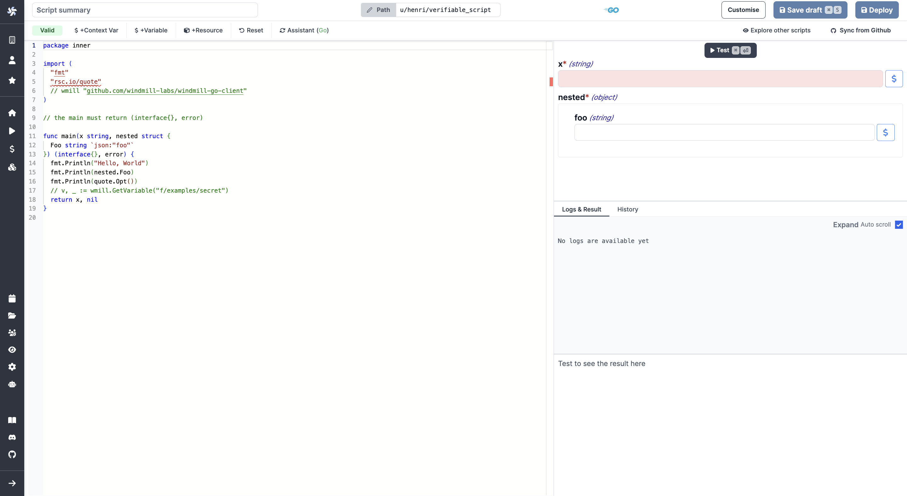
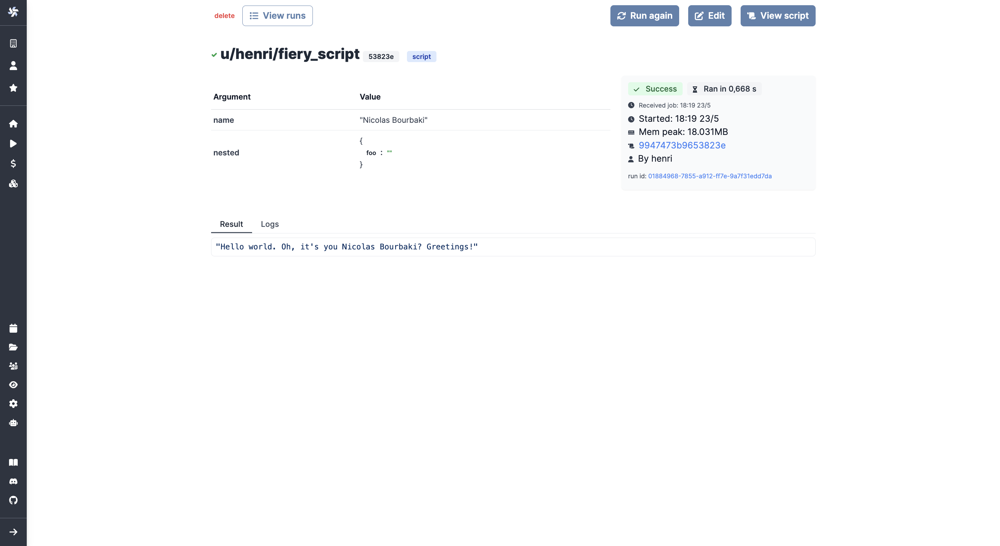

import DocCard from '@site/src/components/DocCard';

# Go quickstart

In this quick start guide, we will write our first script in Go.

<iframe
	style={{ aspectRatio: '16/9' }}
	src="https://www.youtube.com/embed/QRf8C8qF7CY"
	title="Scripts quickstart"
	frameBorder="0"
	allow="accelerometer; autoplay; clipboard-write; encrypted-media; gyroscope; picture-in-picture; web-share"
	allowFullScreen
	className="border-2 rounded-lg object-cover w-full dark:border-gray-800"
></iframe>

<br/>

This tutorial covers how to create a simple script through Windmill web IDE. See the dedicated page to [develop scripts locally](../../../advanced/4_local_development/index.mdx).

<div className="grid grid-cols-2 gap-6 mb-4">
	<DocCard
		title="Local development"
		description="Develop from various environments such as your terminal, VS Code, and JetBrains IDEs."
		href="/docs/advanced/local_development"
	/>
</div>

Scripts are the basic building blocks in Windmill. They can be [run and scheduled](../../8_triggers/index.mdx) as standalone, chained together to create [Flows](../../../flows/1_flow_editor.mdx) or displayed with a personalized User Interface as [Apps](../../7_apps_quickstart/index.mdx).

<div className="grid grid-cols-2 gap-6 mb-4">
	<DocCard
		title="Script editor"
		description="All the details on scripts."
		href="/docs/script_editor"
	/>
	<DocCard
		title="Triggers"
		description="Trigger scripts and flows on-demand, by schedule or on external events."
		href="/docs/getting_started/triggers"
	/>
</div>

Scripts consist of 2 parts:

- [Code](#code): for Go scripts, it must have at least a main function.
- [Settings](#settings): settings & metadata about the Script such as its path, summary, description, [JSON Schema](../../../core_concepts/13_json_schema_and_parsing/index.mdx) of its inputs (inferred from its signature).

When stored in a code repository, those 2 parts are stored separately at `<path>.go` and `<path>.script.yaml`.

Below is a simple example of a script built in Go with Windmill:

```go
package inner

import (
	"net/http"
)

func main(url string) (bool, error) {
	resp, err := http.Get(url) // send a GET request to the provided URL
	if err != nil {
		return false, err // if there is an error, return false and the error
	}
	defer resp.Body.Close() // make sure to close the response body when the function returns

	// if the status code is between 200 and 299, the page exists
	if resp.StatusCode >= 200 && resp.StatusCode <= 299 {
		return true, nil
	}

	// if the status code is not between 200 and 299, the page does not exist
	return false, nil
}
```

In this quick start guide, we'll create a script that greets the operator running it.

From the Home page, click `+Script`. This will take you to the first step of script creation: [Metadata](../../../script_editor/settings.mdx#metadata).

## Settings


As part of the [settings](../../../script_editor/settings.mdx) menu, each script has metadata associated with it, enabling it to be defined and configured in depth.

- **Summary** (optional) is a short, human-readable summary of the Script. It will be displayed as a title across Windmill. If omitted, the UI will use the `path` by default.
- **Path** is the Script's unique identifier that consists of the [script's owner](../../../core_concepts/16_roles_and_permissions/index.mdx), and the script's name. The owner can be either a user, or a group ([folder](../../../core_concepts/8_groups_and_folders/index.mdx#folders)).
- **Description** is where you can give instructions through the [auto-generated UI](../../../core_concepts/6_auto_generated_uis/index.mdx) to users on how to run your Script. It supports markdown.
- **Language** of the script.
- **Script kind**: Action (by default), [Trigger](../../../flows/10_flow_trigger.mdx), [Approval](../../../flows/11_flow_approval.mdx), [Error handler](../../../flows/7_flow_error_handler.md) or [Preprocessor](../../../core_concepts/43_preprocessors/index.mdx). This acts as a tag to filter appropriate scripts from the [flow editor](../../6_flows_quickstart/index.mdx).

This menu also has additional settings on [Runtime](../../../script_editor/settings.mdx#runtime), [Generated UI](#generated-ui) and [Triggers](../../../script_editor/settings.mdx#triggers).

<div className="grid grid-cols-2 gap-6 mb-4">
	<DocCard
		title="Settings"
		description="Each script has metadata & settings associated with it, enabling it to be defined and configured in depth."
		href="/docs/script_editor/settings"
	/>
</div>

Now click on the code editor on the left side.

## Code

Windmill provides an online editor to work on your Scripts. The left-side is
the editor itself. The right-side [previews the UI](../../../core_concepts/6_auto_generated_uis/index.mdx) that Windmill will
generate from the Script's signature - this will be visible to the users of the
Script. You can preview that UI, provide input values, and [test your script](#instant-preview--testing) there.



<div className="grid grid-cols-2 gap-6 mb-4">
	<DocCard
		title="Code editor"
		description="The code editor is Windmill's integrated development environment."
		href="/docs/code_editor"
	/>
	<DocCard
		title="Auto-generated UIs"
		description="Windmill creates auto-generated user interfaces for scripts and flows based on their parameters."
		href="/docs/core_concepts/auto_generated_uis"
	/>
</div>

As we picked `Go` for this example, Windmill provided some Go
boilerplate. Let's take a look:

```go
package inner

import (
	"fmt"
	"rsc.io/quote"
	// wmill "github.com/windmill-labs/windmill-go-client"
)

// the main must return (interface{}, error)

func main(x string, nested struct {
	Foo string `json:"foo"`
}) (interface{}, error) {
	fmt.Println("Hello, World")
	fmt.Println(nested.Foo)
	fmt.Println(quote.Opt())
	// v, _ := wmill.GetVariable("f/examples/secret")
	return x, nil
}
```

In Windmill, scripts need to have a `main` function that will be the script's
entrypoint. There are a few important things to note about the `main`.

- The main arguments are used for generating
  1.  the [input spec](../../../core_concepts/13_json_schema_and_parsing/index.mdx) of the Script
  2.  the [frontend](../../../core_concepts/6_auto_generated_uis/index.mdx) that you see when running the Script as a standalone app.
- Type annotations are used to generate the UI form, and help pre-validate
  inputs. While not mandatory, they are highly recommended. You can customize
  the UI in later steps (but not change the input type!).
- In Go, the main function must return (interface{}, error).

<div className="grid grid-cols-2 gap-6 mb-4">
	<DocCard
		title="JSON schema and parsing"
		description="JSON Schemas are used for defining the input specification for scripts and flows, and specifying resource types."
		href="/docs/core_concepts/json_schema_and_parsing"
	/>
</div>

The last import line imports the Windmill client, which is needed for example to access
[variables](../../../core_concepts/2_variables_and_secrets/index.mdx) or
[resources](../../../core_concepts/3_resources_and_types/index.mdx).

In Go, the dependencies and their versions are contained in the script and hence there is no need for any additional steps.

<div className="grid grid-cols-2 gap-6 mb-4">
	<DocCard
		title="Dependency management & imports"
		description="Windmill's strength lies in its ability to run scripts without having to manage a package.json directly."
		href="/docs/advanced/imports"
	/>
</div>

Back to our Hello World. We can clean up unused import statements, change the
main to take in the user's name. Let's also return the `name`, maybe we can use
this later if we use this Script within a [flow](../../../flows/1_flow_editor.mdx) or [app](../../../apps/0_app_editor/index.mdx) and need to pass its result on.

```go
package inner

import (
	"fmt"
)

func main(name string) (string, error) {
	return fmt.Sprintf("Hello %s", name), nil
}
```

## Instant preview & testing

Look at the UI preview on the right: it was updated to match the input
signature. Run a test (`Ctrl` + `Enter`) to verify everything works.

<video
	className="border-2 rounded-lg object-cover w-full h-full dark:border-gray-800"
	controls
	src="/videos/auto_g_ui_landing.mp4"
/>

<br />

<div className="grid grid-cols-2 gap-6 mb-4">
	<DocCard
		title="Instant preview & testing"
		description="On top of its integrated editors, Windmill allows users to see and test what they are building directly from the editor, even before deployment."
		href="/docs/core_concepts/instant_preview"
	/>
</div>

Now let's go to the last step: the "Generated UI" settings.

## Generated UI

From the Settings menu, the "Generated UI" tab lets you customize the script's arguments.

The UI is generated from the Script's main function signature, but you can add additional constraints here. For example, we could use the `Customize property`: add a regex by clicking on `Pattern` to make sure users are providing a name with only alphanumeric characters: `^[A-Za-z0-9]+$`. Let's still allow numbers in case you are some tech billionaire's kid.


<div className="grid grid-cols-2 gap-6 mb-4">
	<DocCard
		title="Script kind"
		description="You can attach additional functionalities to Scripts by specializing them into specific Script kinds."
		href="/docs/script_editor/script_kinds"
	/>
	<DocCard
		title="Generated UI"
		description="main function's arguments can be given advanced settings that will affect the inputs' auto-generated UI and JSON Schema."
		href="/docs/script_editor/customize_ui"
	/>
</div>

## Run!

We're done! Now let's look at what users of the script will do. Click on the [Deploy](../../../core_concepts/0_draft_and_deploy/index.mdx) button
to load the script. You'll see the user input form we defined earlier.

Note that Scripts are [versioned](../../../core_concepts/34_versioning/index.mdx#script-versioning) in Windmill, and
each script version is uniquely identified by a hash.

Fill in the input field, then hit "Run". You should see a run view, as well as
your logs. All script runs are also available in the [Runs](../../../core_concepts/5_monitor_past_and_future_runs/index.mdx) menu on
the left.



You can also choose to [run the script from the CLI](../../../advanced/3_cli/index.mdx) with the pre-made Command-line interface call.

<div className="grid grid-cols-2 gap-6 mb-4">
	<DocCard
		title="Triggers"
		description="Trigger scripts and flows on-demand, by schedule or on external events."
		href="/docs/getting_started/triggers"
	/>
</div>

## Caching

Every bundle on Go is cached on disk by default. Furtherfore if you use the [Distributed cache storage](../../../misc/13_s3_cache/index.mdx), it will be available to every other worker, allowing fast startup for every worker.

## What's next?

This script is a minimal working example, but there's a few more steps that can be useful in a real-world use case:

- Pass [variables and secrets](../../../core_concepts/2_variables_and_secrets/index.mdx)
  to a script.
- Connect to [resources](../../../core_concepts/3_resources_and_types/index.mdx).
- [Trigger that script](../../8_triggers/index.mdx) in many ways.
- Compose scripts in [Flows](../../../flows/1_flow_editor.mdx) or [Apps](../../../apps/0_app_editor/index.mdx).
- You can [share your scripts](../../../misc/1_share_on_hub/index.md) with the community on [Windmill Hub](https://hub.windmill.dev). Once
  submitted, they will be verified by moderators before becoming available to
  everyone right within Windmill.

Scripts are immutable and there is an hash for each deployment of a given script. Scripts are never overwritten and referring to a script by path is referring to the latest deployed hash at that path.

<div className="grid grid-cols-2 gap-6 mb-4">
	<DocCard
		title="Versioning"
		description="Scripts, when deployed, can have a parent script identified by its hash."
		href="/docs/core_concepts/versioning#script-versioning"
	/>
</div>

For each script, a UI is autogenerated from the jsonchema inferred from the script signature, and can be customized further as standalone or embedded into rich UIs using the [App builder](../../7_apps_quickstart/index.mdx).

<div className="grid grid-cols-2 gap-6 mb-4">
	<DocCard
		title="Auto-generated UIs"
		description="Windmill creates auto-generated user interfaces for scripts and flows based on their parameters."
		href="/docs/core_concepts/auto_generated_uis"
	/>
	<DocCard
		title="Generated UI"
		description="main function's arguments can be given advanced settings that will affect the inputs' auto-generated UI and JSON Schema."
		href="/docs/script_editor/customize_ui"
	/>
</div>

In addition to the UI, sync and async [webhooks](../../../core_concepts/4_webhooks/index.mdx) are generated for each deployment.

<div className="grid grid-cols-2 gap-6 mb-4">
	<DocCard
		title="Webhooks"
		description="Trigger scripts and flows from webhooks."
		href="/docs/core_concepts/webhooks"
	/>
</div>
