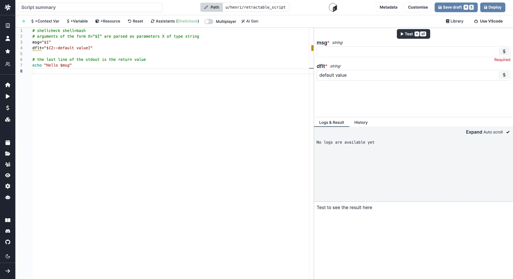
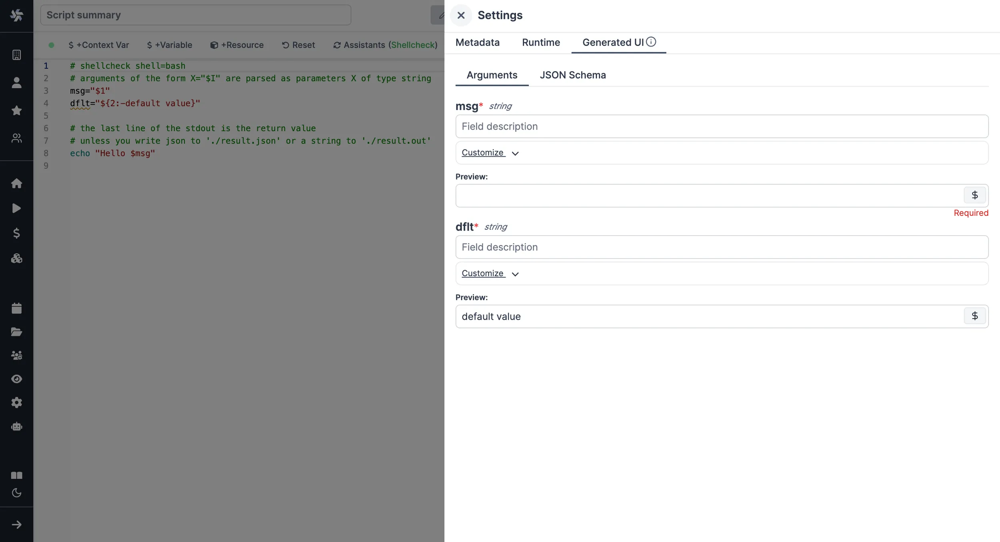

import DocCard from '@site/src/components/DocCard';

# Bash Quickstart

In this quick start guide, we will write our first script in Bash.

Scripts are the basic building blocks in Windmill. They can be [run and scheduled](../../8_trigger_scripts/index.mdx) as standalone, chained together to create [Flows][flows] or displayed with a personalized UI as [Apps](../../7_apps_quickstart/index.mdx).

<div class="grid grid-cols-2 gap-6 mb-4">
	<DocCard
		title="Script Editor"
		description="All the details on scripts."
		href="/docs/script_editor"
	/>
	<DocCard
		title="Triggering Scripts"
		description="Trigger flows on-demand, by schedule or on external events."
		href="/docs/getting_started/trigger_scripts"
	/>
</div>

Scripts consists of 2 parts:

- **Code**: your bash script
- **Metadata**: metadata about the Script such as its path, summary, description, [jsonschema](../../../core_concepts/13_json_schema_and_parsing/index.md) of its inputs (inferred from its signature)

<div class="grid grid-cols-2 gap-6 mb-4">
	<DocCard
		title="Code Editor"
		description="The code editor is Windmill's integrated development environment."
		href="/docs/code_editor"
	/>
	<DocCard
		title="JSON Schema and Parsing"
		description="JSON Schemas are used for defining the input specification for scripts and flows, and specifying resource types."
		href="/docs/core_concepts/json_schema_and_parsing"
	/>
</div>

When stored in a code repository, those 2 parts are stored separately at `<path>.ts` and `<path>.script.yaml`

Scripts are immutable and there is an hash for each deployment of a given script. Scripts are never overwritten and referring to a script by path is referring to the latest deployed hash at that path.

<div class="grid grid-cols-2 gap-6 mb-4">
	<DocCard
		title="Versioning"
		description="Scripts, when deployed, can have a parent script identified by its hash."
		href="/docs/script_editor/versioning"
	/>
</div>

Bash can be used to run [docker](../../../advanced/7_docker/index.md) containers.

For each script, a UI is autogenerated from the jsonchema inferred from the script signature, and can be customized further as standalone or embedded into rich UIs using the [App builder](../../7_apps_quickstart/index.mdx).

<div class="grid grid-cols-2 gap-6 mb-4">
	<DocCard
		title="Auto-generated UIs"
		description="Windmill creates auto-generated user interfaces for scripts and flows based on their parameters."
		href="/docs/core_concepts/auto_generated_uis"
	/>
	<DocCard
		title="Customize Arguments"
		description="Some arguments' types can be given advanced settings that will affect the inputs' auto-generated UI and JSON Schema."
		href="/docs/script_editor/customize_arguments"
	/>
</div>

In addition to the UI, sync and async webhooks are generated for each deployment.

<div class="grid grid-cols-2 gap-6 mb-4">
	<DocCard
		title="Webhooks"
		description="Trigger scripts and flows from webhooks."
		href="/docs/core_concepts/webhooks"
	/>
</div>

[This](https://hub.windmill.dev/scripts/gmail/1291/-send-email-gmail) is a simple example of a script built in TypeScript with Windmill.

In this quick start guide, we'll create a script that greets the operator running it.

From the **Home** page, click `+Script`. This will take you to the
first step of script creation: Metadata.


## Metadata

- **Path** is the Script's unique identifier that consist of the
  [script's owner](../../../core_concepts/16_roles_and_permissions/index.mdx), and the script's name.
  The owner can be either a user, or a group ([folder](../../../core_concepts/8_groups_and_folders/index.mdx#folders)).
- **Summary** (optional) is a short, human-readable summary of the Script. It
  will be displayed as a title across Windmill. If omitted, the UI will use the `path` by
  default.
- **Language** of the script. Windmill supports TypeScript, Python,
  Go, Bash and SQL. Let's pick Bash!
- **Description**: this is where you can give instructions
  to users on how to run your Script. It supports markdown!
- **[Concurrency limits](../../../script_editor/concurrency_limit.mdx)**: it allows you to define concurrency limits for scripts and inline scripts within flows to prevent exceeding the API Limit of the targeted API.
- **[Worker group tag](../../../core_concepts/9_worker_groups/index.md)**, if you want to run some scripts on a GPU machine.

<div class="grid grid-cols-2 gap-6 mb-4">
	<DocCard
		title="Metadata"
		description="Each script has metadata associated with it, enabling it to be defined and configured in depth."
		href="/docs/script_editor/metadata"
	/>
</div>

Now click on the code editor on the left side, and let's build our Hello World!

## Code

**Windmill gives you an online editor** to work on your Scripts. The left-side is
the editor itself. The right-side lets you **preview the UI** that Windmill will
generate from the Script's signature - this will be visible to the users of the
Script. You can easily preview that UI, provide input values, and test your
script there.



<div class="grid grid-cols-2 gap-6 mb-4">
	<DocCard
		title="Code Editor"
		description="The code editor is Windmill's integrated development environment."
		href="/docs/code_editor"
	/>
	<DocCard
		title="Auto-generated UIs"
		description="Windmill creates auto-generated user interfaces for scripts and flows based on their parameters."
		href="/docs/core_concepts/auto_generated_uis"
	/>
</div>

As we picked `Bash` for this example, Windmill provided some Bash
boilerplate. Let's take a look:

```bash
# shellcheck shell=bash
# arguments of the form X="$I" are parsed as parameters X of type string
msg="$1"
dflt="${2:-default value}"

# the last line of the stdout is the return value
echo "Hello $msg"
```

In bash, the arguments are inferred from the arguments requiring a $1, $2, $3. Default arguments can be specified using the syntax above: `dflt="${2:-default value}"`

The last import line imports the Windmill
client, that is needed for example to access
[variables](../../../core_concepts/2_variables_and_secrets/index.mdx) or
[resources](../../../core_concepts/3_resources_and_types/index.mdx). We won't go
into that here.

Back to our Hello World. We can clear up unused import statements, change the
main to take in the user's name. Let's also return the `name`, maybe we can use
this later if we use this Script within a Flow and need to pass it on.

```bash
name="$1"

echo "Hello world! Oh, it's you $name? Greetings"
```

Look at the UI preview on the right: it was updated to match the input
signature. Run a test (`Ctrl` + `Enter`) to verify everything works.

Now let's go to the last step: the "Customise" settings.

## Customize Settings

In this step, you can:

- Give a **script kind**: Action (by default), [Trigger](../../../flows/10_flow_trigger.md), [Approval](../../../flows/11_flow_approval.md) or [Error Handler](../../../flows/7_flow_error_handler.md). This acts as a tag to filter appropriate scripts from the [flow editor](../../6_flows_quickstart/index.mdx).
- Customize the script's **Arguments**. The UI is generated from the Script's main function signature, but you can add additional constraints here. For example, we could use the `Customize property`: add a regex by clicking on `Pattern` to make sure users are providing a name with only alphanumeric characters: `^[A-Za-z0-9]+$`. Let's still allow numbers in case you are some tech billionaire's kid.



We're done! Save your script. Note that Scripts are versioned in Windmill, and
each script version is uniquely identified by a hash.

<div class="grid grid-cols-2 gap-6 mb-4">
	<DocCard
		title="Script Kinds"
		description="You can attach additional functionalities to Scripts by specializing them into specific Script kinds."
		href="/docs/script_editor/script_kinds"
	/>
	<DocCard
		title="Customize Arguments"
		description="Some arguments' types can be given advanced settings that will affect the inputs' auto-generated UI and JSON Schema."
		href="/docs/script_editor/customize_arguments"
	/>
</div>

## Run!

Now let's look at what users of the script will do. Click on the **[Deploy](../../../core_concepts/0_draft_and_deploy/index.mdx)** button
to load the script. You'll see the user input form we defined earlier.

Fill in the input field, then hit "Run". You should see a run view, as well as
your logs. All script runs are also available in the [Runs][app-runs] menu on
the left.


You can also chose to [run the script from the CLI](../../../advanced/3_cli/index.mdx) with the pre-made Command-Line Interface call.

## What's next?

This script is a minimal working example, but there's a few more steps we need
in a real-world use case:

- Pass
  [variables and secrets](../../../core_concepts/2_variables_and_secrets/index.mdx)
  to a script.
- Connect to [resources](../../../core_concepts/3_resources_and_types/index.mdx).
- [Trigger that script](../../8_trigger_scripts/index.mdx) in many ways.
- Compose scripts in [Flows][flows] or [Apps](../../7_apps_quickstart/index.mdx).
- You can [share your scripts](../../../misc/1_share_on_hub/index.md) with the community on [Windmill Hub][wm-hub]. Once
  submitted, they will be verified by moderators before becoming available to
  everyone right within Windmill.

<!-- Resources -->

[flows]: ../../../getting_started/6_flows_quickstart/index.mdx
[app-runs]: https://app.windmill.dev/runs
[app-scripts]: https://app.windmill.dev/scripts
[wm-hub]: https://hub.windmill.dev
