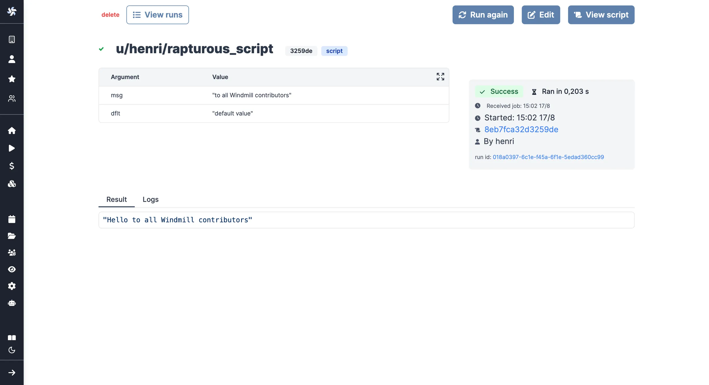

import DocCard from '@site/src/components/DocCard';
import Tabs from '@theme/Tabs';
import TabItem from '@theme/TabItem';

# Bash / PowerShell / Nu quickstart

In this quick start guide, we will write our first script in Bash, PowerShell or Nu.

<video
	className="border-2 rounded-lg object-cover w-full h-full dark:border-gray-800"
	autoPlay
	controls
	id="main-video"
	src="/videos/bash_quickstart.mp4"
/>

<br />

This tutorial covers how to create a simple script through Windmill web IDE. See the dedicated page to [develop scripts locally](../../../advanced/4_local_development/index.mdx).

<div className="grid grid-cols-2 gap-6 mb-4">
	<DocCard
		title="Local development"
		description="Develop from various environments such as your terminal, VS Code, and JetBrains IDEs."
		href="/docs/advanced/local_development"
	/>
</div>

Scripts are the basic building blocks in Windmill. They can be [run and scheduled](../../8_triggers/index.mdx) as standalone, chained together to create [Flows](../../../flows/1_flow_editor.mdx) or displayed with a personalized User Interface as [Apps](../../7_apps_quickstart/index.mdx).

<div className="grid grid-cols-2 gap-6 mb-4">
	<DocCard
		title="Script editor"
		description="All the details on scripts."
		href="/docs/script_editor"
	/>
	<DocCard
		title="Triggers"
		description="Trigger scripts and flows on-demand, by schedule or on external events."
		href="/docs/getting_started/triggers"
	/>
</div>

Scripts consist of 2 parts:

- [Code](#code).
- [Settings](#settings): settings & metadata about the Script such as its path, summary, description, [JSON Schema](../../../core_concepts/13_json_schema_and_parsing/index.mdx) of its inputs (inferred from its signature).

When stored in a code repository, those 2 parts are stored separately at `<path>.sh` and `<path>.script.yaml`.

Below is a simple example of a script built in Bash/Powershell/Nu with Windmill:

<Tabs className="unique-tabs">
<TabItem value="bash" label="Bash" attributes={{className: "text-xs p-4 !mt-0 !ml-0"}}>

```bash
# shellcheck shell=bash
# arguments of the form X="$I" are parsed as parameters X of type string
url="${1:-default value}"

status_code=$(curl -s -o /dev/null -w "%{http_code}" $url)

if [[ $status_code == 2* ]] || [[ $status_code == 3* ]]; then
  echo "The URL is reachable!"
else
  echo "The URL is not reachable."
fi
```

</TabItem>
<TabItem value="powershell" label="PowerShell" attributes={{className: "text-xs p-4 !mt-0 !ml-0"}}>

```powershell
param($url = "default value")

$status_code = (Invoke-WebRequest -Uri $url -Method Get).StatusCode

if ($status_code -like "2*" -or $status_code -like "3*") {
    Write-Host "The URL is reachable!"
} else {
    Write-Host "The URL is not reachable."
}
```
</TabItem>
<TabItem value="nu" label="Nu" attributes={{className: "text-xs p-4 !mt-0 !ml-0"}}>

```python
def main [
  url: string = "default value"
] {
  try {
    # Nu will throw an error automatically if request fails
    http get $url
    echo "The URL is reachable!"
  } catch {
    echo "The URL is not reachable."
  }
}
```

</TabItem>
</Tabs>

In this quick start guide, we'll create a script that greets the operator running it.

From the Home page, click `+Script`. This will take you to the first step of script creation: [Metadata](../../../script_editor/settings.mdx#metadata).

## Settings


As part of the [settings](../../../script_editor/settings.mdx) menu, each script has metadata associated with it, enabling it to be defined and configured in depth.

- **Summary** (optional) is a short, human-readable summary of the Script. It will be displayed as a title across Windmill. If omitted, the UI will use the `path` by default.
- **Path** is the Script's unique identifier that consists of the [script's owner](../../../core_concepts/16_roles_and_permissions/index.mdx), and the script's name. The owner can be either a user, or a group ([folder](../../../core_concepts/8_groups_and_folders/index.mdx#folders)).
- **Description** is where you can give instructions through the [auto-generated UI](../../../core_concepts/6_auto_generated_uis/index.mdx) to users on how to run your Script. It supports markdown.
- **Language** of the script.
- **Script kind**: Action (by default), [Trigger](../../../flows/10_flow_trigger.mdx), [Approval](../../../flows/11_flow_approval.mdx), [Error handler](../../../flows/7_flow_error_handler.md) or [Preprocessor](../../../core_concepts/43_preprocessors/index.mdx). This acts as a tag to filter appropriate scripts from the [flow editor](../../6_flows_quickstart/index.mdx).

This menu also has additional settings on [Runtime](../../../script_editor/settings.mdx#runtime), [Generated UI](#generated-ui) and [Triggers](../../../script_editor/settings.mdx#triggers).

<div className="grid grid-cols-2 gap-6 mb-4">
	<DocCard
		title="Settings"
		description="Each script has metadata & settings associated with it, enabling it to be defined and configured in depth."
		href="/docs/script_editor/settings"
	/>
</div>

Now click on the code editor on the left side.

## Code

Windmill provides an online editor to work on your Scripts. The left-side is
the editor itself. The right-side [previews the UI](../../../core_concepts/6_auto_generated_uis/index.mdx) that Windmill will
generate from the Script's signature - this will be visible to the users of the
Script. You can preview that UI, provide input values, and [test your script](#instant-preview--testing) there.


<div className="grid grid-cols-2 gap-6 mb-4">
	<DocCard
		title="Code editor"
		description="The code editor is Windmill's integrated development environment."
		href="/docs/code_editor"
	/>
	<DocCard
		title="Auto-generated UIs"
		description="Windmill creates auto-generated user interfaces for scripts and flows based on their parameters."
		href="/docs/core_concepts/auto_generated_uis"
	/>
</div>

### Bash

As we picked `Bash` for this example, Windmill provided some Bash
boilerplate. Let's take a look:

```bash
# shellcheck shell=bash
# arguments of the form X="$I" are parsed as parameters X of type string
msg="$1"
dflt="${2:-default value}"

# the last line of the stdout is the return value
echo "Hello $msg"
```

In Bash, the arguments are inferred from the arguments requiring a \$1, \$2, \$3. Default arguments can be specified using the syntax above: `dflt="${2:-default value}"`.

The last line of the output, here `echo "Hello $msg"`, is the return value, which might be useful if the script is used in a [flow](../../../flows/1_flow_editor.mdx) or [app](../../../apps/0_app_editor/index.mdx) to pass its result on.

### PowerShell

As we picked `PowerShell` for this example, Windmill provided some PowerShell
boilerplate. Let's take a look:

```powershell
param($Msg, [string[]]$Names, [PSCustomObject]$Obj, $Dflt = "default value", [int]$Nb = 3)

# Import-Module MyModule

# the last line of the stdout is the return value
Write-Output "Hello $Msg"
```

In PowerShell, the arguments are inferred from the param instruction. It has to be first in the script.
Arguments can be of type `string`, `int`/`long`/`double`/`decimal`/`single`, `PSCustomObject` (parsed from JSON), `datetime`, `bool` and array of these types.
Default arguments can be specified using the following syntax: `$argument_name = "Its default value"`.

The last line of the output, here `Write-Output "Hello $Msg"`, is the return value, which might be useful if the script is used in a [flow](../../../flows/1_flow_editor.mdx) or [app](../../../apps/0_app_editor/index.mdx) to pass its result on.

### Nu

Unlike `Bash` and `PowerShell`, `Nu` requires main function and all arguments should defined in signature.
It supports typed, optional and default arguments.

<Tabs className="unique-tabs">
<TabItem value="simple" label="Simple" attributes={{className: "text-xs p-4 !mt-0 !ml-0"}}>

```python
def main [ msg, dflt = "default value", nb: number = 3 ] {
	echo $"Hello ($msg)"
}
```
</TabItem>
<TabItem value="complete" label="Complete" attributes={{className: "text-xs p-4 !mt-0 !ml-0"}}>

```python
use std assert
# Nushell
# A new type of shell
def main [
    no_default: string,
    name = "Nicolas Bourbaki",
    age: int = 42,
    date_of_birth?: datetime,
    obj: record = {"records": "included"},
    l: list<string> = ["or", "lists!"],
    tables?: table,
    enable_kill_mode?: bool = true,
] {
    # Test
    # https://www.nushell.sh/book/testing.html
		assert ($age == 42)

    print $"Hello World and a warm welcome especially to ($name)"
    print "and its acolytes.." $age $obj $l
    print $tables

    let secret = try { 
      get_variable f/examples/secret
    } catch { 
      'No secret yet at f/examples/secret !' 
    };

    print $"The variable at \`f/examples/secret\`: ($secret)"
    # fetch context variables
    let user = $env.WM_USERNAME

    # Nu pipelines
    ls | where size > 1kb | sort-by modified | print "ls:" $in

    # Nu works with existing data
    # Nu speaks JSON, YAML, SQLite, Excel, and more out of the box. 
    # It's easy to bring data into a Nu pipeline whether it's in a file, a database, or a web API:
    let nu_license = http get https://api.github.com/repos/nushell/nushell | get license

    return { splitted: ($name | split words), user: $user, nu_license: $nu_license}
    # Interested in learning more?
    # https://www.nushell.sh/book/getting_started.html

```

</TabItem>
</Tabs>

One of the strong sides of `Nu` is that it is cross-platform. If you have linux workers and [windows workers](../../../misc/17_windows_workers/index.mdx)
Nushell scripts will be able to run on both!

If you are interested in `Nu` you can read their [official documentation](https://www.nushell.sh/book/getting_started.html)

## Instant preview & testing

Look at the UI preview on the right: it was updated to match the input
signature. Run a test (`Ctrl` + `Enter`) to verify everything works.

<video
	className="border-2 rounded-lg object-cover w-full h-full dark:border-gray-800"
	controls
	src="/videos/auto_g_ui_landing.mp4"
/>

<br />

You can change how the UI behaves by changing the main signature. For example, if you add a default for the `name` argument, the UI won't consider this field as required anymore.

<Tabs className="unique-tabs">
<TabItem value="bash" label="Bash" attributes={{className: "text-xs p-4 !mt-0 !ml-0"}}>

```bash
argument_name="${1:-Its default value}"
```

</TabItem>
<TabItem value="powershell" label="PowerShell" attributes={{className: "text-xs p-4 !mt-0 !ml-0"}}>

```bash
$argument_name = "Its default value"
```

</TabItem>
<TabItem value="nu" label="Nu" attributes={{className: "text-xs p-4 !mt-0 !ml-0"}}>

```python
def main [ argument_name = "Its default value" ] { }
```

</TabItem>
</Tabs>

<div className="grid grid-cols-2 gap-6 mb-4">
	<DocCard
		title="Instant preview & testing"
		description="On top of its integrated editors, Windmill allows users to see and test what they are building directly from the editor, even before deployment."
		href="/docs/core_concepts/instant_preview"
	/>
</div>

Now let's go to the last step: the "Generated UI" settings.

## Generated UI

From the Settings menu, the "Generated UI" tab lets you customize the script's arguments.

The UI is generated from the Script's main function signature, but you can add additional constraints here. For example, we could use the `Customize property`: add a regex by clicking on `Pattern` to make sure users are providing a name with only alphanumeric characters: `^[A-Za-z0-9]+$`. Let's still allow numbers in case you are some tech billionaire's kid.


<div className="grid grid-cols-2 gap-6 mb-4">
	<DocCard
		title="Script kind"
		description="You can attach additional functionalities to Scripts by specializing them into specific Script kinds."
		href="/docs/script_editor/script_kinds"
	/>
	<DocCard
		title="Generated UI"
		description="main function's arguments can be given advanced settings that will affect the inputs' auto-generated UI and JSON Schema."
		href="/docs/script_editor/customize_ui"
	/>
</div>

## Run!

We're done! Now let's look at what users of the script will do. Click on the [Deploy](../../../core_concepts/0_draft_and_deploy/index.mdx) button
to load the script. You'll see the user input form we defined earlier.

Note that Scripts are [versioned](../../../core_concepts/34_versioning/index.mdx#script-versioning) in Windmill, and
each script version is uniquely identified by a hash.

Fill in the input field, then hit "Run". You should see a run view, as well as
your logs. All script runs are also available in the [Runs](../../../core_concepts/5_monitor_past_and_future_runs/index.mdx) menu on
the left.



You can also choose to [run the script from the CLI](../../../advanced/3_cli/index.mdx) with the pre-made Command-line interface call.

<div className="grid grid-cols-2 gap-6 mb-4">
	<DocCard
		title="Triggers"
		description="Trigger scripts and flows on-demand, by schedule or on external events."
		href="/docs/getting_started/triggers"
	/>
</div>

## JSON result

The last line returned by the script will be the string result. To use a json result instead, output your result in `./result.json` and it will be automatically picked-up and considered as the JSON result for Bash and Powershell scripts.

For Nu first returned data from main function will be used as a result.

## Run Docker containers

In some cases where your task requires a complex set of dependencies or is implemented in a non-supported language, you can still include it as a flow step or individual script.

Windmill supports running any docker container through its Bash support. As a pre-requisite, the host docker daemon needs to be mounted into the worker container. This is done through a simple volume mount: `/var/run/docker.sock:/var/run/docker.sock`.

<div className="grid grid-cols-2 gap-6 mb-4">
	<DocCard
		title="Run Docker containers"
		description="In some cases where your task requires a complex set of dependencies or is implemented in a non-supported language, you can still include it as a flow step or individual script."
		href="/docs/advanced/docker"
	/>
</div>

## What's next?

This script is a minimal working example, but there's a few more steps that can be useful in a real-world use case:

- Pass [variables and secrets](../../../core_concepts/2_variables_and_secrets/index.mdx)
  to a script.
- Connect to [resources](../../../core_concepts/3_resources_and_types/index.mdx).
- [Trigger that script](../../8_triggers/index.mdx) in many ways.
- Compose scripts in [Flows](../../../flows/1_flow_editor.mdx) or [Apps](../../../apps/0_app_editor/index.mdx).
- You can [share your scripts](../../../misc/1_share_on_hub/index.md) with the community on [Windmill Hub](https://hub.windmill.dev). Once
  submitted, they will be verified by moderators before becoming available to
  everyone right within Windmill.

Scripts are immutable and there is an hash for each deployment of a given script. Scripts are never overwritten and referring to a script by path is referring to the latest deployed hash at that path.

<div className="grid grid-cols-2 gap-6 mb-4">
	<DocCard
		title="Versioning"
		description="Scripts, when deployed, can have a parent script identified by its hash."
		href="/docs/core_concepts/versioning#script-versioning"
	/>
</div>

For each script, a UI is autogenerated from the jsonchema inferred from the script signature, and can be customized further as standalone or embedded into rich UIs using the [App builder](../../7_apps_quickstart/index.mdx).

<div className="grid grid-cols-2 gap-6 mb-4">
	<DocCard
		title="Auto-generated UIs"
		description="Windmill creates auto-generated user interfaces for scripts and flows based on their parameters."
		href="/docs/core_concepts/auto_generated_uis"
	/>
	<DocCard
		title="Generated UI"
		description="main function's arguments can be given advanced settings that will affect the inputs' auto-generated UI and JSON Schema."
		href="/docs/script_editor/customize_ui"
	/>
</div>

In addition to the UI, sync and async [webhooks](../../../core_concepts/4_webhooks/index.mdx) are generated for each deployment.

<div className="grid grid-cols-2 gap-6 mb-4">
	<DocCard
		title="Webhooks"
		description="Trigger scripts and flows from webhooks."
		href="/docs/core_concepts/webhooks"
	/>
</div>
