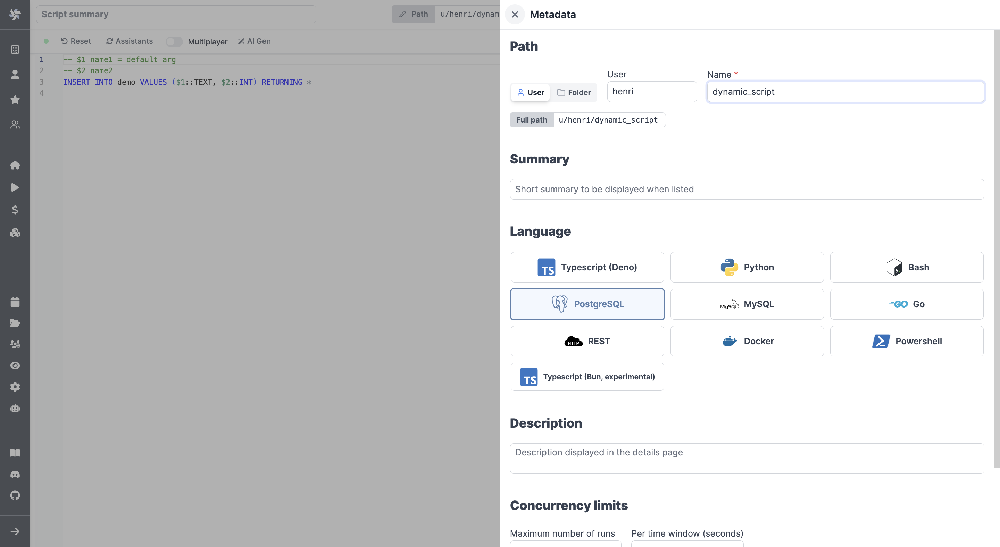

# SQL Quickstart

We will see how to connect a Windmill instance to an external PostgreSQL
service and then send queries to the database using Windmill Scripts.


:::info

Windmill SQL scripts are actually Typescript using a [Deno import](https://deno.land/x/windmill@v1.103.0/mod.ts) as it allows one to use parametrized statement thanks to type inference of the parameters. Find more technical details on the [Typescript Quickstart](../1_typescript_quickstart/index.md).

<br/>

We are strongly considering adding PostgresSQL as a fully supported language in the future, please [reach out to us](../../../misc/6_getting_help/index.md) if that would be a need on your side.

:::

There are two recommended ways to send SQL queries in Windmill scripts:
1. Configure scripts with a dedicated prepared statement for each query type (recommended for security reasons).
2. Configure a single script that accepts raw queries, which is simpler but less secure.

We'll explore both options.

## Create Resource

Windmill provides integration with many different apps and services with the use
of [Resources][docs-resources]. Each Resource has a **Resources Type**, which
controls the shape of it. To be able to connect to a Postgres instance ([Supabase](../../../integrations/supabase.md), [Neon.tech](../../../integrations/neon.md)), we'll need to define a Resource with the `postgresql` Resource Type first.

:::tip

You can find a list of all the officially supported Resource Types on
[Windmill Hub][hub-resources].

:::

Head to the <a href="https://app.windmill.dev/resources" rel="nofollow">Resources</a> page in the Windmill app, click on
"Add a resource/API" in the top right corner and select the `postgresql` type.


Fill out the form with the information of your PostgreSQL instance.

:::tip

For testing purposes, you can use the sample PostgreSQL Resource provided to
every user. It is available unde the path `f/examples/demodb`.

:::


## Create Script

Next, let's create a script that will use the newly created Resource. Head on to
the <a href="https://app.windmill.dev/" rel="nofollow">Home</a> page and click on the "+Script" button. Name the Script
`my_postgres_script`, give it a summary, "Query a PostgreSQL Database" for
example and select "PostgreSQL" as the language.



We will use PostgreSQL's' parameterized queries with the template being written in
TypeScript.

As given by the template, there are two ways to execute queries from Windmill.

### SQL Prepared Statement

The first option is to go with a prepared statement:

```typescript
import {
  pgSql,
  type Resource,
} from "https://deno.land/x/windmill@v1.103.0/mod.ts";

//PG parameterized statement. No SQL injection is possible.
export async function main(
  db: Resource<"postgresql"> = "$res:f/examples/demodb",
  key: number,
  value: string,
) {
  const query = await pgSql(
    db,
  )`INSERT INTO demo VALUES (${key}, ${value}) RETURNING *`;
  return query.rows;

```

This way, malicious or clumsy users could only use the table credentials for limited commands, here `INSERT INTO demo VALUES (${key}, ${value}) RETURNING *`.

At the workspace level, you could have scripts for each tolerated command (and for example simplify their use within a [flow](../../6_flows_quickstart/index.md) with [branches](../../../flows/13_flow_branches.md)).


:::info

This code should be the default one when you select **PostgreSQL** as the
language.

:::

Now try running the script with the following arguments. You should see the
inserted values returned in the bottom right corner.

- **db** - select the Resource we created in the previous step
- **key** - `42`
- **value** - `Test value`

### Raw Queries

A more convenient but less secure option is to accept raw queries as input:

```typescript
import { pgClient, type Resource, type Sql } from "https://deno.land/x/windmill@v1.88.1/mod.ts";

export async function main(
  db: Resource<"postgresql">,
  query: Sql = "SELECT * FROM demo;",
) {
  if(!query) {
    throw Error('Query must not be empty.')
  }
  const { rows } = await pgClient(db).queryObject(query);
  return rows;
}
```
This will allow you to execute all commands from one script. But that's also the vulnerability of it as it opens the door to harmful commands.

:::tip

You can find more Script examples related to PostgreSQL on
[Windmill Hub][hub-examples].

:::

After you're done, click on "[Deploy](../../../core_concepts/0_draft_and_deploy/index.md)", which will save it to your workspace. You can now use this Script in your [Flows][docs-flows], [Apps][docs-apps] or as standalone.

<!-- Links -->

[hub-resources]: https://hub.windmill.dev/resources
[hub-examples]: https://hub.windmill.dev/integrations/postgresql
[docs-resources]: /docs/reference#resource
[docs-path]: /docs/reference#path
[docs-flows]: /docs/getting_started/flows_quickstart
[docs-apps]: /docs/getting_started/apps_quickstart
