import DocCard from '@site/src/components/DocCard';
import Tabs from '@theme/Tabs';
import TabItem from '@theme/TabItem';

# PostgreSQL, MySQL, MS SQL, BigQuery, Snowflake, Redshift, Oracle, DuckDB

In this quick start guide, we will write our first script in SQL. We will see how to connect a Windmill instance to an external SQL service and then send queries to the database using Windmill Scripts.

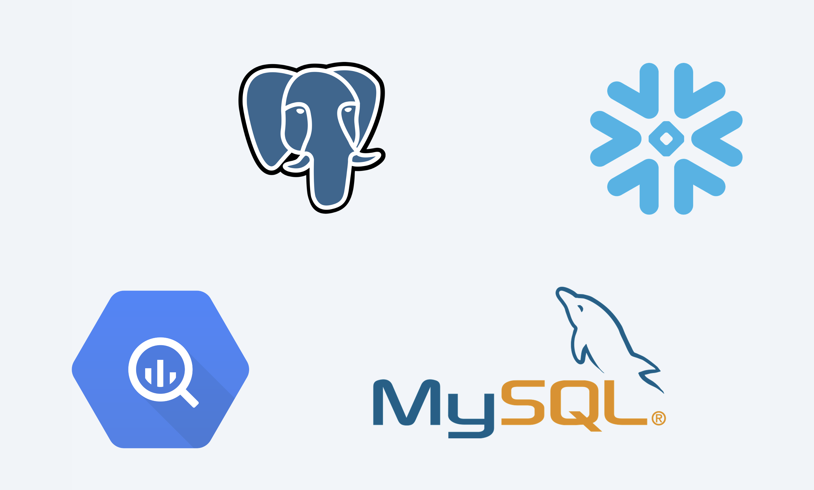

This tutorial covers how to create a simple script through Windmill web IDE. See the dedicated page to [develop scripts locally](../../../advanced/4_local_development/index.mdx).

<div className="grid grid-cols-2 gap-6 mb-4">
	<DocCard
		title="Local development"
		description="Develop from various environments such as your terminal, VS Code, and JetBrains IDEs."
		href="/docs/advanced/local_development"
	/>
</div>

<video
	className="border-2 rounded-lg object-cover w-full h-full dark:border-gray-800"
	controls
	id="main-video"
	src="/videos/test_postgres.mp4"
/>

<br />

Windmill supports [PostgreSQL](https://www.postgresql.org/), [MySQL](https://www.mysql.com/), [Microsoft SQL Server](https://www.microsoft.com/sql-server), [BigQuery](https://cloud.google.com/bigquery) and [Snowflake](https://www.snowflake.com/). In any case, it requires creating a dedicated resource.

Although all users can use BigQuery, Snowflake and MS SQL through resources and [community-available languages](../index.mdx) (TypeScript, Python, Go, Bash etc.), only instances under [Enterprise edition](/pricing) and cloud workspaces can use BigQuery, Snowflake, Oralce DB and MS SQL runtimes as a dedicated language.

## Create resource

Windmill provides integrations with many different apps and services with the use
of [Resources](../../../core_concepts/3_resources_and_types/index.mdx). Resources are rich objects in JSON that allow to store configuration and credentials.

Each Resource has a _Resource Type_ ([PostgreSQL](https://hub.windmill.dev/resource_types/114/postgresql), [MySQL](https://hub.windmill.dev/resource_types/111/mysql), [MS SQL](https://hub.windmill.dev/resource_types/132/ms_sql_server), [BigQuery](https://hub.windmill.dev/resource_types/108/bigquery), [Snowflake](https://hub.windmill.dev/resource_types/107/snowflake))
that defines the schema that the resource of this type needs to implement. Schemas implement the
[JSON Schema specification](https://json-schema.org/).

<div className="grid grid-cols-2 gap-6 mb-4">
	<DocCard
		title="Resources and resource types"
		description="Resources are structured configurations and connections to third-party systems, with Resource types defining the schema for each Resource."
		href="/docs/core_concepts/resources_and_types"
	/>
</div>

:::tip

You can find a list of all the officially supported Resource types on
[Windmill Hub](https://hub.windmill.dev/resources).

:::

:::tip

You can pin a resource to an SQL query by adding a `-- database resource_path` line to your script. The query will automatically use the resource without having to specify it in the autogenerated user interface.

:::

### PostgreSQL

To be able to connect to a [PostgreSQL](https://www.postgresql.org/) instance ([Supabase](../../../integrations/supabase.md), [Neon.tech](../../../integrations/neon.md), etc.), we'll need to define a Resource with the `PostgreSQL` Resource Type first.

Head to the [Resources](../../../core_concepts/3_resources_and_types/index.mdx) page, click on
"Add resource" in the top right corner and select the `PostgreSQL` type.

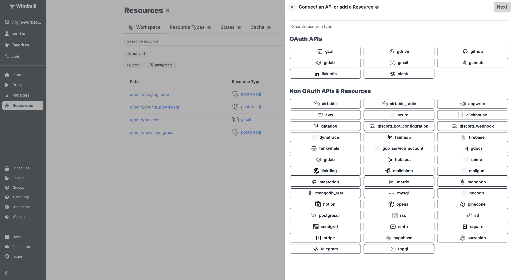

Fill out the form with the information of your PostgreSQL instance and "Test connection" if needed.

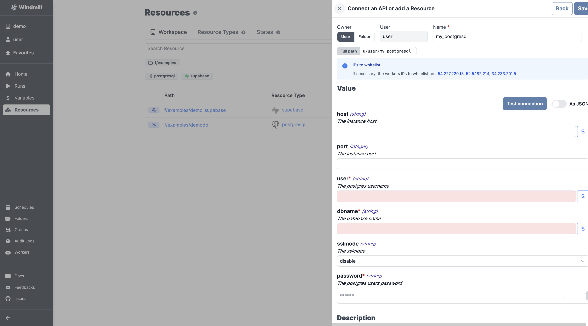

:::tip

For testing purposes, you can use the sample PostgreSQL Resource provided to
every user. It is available under the path `f/examples/demo_windmillshowcases`.

:::

#### PostgreSQL: Add a Supabase database

Windmill provides a wizard to easily add a [Supabase](../../../integrations/supabase.md) database through PostgreSQL.

<video
	className="border-2 rounded-lg object-cover w-full h-full dark:border-gray-800"
	controls
	src="/videos/supabase_wizard.mp4"
/>

<br />

When creating a new PostgreSQL resource, just "Add a Supabase DB". This will lead you to a Supabase page where
you need to pick your organization. Then on Windmill pick a database, fill with database password and that's it.

#### Use SQL to build on external APIs using Sequin

With [Sequin](https://sequin.io), developers can build on top of third-party services like Salesforce or HubSpot using SQL. More details at:

<div className="grid grid-cols-2 gap-6 mb-4">
	<DocCard
		title="Use SQL to build on external APIs using Sequin"
		description=" With Sequin, developers can build on top of third-party services like Salesforce or HubSpot using SQL."
		href="/docs/misc/guides/sequin"
	/>
</div>

### MySQL

To be able to connect to a [MySQL](https://www.mysql.com/) instance, we'll need to define a Resource with the `MySQL` Resource Type first.

Head to the [Resources](../../../core_concepts/3_resources_and_types/index.mdx) page, click on
"Add resource" in the top right corner and select the `MySQL` type.

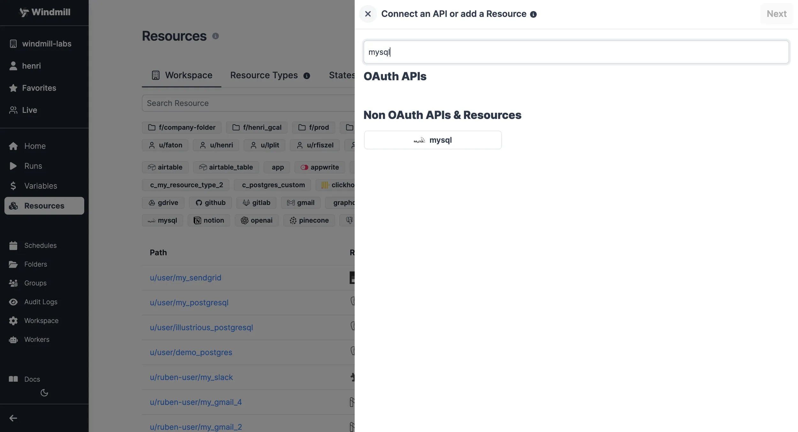

Fill out the form with the information of your MySQL instance and "Test connection" if needed.

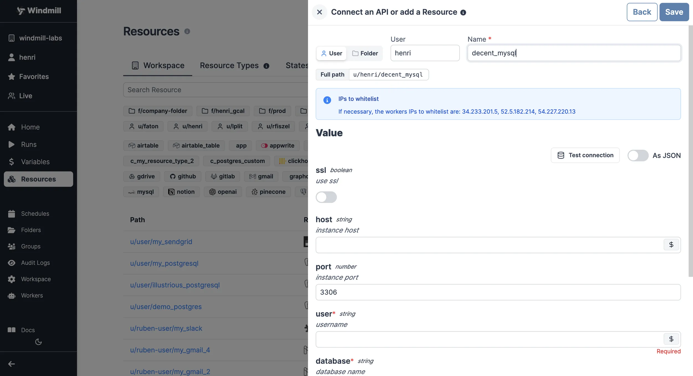

| Property | Type   | Description     | Default | Required | Where to Find                                                                          |
| -------- | ------ | --------------- | ------- | -------- | -------------------------------------------------------------------------------------- |
| host     | string | Instance host   |         | false    | Your hosting provider's control panel or in your server's MySQL configuration file     |
| port     | number | Instance port   | 3306    | false    | Your hosting provider's control panel or in your server's MySQL configuration file     |
| user     | string | Username        |         | true     | Created in MySQL (e.g., via phpMyAdmin or MySQL Workbench) or provided by your hosting |
| database | string | Database name   |         | true     | Created in MySQL (e.g., via phpMyAdmin or MySQL Workbench) or provided by your hosting |
| password | string | User's password |         | true     | Created in MySQL (e.g., via phpMyAdmin or MySQL Workbench) or provided by your hosting |

### MS SQL

To be able to connect to a [Microsoft SQL Server](https://www.microsoft.com/sql-server) instance, we'll need to define a Resource with the `ms_sql_server` Resource Type first.

Head to the [Resources](../../../core_concepts/3_resources_and_types/index.mdx) page, click on
"Add resource" in the top right corner and select the `ms_sql_server` type.

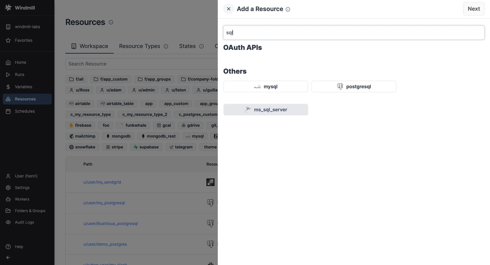

Fill out the form with the information of your MS SQL instance and "Test connection" if needed.


| Property  | Type   | Description              | Default | Required | Where to Find                                                                                   |
| --------- | ------ | ------------------------ | ------- | -------- | ----------------------------------------------------------------------------------------------- |
| host      | string | Instance host            |         | true     | Your hosting provider's control panel or in your server's MS SQL configuration file             |
| port      | number | Instance port            |         | false    | Your hosting provider's control panel or in your server's MS SQL configuration file             |
| user      | string | Username                 |         | true     | Created in MS SQL (e.g., via SQL Server Management Studio) or provided by your hosting          |
| dbname    | string | Database name            |         | true     | Created in MS SQL (e.g., via SQL Server Management Studio) or provided by your hosting          |
| password  | string | User's password          |         | true     | Created in MS SQL (e.g., via SQL Server Management Studio) or provided by your hosting          |
| aad_token | object | OAuth token AD           |         | true     | Either username/password or aad_token should be provided. Requires OAuth setup in Windmill      |
| trust_cert| bool   | Trust server certificate | true    | false    | If true, the server certificate will be trusted even if it is not signed by a trusted authority |
| ca_cert   | string | CA certificate           |         | false    | CA certificate to verify the server certificate. [More information on MS SQL certificates](https://learn.microsoft.com/en-us/sql/linux/sql-server-linux-docker-container-security?view=sql-server-ver16#encrypt-connections-to-sql-server-linux-containers) |

To specify the application intent for read-only requests, add `-- ApplicationIntent=ReadOnly` to the script.

:::info
When using domain credentials via Entra (Azure Active Directory) you need to add the scope `https://database.windows.net//.default` to the [Windmill OAuth instance setting](../../misc/setup_oauth#azure).
:::

### BigQuery

To be able to connect to a [BigQuery](https://cloud.google.com/bigquery) instance, we'll need to define a Resource with the `BigQuery` Resource Type first.

Head to the [Resources](../../../core_concepts/3_resources_and_types/index.mdx) page, click on
"Add resource" in the top right corner and select the `BigQuery` type.

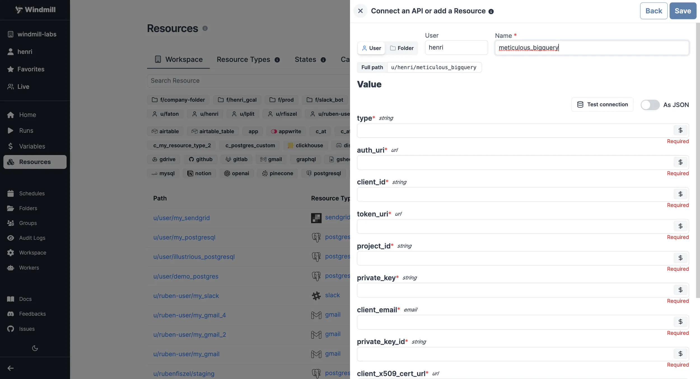

| Property                    | Type   | Description                                    | Required |
| --------------------------- | ------ | ---------------------------------------------- | -------- |
| auth_provider_x509_cert_url | string | Auth provider X.509 certificate URL.           | false    |
| client_x509_cert_url        | string | Client X.509 certificate URL.                  | false    |
| private_key_id              | string | ID of the private key used for authentication. | false    |
| client_email                | string | Email associated with the service account.     | false    |
| private_key                 | string | Private key used for authentication.           | false    |
| project_id                  | string | Google Cloud project ID.                       | true     |
| token_uri                   | string | OAuth 2.0 token URI.                           | false    |
| client_id                   | string | Client ID used for OAuth 2.0 authentication.   | false    |
| auth_uri                    | string | OAuth 2.0 authorization URI.                   | false    |
| type                        | string | Type of the authentication method.             | false    |

Here's a step-by-step guide on where to find each detail.

1. **Service account creation**:

   - Go to the [Google Cloud Console](https://console.cloud.google.com/).
   - Select the appropriate project from the top menu.
   - In the left navigation pane, go to "IAM & Admin" > "Service accounts".
   - Click on the "+ CREATE SERVICE ACCOUNT" button.
   - Provide a name and optional description for the service account.
   - Click "Create".

2. **Assign roles**:

   - After creating the service account, you'll be prompted to grant roles to it. Select "BigQuery" roles such as "BigQuery Admin" or "BigQuery Data Editor" based on your needs.
   - Click "Continue" and "Done" to create the service account.

3. **Generate key**:

   - In the "Service accounts" section, find the newly created service account in the list.
   - Click on the three dots on the right and select "Manage keys", then "Add Key".
   - Choose the key type as "JSON" and click "Create".

4. **Properties Details**:

   Once you've generated the key, the downloaded JSON file will contain all the required properties.

<video
	className="border-2 rounded-lg object-cover w-full h-full dark:border-gray-800"
	controls
	src="/videos/add_bigquery.mp4"
/>

<br />
You can directly "Test connection" if needed.

### Snowflake

To be able to connect to [Snowflake](https://www.snowflake.com/), you can choose to either setup [OAuth for Snowflake](../../../misc/2_setup_oauth/index.mdx#oauth) or by defining a Snowflake Resource.

If a Snowflake OAuth connection is present, you can create a new Resource by heading to [Resources](../../../core_concepts/3_resources_and_types/index.mdx), clicking on "Add Resource" in the top right corner and selecting `snowflake_oauth`. Take a look at [this guide](../../../misc/9_guides/snowflake_app_with_user_roles/index.mdx#sample-app-setup) to learn more about how to build an App with Snowflake OAuth integration.

If you do not wish to use OAuth, click on "Add Resource" in the top right corner and select the `Snowflake` type instead.

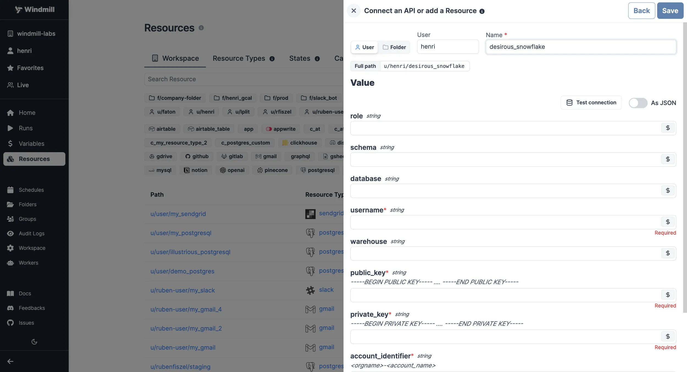

| Property           | Type   | Description                                                            | Required |
| ------------------ | ------ | ---------------------------------------------------------------------- | -------- |
| account_identifier | string | Snowflake account identifier in the format `<orgname>-<account_name>`. | true     |
| private_key        | string | Private key used for authentication.                                   | true     |
| public_key         | string | Public key used for authentication.                                    | true     |
| warehouse          | string | Snowflake warehouse to be used for queries.                            | false    |
| username           | string | Username for Snowflake login.                                          | true     |
| database           | string | Name of the Snowflake database to connect to.                          | true     |
| schema             | string | Schema within the Snowflake database.                                  | false    |
| role               | string | Role to be assumed upon connection.                                    | false    |

Here's a step-by-step guide on where to find each detail.

1. **Account identifier**:

   The account identifier typically follows the format: `<orgname>-<account_name>`. You can find it in the Snowflake web interface:

   - Log in to your Snowflake account.
   - The account identifier can often be found in the URL or at the top of the Snowflake interface after you log in (in the format `https://app.snowflake.com/orgname/account_name/`).

   [Snowflake Documentation on Account Identifier](https://docs.snowflake.com/en/user-guide/admin-account-identifier)

2. **Username**:

   The username is the Snowflake user you will use to connect to the database. You will need to create a user if you don't have one:

   - In the Snowflake web interface, go to the "ACCOUNT" tab.
   - Select "Users" from the left navigation pane.
   - Click the "+ CREATE USER" button to create a new user with a username and password.

3. **Public key and private key**:

   To create the public and private keys, you will need to generate them using a tool like OpenSSL:

   - Open a terminal window.
   - Use OpenSSL to generate a public and private key pair. The exact commands may vary based on your operating system.
   - For example, to generate a public key: `openssl rsa -pubout -in private_key.pem -out public_key.pem`

   Once you have the keys, you can copy the content and paste them into the respective fields in your configuration.

   [Snowflake Documentation on Key Pair Authentication & Key Pair Rotation](https://docs.snowflake.com/en/user-guide/key-pair-auth)

4. **Warehouse, schema, database, and role**:

   These parameters are specific to your Snowflake environment and will depend on how your Snowflake instance is configured:

   - `warehouse`: The name of the Snowflake warehouse you want to connect to.
   - `schema`: The name of the Snowflake schema you want to use.
   - `database`: The name of the Snowflake database you want to connect to.
   - `role`: The role you want to use for authentication.

   You can find these details in the Snowflake web interface:

   - Log in to your Snowflake account.
   - You can find the names of warehouses, schemas, databases, and roles in the interface or by running SQL queries.

You can directly "Test connection" if needed.

### Amazon Redshift

To connect to an Amazon Redshift instance, we need to add the corresponding resource. Redshift is compatible with Windmill's PostgreSQL resources and scripts, so we'll start by adding a new PostgrSQL resource type.


Get the required values from the AWS console under CLUSTERS > your Redshift cluster.

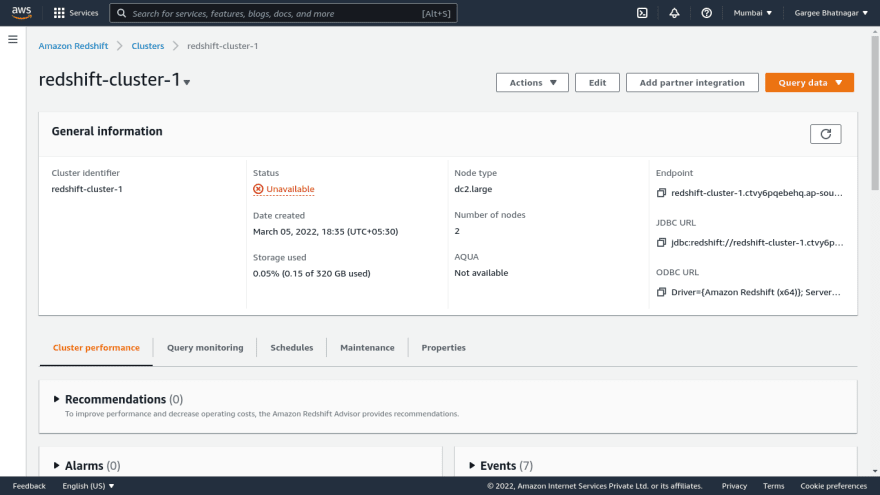

Find the value named 'endpoint' it should look like this:

```
default-workgroup.475893240789.us-east-1.redshift-serverless.amazonaws.com:5439/dev
```
From there you can deduce your host, port and database name:

- host: default-workgroup.475893240789.us-east-1.redshift-serverless.amazonaws.com
- port: 5439
- dbname: dev

Now you can fill those values in Windmill, fill also the user and password for the db and press "Test connection" to check that it's working.

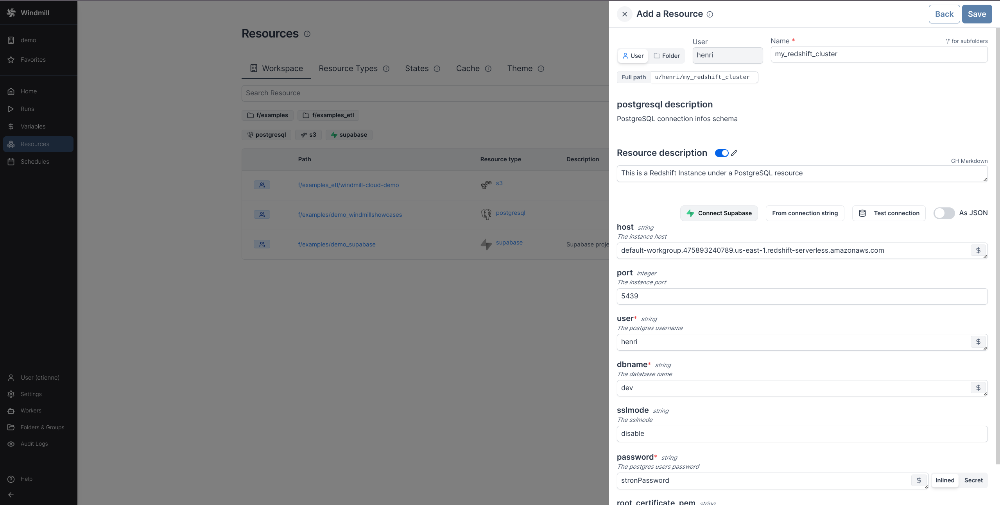

Once it's working press save and you have succesfully added your Redshift instance as a PostgreSQL resource!

### Oracle

To be able to connect to an [Oracle database](https://www.oracle.com/database/), you need to define an Oracle resource.

Head to the [Resources](../../../core_concepts/3_resources_and_types/index.mdx) page, click on
"Add resource" in the top right corner and select the `Oracle` type.


| Property  | Type   | Description     | Required |
| --------- | ------ | --------------- | -------- |
| database  | string | Database name   | true     |
| user      | string | Username        | true     |
| password  | string | User's password | true     |

Here's a step-by-step guide on where to find each detail.

1. **Database**: The name of the Oracle database you want to connect to. This can be found in your Oracle database configuration or by consulting your database administrator.

2. **Username**: The username for Oracle login. You will need to create a user if you don't have one:

   - In the Oracle database interface, go to the "Users" section.
   - Create a new user with a username and password.

3. **Password**: The password associated with the Oracle username.

You can directly "Test connection" if needed.

### DuckDB

DuckDB scripts run in-memory out-of-the-box.

## Create script

Next, let's create a script that will use the newly created Resource. From the Home page,
click on the "+Script" button. Name the Script, give it a summary, and select your preferred language, [PostgreSQL](#postgresql-1), [MySQL](#mysql-1), [MS SQL](#ms-sql-1), [BigQuery](#bigquery-1), [Snowflake](#snowflake-1).

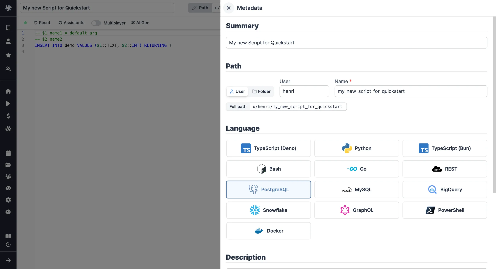

You can also give more details to your script, in the [settings section](../../../script_editor/settings.mdx), you can also get back to that later at any point.

### PostgreSQL

Arguments need to be passed in the given format:

```sql
-- $1 name1 = default arg
-- $2 name2
INSERT INTO demo VALUES ($1::TEXT, $2::INT) RETURNING *
```

"name1", "name2" being the names of the arguments, and "default arg" the optional default value.

Database resource can be specified from the UI or directly within script with a line `-- database resource_path`.

<video
	className="border-2 rounded-lg object-cover w-full h-full dark:border-gray-800"
	controls
	src="/videos/pin_database.mp4"
/>

<br/>

You can then write your prepared statement.

<video
	className="border-2 rounded-lg object-cover w-full h-full dark:border-gray-800"
	controls
	src="/videos/test_postgres.mp4"
/>

### MySQL

Arguments need to be passed in the given format:

```sql
-- :name1 (text) = default arg
-- :name2 (int)
INSERT INTO demo VALUES (:name1, :name2)
```

"name1", "name2" being the names of the arguments, and "default arg" the optional default value.

Database resource can be specified from the UI or directly within script with a line `-- database resource_path`.

<video
	className="border-2 rounded-lg object-cover w-full h-full dark:border-gray-800"
	controls
	src="/videos/pin_database.mp4"
/>

<br/>
You can then write your prepared statement.

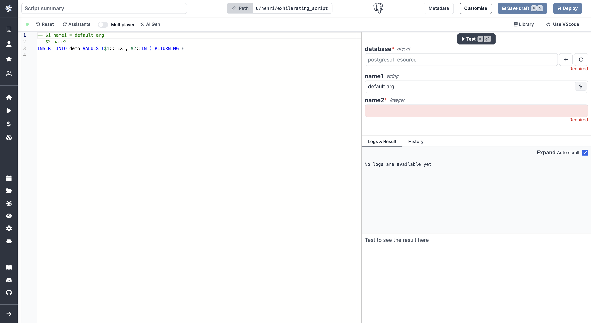

### MS SQL

Arguments need to be passed in the given format:

```sql
-- @P1 name1 (varchar) = default arg
-- @P2 name2 (int)
INSERT INTO demo VALUES (@P1, @P2)
```

"name1", "name2" being the names of the arguments, and "default arg" the optional default value.

Database resource can be specified from the UI or directly within script with a line `-- database resource_path`.

<video
	className="border-2 rounded-lg object-cover w-full h-full dark:border-gray-800"
	controls
	src="/videos/pin_database.mp4"
/>

<br/>
You can then write your prepared statement.

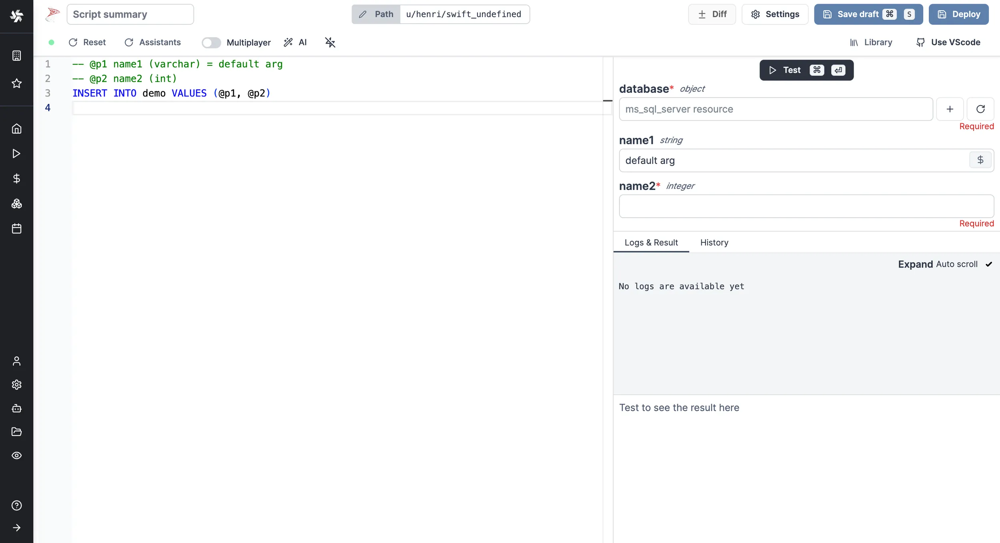

### BigQuery

Arguments need to be passed in the given format:

```sql
-- @name1 (string) = default arg
-- @name2 (integer)
-- @name3 (string[])
INSERT INTO `demodb.demo` VALUES (@name1, @name2, @name3)
```

"name1", "name2", "name3" being the names of the arguments, "default arg" the optional default value and `string`, `integer` and `string[]` the types.

Database resource can be specified from the UI or directly within script with a line `-- database resource_path`.

<video
	className="border-2 rounded-lg object-cover w-full h-full dark:border-gray-800"
	controls
	src="/videos/pin_database.mp4"
/>

<br/>
You can then write your prepared statement.

<video
	className="border-2 rounded-lg object-cover w-full h-full dark:border-gray-800"
	controls
	src="/videos/test_bigquery.mp4"
/>

### Snowflake

Arguments need to be passed in the given format:

```sql
-- ? name1 (varchar) = default arg
-- ? name2 (int)
INSERT INTO demo VALUES (?, ?)
```

"name1", "name2" being the names of the arguments, "default arg" the optional default value and `varchar` & `int` the types.

Database resource can be specified from the UI or directly within script with a line `-- database resource_path`.

<video
	className="border-2 rounded-lg object-cover w-full h-full dark:border-gray-800"
	controls
	src="/videos/pin_database.mp4"
/>

<br/>
You can then write your prepared statement.

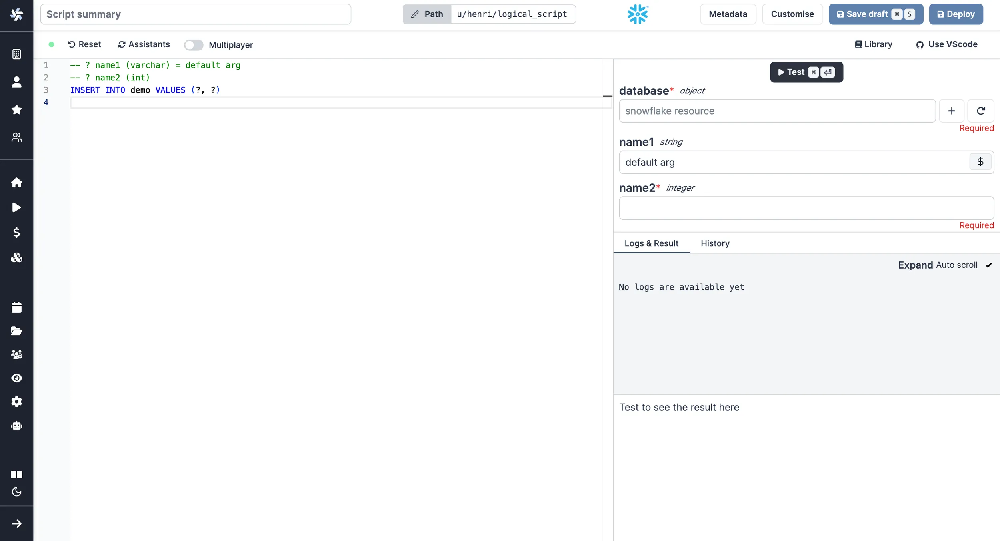

### Amazon Redshift

Since Redshift is compatible with Windmill's PostgreSQL, you can follow the same instructions as for [PostgreSQL scripts](#postgresql-1). Make sure to select your Redshift instance as a resource.

Remeber when using a a Redshift resource, you should write valid Redshift, and not PostgreSQL. For example the `RETURNING *` syntax is not supported, so you may want to change the default script to something like:

```sql
-- $1 name1 = default arg
-- $2 name2
INSERT INTO demo VALUES ($1::TEXT, $2::INT)
```

Learn more about [the differences here](https://docs.aws.amazon.com/redshift/latest/dg/c_redshift-and-postgres-sql.html).

### Oracle

Arguments need to be passed in the given format:

```sql
-- database f/your/path
-- :name1 (text) = default arg
-- :name2 (int)
-- :name3 (int)
INSERT INTO demo VALUES (:name1, :name2);
UPDATE demo SET col2 = :name3 WHERE col2 = :name2;
```

"name1", "name2", "name3" being the names of the arguments, and "default arg" the optional default value.

### DuckDB

DuckDB arguments need to be passed in the given format:
```sql
-- $name1 (text) = default arg
-- $name2 (int)
INSERT INTO demo VALUES ($name1, $name2)
```
"name1", "name2" being the names of the arguments, and "default arg" the optional default value.  

You can pass a file on S3 as an argument of type s3object. This will substitute it with the correct 's3:///...' path at runtime.
You can then query this file using the standard read_csv/read_parquet/read_json functions :
```sql
-- $file (s3object)
SELECT * FROM read_parquet($file)
```

Alternatively, you can reference files on the workspace directly using s3:// notation.

For primary workspace storage:
```sql
SELECT * FROM read_parquet('s3:///path/to/file.parquet')
```

For secondary storage:
```sql
SELECT * FROM read_parquet('s3://<secondary_storage>/path/to/file.parquet')
```

This notation also works with glob patterns:
```sql
SELECT * FROM read_parquet('s3:///myfiles/*.parquet')
```

The s3:// notation now uses the Windmill S3 Proxy by default.

You can also attach to other database resources (BigQuery, PostgreSQL and MySQL). We use the official and community DuckDB extensions under the hood :
```sql
ATTACH '$res:u/demo/amazed_postgresql' AS db (TYPE postgres);
SELECT * FROM db.public.friends;
```


Database resource can be specified from the UI or directly within the script with a line `-- database resource_path`.

<video
	className="border-2 rounded-lg object-cover w-full h-full dark:border-gray-800"
	controls
	src="/videos/pin_database.mp4"
/>

<br/>
You can then write your prepared statement.

## Result collection

You can choose what the script will return with the `result_collection` directive :

| Collection strategies             | Output                                   |
| --------------------------------- | ---------------------------------------- |
| last_statement_all_rows (default) | Array of records                         |
| last_statement_first_row          | Record                                   |
| last_statement_all_rows_scalar    | Array of scalars                         |
| last_statement_first_row_scalar   | Scalar                                   |
| all_statements_all_rows           | Array of array of records                |
| all_statements_first_row          | Array of records                         |
| all_statements_all_rows_scalar    | Array of array of scalars                |
| all_statements_first_row_scalar   | Array of scalars                         |
| legacy (deprecated)               | Behavior before introduction of the flag |

Examples:

```sql
-- result_collection=all_statements_first_row_scalar
SELECT 1;
SELECT 2;
SELECT 3;

-- Result: [1, 2, 3]
```

```sql
-- result_collection=last_statement_all_rows
INSERT INTO my_table VALUES ('a', 'b', 'c');
INSERT INTO my_table VALUES ('1', '2', '3');
SELECT * FROM my_table;
-- Result: [
--   { "col1": "a", "col2": "b", "col3": "c" },
--   { "col1": "1", "col2": "2", "col3": "3" }
-- ]
--
```


## Contextual variables

You can use [contextual variables](../../../core_concepts/47_environment_variables/index.mdx#contextual-variables) in your queries. They need to be wrapped in `%%` like this:

```sql
SELECT '%%WM_WORKSPACE%%'
```

## Raw queries

### Safe interpolated arguments

To allow more flexibility than with prepared statements, Windmill offers the possibility to do safe string interpolation in your queries thanks to [backend schema validation](../../../core_concepts/13_json_schema_and_parsing/index.mdx#backend-schema-validation). This allows you to use script parameters for elements you would usually not be able to, such as table or column names. In order to avoid SQL injections however, these parameters are checked at runtime and the job will fail if any of these rules is not followed:

- The parameter is a non-empty string.
- The characters are all either alphabetical (ASCII only), numeric, or an underscore (`_`). Meaning no whitespace or symbol is allowed.
- The string does not start with a number.
- If the parameter is an enum, it must be one of the defined variants.

These rules are strict enough to protect from any kind of unexpected injection, but lenient enough to have some powerful use cases. Let's look at an example:

```sql
-- :daily_minimum_calories (int)
-- %%table_name%% fruits/vegetables/cereals

SELECT name, calories FROM %%table_name%% WHERE calories > daily_minimum_calories
```

In this example the argument `table_name` is defined as a string that can be either `"fruits"`, `"vegetables"` or `"cereals"`, and the user of the script can then choose which table to query by setting this argument. If the user of the script tries to query a different table, the job will fail before making a connection to the DB, and thus protecting potentially sensitive data.

It the enum variants are ommited, the field is considered to be a regular string and only the other rules apply:

```sql
-- :daily_minimum_calories (int)
-- %%table_name%%

SELECT name, calories FROM %%table_name%% WHERE calories > daily_minimum_calories
```

Keep in mind that this means users of this script can try this query against all existant and non-existant tables of the database.


### Unsafe interpolation on a REST script

A more convenient but less secure option is to execute raw queries with a TypeScript, Deno or Python client. You can for instance do string interpolation to make the name of the table a parameter of your script: `SELECT * FROM ${table}`. However this is dangerous since the string is directly interpolated and this open the door for [SQL injections](https://en.wikipedia.org/wiki/SQL_injection). Use with care and only in trusted environment.

#### PostgreSQL

<Tabs className="unique-tabs">

<TabItem value="bun" label="TypeScript (Bun)" attributes={{className: "text-xs p-4 !mt-0 !ml-0"}}>

```ts
import * as wmill from 'windmill-client';
import { Client } from 'pg';

// Define the resource type as specified
type Postgresql = {
  host: string,
  port: number,
  user: string,
  dbname: string,
  sslmode: string,
  password: string,
  root_certificate_pem: string
}

// The main function that will execute a query on a Postgresql database
export async function main(query = 'SELECT * FROM demo', pg_resource: Postgresql) {
  // Initialize the PostgreSQL client with SSL configuration disabled for strict certificate validation
  const client = new Client({
    host: pg_resource.host,
    port: pg_resource.port,
    user: pg_resource.user,
    password: pg_resource.password,
    database: pg_resource.dbname,
    ssl: pg_resource.ssl,
  });

  try {
    // Connect to the database
    await client.connect();

    // Execute the query
    const res = await client.query(query);

    // Close the connection
    await client.end();

    // Return the query result
    return res.rows;
  } catch (error) {
    console.error('Database query failed:', error);
    // Rethrow the error to handle it outside or log it appropriately
    throw error;
  }
}
```

View script on [Windmill Hub](https://hub.windmill.dev/scripts/postgresql/7105/execute-arbitrary-query-and-return-results-postgresql).

</TabItem>

<TabItem value="deno" label="TypeScript (Deno)" attributes={{className: "text-xs p-4 !mt-0 !ml-0"}}>

```ts
import {
  type Sql,
} from "https://deno.land/x/windmill@v1.88.1/mod.ts";

import { Client } from "https://deno.land/x/postgres@v0.17.0/mod.ts"

type Postgresql = {
  host: string;
  port: number;
  user: string;
  dbname: string;
  sslmode: string;
  password: string;
};
export async function main(db: Postgresql, query: Sql = "SELECT * FROM demo;") {
  if (!query) {
    throw Error("Query must not be empty.");
  }
  const { rows } = await pgClient(db).queryObject(query);
  return rows;
}

export function pgClient(db: any) {
  let db2 = {
    ...db,
    hostname: db.host,
    database: db.dbname,
    tls: {
        enabled: false,
    },
  }
  return new Client(db2)
}
```

View script on [Windmill Hub](https://hub.windmill.dev/scripts/postgresql/1294/execute-query-and-return-results-postgresql).

</TabItem>

<TabItem value="python" label="Python" attributes={{className: "text-xs p-4 !mt-0 !ml-0"}}>

```python
from typing import TypedDict, Dict, Any
import psycopg2

# Define the PostgreSQL resource type as specified
class postgresql(TypedDict):
    host: str
    port: int
    user: str
    dbname: str
    sslmode: str
    password: str
    root_certificate_pem: str

def main(query: str, db_config: postgresql) -> Dict[str, Any]:
    # Connect to the PostgreSQL database
    conn = psycopg2.connect(
        host=db_config["host"],
        port=db_config["port"],
        user=db_config["user"],
        password=db_config["password"],
        dbname=db_config["dbname"],
        sslmode=db_config["sslmode"],
        sslrootcert=db_config["root_certificate_pem"],
    )

    # Create a cursor object
    cur = conn.cursor()

    # Execute the query
    cur.execute(query)

    # Fetch all rows from the last executed statement
    rows = cur.fetchall()

    # Close the cursor and connection
    cur.close()
    conn.close()

    # Convert the rows to a list of dictionaries to make it more readable
    columns = [desc[0] for desc in cur.description]
    result = [dict(zip(columns, row)) for row in rows]

    return result
```

View script on [Windmill Hub](https://hub.windmill.dev/scripts/postgresql/7106/execute-arbitrary-query-postgresql).

</TabItem>
</Tabs>

:::tip

You can find more Script examples related to PostgreSQL on
[Windmill Hub](https://hub.windmill.dev/integrations/postgresql).

:::

#### MySQL

The same logic goes for MySQL.

<Tabs className="unique-tabs">

<TabItem value="bun" label="TypeScript (Bun)" attributes={{className: "text-xs p-4 !mt-0 !ml-0"}}>

```ts
import { createConnection } from 'mysql';

// Define the Mysql resource type as specified
type Mysql = {
  ssl: boolean,
  host: string,
  port: number,
  user: string,
  database: string,
  password: string
}

// The main function that will execute a query on a Mysql resource
export async function main(mysqlResource: Mysql, query: string): Promise<any> {
  // Create a promise to handle the MySQL connection and query execution
  return new Promise((resolve, reject) => {
    // Create a connection to the MySQL database using the resource credentials
    const connection = createConnection({
      host: mysqlResource.host,
      port: mysqlResource.port,
      user: mysqlResource.user,
      password: mysqlResource.password,
      database: mysqlResource.database,
      ssl: mysqlResource.ssl
    });

    // Connect to the MySQL database
    connection.connect(err => {
      if (err) {
        reject(err);
        return;
      }

      // Execute the query provided as a parameter
      connection.query(query, (error, results) => {
        // Close the connection after the query execution
        connection.end();

        if (error) {
          reject(error);
        } else {
          resolve(results);
        }
      });
    });
  });
}
```

View script on [Windmill Hub](https://hub.windmill.dev/scripts/mysql/7108/execute-arbitrary-query-mysql).

</TabItem>

<TabItem value="deno" label="TypeScript (Deno)" attributes={{className: "text-xs p-4 !mt-0 !ml-0"}}>

```ts
import { createPool as createMysqlPool } from "npm:mysql2/promise";

// Define the MySQL resource type as specified
type Mysql = {
  ssl: boolean,
  host: string,
  port: number,
  user: string,
  database: string,
  password: string

}

// The main function that executes a query on a MySQL database
export async function main(
  mysqlResource: Mysql,
  query: string,
): Promise<any> {
  // Adjust the SSL configuration based on the mysqlResource.ssl value
  const sslConfig = mysqlResource.ssl ? { rejectUnauthorized: true } : false;

  // Create a new connection pool using the provided MySQL resource
  const pool = createMysqlPool({
    host: mysqlResource.host,
    user: mysqlResource.user,
    database: mysqlResource.database,
    password: mysqlResource.password,
    port: mysqlResource.port,
    // Use the adjusted SSL configuration
    ssl: sslConfig,
    waitForConnections: true,
    connectionLimit: 10,
    queueLimit: 0,
  });

  try {
    // Get a connection from the pool and execute the query
    const [rows] = await pool.query(query);
    return rows;
  } catch (error) {
    // If an error occurs, throw it to be handled by the caller
    throw new Error(`Failed to execute query: ${error}`);
  } finally {
    // Always close the pool after the operation is complete
    await pool.end();
  }
}

```

View script on [Windmill Hub](https://hub.windmill.dev/scripts/mysql/7107/execute-arbitrary-query-mysql).

</TabItem>

<TabItem value="python" label="Python" attributes={{className: "text-xs p-4 !mt-0 !ml-0"}}>

```python
from typing import TypedDict
import mysql.connector as mysql_connector

# Define the MySQL resource type
class mysql(TypedDict):
    ssl: bool
    host: str
    port: float
    user: str
    database: str
    password: str

def main(mysql_credentials: mysql, query; str) -> str:
    # Connect to the MySQL database using the provided credentials
    connection = mysql_connector.connect(
        host=mysql_credentials["host"],
        user=mysql_credentials["user"],
        password=mysql_credentials["password"],
        database=mysql_credentials["database"],
        port=int(mysql_credentials["port"]),
        ssl_disabled=not mysql_credentials["ssl"],
    )

    # Create a cursor object
    cursor = connection.cursor()

    # Execute the query
    cursor.execute(query)

    # Fetch one result
    result = cursor.fetchone()

    # Close the cursor and connection
    cursor.close()
    connection.close()

    # Return the result
    return str(result[0])
```

View script on [Windmill Hub](https://hub.windmill.dev/scripts/mysql/7109/execute-arbitrary-query-mysql).

</TabItem>
</Tabs>

And so on for [MS SQL](#ms-sql), [BigQuery](#bigquery) and [Snowflake](#snowflake).

## Customize your script

After you're done, click on "[Deploy](../../../core_concepts/0_draft_and_deploy/index.mdx)", which will save it to your workspace. You can now use this Script in your [Flows](../../../flows/1_flow_editor.mdx), [app](../../../apps/0_app_editor/index.mdx) or as standalone.

Feel free to customize your script's metadata ([path](../../../core_concepts/16_roles_and_permissions/index.mdx#path), name, description),
runtime ([concurrency limits](../../../script_editor/concurrency_limit.mdx), [worker group](../../../script_editor/settings.mdx#worker-group-tag),
[cache](../../../core_concepts/24_caching/index.md), [dedicated workers](../../../core_concepts/25_dedicated_workers/index.mdx)) and [generated UI](../../../script_editor/customize_ui.mdx).


<div className="grid grid-cols-2 gap-6 mb-4">
	<DocCard
		title="Settings"
		description="Each script has metadata & settings associated with it, enabling it to be defined and configured in depth."
		href="/docs/script_editor/settings"
	/>
	<DocCard
		title="Generated UI"
		description="main function's arguments can be given advanced settings that will affect the inputs' auto-generated UI and JSON Schema."
		href="/docs/script_editor/customize_ui"
	/>
</div>

## What's next?

Those scripts are minimal working examples, but there's a few more steps that can be useful in a real-world use case:

- Pass [variables and secrets](../../../core_concepts/2_variables_and_secrets/index.mdx)
  to a script.
- Connect to [resources](../../../core_concepts/3_resources_and_types/index.mdx).
- [Trigger that script](../../8_triggers/index.mdx) in many ways.
- Compose scripts in [Flows](../../../flows/1_flow_editor.mdx) or [Apps](../../../apps/0_app_editor/index.mdx) (in particular, [Database studio](#database-studio) to visualize and manage your databases in apps).
- You can [share your scripts](../../../misc/1_share_on_hub/index.md) with the community on [Windmill Hub](https://hub.windmill.dev). Once
  submitted, they will be verified by moderators before becoming available to
  everyone right within Windmill.

Scripts are immutable and there is a hash for each deployment of a given script. Scripts are never overwritten and referring to a script by path is referring to the latest deployed hash at that path.

<div className="grid grid-cols-2 gap-6 mb-4">
	<DocCard
		title="Versioning"
		description="Scripts, when deployed, can have a parent script identified by its hash."
		href="/docs/core_concepts/versioning#script-versioning"
	/>
</div>

For each script, a UI is autogenerated from the jsonchema inferred from the script signature, and can be customized further as standalone or embedded into rich UIs using the [App builder](../../7_apps_quickstart/index.mdx).

<div className="grid grid-cols-2 gap-6 mb-4">
	<DocCard
		title="Auto-generated UIs"
		description="Windmill creates auto-generated user interfaces for scripts and flows based on their parameters."
		href="/docs/core_concepts/auto_generated_uis"
	/>
	<DocCard
		title="Generated UI"
		description="main function's arguments can be given advanced settings that will affect the inputs' auto-generated UI and JSON Schema."
		href="/docs/script_editor/customize_ui"
	/>
</div>

In addition to the UI, sync and async [webhooks](../../../core_concepts/4_webhooks/index.mdx) are generated for each deployment.

<div className="grid grid-cols-2 gap-6 mb-4">
	<DocCard
		title="Webhooks"
		description="Trigger scripts and flows from webhooks."
		href="/docs/core_concepts/webhooks"
	/>
</div>

## Database studio

From Windmill [App editor](../../../apps/0_app_editor/index.mdx), you can also use the [Database studio](../../../apps/4_app_configuration_settings/database_studio.mdx) component to visualize and manage your databases (PostgreSQL / MySQL / MS SQL / Snowflake / BigQuery are all supported).


<iframe
	style={{ aspectRatio: '16/9' }}
	src="https://www.youtube.com/embed/Fd_0EffVDtw"
	title="Database studio"
	frameBorder="0"
	allow="accelerometer; autoplay; clipboard-write; encrypted-media; gyroscope; picture-in-picture; web-share"
	allowFullScreen
	className="border-2 rounded-lg object-cover w-full dark:border-gray-800"
></iframe>

<br/>

The Database studio component allows you to:
- Display the content of a table.
- Edit the content of a table by directly editing the cells (only when the cell is editable).
- Add a new row.
- Delete a row.

All details at:

<div className="grid grid-cols-2 gap-6 mb-4">
	<DocCard
		title="Database studio"
		description="The Database studio is a web-based database management tool that leverages Ag Grid for table display and interaction"
		href="/docs/apps/app_configuration_settings/database_studio"
	/>
</div>

## Streaming large query results to S3 (Enterprise feature)

Sometimes, your SQL script will return too much data which exceeds the 10 000 rows query limit within Windmill. In this case, you will want to use the s3 flag to stream your query result to a file.

<DocCard
	title="SQL to S3 streaming"
	description="Stream an SQL query large result to a workspace storage file"
	href="/docs/core_concepts/sql_to_s3_streaming"
/>
