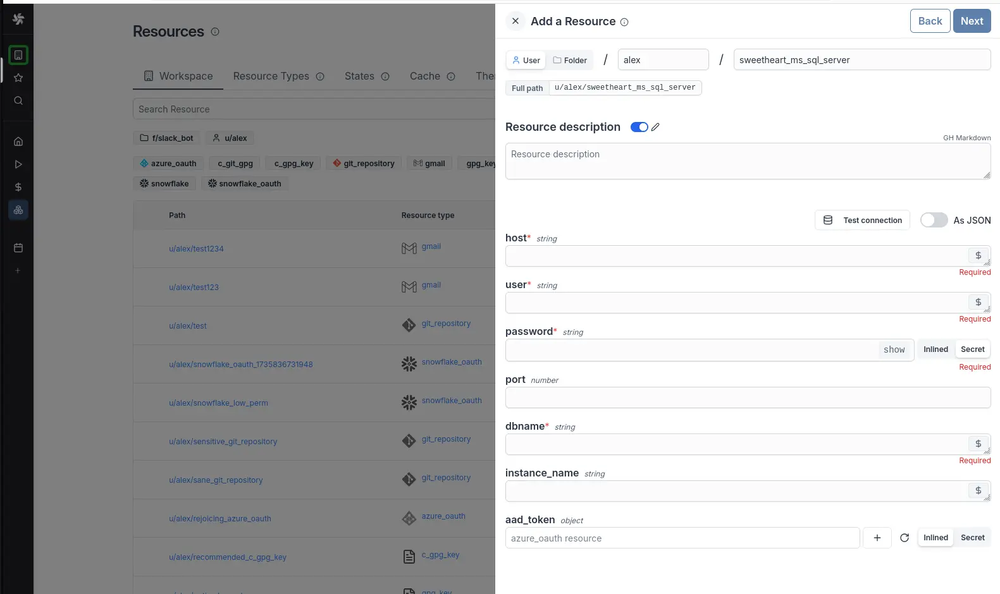

import DocCard from '@site/src/components/DocCard';

# PostgreSQL, MySQL, MSSQL, BigQuery, Snowflake

In this quick start guide, we will write our first script in SQL. We will see how to connect a Windmill instance to an external SQL service and then send queries to the database using Windmill Scripts.


<video
	className="border-2 rounded-xl object-cover w-full h-full dark:border-gray-800"
	controls
	id="main-video"
	src="/videos/test_postgres.mp4"
/>

<br />

Windmill supports [PostgreSQL](https://www.postgresql.org/), [MySQL](https://www.mysql.com/), [Microsoft SQL Server](https://www.microsoft.com/sql-server), [BigQuery](https://cloud.google.com/bigquery) and [Snowflake](https://www.snowflake.com/). In any case, it requires creating a dedicated resource.

## Create Resource

Windmill provides integrations with many different apps and services with the use
of [Resources](../../../core_concepts/3_resources_and_types/index.mdx). Resources are rich objects in JSON that allow to store configuration and credentials.

Each Resource has a _Resource Type_ ([PostgreSQL](https://hub.windmill.dev/resource_types/114/postgresql), [MySQL](https://hub.windmill.dev/resource_types/111/mysql), [MSSQL](https://hub.windmill.dev/resource_types/132/ms_sql_server), [BigQuery](https://hub.windmill.dev/resource_types/108/bigquery), [Snowflake](https://hub.windmill.dev/resource_types/107/snowflake))
that defines the schema that the resource of this type needs to implement. Schemas implement the
[JSON Schema specification](https://json-schema.org/).

<div className="grid grid-cols-2 gap-6 mb-4">
	<DocCard
		title="Resources and Resource Types"
		description="Resources are structured configurations and connections to third-party systems, with Resource Types defining the schema for each Resource."
		href="/docs/core_concepts/resources_and_types"
	/>
</div>

:::tip

You can find a list of all the officially supported Resource Types on
[Windmill Hub](https://hub.windmill.dev/resources).

:::

### PostgreSQL

To be able to connect to a [PostgreSQL](https://www.postgresql.org/) instance ([Supabase](../../../integrations/supabase.md), [Neon.tech](../../../integrations/neon.md), etc.), we'll need to define a Resource with the `PostgreSQL` Resource Type first.

Head to the <a href="https://app.windmill.dev/resources" rel="nofollow">Resources</a> page in the Windmill app, click on
"Add a resource/API" in the top right corner and select the `PostgreSQL` type.


Fill out the form with the information of your PostgreSQL instance and "Test connection" if needed.


:::tip

For testing purposes, you can use the sample PostgreSQL Resource provided to
every user. It is available under the path `f/examples/demo_windmillshowcases`.

:::

#### PostgreSQL: Add a Supabase Database

Windmill provides a wizard to easily add a [Supabase](../../../integrations/supabase.md) database through PostgreSQL.

<video
	className="border-2 rounded-xl object-cover w-full h-full dark:border-gray-800"
	controls
	src="/videos/supabase_wizard.mp4"
/>

<br />

When creating a new PostgreSQL resource, just "Add a Supabase DB". This will lead you to a Supabase page where
you need to pick your organization. Then on Windmill pick a database, fill with database password and that's it.

#### Use SQL to build on external APIs using Sequin

With [Sequin](https://sequin.io), developers can build on top of third-party services like Salesforce or HubSpot using SQL. More details at:

<div className="grid grid-cols-2 gap-6 mb-4">
	<DocCard
		title="Use SQL to build on external APIs using Sequin"
		description=" With Sequin, developers can build on top of third-party services like Salesforce or HubSpot using SQL."
		href="/docs/misc/guides/sequin"
	/>
</div>

### MySQL

To be able to connect to a [MySQL](https://www.mysql.com/) instance, we'll need to define a Resource with the `MySQL` Resource Type first.

Head to the <a href="https://app.windmill.dev/resources" rel="nofollow">Resources</a> page in the Windmill app, click on
"Add a resource/API" in the top right corner and select the `MySQL` type.


Fill out the form with the information of your MySQL instance and "Test connection" if needed.


| Property | Type   | Description     | Default | Required | Where to Find                                                                          |
| -------- | ------ | --------------- | ------- | -------- | -------------------------------------------------------------------------------------- |
| host     | string | Instance host   |         | false    | Your hosting provider's control panel or in your server's MySQL configuration file     |
| port     | number | Instance port   | 3306    | false    | Your hosting provider's control panel or in your server's MySQL configuration file     |
| user     | string | Username        |         | true     | Created in MySQL (e.g., via phpMyAdmin or MySQL Workbench) or provided by your hosting |
| database | string | Database name   |         | true     | Created in MySQL (e.g., via phpMyAdmin or MySQL Workbench) or provided by your hosting |
| password | string | User's password |         | true     | Created in MySQL (e.g., via phpMyAdmin or MySQL Workbench) or provided by your hosting |

### MSSQL

To be able to connect to a [Microsoft SQL Server](https://www.microsoft.com/sql-server) instance, we'll need to define a Resource with the `ms_sql_server` Resource Type first.

Head to the <a href="https://app.windmill.dev/resources" rel="nofollow">Resources</a> page in the Windmill app, click on
"Add a resource/API" in the top right corner and select the `ms_sql_server` type.


Fill out the form with the information of your MySQL instance and "Test connection" if needed.



| Property | Type   | Description     | Default | Required | Where to Find                                                                         |
| -------- | ------ | --------------- | ------- | -------- | ------------------------------------------------------------------------------------- |
| host     | string | Instance host   |         | true     | Your hosting provider's control panel or in your server's MSSQL configuration file    |
| port     | number | Instance port   |         | false    | Your hosting provider's control panel or in your server's MSSQL configuration file    |
| user     | string | Username        |         | true     | Created in MSSQL (e.g., via SQL Server Management Studio) or provided by your hosting |
| dbname   | string | Database name   |         | true     | Created in MSSQL (e.g., via SQL Server Management Studio) or provided by your hosting |
| password | string | User's password |         | true     | Created in MSSQL (e.g., via SQL Server Management Studio) or provided by your hosting |

### BigQuery

To be able to connect to a [BigQuery](https://cloud.google.com/bigquery) instance, we'll need to define a Resource with the `BigQuery` Resource Type first.

Head to the <a href="https://app.windmill.dev/resources" rel="nofollow">Resources</a> page in the Windmill app, click on
"Add a resource/API" in the top right corner and select the `BigQuery` type.


| Property                    | Type   | Description                                    | Required |
| --------------------------- | ------ | ---------------------------------------------- | -------- |
| auth_provider_x509_cert_url | string | Auth provider X.509 certificate URL.           | false    |
| client_x509_cert_url        | string | Client X.509 certificate URL.                  | false    |
| private_key_id              | string | ID of the private key used for authentication. | false    |
| client_email                | string | Email associated with the service account.     | false    |
| private_key                 | string | Private key used for authentication.           | false    |
| project_id                  | string | Google Cloud project ID.                       | true     |
| token_uri                   | string | OAuth 2.0 token URI.                           | false    |
| client_id                   | string | Client ID used for OAuth 2.0 authentication.   | false    |
| auth_uri                    | string | OAuth 2.0 authorization URI.                   | false    |
| type                        | string | Type of the authentication method.             | false    |

Here's a step-by-step guide on where to find each detail.

1. **Service Account Creation**:

   - Go to the [Google Cloud Console](https://console.cloud.google.com/).
   - Select the appropriate project from the top menu.
   - In the left navigation pane, go to "IAM & Admin" > "Service accounts".
   - Click on the "+ CREATE SERVICE ACCOUNT" button.
   - Provide a name and optional description for the service account.
   - Click "Create".

2. **Assign Roles**:

   - After creating the service account, you'll be prompted to grant roles to it. Select "BigQuery" roles such as "BigQuery Admin" or "BigQuery Data Editor" based on your needs.
   - Click "Continue" and "Done" to create the service account.

3. **Generate Key**:

   - In the "Service accounts" section, find the newly created service account in the list.
   - Click on the three dots on the right and select "Manage keys", then "Add Key".
   - Choose the key type as "JSON" and click "Create".

4. **Properties Details**:

   Once you've generated the key, the downloaded JSON file will contain all the required properties.

<video
	className="border-2 rounded-xl object-cover w-full h-full dark:border-gray-800"
	controls
	src="/videos/add_bigquery.mp4"
/>

<br />
You can directly "Test connection" if needed.

### Snowflake

To be able to connect to a [Snowflake](https://www.snowflake.com/) instance, we'll need to define a Resource with the `Snowflake` Resource Type first.

Head to the <a href="https://app.windmill.dev/resources" rel="nofollow">Resources</a> page in the Windmill app, click on
"Add a resource/API" in the top right corner and select the `Snowflake` type.


| Property           | Type   | Description                                                            | Required |
| ------------------ | ------ | ---------------------------------------------------------------------- | -------- |
| account_identifier | string | Snowflake account identifier in the format `<orgname>-<account_name>`. | true     |
| private_key        | string | Private key used for authentication.                                   | true     |
| public_key         | string | Public key used for authentication.                                    | true     |
| warehouse          | string | Snowflake warehouse to be used for queries.                            | false    |
| username           | string | Username for Snowflake login.                                          | true     |
| database           | string | Name of the Snowflake database to connect to.                          | true     |
| schema             | string | Schema within the Snowflake database.                                  | false    |
| role               | string | Role to be assumed upon connection.                                    | false    |

Here's a step-by-step guide on where to find each detail.

1. **Account Identifier**:

   The account identifier typically follows the format: `<orgname>-<account_name>`. You can find it in the Snowflake web interface:

   - Log in to your Snowflake account.
   - The account identifier can often be found in the URL or at the top of the Snowflake interface after you log in (in the format `https://app.snowflake.com/orgname/account_name/`).

   [Snowflake Documentation on Account Identifier](https://docs.snowflake.com/en/user-guide/admin-account-identifier)

2. **Username**:

   The username is the Snowflake user you will use to connect to the database. You will need to create a user if you don't have one:

   - In the Snowflake web interface, go to the "ACCOUNT" tab.
   - Select "Users" from the left navigation pane.
   - Click the "+ CREATE USER" button to create a new user with a username and password.

3. **Public Key and Private Key**:

   To create the public and private keys, you will need to generate them using a tool like OpenSSL:

   - Open a terminal window.
   - Use OpenSSL to generate a public and private key pair. The exact commands may vary based on your operating system.
   - For example, to generate a public key: `openssl rsa -pubout -in private_key.pem -out public_key.pem`

   Once you have the keys, you can copy the content and paste them into the respective fields in your configuration.

   [Snowflake Documentation on Key Pair Authentication & Key Pair Rotation](https://docs.snowflake.com/en/user-guide/key-pair-auth)

4. **Warehouse, Schema, Database, and Role**:

   These parameters are specific to your Snowflake environment and will depend on how your Snowflake instance is configured:

   - `warehouse`: The name of the Snowflake warehouse you want to connect to.
   - `schema`: The name of the Snowflake schema you want to use.
   - `database`: The name of the Snowflake database you want to connect to.
   - `role`: The role you want to use for authentication.

   You can find these details in the Snowflake web interface:

   - Log in to your Snowflake account.
   - You can find the names of warehouses, schemas, databases, and roles in the interface or by running SQL queries.

You can directly "Test connection" if needed.

## Create Script

Next, let's create a script that will use the newly created Resource. From the <a href="https://app.windmill.dev/" rel="nofollow">Home</a> page,
click on the "+Script" button. Name the Script, give it a summary, and select your preferred language, [PostgreSQL](#postgresql-1), [MySQL](#mysql-1), [MSSQL](#mssql-1), [BigQuery](#bigquery-1), [Snowflake](#snowflake-1).


You can also give more details to your script, in the [settings section](../../../script_editor/settings.mdx), you can also get back to that later at any point.

### PostgreSQL

Arguments need to be passed in the given format:

```sql
-- $1 name1 = default arg
-- $2 name2
INSERT INTO demo VALUES ($1::TEXT, $2::INT) RETURNING *
```

"name1", "name2" being the names of the arguments, and "default arg" the optional default value.

You can then write your prepared statement.

<video
	className="border-2 rounded-xl object-cover w-full h-full dark:border-gray-800"
	controls
	src="/videos/test_postgres.mp4"
/>

### MySQL

Arguments need to be passed in the given format:

```sql
-- ? name1 (text) = default arg
-- ? name2 (int)
INSERT INTO demo VALUES (?, ?)
```

"name1", "name2" being the names of the arguments, and "default arg" the optional default value.

You can then write your prepared statement.


### MSSQL

Arguments need to be passed in the given format:

```sql
-- @p1 name1 (varchar) = default arg
-- @p2 name2 (int)
INSERT INTO demo VALUES (@p1, @p2)
```

"name1", "name2" being the names of the arguments, and "default arg" the optional default value.

You can then write your prepared statement.


### BigQuery

Arguments need to be passed in the given format:

```sql
-- @name1 (string) = default arg
-- @name2 (integer)
-- @name3 (string[])
INSERT INTO `demodb.demo` VALUES (@name1, @name2, @name3)
```

"name1", "name2", "name3" being the names of the arguments, "default arg" the optional default value and `string`, `integer` and `string[]` the types.

You can then write your prepared statement.

<video
	className="border-2 rounded-xl object-cover w-full h-full dark:border-gray-800"
	controls
	src="/videos/test_bigquery.mp4"
/>

### Snowflake

Arguments need to be passed in the given format:

```sql
-- ? name1 (varchar) = default arg
-- ? name2 (int)
INSERT INTO demo VALUES (?, ?)
```

"name1", "name2" being the names of the arguments, "default arg" the optional default value and `varchar` & `int` the types.

You can then write your prepared statement.


### Raw Queries

A more convenient but less secure option is to execute raw queries with a typescript or deno client. This enable you more flexibility than SQL prepared statement. You can for instance do string interpolation to make the name of the table a parameter of your script: `SELECT * FROM ${table}`. However this is dangerous since the string is directly interpolated and this open the door for [SQL injections](https://en.wikipedia.org/wiki/SQL_injection). Use with care and only in trusted environment.

We show below an example using a [Typescript script](../1_typescript_quickstart/index.mdx): [Execute Query and return results](https://hub.windmill.dev/scripts/postgresql/1294/execute-query-and-return-results-postgresql).

```typescript
import { pgClient, type Sql } from 'https://deno.land/x/windmill@v1.88.1/mod.ts';

type Postgresql = {
	host: string;
	port: number;
	user: string;
	dbname: string;
	sslmode: string;
	password: string;
};

export async function main(db: Postgresql, query: Sql = 'SELECT * FROM demo;') {
	if (!query) {
		throw Error('Query must not be empty.');
	}
	const { rows } = await pgClient(db).queryObject(query);
	return rows;
}
```

This will allow you to execute all commands from one script. But that's also the vulnerability of it as it opens the door to harmful commands. To make it more secure, do not take the query directly as input but its parameters and then sanitize it properly so SQL injections are mitigated unless you are in a trusted environment.

<video
	className="border-2 rounded-xl object-cover w-full h-full dark:border-gray-800"
	controls
	src="/videos/raw_query.mp4"
/>

<br />

:::tip

You can find more Script examples related to PostgreSQL on
[Windmill Hub](https://hub.windmill.dev/integrations/postgresql).

:::

After you're done, click on "[Deploy](../../../core_concepts/0_draft_and_deploy/index.mdx)", which will save it to your workspace. You can now use this Script in your [Flows](../../../flows/1_flow_editor.mdx), [app](../../../apps/0_app_editor/index.mdx) or as standalone.

## Customize your script

Feel free to customize your script's metadata ([path](../../../core_concepts/16_roles_and_permissions/index.mdx#path), name, description),
runtime ([concurrency limits](../../../script_editor/concurrency_limit.mdx), [worker group](../../../script_editor/worker_group_tag.mdx),
[cache](../../../core_concepts/24_caching/index.md), [dedicated workers](../../../core_concepts/25_dedicated_workers/index.mdx)) and [generated UI](../../../script_editor/customize_ui.mdx).


<div className="grid grid-cols-2 gap-6 mb-4">
	<DocCard
		title="Settings"
		description="Each script has metadata & settings associated with it, enabling it to be defined and configured in depth."
		href="/docs/script_editor/settings"
	/>
	<DocCard
		title="Customize UI"
		description="Some arguments' types can be given advanced settings that will affect the inputs' auto-generated UI and JSON Schema."
		href="/docs/script_editor/customize_ui"
	/>
</div>

## What's next?

Those scripts are minimal working examples, but there's a few more steps that can be useful in a real-world use case:

- Pass [variables and secrets](../../../core_concepts/2_variables_and_secrets/index.mdx)
  to a script.
- Connect to [resources](../../../core_concepts/3_resources_and_types/index.mdx).
- [Trigger that script](../../8_trigger_scripts/index.mdx) in many ways.
- Compose scripts in [Flows](../../../flows/1_flow_editor.mdx) or [Apps](../../../apps/0_app_editor/index.mdx).
- You can [share your scripts](../../../misc/1_share_on_hub/index.md) with the community on [Windmill Hub](https://hub.windmill.dev). Once
  submitted, they will be verified by moderators before becoming available to
  everyone right within Windmill.

Scripts are immutable and there is an hash for each deployment of a given script. Scripts are never overwritten and referring to a script by path is referring to the latest deployed hash at that path.

<div className="grid grid-cols-2 gap-6 mb-4">
	<DocCard
		title="Versioning"
		description="Scripts, when deployed, can have a parent script identified by its hash."
		href="/docs/script_editor/versioning"
	/>
</div>

For each script, a UI is autogenerated from the jsonchema inferred from the script signature, and can be customized further as standalone or embedded into rich UIs using the [App builder](../../7_apps_quickstart/index.mdx).

<div className="grid grid-cols-2 gap-6 mb-4">
	<DocCard
		title="Auto-generated UIs"
		description="Windmill creates auto-generated user interfaces for scripts and flows based on their parameters."
		href="/docs/core_concepts/auto_generated_uis"
	/>
	<DocCard
		title="Customize UI"
		description="Some arguments' types can be given advanced settings that will affect the inputs' auto-generated UI and JSON Schema."
		href="/docs/script_editor/customize_ui"
	/>
</div>

In addition to the UI, sync and async [webhooks](../../../core_concepts/4_webhooks/index.mdx) are generated for each deployment.

<div className="grid grid-cols-2 gap-6 mb-4">
	<DocCard
		title="Webhooks"
		description="Trigger scripts and flows from webhooks."
		href="/docs/core_concepts/webhooks"
	/>
</div>
