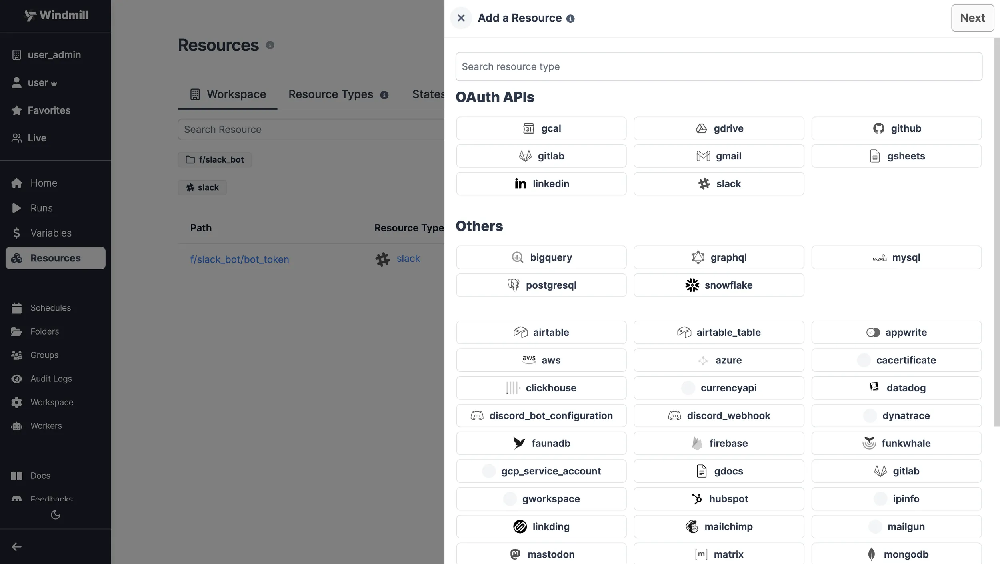
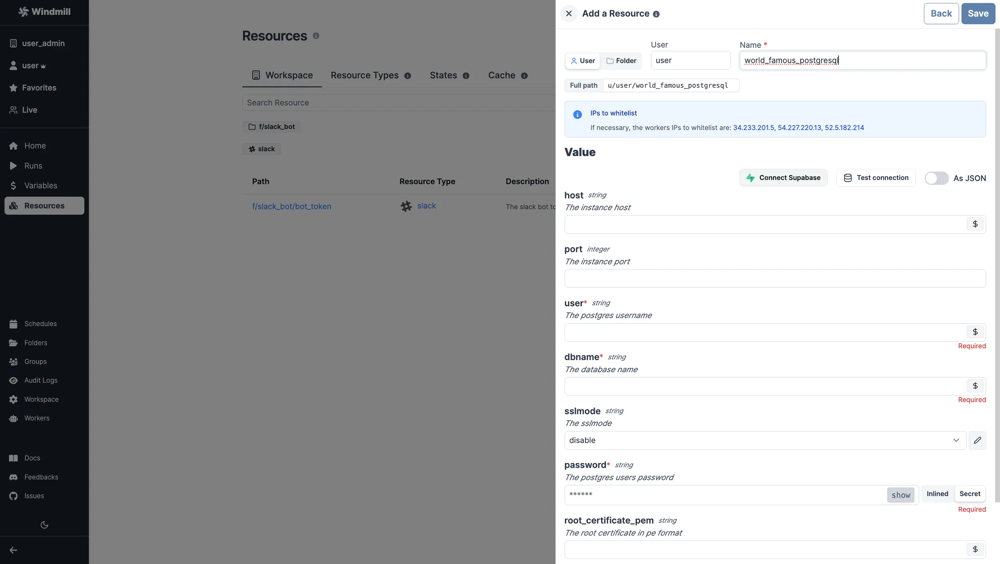
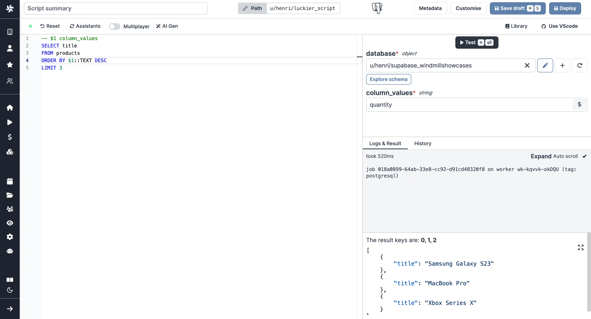
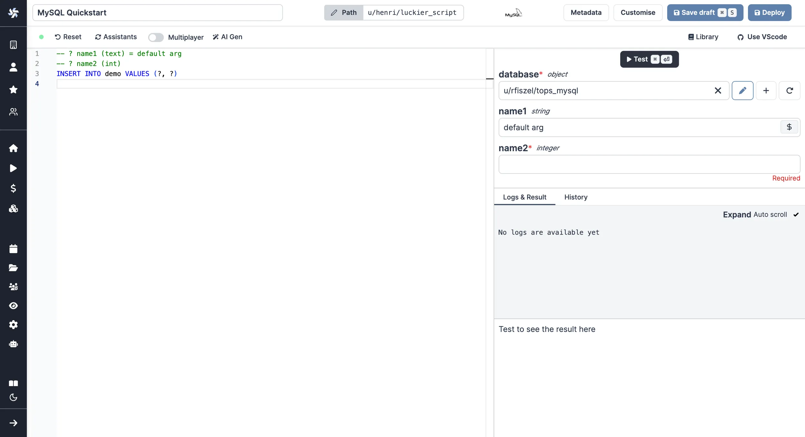

import DocCard from '@site/src/components/DocCard';

# SQL Quickstart

We will see how to connect a Windmill instance to an external SQL service and then send queries to the database using Windmill Scripts.

Windmill supports PostgreSQL and MySQL. In any case, it requires creating a dedicated resource.

## Create Resource

Windmill provides integration with many different apps and services with the use
of [Resources][docs-resources]. Each Resource has a **Resources Type**, which
controls the shape of it. To be able to connect to a Postgres instance ([Supabase](../../../integrations/supabase.md), [Neon.tech](../../../integrations/neon.md)), we'll need to define a Resource with the `PostgreSQL` or `MySQL` Resource Type first.

:::tip

You can find a list of all the officially supported Resource Types on
[Windmill Hub][hub-resources].

:::

Head to the <a href="https://app.windmill.dev/resources" rel="nofollow">Resources</a> page in the Windmill app, click on
"Add a resource/API" in the top right corner and select the `PostgreSQL` or `MySQL` type.



Fill out the form with the information of your PostgreSQL/MySQL instance.

:::tip

For testing purposes, you can use the sample PostgreSQL Resource provided to
every user. It is available under the path `f/examples/demodb`.

:::



## Create Script

Next, let's create a script that will use the newly created Resource. Head on to
the <a href="https://app.windmill.dev/" rel="nofollow">Home</a> page and click on the "+Script" button. Name the Script, give it a summary, "Query a PostgreSQL Database" for
example and select your prefered language, "PostgreSQL" or "MySQL".


You can also give more details to your script, in the [metadata section](../../../script_editor/metadata.mdx), you can also get back to that later at any point.

### PostgreSQL

Arguments need to be passed in the given format:

```sql
-- $1 name1 = default arg
-- $2 name2
INSERT INTO demo VALUES ($1::TEXT, $2::INT) RETURNING *
```

"name1", "name2" being the names of the arguments, and "default arg" the optional default value.

You can then write your prepared statement.



### MySQL

Arguments need to be passed in the given format:

```sql
-- ? name1 (text) = default arg
-- ? name2 (int)
INSERT INTO demo VALUES (?, ?)
```

"name1", "name2" being the names of the arguments, and "default arg" the optional default value.

You can then write your prepared statement.



### Raw Queries

A more convenient but less secure option is to execute raw queries with a typescript or deno client. This enable you more flexibility than SQL prepared statement. You can for instance do string interpolation to make the name of the table a parameter of your script: `SELECT * FROM ${table}`. However this is dangerous since the string is directly interpolated and this open the door for [SQL injections](https://en.wikipedia.org/wiki/SQL_injection). Use with care and only in trusted environment.

We show below an example using a [Typescript script](../1_typescript_quickstart/index.mdx): [Execute Query and return results](https://hub.windmill.dev/scripts/postgresql/1294/execute-query-and-return-results-postgresql).

```typescript
import { pgClient, type Sql } from 'https://deno.land/x/windmill@v1.88.1/mod.ts';

type Postgresql = {
	host: string;
	port: number;
	user: string;
	dbname: string;
	sslmode: string;
	password: string;
};

export async function main(db: Postgresql, query: Sql = 'SELECT * FROM demo;') {
	if (!query) {
		throw Error('Query must not be empty.');
	}
	const { rows } = await pgClient(db).queryObject(query);
	return rows;
}
```

This will allow you to execute all commands from one script. But that's also the vulnerability of it as it opens the door to harmful commands. To make it more secure, do not take the query directly as input but its parameters and then sanitize it properly so SQL injections are mitigated unless you are in a trusted environment.


:::tip

You can find more Script examples related to PostgreSQL on
[Windmill Hub][hub-examples].

:::

After you're done, click on "[Deploy](../../../core_concepts/0_draft_and_deploy/index.mdx)", which will save it to your workspace. You can now use this Script in your [Flows][docs-flows], [Apps][docs-apps] or as standalone.

## Customize your script

Feel free to customize your script's metadata ([path](../../../core_concepts/16_roles_and_permissions/index.mdx#path), name, description, [concurrency limits](../../../script_editor/concurrency_limit.mdx), [worker group](../../../script_editor/worker_group_tag.mdx)) and [arguments](../../../script_editor/customize_arguments.mdx).

<div class="grid grid-cols-2 gap-6 mb-4">
	<DocCard
		title="Metadata"
		description="Each script has metadata associated with it, enabling it to be defined and configured in depth."
		href="/docs/script_editor/metadata"
	/>
	<DocCard
		title="Customize Arguments"
		description="Some arguments' types can be given advanced settings that will affect the inputs' auto-generated UI and JSON Schema."
		href="/docs/script_editor/customize_arguments"
	/>
</div>

<!-- Links -->

[hub-resources]: https://hub.windmill.dev/resources
[hub-examples]: https://hub.windmill.dev/integrations/postgresql
[docs-resources]: /docs/core_concepts/resources_and_types
[docs-path]: /docs/core_concepts/roles_and_permissions#path
[docs-flows]: /docs/getting_started/flows_quickstart
[docs-apps]: /docs/getting_started/apps_quickstart
