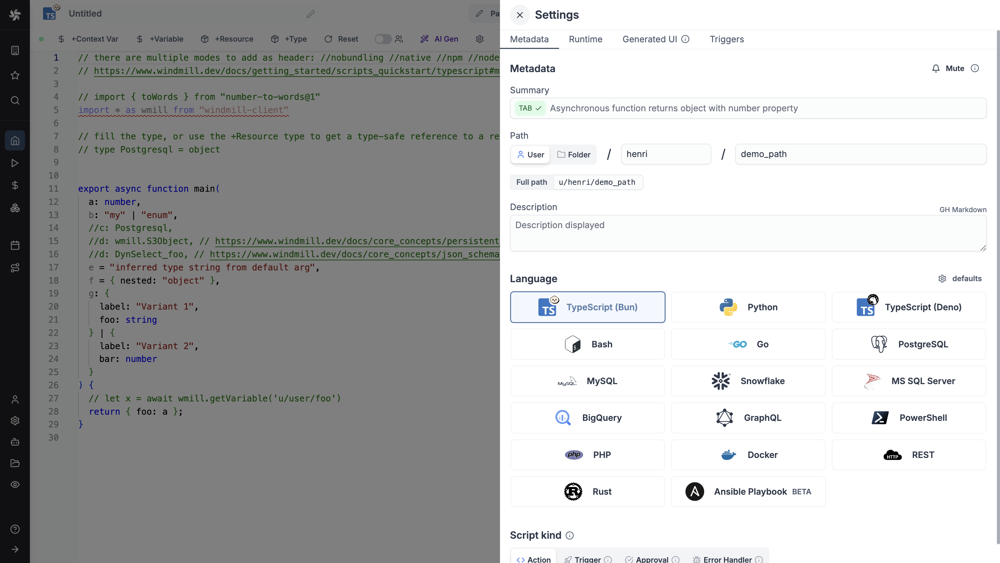
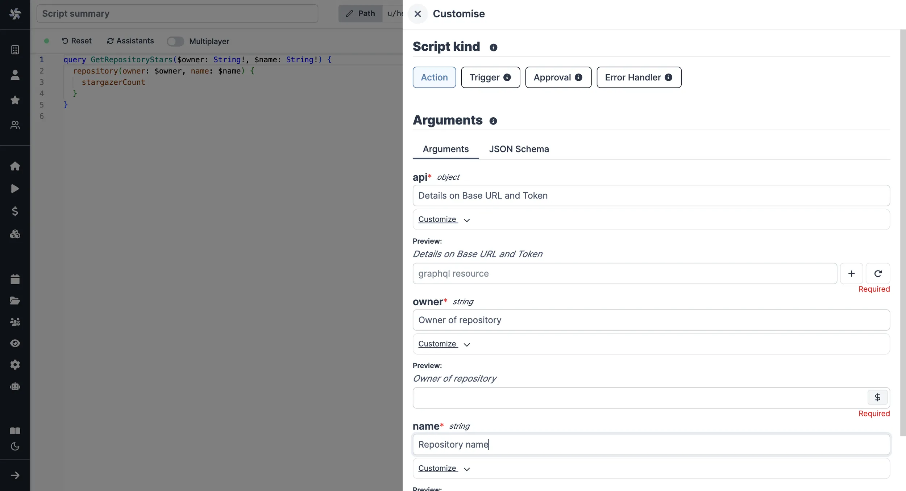
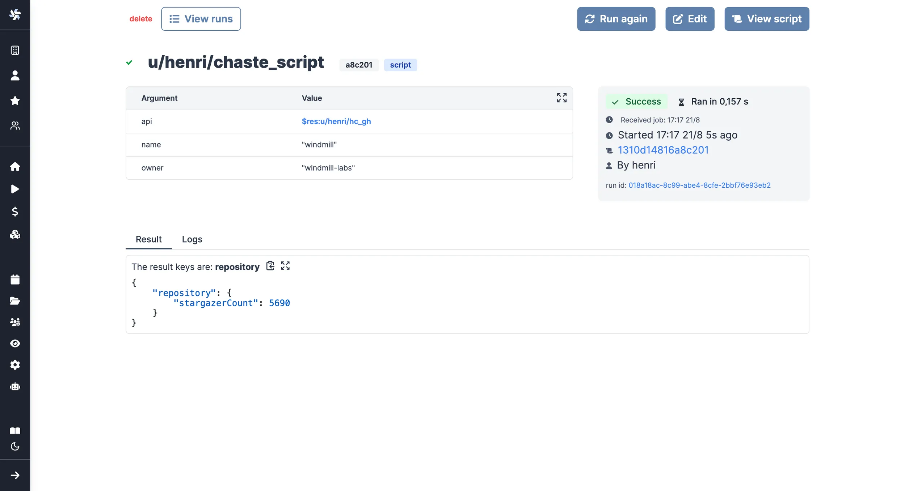

import DocCard from '@site/src/components/DocCard';

# Rest / GraphQL quickstart

In this quick start guide, we will write our first script in [Rest](https://restfulapi.net/) & [GraphQL](https://graphql.org/).

<video
	className="border-2 rounded-lg object-cover w-full h-full dark:border-gray-800"
	autoPlay
	controls
	id="main-video"
	src="/videos/rest_example_intro.mp4"
/>

<br />

This tutorial covers how to create a simple script through Windmill web IDE. See the dedicated page to [develop scripts locally](../../../advanced/4_local_development/index.mdx).

<div className="grid grid-cols-2 gap-6 mb-4">
	<DocCard
		title="Local development"
		description="Develop from various environments such as your terminal, VS Code, and JetBrains IDEs."
		href="/docs/advanced/local_development"
	/>
</div>

Scripts are the basic building blocks in Windmill. They can be [run and scheduled](../../8_triggers/index.mdx) as standalone, chained together to create [Flows](../../../flows/1_flow_editor.mdx) or displayed with a personalized User Interface as [Apps](../../7_apps_quickstart/index.mdx).

<div className="grid grid-cols-2 gap-6 mb-4">
	<DocCard
		title="Script editor"
		description="All the details on scripts."
		href="/docs/script_editor"
	/>
	<DocCard
		title="Triggers"
		description="Trigger scripts and flows on-demand, by schedule or on external events."
		href="/docs/getting_started/triggers"
	/>
</div>

Scripts consist of 2 parts:

- [Code](#code).
- [Settings](#settings): settings & metadata about the Script such as its path, summary, description, [JSON Schema](../../../core_concepts/13_json_schema_and_parsing/index.mdx) of its inputs (inferred from its signature).

When stored in a code repository, those 2 parts are stored separately at `<path>.rest` and `<path>.script.yaml`.

Below is a simple example of a script built in Rest with Windmill:

```ts
export async function main() {
	const res = await fetch('https://api.supabase.com/v1/organizations', {
		headers: {
			Authorization: `Bearer <your_supabase_token>`,
			'Content-Type': 'application/json'
		}
	});
	return res.json();
}
```

## Settings



As part of the [settings](../../../script_editor/settings.mdx) menu, each script has metadata associated with it, enabling it to be defined and configured in depth.

- **Summary** (optional) is a short, human-readable summary of the Script. It will be displayed as a title across Windmill. If omitted, the UI will use the `path` by default.
- **Path** is the Script's unique identifier that consists of the [script's owner](../../../core_concepts/16_roles_and_permissions/index.mdx), and the script's name. The owner can be either a user, or a group ([folder](../../../core_concepts/8_groups_and_folders/index.mdx#folders)).
- **Description** is where you can give instructions through the [auto-generated UI](../../../core_concepts/6_auto_generated_uis/index.mdx) to users on how to run your Script. It supports markdown.
- **Language** of the script.
- **Script kind**: Action (by default), [Trigger](../../../flows/10_flow_trigger.mdx), [Approval](../../../flows/11_flow_approval.mdx), [Error handler](../../../flows/7_flow_error_handler.md) or [Preprocessor](../../../core_concepts/43_preprocessors/index.mdx). This acts as a tag to filter appropriate scripts from the [flow editor](../../6_flows_quickstart/index.mdx).

This menu also has additional settings on [Runtime](../../../script_editor/settings.mdx#runtime), [Generated UI](#generated-ui) and [Triggers](../../../script_editor/settings.mdx#triggers).

<div className="grid grid-cols-2 gap-6 mb-4">
	<DocCard
		title="Settings"
		description="Each script has metadata & settings associated with it, enabling it to be defined and configured in depth."
		href="/docs/script_editor/settings"
	/>
</div>

Now click on the code editor on the left side.

## Code

Windmill provides an online editor to work on your Scripts. The left-side is
the editor itself. The right-side [previews the UI](../../../core_concepts/6_auto_generated_uis/index.mdx) that Windmill will
generate from the Script's signature - this will be visible to the users of the
Script. You can preview that UI, provide input values.


<div className="grid grid-cols-2 gap-6 mb-4">
	<DocCard
		title="Code editor"
		description="The code editor is Windmill's integrated development environment."
		href="/docs/code_editor"
	/>
	<DocCard
		title="Auto-generated UIs"
		description="Windmill creates auto-generated user interfaces for scripts and flows based on their parameters."
		href="/docs/core_concepts/auto_generated_uis"
	/>
</div>

### Rest

As we picked `Rest` for this example, Windmill provided some boilerplate. Let's take a look:

```ts
//native
//you can add proxy support using //proxy http(s)://host:port

// native scripts are bun scripts that are executed on native workers and can be parallelized
// only fetch is allowed, but imports will work as long as they also use only fetch and the standard lib

//import * as wmill from "windmill-client"

export async function main(example_input: number = 3) {
  // "3" is the default value of example_input, it can be overriden with code or using the UI
  const res = await fetch(`https://jsonplaceholder.typicode.com/todos/${example_input}`, {
    headers: { "Content-Type": "application/json" },
  });
  return res.json();
}

```

Rest scripts are in fact [Bun TypeScript](../1_typescript_quickstart/index.mdx) fetches.
They support all the normal signatures of normal TypeScript but only [stdlib](https://en.wikibooks.org/wiki/C_Programming/stdlib.h) JavaScript, and the fetch operations (including fetch operations from npm packages and relative imports).
For example, the full [wmill API](../../../advanced/2_clients/ts_client.mdx) is supported, just use:

```ts
import * as wmill from './windmill.ts'
```

The `// native` header line will help Windmill automatically convert between 'nativets' and 'bun' scripts based on the presence of this header so you can always just pick TypeScript (Bun) and decide at the end if you want to accelerate it with 'native' if possible.
The REST button simply prefills a Bun script with a `//native` header. 

Fetches can also be done through a regular TypeScript in Windmill (without the `//native` header), but opting for dedicated Rest scripts
benefits from a highly efficient runtime.

Replace the `<jsonplaceholder>` URL with the API endpoint of your choice and customize the headers object according to your fetch requirements.

REST scripts benefit from the [auto-generated UI](../../../core_concepts/6_auto_generated_uis/index.mdx) capabilities of any Windmill script.
The arguments of the `main` function are used for generating 1. the input spec of the Script,
and 2. the frontend that you see when running the Script as a standalone app.
Type annotations are used to generate the UI form, and help pre-validate
inputs. While not mandatory, they are highly recommended. You can customize the UI in later steps (but not change the input type!).

This is also a way to have users fill [resources](../../../core_concepts/3_resources_and_types/index.mdx) or [variables](../../../core_concepts/2_variables_and_secrets/index.mdx) through the auto-generated UI. The UI is available in the script editor to [test your code](../../../core_concepts/23_instant_preview/index.mdx):

<video
	className="border-2 rounded-lg object-cover w-full h-full dark:border-gray-800"
	controls
	src="/videos/rest_supabase.mp4"
/>

<br />

> In the example above, a custom resource is declared as a parameter of the main function. It will be asked by the user through the auto-generated UI and used directly in the script (here for the bearer token).

If the endpoint is and HTTPS endpoint exposing custom certificate, the fetch will fail. Custom certificates can be trusted using the `DENO_CERT` env variable (see [Deno official documentation](https://docs.deno.com/runtime/manual/getting_started/setup_your_environment#environment-variables))

<br />

<div className="grid grid-cols-2 gap-6 mb-4">
	<DocCard
		title="Instant preview & testing"
		description="On top of its integrated editors, Windmill allows users to see and test what they are building directly from the editor, even before deployment."
		href="/docs/core_concepts/instant_preview"
	/>
</div>

### GraphQL

As we picked `GraphQL` for this example, Windmill provided some boilerplate. Let's take a look:

```ts
query($name1: String, $name2: Int, $name3: [String]) {
	demo(example_name_1: $name1, example_name_2: $name2, example_name_3: $name3) {
		example_name_1,
		example_name_2,
		example_name_3
	}
}
```

The query itself is similar to any GraphQL query.

To trigger each GraphQL script, an input named 'api' will be required. This is a [GraphQL resource](https://hub.windmill.dev/resource_types/112/graphql) defined by the JSON schema:

```js
{
    "type": "object",
    "$schema": "https://json-schema.org/draft/2020-12/schema",
    "required": [
        "base_url"
    ],
    "properties": {
        "base_url": {
            "type": "string",
            "format": "uri",
            "default": "",
            "description": ""
        },
        "bearer_token": {
            "type": "string",
            "default": "",
            "description": ""
        },
        "custom_headers": {
            "type": "object",
            "description": "",
            "properties": {},
            "required": []
        }
    }
}
```

[Resources](../../../core_concepts/3_resources_and_types/index.mdx) are rich objects in JSON that allow to store configuration and credentials. They can be saved, named, and shared within Windmill to control and streamline the execution of GraphQL scripts.

<div className="grid grid-cols-2 gap-6 mb-4">
	<DocCard
		title="Resources and resource types"
		description="Resources are structured configurations and connections to third-party systems, with Resource types defining the schema for each Resource."
		href="/docs/core_concepts/resources_and_types"
	/>
</div>

The arguments of the query will be used for generating 1. the input spec of the Script,
and 2. the frontend that you see when running the Script with an [auto-generated UI](../../../core_concepts/6_auto_generated_uis/index.mdx).
Type annotations are used to generate the UI form, and help pre-validate
inputs. While not mandatory, they are highly recommended. You can customize the UI in later steps (but not change the input type).

The UI is available in the script editor to [test your code](../../../core_concepts/23_instant_preview/index.mdx):

<video
	className="border-2 rounded-lg object-cover w-full h-full dark:border-gray-800"
	controls
	src="/videos/graphql_example.mp4"
/>

<br />

> In the example above, a [GraphQL resource](https://hub.windmill.dev/resource_types/112/graphql) is used with details on base URL and bearer token. Also was used the [auto-generated UI](../../../core_concepts/6_auto_generated_uis/index.mdx) to fill the argument `login`.

## Generated UI

From the Settings menu, the "Generated UI" tab lets you customize the script's arguments.

The UI is generated from the Script's main function signature, but you can add additional constraints here. For example, we could use the `Customize property`: add a regex by clicking on `Pattern` to make sure users are providing a name with only alphanumeric characters: `^[A-Za-z0-9]+$`. Let's still allow numbers in case you are some tech billionaire's kid.



<div className="grid grid-cols-2 gap-6 mb-4">
	<DocCard
		title="Script kind"
		description="You can attach additional functionalities to Scripts by specializing them into specific Script kinds."
		href="/docs/script_editor/script_kinds"
	/>
	<DocCard
		title="Generated UI"
		description="main function's arguments can be given advanced settings that will affect the inputs' auto-generated UI and JSON Schema."
		href="/docs/script_editor/customize_ui"
	/>
</div>

## Run!

We're done! Now let's look at what users of the script will do. Click on the [Deploy](../../../core_concepts/0_draft_and_deploy/index.mdx) button
to load the script. You'll see the user input form we defined earlier.

Note that Scripts are [versioned](../../../core_concepts/34_versioning/index.mdx#script-versioning) in Windmill, and
each script version is uniquely identified by a hash.

Fill in the input field, then hit "Run". You should see a run view, as well as
your logs. All script runs are also available in the [Runs](../../../core_concepts/5_monitor_past_and_future_runs/index.mdx) menu on
the left.



You can also choose to [run the script from the CLI](../../../advanced/3_cli/index.mdx) with the pre-made Command-line interface call.

<div className="grid grid-cols-2 gap-6 mb-4">
	<DocCard
		title="Triggers"
		description="Trigger scripts and flows on-demand, by schedule or on external events."
		href="/docs/getting_started/triggers"
	/>
</div>

## What's next?

This script is a minimal working example, but there's a few more steps that can be useful in a real-world use case:

- Pass [variables and secrets](../../../core_concepts/2_variables_and_secrets/index.mdx)
  to a script.
- Connect to [resources](../../../core_concepts/3_resources_and_types/index.mdx).
- [Trigger that script](../../8_triggers/index.mdx) in many ways.
- Compose scripts in [Flows](../../../flows/1_flow_editor.mdx) or [Apps](../../../apps/0_app_editor/index.mdx).
- You can [share your scripts](../../../misc/1_share_on_hub/index.md) with the community on [Windmill Hub](https://hub.windmill.dev). Once
  submitted, they will be verified by moderators before becoming available to
  everyone right within Windmill.

Scripts are immutable and there is an hash for each deployment of a given script. Scripts are never overwritten and referring to a script by path is referring to the latest deployed hash at that path.

<div className="grid grid-cols-2 gap-6 mb-4">
	<DocCard
		title="Versioning"
		description="Scripts, when deployed, can have a parent script identified by its hash."
		href="/docs/core_concepts/versioning#script-versioning"
	/>
</div>

For each script, a UI is autogenerated from the jsonchema inferred from the script signature, and can be customized further as standalone or embedded into rich UIs using the [App builder](../../7_apps_quickstart/index.mdx).

<div className="grid grid-cols-2 gap-6 mb-4">
	<DocCard
		title="Auto-generated UIs"
		description="Windmill creates auto-generated user interfaces for scripts and flows based on their parameters."
		href="/docs/core_concepts/auto_generated_uis"
	/>
	<DocCard
		title="Generated UI"
		description="main function's arguments can be given advanced settings that will affect the inputs' auto-generated UI and JSON Schema."
		href="/docs/script_editor/customize_ui"
	/>
</div>

In addition to the UI, sync and async [webhooks](../../../core_concepts/4_webhooks/index.mdx) are generated for each deployment.

<div className="grid grid-cols-2 gap-6 mb-4">
	<DocCard
		title="Webhooks"
		description="Trigger scripts and flows from webhooks."
		href="/docs/core_concepts/webhooks"
	/>
</div>
