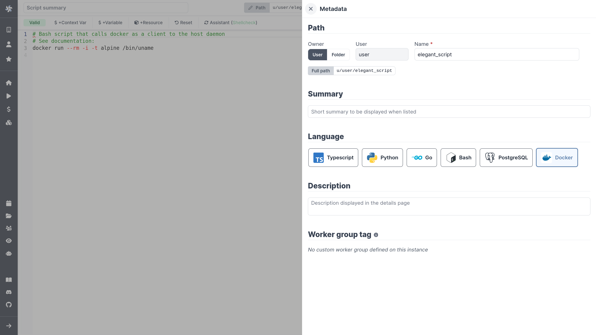
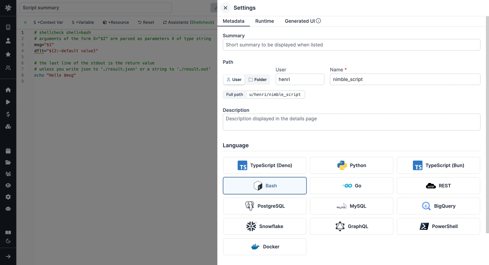
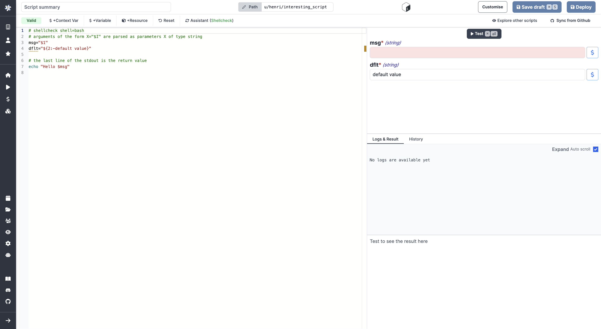
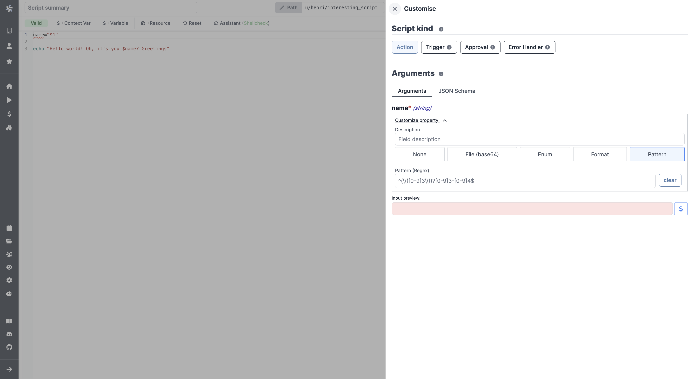
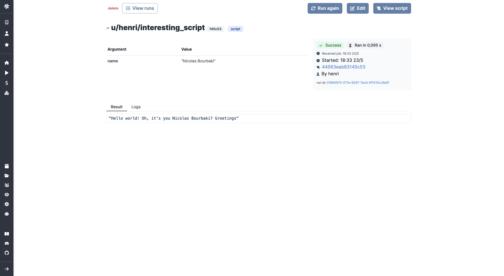

import DocCard from '@site/src/components/DocCard';

# Docker Quickstart

In this quick start guide, we will write our first script ran from a [Docker](https://www.docker.com/) container.

Windmill natively supports Python, Typescript, Go, Bash or SQL.
In some cases where your task requires a complex set of dependencies or is implemented in a non-supported language, Windmill allows running any Docker container through its [Bash](../4_bash_quickstart/index.mdx) support.

As a pre-requisite, the host docker daemon needs to be mounted into the worker container. This is done through a simple volume mount: `/var/run/docker.sock:/var/run/docker.sock`.



<br />

Scripts are the basic building blocks in Windmill. They can be [run and scheduled](../../8_trigger_scripts/index.mdx) as standalone, chained together to create [Flows](../../../flows/1_flow_editor.mdx) or displayed with a personalized User Interface as [Apps](../../7_apps_quickstart/index.mdx).

<div className="grid grid-cols-2 gap-6 mb-4">
	<DocCard
		title="Script Editor"
		description="All the details on scripts."
		href="/docs/script_editor"
	/>
	<DocCard
		title="Triggering Scripts"
		description="Trigger flows on-demand, by schedule or on external events."
		href="/docs/getting_started/trigger_scripts"
	/>
</div>

Scripts consist of 2 parts:

- [Code](#code).
- [Settings](#settings): settings & metadata about the Script such as its path, summary, description, [jsonschema](../../../core_concepts/13_json_schema_and_parsing/index.md) of its inputs (inferred from its signature).

When stored in a code repository, those 2 parts are stored separately at `<path>.ts` and `<path>.script.yaml`.

Below is a simple example of a script built using Bash to run Docker containers from Windmill:

```bash
# shellcheck shell=bash
# Bash script that calls docker as a client to the host daemon
# See documentation: https://www.windmill.dev/docs/advanced/docker
msg="${1:-world}"

IMAGE="alpine:latest"
COMMAND="/bin/echo Hello $msg"

# ensure that the image is up-to-date
docker pull $IMAGE
docker run --rm $IMAGE $COMMAND
```

### Kubernetes

If you use kubernetes and would like to run your docker file directly on the kubernetes host, use the following script:

```
# shellcheck shell=bash
# Bash script that calls docker as a client to the host daemon
# See documentation: https://www.windmill.dev/docs/advanced/docker
msg="${1:-world}"

IMAGE="docker/whalesay:latest"
COMMAND=(sh -c "cowsay $msg")

APISERVER=https://kubernetes.default.svc
SERVICEACCOUNT=/var/run/secrets/kubernetes.io/serviceaccount
NAMESPACE=$(cat ${SERVICEACCOUNT}/namespace)
TOKEN=$(cat ${SERVICEACCOUNT}/token)
CACERT=${SERVICEACCOUNT}/ca.crt

KUBECONFIG_TMP_DIR="$(mktemp -d)"
export KUBECONFIG="${KUBECONFIG_TMP_DIR}/kubeconfig"

trap "rm -rfv ${KUBECONFIG_TMP_DIR}" EXIT

kubectl config set-cluster local --server="${APISERVER}" --certificate-authority="${CACERT}"
kubectl config set-credentials local --token="${TOKEN}"
kubectl config set-context local --cluster=local --user=local --namespace="${NAMESPACE}"
kubectl config use-context local

kubectl run task -it --rm --restart=Never --image="$IMAGE" -- "${COMMAND[@]}"
```

and use the following additional privileges

```yaml
---
apiVersion: rbac.authorization.k8s.io/v1
kind: Role
metadata:
  namespace: windmill
  name: pod-management
rules:
  - apiGroups: ['']
    resources: ['pods']
    verbs: ['get', 'list', 'watch', 'create', 'update', 'patch', 'delete']
  - apiGroups: ['']
    resources: ['pods/log']
    verbs: ['get', 'list', 'watch']
  - apiGroups: ['']
    resources: ['pods/attach']
    verbs: ['get', 'list', 'watch', 'create', 'update', 'patch', 'delete']
  - apiGroups: ['']
    resources: ['events']
    verbs: ['get', 'list', 'watch']
---
apiVersion: rbac.authorization.k8s.io/v1
kind: RoleBinding
metadata:
  name: pod-management
  namespace: windmill
subjects:
  - kind: ServiceAccount
    name: windmill-chart
    namespace: windmill
roleRef:
  kind: Role
  name: pod-management
  apiGroup: rbac.authorization.k8s.io
```

## Setup

To set-up Docker, see:

<div className="grid grid-cols-2 gap-6 mb-4">
	<DocCard
		title="Docker Set-Up"
		description="Windmill supports running any Docker container through its Bash support."
		href="/docs/advanced/docker"
	/>
</div>

## Use

From the Home page of Windmill App, click `+Script`. This will take you to the
first step of script creation: Metadata.

## Settings



As part of the settings menu, each script has metadata associated with it, enabling it to be defined and configured in depth.

- **Path** is the Script's unique identifier that consists of the
  [script's owner](../../../core_concepts/16_roles_and_permissions/index.mdx), and the script's name.
  The owner can be either a user, or a group ([folder](../../../core_concepts/8_groups_and_folders/index.mdx#folders)).
- **Summary** (optional) is a short, human-readable summary of the Script. It
  will be displayed as a title across Windmill. If omitted, the UI will use the `path` by
  default.
- **Language** of the script.
- **Description** is where you can give instructions through the [auto-generated UI](../../../core_concepts/6_auto_generated_uis/index.mdx)
  to users on how to run your Script. It supports markdown.
- **Script kind**: Action (by default), [Trigger](../../../flows/10_flow_trigger.mdx), [Approval](../../../flows/11_flow_approval.mdx) or [Error Handler](../../../flows/7_flow_error_handler.md). This acts as a tag to filter appropriate scripts from the [flow editor](../../6_flows_quickstart/index.mdx).

This menu also has additional settings, such as:

- **[Concurrency limits](../../../script_editor/concurrency_limit.mdx)** enable defining concurrency limits for scripts and inline scripts within flows to prevent exceeding the API Limit of the targeted API.
- **[Worker group tag](../../../core_concepts/9_worker_groups/index.mdx)** to assign scripts to specific worker groups (such as nodes with GPU accelaration).
- **[Cache](../../../core_concepts/24_caching/index.md)** to cache the results for each possible inputs for a given time.
- **[Dedicated Workers](../../../core_concepts/25_dedicated_workers/index.mdx)** to run the script on, to run the script at native speed. Only available on [Cloud plans and Self-Hosted Enterprise edition](/pricing) and with Python and TypeScript.

<div className="grid grid-cols-2 gap-6 mb-4">
	<DocCard
		title="Settings"
		description="Each script has metadata & settings associated with it, enabling it to be defined and configured in depth."
		href="/docs/script_editor/settings"
	/>
</div>

Now click on the code editor on the left side.

### Code

Windmill provides an online editor to work on your Scripts. The left-side is
the editor itself. The right-side [previews the UI](../../../core_concepts/6_auto_generated_uis/index.mdx) that Windmill will
generate from the Script's signature - this will be visible to the users of the
Script. You can preview that UI, provide input values, and [test your script](#instant-preview--testing) there.



<div className="grid grid-cols-2 gap-6 mb-4">
	<DocCard
		title="Code Editor"
		description="The code editor is Windmill's integrated development environment."
		href="/docs/code_editor"
	/>
	<DocCard
		title="Auto-generated UIs"
		description="Windmill creates auto-generated user interfaces for scripts and flows based on their parameters."
		href="/docs/core_concepts/auto_generated_uis"
	/>
</div>

As we picked `Docker` for this example, Windmill provided some Bash
boilerplate. Let's take a look:

```bash
# shellcheck shell=bash
# Bash script that calls docker as a client to the host daemon
# See documentation: https://www.windmill.dev/docs/advanced/docker
msg="${1:-world}"

IMAGE="alpine:latest"
COMMAND="/bin/echo Hello $msg"

# ensure that the image is up-to-date
docker pull $IMAGE
docker run --rm $IMAGE $COMMAND
```

`msg` is just a normal Bash variable. It can be used to pass arguments to the script. This syntax is the standard Bash one to assign default values to parameters.

```
docker run --rm <image> <command>
```

--rm is so that the container dispose itself after being executed. It helps unpollute the host.

The image is the docker image to run. It can be any image available on docker hub or any private registry. It can also be a local image.

The command is the command to run inside the container. It can be any command available in the image.

It is just a Bash script so it will behave exactly the same as a local command or if running this as an ssh command on the host. As a consequence, you can use any strategy to cache docker images or handle authentication.

Do not use the daemon mode `-d` otherwise the script will immediately return while the container continue to run in the background. However, in some cases, that might be what you want.

Like any Bash script, it will return the last line of the stdout. So be sure to print the the return value from your command if you'd like to use it as a result.

### Instant Preview & Testing

Look at the UI preview on the right: it was updated to match the input
signature. Run a test (`Ctrl` + `Enter`) to verify everything works.

<video
	className="border-2 rounded-xl object-cover w-full h-full dark:border-gray-800"
	controls
	src="/videos/auto_g_ui_landing.mp4"
/>

<br />

<div className="grid grid-cols-2 gap-6 mb-4">
	<DocCard
		title="Instant Preview & Testing"
		description="On top of its integrated editors, Windmill allows users to see and test what they are building directly from the editor, even before deployment."
		href="/docs/core_concepts/instant_preview"
	/>
</div>

Now let's go to the last step: the "Generated UI" settings.

## Customize UI

From the Settings menu, the "Generated UI" tab lets you customize the script's arguments.

The UI is generated from the Script's main function signature, but you can add additional constraints here. For example, we could use the `Customize property`: add a regex by clicking on `Pattern` to make sure users are providing a name with only alphanumeric characters: `^[A-Za-z0-9]+$`. Let's still allow numbers in case you are some tech billionaire's kid.



We're done! Save your script. Note that Scripts are [versioned](../../../script_editor/versioning.mdx) in Windmill, and
each script version is uniquely identified by a hash.

<div className="grid grid-cols-2 gap-6 mb-4">
	<DocCard
		title="Script Kinds"
		description="You can attach additional functionalities to Scripts by specializing them into specific Script kinds."
		href="/docs/script_editor/script_kinds"
	/>
	<DocCard
		title="Customize UI"
		description="Some arguments' types can be given advanced settings that will affect the inputs' auto-generated UI and JSON Schema."
		href="/docs/script_editor/customize_ui"
	/>
</div>

### Run!

Now let's look at what users of the script will do. Click on the [Deploy](../../../core_concepts/0_draft_and_deploy/index.mdx) button
to load the script. You'll see the user input form we defined earlier.

Fill in the input field, then hit "Run". You should see a run view, as well as
your logs. All script runs are also available in the [Runs](../../../core_concepts/5_monitor_past_and_future_runs/index.mdx) menu on
the left.



You can also choose to [run the script from the CLI](../../../advanced/3_cli/index.mdx) with the pre-made Command-Line Interface call.

<div className="grid grid-cols-2 gap-6 mb-4">
	<DocCard
		title="Triggering Scripts"
		description="Trigger flows on-demand, by schedule or on external events."
		href="/docs/getting_started/trigger_scripts"
	/>
</div>

## JSON result

The last line returned by the script will be the string result. To use a json result instead, output your result in `./result.json` and it will be automatically picked-up and considered as the JSON result for Bash and Powershell scripts.

## What's next?

This script is a minimal working example, but there's a few more steps that can be useful in a real-world use case:

- Pass [variables and secrets](../../../core_concepts/2_variables_and_secrets/index.mdx)
  to a script.
- Connect to [resources](../../../core_concepts/3_resources_and_types/index.mdx).
- [Trigger that script](../../8_trigger_scripts/index.mdx) in many ways.
- Compose scripts in [Flows](../../../flows/1_flow_editor.mdx) or [Apps](../../../apps/0_app_editor/index.mdx).
- You can [share your scripts](../../../misc/1_share_on_hub/index.md) with the community on [Windmill Hub](https://hub.windmill.dev). Once
  submitted, they will be verified by moderators before becoming available to
  everyone right within Windmill.

Scripts are immutable and there is an hash for each deployment of a given script. Scripts are never overwritten and referring to a script by path is referring to the latest deployed hash at that path.

<div className="grid grid-cols-2 gap-6 mb-4">
	<DocCard
		title="Versioning"
		description="Scripts, when deployed, can have a parent script identified by its hash."
		href="/docs/script_editor/versioning"
	/>
</div>

For each script, a UI is autogenerated from the jsonchema inferred from the script signature, and can be customized further as standalone or embedded into rich UIs using the [App builder](../../7_apps_quickstart/index.mdx).

<div className="grid grid-cols-2 gap-6 mb-4">
	<DocCard
		title="Auto-generated UIs"
		description="Windmill creates auto-generated user interfaces for scripts and flows based on their parameters."
		href="/docs/core_concepts/auto_generated_uis"
	/>
	<DocCard
		title="Customize UI"
		description="Some arguments' types can be given advanced settings that will affect the inputs' auto-generated UI and JSON Schema."
		href="/docs/script_editor/customize_ui"
	/>
</div>

In addition to the UI, sync and async [webhooks](../../../core_concepts/4_webhooks/index.mdx) are generated for each deployment.

<div className="grid grid-cols-2 gap-6 mb-4">
	<DocCard
		title="Webhooks"
		description="Trigger scripts and flows from webhooks."
		href="/docs/core_concepts/webhooks"
	/>
</div>
