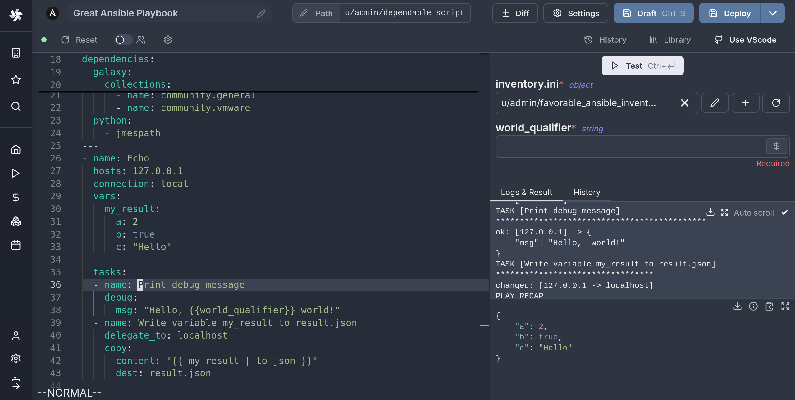
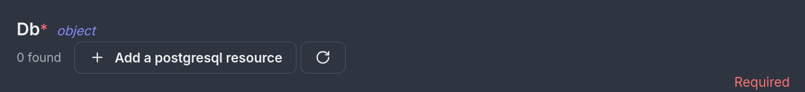
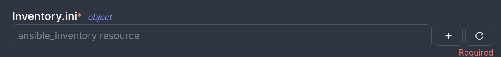

import DocCard from '@site/src/components/DocCard';

# Ansible quickstart

## Windmill Scripts

In this quickstart guide, we will write our first script/playbook with ansible.

<video
	className="border-2 rounded-lg object-cover w-full h-full dark:border-gray-800"
	autoPlay
	controls
	id="main-video"
	src="/videos/ansible_quickstart.mp4"
/>

<br />

This tutorial covers how to create a simple ansible script through Windmill web IDE. See the dedicated page to [Develop Scripts Locally](../../../advanced/4_local_development/index.mdx).

<div className="grid grid-cols-2 gap-6 mb-4">
	<DocCard
		title="Local development"
		description="Develop from various environments such as your terminal, VS Code, and JetBrains IDEs."
		href="/docs/advanced/local_development"
	/>
</div>

Scripts are the basic building blocks in Windmill. They can be [run and scheduled](../../8_trigger_scripts/index.mdx) as standalone, chained together to create [Flows](../../../flows/1_flow_editor.mdx) or displayed with a personalized User Interface as [Apps](../../7_apps_quickstart/index.mdx).

<div className="grid grid-cols-2 gap-6 mb-4">
	<DocCard
		title="Script editor"
		description="All the details on scripts."
		href="/docs/script_editor"
	/>
	<DocCard
		title="Triggering scripts"
		description="Trigger flows on-demand, by schedule or on external events."
		href="/docs/getting_started/trigger_scripts"
	/>
</div>

Scripts consist of 2 parts:

- [Code](#code): For ansible this is a playbook file written in yaml.
- [Settings](#settings): settings & metadata about the Script such as its path, summary, description, [jsonschema](../../../core_concepts/13_json_schema_and_parsing/index.mdx) of its inputs (inferred from its signature).

When stored in a code repository, these 2 parts are stored separately at `<path>.playbook.yml` and `<path>.script.yaml`

#### Create an Ansible playbook script


## Code (Playbook)

In order to make Ansible playbooks compatible with the windmill environment and script model, there is some extra information preceding the start of the playbook that can be entered. Because of this, an Ansible playbook in Windmill will typically look like this:



```yml
---
inventory:
  - resource_type: ansible_inventory
    # You can pin an inventory to this script:
    # resource: u/user/your_resource

# File resources will be written in the relative \`target\` location before
# running the playbook
file_resources:
  - resource: u/user/fabulous_jinja_template
    target:  ./config_template.j2

# Define the arguments of the windmill script
extra_vars:
  world_qualifier:
    type: string

dependencies:
  galaxy:
    collections:
      - name: community.general
      - name: community.vmware
  python:
    - jmespath
---
- name: Echo
  hosts: 127.0.0.1
  connection: local
  vars:
    my_result:
      a: 2
      b: true
      c: "Hello"

  tasks:
  - name: Print debug message
    debug:
      msg: "Hello, {{world_qualifier}} world!"
  - name: Write variable my_result to result.json
    delegate_to: localhost
    copy:
      content: "{{ my_result | to_json }}"
      dest: result.json
```

There are two YAML documents in series, the second being the Ansible Playbook. The first one is only used by windmill, and will not be visible to Ansible when executing the playbook. It contains different sections that declare some metadata about the script.

We will now go thorugh each of these sections.

### Arguments (extra-args)

Windmill scripts can take arguments, and in order to define the names and types of the arguments you can use this section. These definitions will be parsed allowing the frontend to interactively display dynamic inputs for the script.


```yaml
extra_vars:
  world_qualifier:
    type: string
  nested_object:
    type: object
    properties:
      a:
        type: string
      b:
        type: number
  some_arr:
    type: array
    objects:
      type: string
```


The type definition is inspired and tries to follow the [OpenAPI Data Types standard](https://swagger.io/docs/specification/data-models/data-types/). Note that not all features / types are supported, the best way to know what is supported is to test it out in the Web IDE.

To use windmill resources as types you can use the following type definition:

```yaml
extra_vars:
  my_resource:
    type: windmill_resource
    resource_type: postgresql
```



Under the hood, Windmill will pass these variables using the `--extra-args` flag to Ansible, so you can expect the according behavior.

### Return Values

In windmill scripts usually have a return value, which allows scripts to be chained in flows and run conditionally on the result of a previous operation. For Ansible playbooks you can achieve the same result by having one of the tasks (preferably the last one for coherence of results/errors) write a file named `result.json` with the JSON object you want to return:

```yaml
---
tasks:

  [...]

  - name: Write variable my_result to result.json
    delegate_to: localhost
    copy:
      content: "{{ my_result | to_json }}"
      dest: result.json

```

Note that valid json must be written to the file or else the job will fail. Also, this should be done by the control node i.e. your worker, so it's important to use the `delegate_to: localhost` directive.


### Inventories

When using ansbile playbooks, you would usually run a command such as `ansible-playbook playbook.yml -i inventory.ini`. The ways to pass inventories to Ansible in Windmill is by filling the following section:

```yaml
inventory:
  - resource_type: ansible_inventory
```

To create similar resource type, refer to [creating plain text resources](/docs/core_concepts/resources_and_types#plain-text-file-resources). Otherwise `ansible_inventory` should be available after syncing resource types from the hub.

After adding this in the Web IDE, you will see a new `inventory.ini` argument pop up. You can then select or create a new ansible_inventory resource.



If you don't want one of the inputs of the script be the inventory, you can pin a specific resource to the script by specifying its path. In this case you don't need to specify the resource_type anymore:

```yaml
inventory:
  - resource: u/user/my_ansible_inventory
```

Then the UI will not prompt you for the inventory but will use this resource at every run of the script. If otherwise you wish to not specify any inventory, you can remove the section altogether

### Other non-inventory file resources

It sometimes happens that your Ansible playbook depends on some text file existing at a relative path to the playbook. This can be a configuration file, a template, some other file that you can't inline or otherwise is simpler to keep as a separate file. In this case, Windmill offers a feature to create these files at the specified path before running the playbook. The syntax will be the following:

```yaml
file_resources:
  - resource: u/user/fabulous_jinja_template
    target:  ./config_template.j2
```

To create text file resource type and resources, refer to [creating plain text resources](/docs/core_concepts/resources_and_types#plain-text-file-resources)

In the example above, the resource `u/user/faboulous_jinja_template` is a special plain text file resource. The target `./config_template.j2` is the path relative to the playbook where the file will be created and where the playbook can access it.

Now you can write your notebook assuming that this file will exist at the time of execution.

### Dependencies

Ansible playbooks often depend on python packages or Ansible Galaxy Collections. In windmill you can specify these dependencies in the `dependencies` section and Windmill will take care of satisfying them before running the playbook.

```yaml
dependencies:
  galaxy:
    collections:
      - name: community.general
      - name: community.vmware
  python:
    - jmespath
```

The syntax is similar to `ansible-builder` and Execution Environments, however all is installed locally using the same technology as for managing [Python Dependencies](../../../advanced/15_dependencies_in_python/index.mdx) in python scripts, meaning no extra container is created.

:::info Ansible vs Ansible-core
Currently the Windmill image supporting ansible runs the full `ansible` and not `ansible-core`. You can expect the respective collections to be preinstalled.
:::

## Instant Preview & Testing

Look at the UI preview on the right: it was updated to match the input
signature. Run a test (`Ctrl` + `Enter`) to verify everything works.

<video
	className="border-2 rounded-lg object-cover w-full h-full dark:border-gray-800"
	controls
	src="/videos/auto_g_ui_landing.mp4"
/>

<br />


<div className="grid grid-cols-2 gap-6 mb-4">
	<DocCard
		title="Instant Preview & Testing"
		description="On top of its integrated editors, Windmill allows users to see and test what they are building directly from the editor, even before deployment."
		href="/docs/core_concepts/instant_preview"
	/>
</div>

Now let's go to the last step: the "Generated UI" settings.

## Generated UI

From the Settings menu, the "Generated UI" tab lets you customize the script's arguments.

The UI is generated from the Script's main function signature, but you can add additional constraints here. For example, we could use the `Customize property`: add a regex by clicking on `Pattern` to make sure users are providing a name with only alphanumeric characters: `^[A-Za-z0-9]+$`. Let's still allow numbers in case you are some tech billionaire's kid.

``

<div className="grid grid-cols-2 gap-6 mb-4">
	<DocCard
		title="Script Kinds"
		description="You can attach additional functionalities to Scripts by specializing them into specific Script kinds."
		href="/docs/script_editor/script_kinds"
	/>
	<DocCard
		title="Generated UI"
		description="main function's arguments can be given advanced settings that will affect the inputs' auto-generated UI and JSON Schema."
		href="/docs/script_editor/customize_ui"
	/>
</div>

## Workflows as Code

One way to write distributed programs that execute distinct jobs is to use [flows](../../../flows/1_flow_editor.mdx) that chain scripts together.

Another approach is to write a program that defines the jobs and their dependencies, and then execute that program directly in your script. This is known as [workflows as code](../../../core_concepts/31_workflows_as_code/index.mdx).


All details at:

<div className="grid grid-cols-2 gap-6 mb-4">
	<DocCard
		title="Workflows as Code"
		description="Automate tasks and their flow with only code."
		href="/docs/core_concepts/workflows_as_code"
	/>
</div>

## Run!

We're done! Now let's look at what users of the script will do. Click on the [Deploy](../../../core_concepts/0_draft_and_deploy/index.mdx) button
to load the script. You'll see the user input form we defined earlier.

Note that Scripts are [versioned](../../../core_concepts/34_versioning/index.mdx#script-versioning) in Windmill, and
each script version is uniquely identified by a hash.

Fill in the input field, then hit "Run". You should see a run view, as well as
your logs. All script runs are also available in the [Runs](../../../core_concepts/5_monitor_past_and_future_runs/index.mdx) menu on
the left.

``

You can also choose to [run the script from the CLI](../../../advanced/3_cli/index.mdx) with the pre-made Command-Line Interface call.

<div className="grid grid-cols-2 gap-6 mb-4">
	<DocCard
		title="Triggering Scripts"
		description="Trigger flows on-demand, by schedule or on external events."
		href="/docs/getting_started/trigger_scripts"
	/>
</div>

## Caching

Every dependency on Python is cached on disk by default. Furtherfore if you use the [Distributed cache storage](../../../misc/13_s3_cache/index.mdx), it will be available to every other worker, allowing fast startup for every worker.

## What's next?

This script is a minimal working example, but there's a few more steps that can be useful in a real-world use case:

- Pass [variables and secrets](../../../core_concepts/2_variables_and_secrets/index.mdx)
  to a script.
- Connect to [resources](../../../core_concepts/3_resources_and_types/index.mdx).
- [Trigger that script](../../8_trigger_scripts/index.mdx) in many ways.
- Compose scripts in [Flows](../../../flows/1_flow_editor.mdx) or [Apps](../../../apps/0_app_editor/index.mdx).
- You can [share your scripts](../../../misc/1_share_on_hub/index.md) with the community on [Windmill Hub](https://hub.windmill.dev). Once
  submitted, they will be verified by moderators before becoming available to
  everyone right within Windmill.

Scripts are immutable and there is an hash for each deployment of a given script. Scripts are never overwritten and referring to a script by path is referring to the latest deployed hash at that path.

<div className="grid grid-cols-2 gap-6 mb-4">
	<DocCard
		title="Versioning"
		description="Scripts, when deployed, can have a parent script identified by its hash."
		href="/docs/core_concepts/versioning#script-versioning"
	/>
</div>

For each script, a UI is autogenerated from the jsonchema inferred from the script signature, and can be customized further as standalone or embedded into rich UIs using the [App builder](../../7_apps_quickstart/index.mdx).

<div className="grid grid-cols-2 gap-6 mb-4">
	<DocCard
		title="Auto-generated UIs"
		description="Windmill creates auto-generated user interfaces for scripts and flows based on their parameters."
		href="/docs/core_concepts/auto_generated_uis"
	/>
	<DocCard
		title="Generated UI"
		description="main function's arguments can be given advanced settings that will affect the inputs' auto-generated UI and JSON Schema."
		href="/docs/script_editor/customize_ui"
	/>
</div>

In addition to the UI, sync and async [webhooks](../../../core_concepts/4_webhooks/index.mdx) are generated for each deployment.

<div className="grid grid-cols-2 gap-6 mb-4">
	<DocCard
		title="Webhooks"
		description="Trigger scripts and flows from webhooks."
		href="/docs/core_concepts/webhooks"
	/>
</div>
