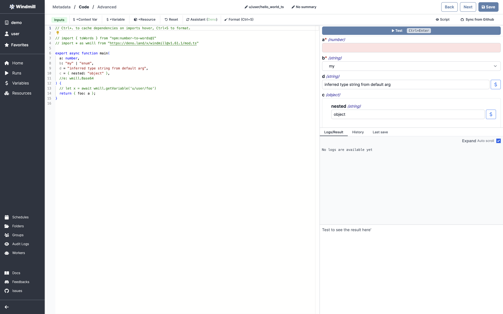
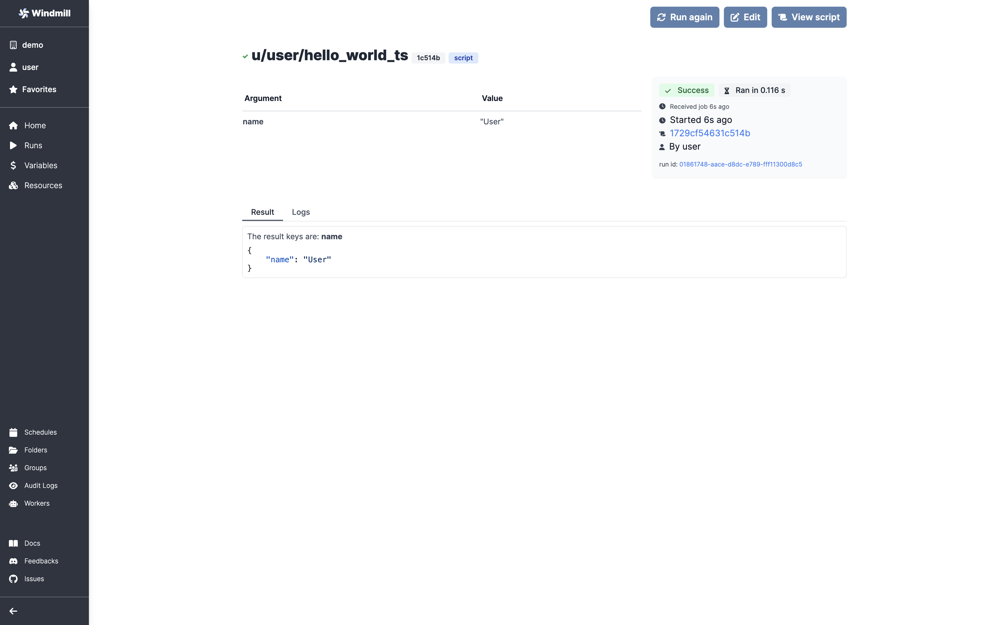

# Typescript quickstart

In this quick start guide, we will write our first script in typescript. Windmill uses [deno](https://deno.land/) as the typescript runtime.

Scripts are the basic building blocks in Windmill. They can be run as standalone apps, chained together to create flows.

In Windmill, Scripts consist of three parts:

- **Metadata**: information about the Script such as its path, description, and author, as well as configuration.
- **Logic**: the code.
- **UI**: a UI autogenerated from the script signature, that can be customized. That will be the visible part for operators.

For more information about how Scripts and Flows are represented within Windmill, also see the [OpenFlow Spec.][openflow]

In this quick start guide, we'll create a Script that greets the operator running it. For newcomers, you can access to our cloud app [here](https://app.windmill.dev/user/login) (it's free and will always be). From the Home page, click on "_+ Script </>_". This will take you to the first step of script creation: metadata.


## Metadata

- **Path** is the Script's unique identifier that consist of the
[script's owner](../reference#owner), and the script's name. The owner can be
either a user, or a group. This defines the permissions on Windmill:
selecting user will keep the script _private_ to the selected account, while
selecting group will make it available to all users of the given group. Let's save this script under your path, and call it `hello_world`.
- **Summary** (optional) is a short, human-readable summary of the Script. It will be displayed across Windmill. If omitted, the UI will use the `path` by default. Let's use "Greet the user by name!".
- **Language** the language of the script. Windmill supports golang, typescript, python, and bash. You can read more about environments. Let's pick typescript!
- **Advanced** gives you access to more options, such as creating [specialized scripts](../reference.md) and saving the script as a template. We won't go into this in this quickstart.

Now hit next at the top right corner, and let's build our hello world!

## Code

**Windmill gives you an online editor to work on your Scripts**. The left-side is the editor itself. The right-side lets you preview the UI that Windmill will generate from the Script's signature and show to Script users. You can easily preview that UI, provide input values, and test your script there.



We picked `typescript` for this example, so Windmill provided some typescript boilerplate. Let's take a look:

```typescript
// reload the smart assistant on the top right if it dies to get autocompletion and syntax highlighting
// (Ctrl+space to cache dependencies on imports hover).

// you can use npm imports directly!
// import { toWords } from "npm:number-to-words@1"
// import * as wmill from "https://deno.land/x/windmill@v1.47.3/mod.ts"

export async function main(
  a: number,
  b: "my" | "enum",
  d = "inferred type string from default arg",
  c = { nested: "object" },
  //e: wmill.Base64
) {
  // let x = await wmill.getVariable('u/user/foo')
  return { foo: a };
}

```

In Windmill, scripts need to have a `main` function that will be the script's
entrypoint. There are a few important things to note about the `main`.
- The main arguments are used for generating the input spec of the Script, and the frontend that you see when running the Script as a standalone app.
- Type annotations are used to generate the UI form, and help pre-validate inputs. While not mandatory, they are highly recommended. You can customize the UI in later steps (but not change the input type!).

Also take a look at the import statement lines that are commented out. You can use npm imports directly in Windmill. The last import line imports the windmill client, that is needed for example to access [variables](../how-tos/2_save_variables_and_secrets.md) or [resources](../how-tos/3_create_resources_and_types.md). We won't go into that here.

Back to our hello world. We can clear up unused import statements, change the main to take in the user's name. Let's also return the `name`, maybe we can use this later if we use this Script within a Flow and need to pass it on.

```typescript
export async function main(
  name: string
) {
  console.log("Hello world! Oh, it's you %s? Greetings!", name)
  return { name: name};
}

```

Look at the UI preview on the right: it was updated to match the input signature. Run a preview to verify everything works. 

You can change how the UI behaves by changing the main signature. For example, if you add a default for the `name` argument, the UI won't consider this field as required anymore.

```typescript
  name: string = "you"
```

Now let's go to the last step: customizing the UI.

## UI Customization

In this step, you can:

- add a **Description** to the Script. This is where you can give instructions to users on how to run your Script. It supports _markdown_!
- customize the Script **Arguments**. The UI is generated from the Script's main function signature, but you can add additional constraints here. For example, we could use the `Format` add a regex here to make sure users are providing a name with only alphanumeric characters: `^[A-Za-z0-9]*$`. Let's still allow numbers in case you're some tech billionaire's kid.


We're done! Save your script. Note that Scripts are versioned in Windmill, and each script version is uniquely identified by a hash.

### Run!

Now let's look at what users of this script will do. Click on the **_Run_** button
to load this script. You'll see the user input form we defined earlier. 

Fill in the input field, then hit run. You should see a run view, as well as your
logs. **All script runs are also available in the [Runs]**[app-runs] menu on the
left.



### What's next ?

This script is a minimal working example, but there's a few more steps we need
in a real-world use case:

- pass [variables and secrets](../how-tos/variables_and_secrets) to a script
- connect to [resources](../how-tos/create_resources)
- run scripts or flows on a [schedule](../how-tos/schedule)
- compose scripts in flows
- you can **share your scripts with the community** on [Windmill Hub][wm-hub]. Once submitted, they will be verified by
moderators before becoming available to everyone right within Windmill.

<!-- Resources -->

[app-runs]: https://app.windmill.dev/runs
[app-scripts]: https://app.windmill.dev/scripts
[deno]: https://deno.land/
[openflow]: ../openflow.md
[python]: https://www.python.org/
[wm-hub]: https://hub.windmill.dev
