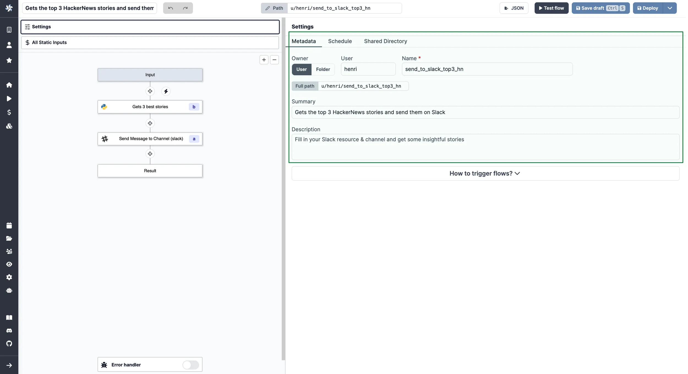
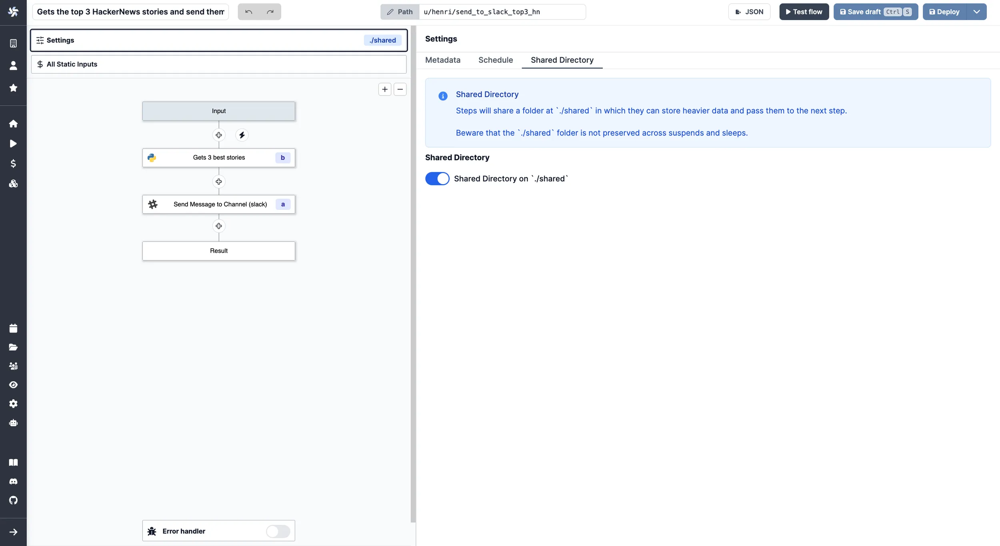
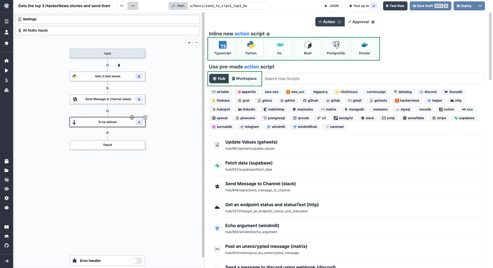
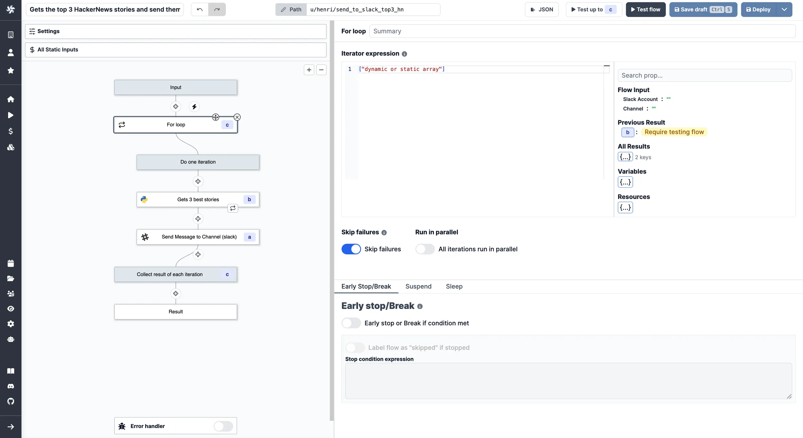
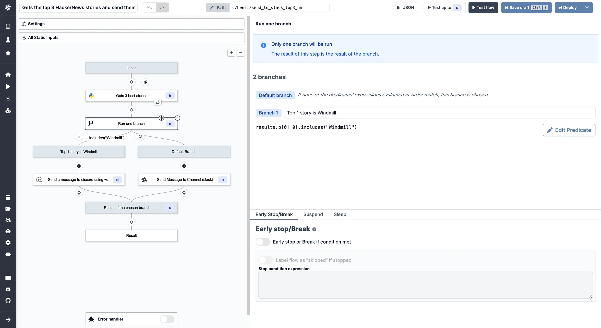
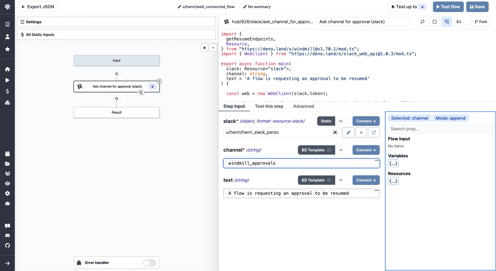
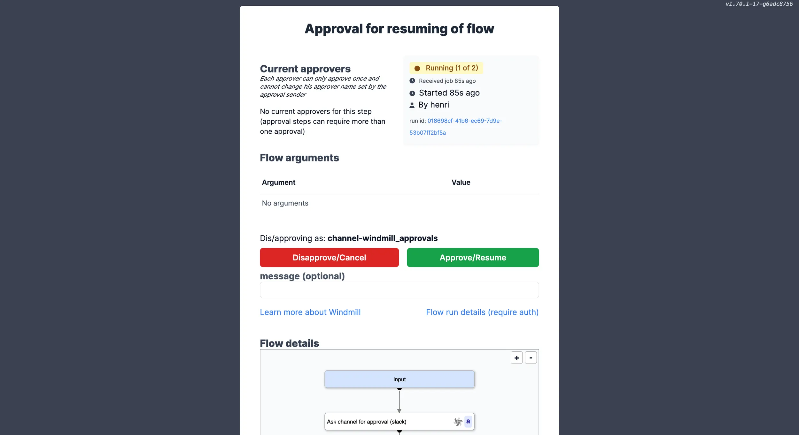

# Flows Quickstart

The present document will introduce you to Flows and how to build your first one.

<video
    className="border-2 rounded-xl object-cover w-full h-full dark:border-gray-800"
    autoPlay
    loop
    controls
    id="main-video"
    src="/videos/flows_quickstart_example.mp4"
/>

 

> [Here](https://hub.windmill.dev/flows/43/) is an example of a simple flow built with Windmill.

 

It is important to have in mind that **in Windmill Scripts are at the basis of Flows and Apps**. To sum up roughly, workflows are state machines represented as DAG to compose scripts together. Learn more in the [Script Quickstart](../0_scripts_quickstart/index.mdx) in the previous section. You will not necessarily have to re-build each script as you can reuse them from your workspace or from the [Hub](https://hub.windmill.dev/).

Those workflows can run for-loops, branches (parralellizable) suspend themselves until a timeout or receiving events such as webhooks or approvals. They can be scheduled very frequently and check for new external items to process (what we call "Trigger" script).

**The overhead and coldstart between each step is about 20ms, which is faster than any other orchestration engine, by a large margin**

To create your first workflow, you could also pick one from our [Hub](https://hub.windmill.dev/flows) and fork it. Here, we're going to build our own flow from scratch, step by step.

From [Windmill](../00_how_to_use_windmill/index.mdx), click on `+ Flow`, and let's get started!

:::tip

Follow our [detailed section](../../flows/1_flow_editor.mdx) on the Flow Editor for more information.

:::

### Settings

#### Metadata

The first thing you'll see is the **Metadata** menu. From there, you can set the permissions of the workflow: User (by default, you), and Folder (referring to read and/or write groups).

Also, you can give succintly a Name, a Summary and a Description to your flow. Those are supposed to be explicit, we recommend you to give context and make them as self-explainatory as possible.

#### Schedule

On another tab, you can configure a **[Schedule](../../core_concepts/1_scheduling/index.md)** to trigger your flow. Flows can be [triggered](../9_trigger_flows/index.md) by any schedules, their [webhooks](../../core_concepts/4_webhooks/index.md) or their UI but they only have only one primary schedule with which they share the same path. This menu is where you set the primary schedule with CRON. The default schedule is none.

#### Shared Directory

Last tab of the settings menu is the **[Shared Directory](../../flows/3_editor_components.mdx#shared-directory)**.

By default, flows on Windmill are based on a result basis. A step will take as inputs the results of previous steps. And this works fine for lightweight automation.

For heavier ETLs and any output that is not suitable for JSON, you might want to use the `Shared Directory` to share data between steps. Steps share a folder at `./shared` in which they can store heavier data and pass them to the next step.

Get more details on the [Persistent Storage dedicated page](../../core_concepts/11_persistent_storage/index.md).

You can always go back to this menu by clicking on `Settings` on the top lef, or on the name of the flow on the [toolbar](../../flows/3_editor_components.mdx#toolbar).

### Flow editor

The proper flow editor is the side menu on the left. From there you can architecture your flow and take action at each step.

There are four kinds of scripts: [Action](../../flows/3_editor_components.mdx#flow-actions), [Trigger](../../flows/10_flow_trigger.md), [Approval](../../flows/11_flow_approval.md) and [Error handler](../../flows/7_flow_error_handler.md). You can sequence them how you want. Action is the default script type.

Each script can be called from Workspace or [Hub](https://hub.windmill.dev/), you can also decide to **write them inline**.

 

### How data is exchanged between steps

Flows on Windmill are generic and reusable, they therefore expose inputs. Input and outputs are piped together.

Inputs are either:

- **[Static](../../flows/3_editor_components.mdx#static-inputs)**: you can find them on top of the side menu. This tab centralizes the static inputs of every steps. It is akin to a file containing all constants. Modifying a value here modify it in the step input directly.
- **Dynamically linked to others**: with JSON objects as result that allow to refer to the output of any step. You can refer to the result of any step using the id associated with the step.

### Retries

At each step, Windmill allows you to **[customize the number of retries](../../flows/14_retries.md)** by going on the `Advanced` tabs of the individual script. If defined, upon error this step will be retried with a delay and a maximum number of attempts.

But the Flow editor is not just for sequence of steps, but also for more complex controls, such as:

### For loops

**[For loops](../../flows/12_flow_loops.md)** are a special type of steps that allows you to iterate over a list of items, given by an iterator expression.

### Branching

**[Branches](../../flows/13_flow_branches.md)** allow you to build branching logic to create and manage complex workflows based on conditions. There are two of them:

- [Branch one](../../flows/13_flow_branches.md#branch-one): allows you to execute a branch if a condition is true.
- [Branch all](../../flows/13_flow_branches.md#branch-all): allows you to execute all the branches in parallel, as if each branch is a flow.

### Suspend/Approval Step

At each step you can add **[Approval Scripts](../../flows/11_flow_approval.md)** to manage security and control over your flows.

Request approvals can be sent by email, Slack, anything. Then you can **automatically resume workflows with secret webhooks** after the approval steps.

<video
    className="border-2 rounded-xl object-cover w-full h-full dark:border-gray-800"
    autoPlay
    controls
    id="main-video"
    src="/videos/flow-approval.mp4"
/>

 

  
Create an approval step using Slack

On the `+` button, chose `Approval (Script)`. Pick "[Ask channel for approval (slack)](https://hub.windmill.dev/scripts/slack/1503/)" from Hub scripts. Configure it from the `Step Input` tab.

 

Run (or test) flow and receive approval request.

 

Approve.

 

Workflow will be automatically resumed.

### Triggers

There are several ways to [trigger a flow with Windmill](../9_trigger_flows/index.md).

1. The most direct one is from the **[autogenerated UI provided by Windmill](../../core_concepts/6_auto_generated_uis/index.md)**. It is the one you will see from the flow editor.
2. A similar but more customized way is to use **Windmill Apps** using the [App editor](../7_apps_quickstart/index.mdx).
3. We saw above that you can trigger flows using **[schedules](../../core_concepts/1_scheduling/index.md)** that you can check from the [Runs](../../core_concepts/5_monitor_past_and_future_runs/index.mdx) page. One special way to use scheduling is to combine it with [trigger scripts](../../flows/10_flow_trigger.md).
4. **[Execute flows from the CLI](../../advanced/3_cli/index.mdx)** to trigger your flows from your terminal.
5. **[Trigger the flow from another flow](../9_trigger_flows/index.md#trigger-a-flow-from-another-flow)**.
6. Using **[trigger scripts](../../flows/10_flow_trigger.md)** to trigger only if a condition has been met.
7. **[Webhooks](../../core_concepts/4_webhooks/index.md)**. Each Flow created in the app gets autogenerated webhooks. You can see them once you flow is saved. You can even [trigger flows without leaving Slack](/blog/handler-slack-commands)!

### Time to test

You don't have to explore all flows editor possibilities at once. At each step, **test what you're building** to keep control on your wonder. You can also test up to a certain step by clicking on an action (x) and then on `Test up to x`.

<video
    className="border-2 rounded-xl object-cover w-full h-full dark:border-gray-800"
    autoPlay
    controls
    id="main-video"
    src="/videos/test_flow.mp4"
/>

 

When you're done, [deploy](../../core_concepts/0_draft_and_deploy/index.mdx) your flow, schedule it, [create and app from it](../../core_concepts/6_auto_generated_uis/index.md#automatically-generated-apps), or even [publish it to Hub](../../misc/1_share_on_hub/index.md).

Follow our [detailed section](../../flows/1_flow_editor.mdx) on the Flow Editor for more information.
