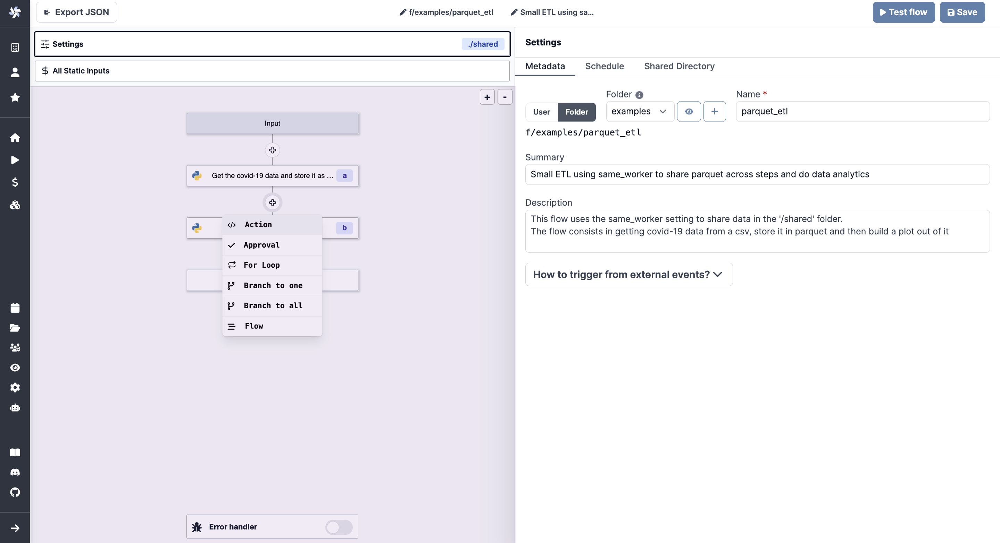
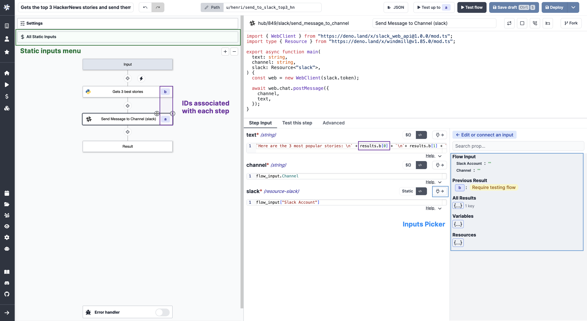
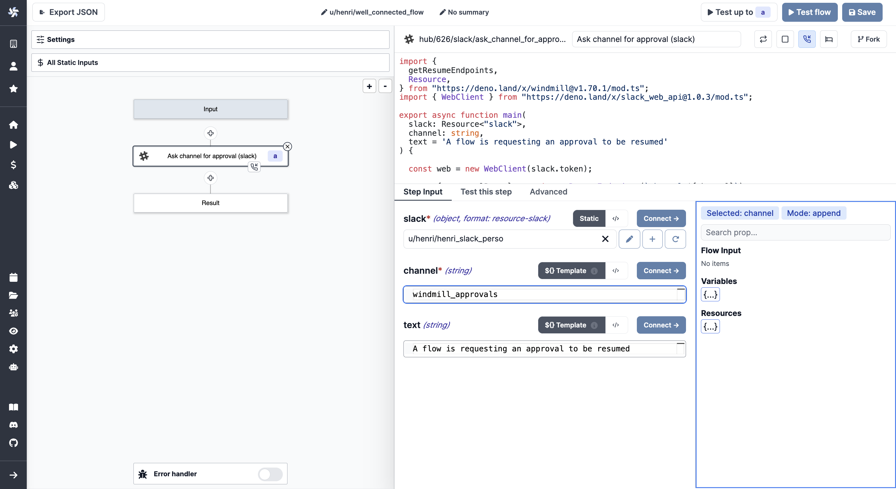
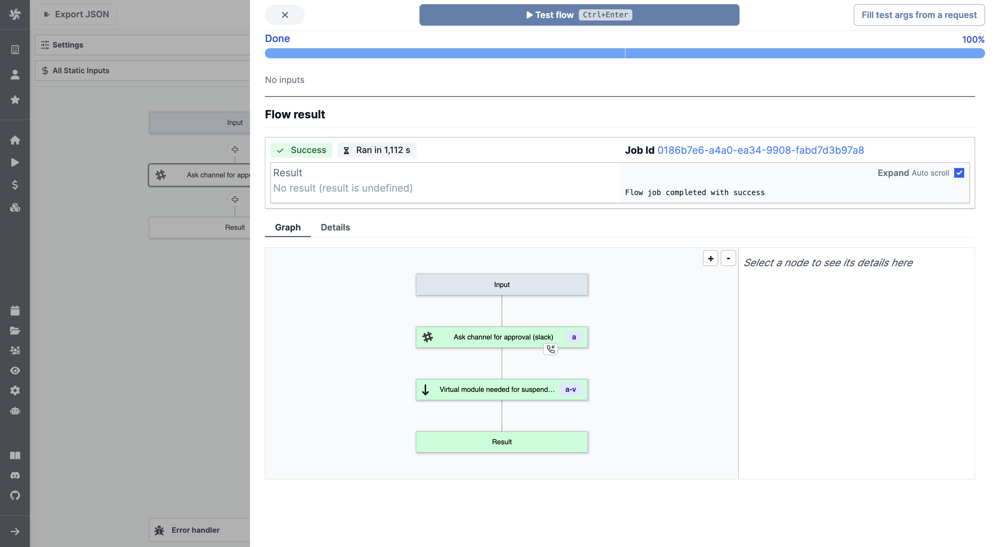

# Flows Quickstart

The present document will introduce you to flows and how to build your first one.

[Here](https://hub.windmill.dev/flows/13/whenever-an-hackernews-message-contains-a-mention%2C-publish-it-to-slack-with-sentiment-analysed) is an example of a simple flow built with Windmill.

It is important to have in mind that **scripts are at the basis of Windmill**. To sum up roughly, workflows are an architecture of scripts. You can have a look at the [Script Quickstart](https://docs.windmill.dev/docs/getting_started/scripts_quickstart/typescript) in the precedent section (in the programming language of your choice). But don't worry, you will not have to build each script by hand, as you can always use scripts from your workspace or from the [Hub](https://hub.windmill.dev/).

To create your first workflow, you could also pick one from our [Hub](https://hub.windmill.dev/flows) and fork it. Here, we're going to build our own flow from scratch, step by step.

From [Windmill](https://app.windmill.dev/user/login), click on `+ Flow`, and let's get started!

:::tip

Follow our [detailed pages](../../flows/1_flow_editor.md) on the Flow Editor for more information.
 
:::

### Settings

The first thing you'll see is the **Metadata** menu. From there, you can set the permissions of the workflow: User (by default, you), and Folder (referring to read and/or write groups).

Also, you can give succintly a Name, a Summary and a Description to your flow. Those are supposed to be explicit, we recommend you to give context and make them as self-explainatory as possible.

Then, you will configure the **[Schedule](https://docs.windmill.dev/docs/flows/flow_settings#schedule)**. Flows can be triggered by any schedules, their webhooks or their UI but they only have only one primary schedule with which they share the same path. This menu is where you set the primary schedule with CRON. The default schedule is none.

**[Shared Directory](https://docs.windmill.dev/docs/flows/flow_settings#shared-directory)**:

Flows on Windmill are by default based on a result basis. A step will take as inputs the results of previous steps. And this works fine for lightweight automation.

For heavier ETLs and any output that is not suitable for json, you might want to use the `Shared Directory` to share data between steps. Steps will share a folder at `./shared` in which they can store heavier data and pass them to the next step.

You can always go back to this menu by clicking on `Settings` on top of the [mini map](https://docs.windmill.dev/docs/flows/flow_mini_map) or on the name of the flow on the [toolbar](https://docs.windmill.dev/docs/flows/flow_toolbar).

### Flow editor

The proper flow editor is the side menu on the left. From there you can architecture your flow and take action at each step.

There are four kinds of scripts: [Action](https://docs.windmill.dev/docs/flows/flow_action), [Trigger](https://docs.windmill.dev/docs/flows/flow_trigger), [Approval](https://docs.windmill.dev/docs/flows/flow_approval) and [Error handler](https://docs.windmill.dev/docs/flows/flow_error_handler). You can sequence them how you want.

Each script can be called from Workspace or Hub, you can also decide to **write them inline**.

### How data is exchanged between steps

Flows on Windmill are generic and reusable, they therefore expose inputs. Input and outputs are piped together.

Inputs are either:
- **[Static](https://docs.windmill.dev/docs/flows/flow_static_inputs)**: you can find them on top of the side menu. This tab centralizes the static inputs of every steps. It is akin to a file containing all constants. Modifying a value here modify it in the step input directly.
- **Dynamically linked to others**: with JSON objects as result that allow to refer to the output of each step. You can refer to the result of each step using the id associated with the step.

### Retries

At each step, Windmill allows you to **[customize the number of retries](https://docs.windmill.dev/docs/reference/#retries)** by going on the `Advanced` tabs of the individual script. If defined, upon error this step will be retried with a delay and a maximum number of attempts.

But the Flow editor is not just for sequence of steps, but also for more complex controls, such as:

### For loops

**[For loops](https://docs.windmill.dev/docs/flows/flow_loops)** are a special type of steps that allows you to iterate over a list of items, given by an iterator expression.

### Branching

**[Branches](https://docs.windmill.dev/docs/flows/flow_branches)** allow you to build branching logic to create and manage complex workflows. There are two of them:
- **branch one**: allows you to execute a branch if a condition is true
- **branch all**: allows you to execute all the branches in parallel, as if each branch is a flow.

### Suspend/Approval Step

At each step you can add **[approval scripts](https://docs.windmill.dev/docs/flows/flow_approval)** to manage security and control over your flows.

Request approvals can be sent by email, Slack, anything. Then you can **automatically resume workflows with secret webhooks** after the approval steps.

:::tip Create an approval step using Slack

 

On the `+` button, chose `Approval (Script)`. Pick "Ask channel for approval (slack)" from Hub scripts.  Configure it from the `Step Input` tab.

 

Run (or test) flow and receive approval request.

 

Approve.

 

Workflow will be automatically resumed.

:::

### Triggers

There are several ways to trigger a flow.

The most direct one is from the **autogenerated UI provided by Windmill**. It is the one you will see from the flow editor.

A similar but more customized way is to use **Windmill apps** using the [App editor](https://docs.windmill.dev/docs/getting_started/apps_quickstart/).

We saw above that you can trigger flows using **[schedules](https://docs.windmill.dev/docs/core_concepts/schedules/)** that you can check from the [Runs](https://app.windmill.dev/runs) page.

**[Webhooks](https://docs.windmill.dev/docs/core_concepts/webhooks/)**. Each Flow created in the app gets autogenerated webhooks. You can see them once you flow is saved.

**[Execute flows from the CLI](https://docs.windmill.dev/docs/advanced/cli/)** to trigger your flows from your terminal.

You can even trigger flows without leaving **[Slack](https://docs.windmill.dev/blog/connect-slack-with-windmill#action-on-windmill-from-slack)**!

### Time to test

You don't have to explore all flows editor possibilities at once. At each step, **test what you're building** to keep control on your wonder. You can also test up to a certain step by clicking on an action (x) and then on `Test up to x`.

When you're done, save your flow to run it, schedule it, share it, or even [publish it to Hub](https://docs.windmill.dev/docs/misc/share_on_hub/).

Follow our [detailed pages](../../flows/1_flow_editor.md) on the Flow Editor for more information.