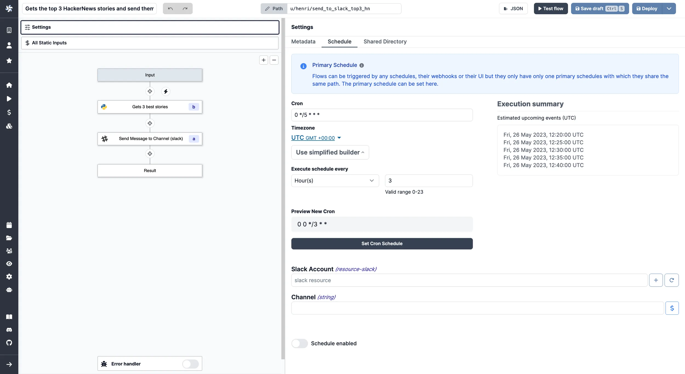
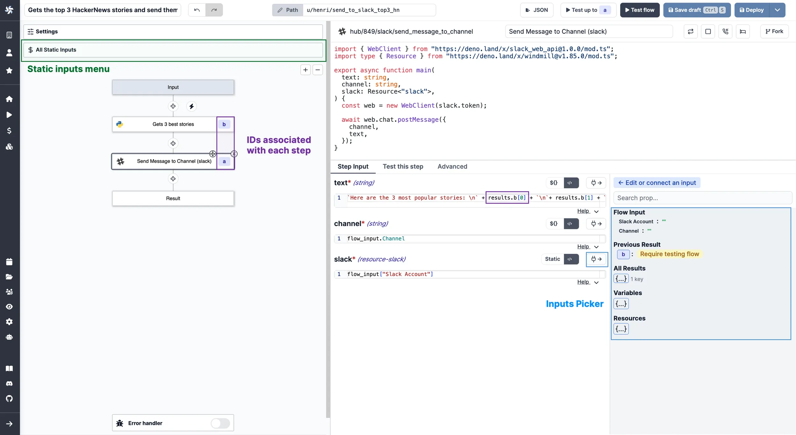
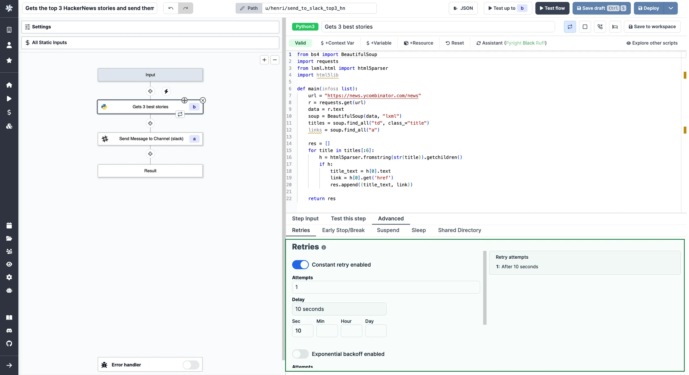

import DocCard from '@site/src/components/DocCard';

# Flows quickstart

The present document will introduce you to [Flows](../../flows/1_flow_editor.mdx) and how to build your first one.

<iframe
	style={{ aspectRatio: '16/9' }}
	src="https://www.youtube.com/embed/yE-eDNWTj3g"
	title="Flows quickstart"
	frameBorder="0"
	allow="accelerometer; autoplay; clipboard-write; encrypted-media; gyroscope; picture-in-picture; web-share"
	allowFullScreen
	className="border-2 rounded-lg object-cover w-full dark:border-gray-800"
></iframe>

 

> [Here](https://hub.windmill.dev/flows/43/) is an example of a simple flow built with Windmill.

 

Have in mind that in Windmill, Scripts are at the basis of Flows and Apps. To sum up roughly, workflows are state machines [represented as DAGs](../../flows/16_architecture.mdx) (Directed Acyclic Graphs) to compose scripts together. To learn more about scripts, check the [Script quickstart](../0_scripts_quickstart/index.mdx). You will not necessarily have to re-build each script as you can reuse them from your workspace or from the [Hub](https://hub.windmill.dev/).

Those workflows can run for-loops, branches (parralellizable) suspend themselves until a timeout or receiving events such as webhooks or approvals. They can be scheduled very frequently and check for new external items to process (what we call "Trigger" script).

The result of a flow is the result of the last step executed, unless [error](../../flows/8_error_handling.mdx) was returned before or [Early return](../../flows/19_early_return.mdx) is set.

The overhead and coldstart between each step is about 20ms, which is [faster than any other orchestration engine](/blog/launch-week-1/fastest-workflow-engine), by a large margin.

To create your first workflow, you could also pick one from our [Hub](https://hub.windmill.dev/flows) and fork it. Here, we're going to build our own flow from scratch, step by step.

From [Windmill](../00_how_to_use_windmill/index.mdx), click on `+ Flow`, and let's get started!

:::tip

Follow our [detailed section](../../flows/1_flow_editor.mdx) on the Flow editor for more information.

:::

## Settings

### Metadata

The first thing you'll see is the [Settings](../../flows/3_editor_components.mdx#settings) menu. From there, you can set the [permissions](../../core_concepts/16_roles_and_permissions/index.mdx) of the workflow: User (by default, you), and [Folder](../../core_concepts/8_groups_and_folders/index.mdx) (referring to read and/or write groups).

Also, you can give succinctly a Name, a Summary and a Description to your flow. Those are supposed to be explicit, we recommend you to give context and make them as self-explanatory as possible.

	<DocCard
		title="Roles and permissions"
		description="Control access and manage permissions within your instance and workspaces."
		href="/docs/core_concepts/roles_and_permissions"
		color="teal"
	/>

### Schedule

On another tab, you can configure a [Schedule](../../core_concepts/1_scheduling/index.mdx) to trigger your flow. Flows can be [triggered](../8_triggers/index.mdx) by any schedules, their [webhooks](../../core_concepts/4_webhooks/index.mdx) or their UI but they only have only one primary schedule with which they share the same path. This menu is where you set the primary schedule with CRON. The default schedule is none.

	<DocCard
		color="teal"
		title="Schedules"
		description="Scheduling allows you to define schedules for Scripts and Flows, automatically running them at set frequencies."
		href="/docs/core_concepts/scheduling"
	/>

### Shared directory

Last tab of the settings menu is the [Shared Directory](../../core_concepts/11_persistent_storage/within_windmill.mdx#shared-directory).

By default, flows on Windmill are based on a [result basis](#how-data-is-exchanged-between-steps). A step will take as inputs the results of previous steps. And this works fine for lightweight automation.

For heavier ETLs and any output that is not suitable for JSON, you might want to use the `Shared Directory` to share data between steps. Steps share a folder at `./shared` in which they can store heavier data and pass them to the next step.

Get more details on the [Persistent storage & databases dedicated page](../../core_concepts/11_persistent_storage/index.mdx).

	<DocCard
		color="teal"
		title="Persistent storage & databases"
		description="Ensure that your data is safely stored and easily accessible whenever required."
		href="/docs/core_concepts/persistent_storage"
	/>

### Worker group

When a [worker group](../../core_concepts/9_worker_groups/index.mdx) is defined at the flow level, any steps inside the flow will run on that worker group, regardless of the steps' worker group. If no worker group is defined, the flow controls will be executed by the default worker group 'flow' and the steps will be executed in their respective worker group.

	<DocCard
		color="teal"
		title="Workers and worker groups"
		description="Worker Groups allow users to run scripts and flows on different machines with varying specifications."
		href="/docs/core_concepts/worker_groups"
	/>

You can always go back to this menu by clicking on `Settings` on the top lef, or on the name of the flow on the [toolbar](../../flows/3_editor_components.mdx#toolbar).

## How data is exchanged between steps

Flows on Windmill are generic and reusable, they therefore expose inputs. Input and outputs are piped together.

Inputs are either:

- [Static](../../flows/3_editor_components.mdx#static-inputs): you can find them on top of the side menu. This tab centralizes the static inputs of every steps. It is akin to a file containing all constants. Modifying a value here modify it in the step input directly.
- [Dynamically linked to others](../../flows/16_architecture.mdx): with [JSON objects](../../core_concepts/13_json_schema_and_parsing/index.mdx) as result that allow to refer to the output of any step.
  You can refer to the result of any step:
  - using the id associated with the step
  - clicking on the plug logo that will let you pick flow inputs or previous steps' results (after testing flow or step).

	<DocCard
		color="teal"
		title="Architecture and data exchange"
		description="A workflow is a JSON serializable value in the OpenFlow format."
		href="/docs/flows/architecture"
	/>

## Flow editor

On the left of the editor, you'll find a graphical view of the flow. From there you can architecture your flow and take action at each step.

:::tip Pro tips
Keep your flows organized and documented with [sticky notes](../../flows/24_sticky_notes.mdx)! Add free notes anywhere on the canvas for comments and TODOs, or create group notes to explain complex workflow sections to your team.
:::

There are four kinds of scripts: [Action](../../flows/3_editor_components.mdx#flow-actions), [Trigger](../../flows/10_flow_trigger.mdx), [Approval](../../flows/11_flow_approval.mdx) and [Error handler](../../flows/7_flow_error_handler.md). You can sequence them how you want. Action is the default script type.

Each script can be called from Workspace or [Hub](https://hub.windmill.dev/), you can also decide to write them inline.

 

Your flow can be deepened with [additional features](../../flows/1_flow_editor.mdx), below are some major ones.

### For loops

[For loops](../../flows/12_flow_loops.md) are a special type of steps that allows you to iterate over a list of items, given by an iterator expression.

	<DocCard
		color="teal"
		title="For loops"
		description="Iterate a series of tasks."
		href="/docs/flows/flow_loops"
	/>

### While loops

While loops execute a sequence of code indefinitely until the user cancels or a step set to [Early stop](../../flows/2_early_stop.md) stops.

<video
	className="border-2 rounded-xl object-cover w-full h-full dark:border-gray-800"
	controls
	src="/videos/while_early_stop.mp4"
/>

 

	<DocCard
		color="teal"
		title="While loops"
		description="While loops execute a sequence of code indefinitely until the user cancels or a step set to Early stop stops."
		href="/docs/flows/while_loops"
	/>

### Branching

[Branches](../../flows/13_flow_branches.md) build branching logic to create and manage complex workflows based on conditions. There are two of them:

- [Branch one](../../flows/13_flow_branches.md#branch-one): allows you to execute a branch if a condition is true.
- [Branch all](../../flows/13_flow_branches.md#branch-all): allows you to execute all the branches in parallel, as if each branch is a flow.

	<DocCard
		color="teal"
		title="Branches"
		description="Split the execution of the flow based on a condition."
		href="/docs/flows/flow_branches"
	/>

### Retries

At each step, Windmill allows you to [customize the number of retries](../../flows/14_retries.md) by going on the `Advanced` tabs of the individual script. If defined, upon error this step will be retried with a delay and a maximum number of attempts.

	<DocCard
		color="teal"
		title="Retries"
		description="Re-try a step in case of error."
		href="/docs/flows/retries"
	/>

### Suspend/Approval Step

At each step you can add [Approval scripts](../../flows/11_flow_approval.mdx) to manage security and control over your flows.

Request approvals can be sent by email, Slack, anything. Then you can automatically resume workflows with secret webhooks after the approval steps.

 

	<DocCard
		color="teal"
		title="Suspend & Approval / Prompts"
		description="Suspend a flow until specific event(s) are received, such as approvals or cancellations."
		href="/docs/flows/flow_approval"
	/>

You can find all the flows' features in their [dedicated section](../../flows/1_flow_editor.mdx).

## Triggers

There are several ways to trigger a flow with Windmill.

1. The most direct one is from the [autogenerated UI provided by Windmill](../../core_concepts/6_auto_generated_uis/index.mdx). It is the one you will see from the flow editor.
2. A similar but more customized way is to use Windmill Apps using the [App editor](../7_apps_quickstart/index.mdx).
3. We saw above that you can trigger flows using [schedules](../../core_concepts/1_scheduling/index.mdx) that you can check from the [Runs](../../core_concepts/5_monitor_past_and_future_runs/index.mdx) page. One special way to use scheduling is to combine it with [trigger scripts](../../flows/10_flow_trigger.mdx).
4. [Execute flows from the CLI](../../advanced/3_cli/index.mdx) to trigger your flows from your terminal.
5. [Trigger the flow from another flow](../8_triggers/index.mdx#trigger-from-flows).
6. Using [trigger scripts](../../flows/10_flow_trigger.mdx) to trigger only if a condition has been met.
7. [Webhooks](../../core_concepts/4_webhooks/index.mdx). Each Flow created in the app gets autogenerated webhooks. You can see them once you flow is saved. You can even [trigger flows without leaving Slack](/blog/handler-slack-commands)!

You can test your triggers in test mode:

<iframe
	style={{ aspectRatio: '16/9' }}
	src="https://www.youtube.com/embed/nI3P3q4Okx8"
	title="YouTube video player"
	frameBorder="0"
	allow="accelerometer; autoplay; clipboard-write; encrypted-media; gyroscope; picture-in-picture; web-share"
	allowFullScreen
	className="border-2 rounded-lg object-cover w-full dark:border-gray-800"
></iframe>

 

	<DocCard
		color="teal"
		title="Triggering flows"
		description="Trigger scripts and flows on-demand, by schedule or on external events."
		href="/docs/getting_started/triggers"
	/>

## Test your flow

You don't have to explore all Flow editor possibilities at once. At each step, test what you're building to keep control on your wonder. You can also test up to a certain step by clicking on an action (x) and then on `Test up to x`.

<video
	className="border-2 rounded-lg object-cover w-full h-full dark:border-gray-800"
	autoPlay
	controls
	src="/videos/test_flow.mp4"
/>

 

	<DocCard
		color="teal"
		title="Testing flows"
		description="Iterate quickly and get control on your flow testing."
		href="/docs/flows/test_flows"
	/>

When you're done, [deploy](../../core_concepts/0_draft_and_deploy/index.mdx) your flow, schedule it, [create and app from it](../../core_concepts/6_auto_generated_uis/index.mdx), or even [publish it to Hub](../../misc/1_share_on_hub/index.md).

Follow our [detailed section](../../flows/1_flow_editor.mdx) on the Flow editor for more information.

## Flow as Code

Flows are not the only way to write distributed programs that execute distinct jobs. Another approach is to write a program that defines the jobs and their dependencies, and then execute that program within a [Python](../0_scripts_quickstart/2_python_quickstart/index.mdx) or [TypeScript](../0_scripts_quickstart/1_typescript_quickstart/index.mdx) script. This is known as workflows as code.

	<DocCard
		title="Workflows as code"
		description="Automate tasks and their flow with only code."
		href="/docs/core_concepts/workflows_as_code"
	/>

