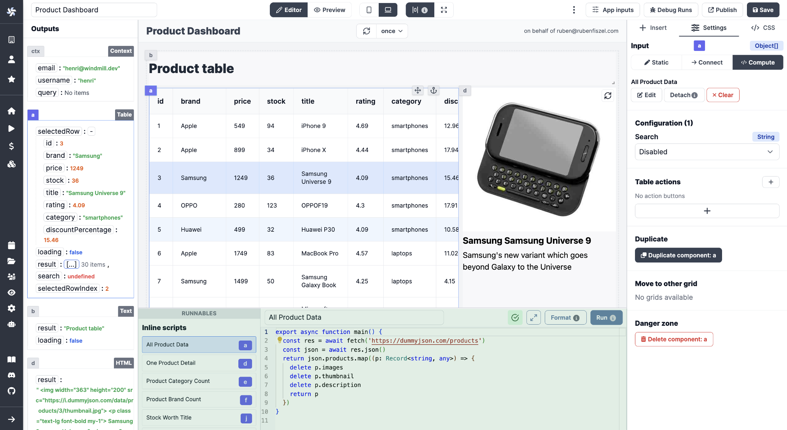

# Apps Quickstart

Welcome to the Apps Quickstart! This document will provide you with 95% of the knowledge on building apps in just a few minutes.

<video
    className="border-2 rounded-xl object-cover w-full h-full"
    autoPlay
    loop
    controls
    id="main-video"
    src="/videos/app_editor_fast.mp4"
/>

 

> _For more details on that app, check out our [e-commerce CRM app tutorial](../../apps/7_app_e-commerce.md)_.

 

:::info
Although Windmill provides **[auto-generated UIs for scripts and flows](../../core_concepts/6_auto_generated_uis/index.md)**, you can build your own internal applications tailored to your needs using the app editor.
:::

**Windmill applications are customized UIs for interacting with datasources** (web, internal, data providers, etc.). They are a great way to enable non-technical users to interact with custom-made workflows.

Here is an example of an app built with Windmill: [link](https://hub.windmill.dev/apps/3/crm).

In short, here's what you need to remember about apps:

- They work on a **what-you-see-is-what-you-get basis**.
- You can connect apps and components to **datasources**.
- Components can be **enhanced with Windmill [scripts](https://docs.windmill.dev/docs/getting_started/scripts_quickstart/typescript)**.

:::tip
For more information, refer to our [detailed pages](../../apps/0_app_editor.md) on the App Editor.
:::

To create your first app, you can either create a new one from the homepage or you can choose one from our [Hub](https://hub.windmill.dev/apps) and fork it.

To get started, go to [Windmill](https://app.windmill.dev/user/login), click on `+ App`, and let's get started!

### Toolbar

Before jumping in, you should decide if you want to build a **Desktop** or a **Mobile** app. Just click on the appropriate icon at the top.

While you're there, know that you can either go with **centered** content or display it **across the full page width**.

Switch from **Editor** to **Preview** mode to take a step back and see what you're building.

### Components

The App editor works on a drag-and-drop basis. From the right-side menu, click on a component to **create** it on the [canvas](https://docs.windmill.dev/docs/apps/app_canvas/), **move** it by maintaining a click on it, and **delete** it by clicking on `Delete component` at the bottom of the `Settings` tab. You can resize your components by dragging the **resize** handler on the bottom-right corner.

If you have numerous components, you might need to **Anchor** some of them to make them unmovable by other components.

<video
    className="border-2 rounded-xl object-cover w-full h-full"
    autoPlay
    loop
    controls
    id="main-video"
    src="/videos/component-moving.mp4"
/>

<!-- This video is supposed to be in sync with the new main after Faton did his PR to fix it on the Canvas docs page -->

 

Check out all of our components at [this page](https://docs.windmill.dev/docs/apps/app_component_library) or, even better, directly from the app editor. Know that **we can quickly add components to the library**; just mention your suggestions on our [Discord](https://discord.com/invite/V7PM2YHsPB) channel.

### Empower components with scripts

The beauty of the Windmill App editor is the integration of scripts and workflows with components. At the bottom of the app editor, you can find the **[Runnable](https://docs.windmill.dev/docs/apps/app-runnable)** editor. It allows you to create, edit, or manage the scripts or flows linked to components (Runnables) and background runnables.

:::tip Add a script to a component

The following video showcases how to call a script either from the workspace/hub or add it directly inline:

<video
    className="border-2 rounded-xl object-cover w-full h-full"
    controls
    id="main-video"
    src="/videos/script_and_flows_components.mp4"
/>

On Windmill, you can also [use AI to autosuggest code for you](../../misc/11_code_autocompletion/index.md).

:::

The **[Outputs](https://docs.windmill.dev/docs/apps/app_outputs)** of each component can be found on the left side menu. Each of them is associated with a component (see the component ID).

**Inputs can be connected to any output**: Click on `Connect` on a component and associate inputs with outputs.

At any time, you can check your app's **Inputs** associated with each component on the dedicated `App inputs` tab.

### Tailor the look of your app

At the **component level**, on the `Settings` tab, you can configure the [style](../../apps/8_app_styling.md) of each component (color, size, label, etc.) either directly in the boxes or using Custom CSS (on the `Settings` tab).

At the **app level**, you can give a [harmonized style](../../apps/8_app_styling.md#global-styling) to your app with CSS. On the `CSS` tab, provide details in either the boxes or JSON format.

### Time to test

While building your app, you can try each component by clicking on the refresh button.

You can do a refresh for the whole app by clicking the refresh button at the top of the canvas or even schedule automatic refresh.

For possible bugs, you can review past runs with detailed information per component in the `Debug Runs` tab.

### What's next?

When you're done editing your app, make sure to `Save` the current version for the relevant users/folders with a proper and explicit name.

Once it's saved, it's ready to use! You can also `Publish` it or even `Publish to Hub` and export it in JSON or Hub-compatible JSON from the `⋮` tab.

For more information, refer to our [detailed pages](../../apps/0_app_editor.md) on the App Editor.
