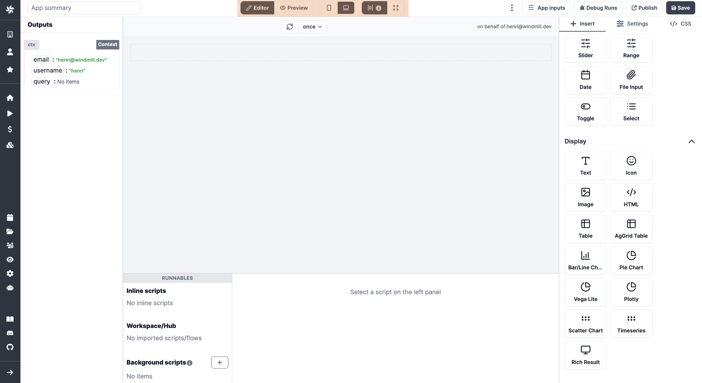
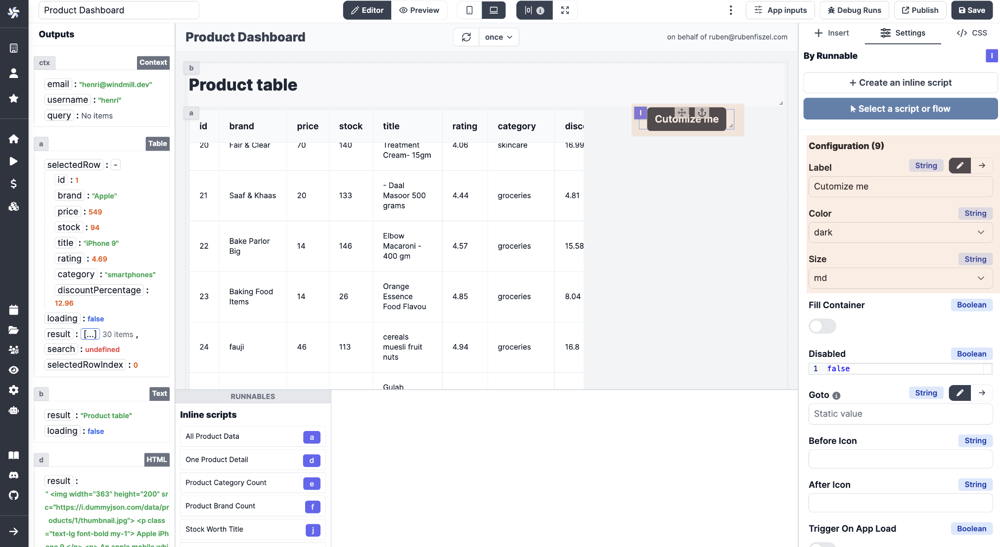

# Apps Quickstart

Welcome to the Apps Quickstart! This page will provide you with the necessary knowledge to build your first applications in a matter of minutes.

<video
    className="border-2 rounded-xl object-cover w-full h-full"
    autoPlay
    controls
    id="main-video"
    src="/videos/app_editor_fast.mp4"
/>

 

> _Have more details the app above on the [tutorial](../../apps/7_app_e-commerce.md) of our [e-commerce CRM app](https://hub.windmill.dev/apps/14/)_.

 

:::info UIs in Windmill
Although Windmill provides **[auto-generated UIs to scripts and flows](../../core_concepts/6_auto_generated_uis/index.md)**, you can build your own internal applications designed to your needs. Either with our integrated [app editor](../../apps/0_app_editor/index.mdx), or by [importing your own React/Vue/Svelte apps](../../react_vue_svelte_apps/index.md).
:::

 

**Windmill applications are customized UIs to interact with datasources** (web, internal, data providers, etc). They are a great way to have non-technical users interact with custom-made workflows.

In short, what you need to remember about apps:

- They work on a what-you-see-is-what-you-get basis.
- You can connect apps and components to [datasources](../../integrations/0_integrations_on_windmill.md).
- Components can be empowered by Windmill [scripts](../../getting_started/0_scripts_quickstart/index.mdx) and [flows](../6_flows_quickstart/index.md).

:::tip

Follow our [detailed section](../../apps/0_app_editor/index.mdx) on the App Editor for more information.

:::

To create your first app, you could pick one from our [Hub](https://hub.windmill.dev/apps) and fork it. Here, we're going to build our own app from scratch, step by step.

From [Windmill](https://app.windmill.dev/user/login), click on `+ App`, and let's get started!

### [Toolbar](../../apps/0_toolbar.mdx)

Before jumping in, you should decide if you want to build a **Desktop** or a **Mobile** app. Just clik on the appropriated icon on top.

Switch from **Editor** to **Preview** mode to take a step back on what you're building.

### Components

The App editor works on a drag-and-drop basis. From the right-side menu, click on a component to **create** it on the [canvas](https://docs.windmill.dev/docs/apps/app_canvas/), **move** it maintaining a click on it and **delete** it clicking on `Delete component` at the bottom of the `Settings` tab. You can resize your components by dragging the **resize** handler on the bottom-right corner.

If you have numerous components you might need to **Anchor** some of them to have them unmovable by other components.

<video
    className="border-2 rounded-xl object-cover w-full h-full"
    controls
    id="main-video"
    src="/videos/component_dd.mp4"
/>

 

Check out all of our components at [this page](../../apps/4_app_configuration-settings/1_app_component_library.md) or (better) directly from the app editor. Know that **we can quickly add components to the library**, just [reach out to us](../../misc/6_getting_help/index.md).

### Empower components with scripts

The beauty of Windmill App editor is the integrations of scripts & workflows to components. On the bottom of the app editor, you can find the **[Runnable editor](../../apps/3_app-runnable-panel.mdx)**. It allows you to create, edit or manage the scripts or flows linked to components (Runnables), and [background runnables](../../apps/3_app-runnable-panel.mdx#background-runnables).

From a component, click on `Create an inline script` or `Select a script or flow` (from workspace or hub) and you're good!

The **[Ouputs](../../apps/2_outputs.md)** of each component can be found on the left side menu. Each of them is associated with a component (see the component id).

**Inputs can be connected to any output**: on a component click on `Connect` and associate inputs to outputs.

<video
    className="border-2 rounded-xl object-cover w-full h-full"
    controls
    id="main-video"
    src="/videos/connect_outputs.mp4"
/>

 

At any time, have a look at your app's **Inputs** associated with each component on the dedicated `App inputs` tab found in the `⋮` menu of the toolbar.

### Tailor the look of your app

At the **[component level](../../apps/4_app_configuration-settings/4_app_styling.md#component-level)**, on the `Settings` tab, configure the style of each component (color, size, label, etc.) either directly in the boxes or using Custom CSS (on the Component Settings - Styling tab).

At the **[app level](../../apps/4_app_configuration-settings/4_app_styling.md#global-styling)**, you can give a harmonized style to your app with CSS. On the `Glbal Styling` tab, give details in boxes or in JSON, for the whole app and per class of component.

### Time to test

While building your app, you can try each component clicking on refresh button.

You can do a refresh all for the whole app with the refesh button on top of the canvas, or even schedule automatic refesh.

For possible bugs, there is a `Debug Runs` tab to review past runs with details for each component.

### Then what?

When you're done with the editing of your app, `Save` the current version to the relevant users/folders with a proper and explicit name.

Once it's saved, it's ready to use! You can also `Publish` it, or even `Publish to Hub` and export it in JSON or Hub compatible JSON from the `⋮` tab.

Follow our [detailed section](../../apps/0_app_editor/index.mdx) on the App Editor for more information.
