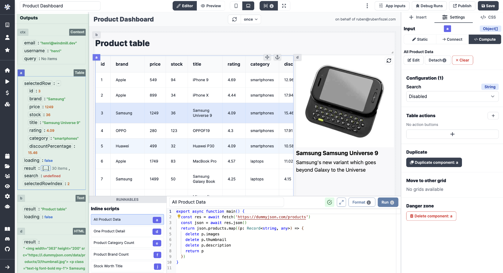

# Apps Quickstart

Welcome to the Apps Quickstart! This document will provide you with 95% of the knowledge on building apps, in a few minutes.

<video
    className="border-2 rounded-xl object-cover w-full h-full"
    autoPlay
    loop
    controls
    id="main-video"
    src="/videos/app_editor_fast.mp4"
/>

 

> _Have more details on that app on our [e-commerce CRM app tutorial](../../apps/7_app_e-commerce.md)_.

 

:::info
Although Windmill provides **[auto-generated UIs to scripts and flows](../../core_concepts/6_auto_generated_uis/index.md)**, you can build your own internal applications designed to your needs. This is what the app editor is for.
:::

**Windmill applications are customized UIs to interact with datasources** (web, internal, data providers, etc). They are a great way to have non-technical users interact with custom-made workflows.

[Here](https://hub.windmill.dev/apps/3/crm) is an example of an app built with Windmill.

In short, what you need to remember about apps:

- They work on a **what-you-see-is-what-you-get basis**.
- You can connect apps and components to **datasources**.
- Components can be **empowered by Windmill [scripts](../../getting_started/0_scripts_quickstart/index.md)**.

:::tip

Follow our [detailed pages](../../apps/0_app_editor/index.mdx) on the App Editor for more information.

:::

To create your first app, you could pick one from our [Hub](https://hub.windmill.dev/apps) and fork it. Here, we're going to build our own app from scratch, step by step.

From [Windmill](https://app.windmill.dev/user/login), click on `+ App`, and let's get started!

### Toolbar

Before jumping in, you should decide if you want to build a **Desktop** or a **Mobile** app. Just clik on the appropriated icon on top.

While we are there, know that you can either go with **centered** content or rather display **full page width**.

Switch from **Editor** to **Preview** mode to take a step back on what you're building.

### Components

The App editor works on a drag-and-drop basis. From the right-side menu, click on a component to **create** it on the [canvas](https://docs.windmill.dev/docs/apps/app_canvas/), **move** it maintaining a click on it and **delete** it clicking on `Delete component` at the bottom of the `Settings` tab. You can resize your components by dragging the **resize** handler on the bottom-right corner.

If you have numerous components you might need to **Anchor** some of them to have them unmovable by other components.

<video
    className="border-2 rounded-xl object-cover w-full h-full"
    autoPlay
    loop
    controls
    id="main-video"
    src="/videos/component-moving.mp4"
/>

<!-- This video is supposed to be sync with new main after Faton did his PR to fix it on the Canvas docs page -->

 

Check out all of our components at [this page](https://docs.windmill.dev/docs/apps/app_component_library) or (better) directly from the app editor. Know that **we can quickly add components to the librairy**, just mention your suggestions on our [Discord](https://discord.com/invite/V7PM2YHsPB) channel.

### Empower components with scripts

The beauty of Windmill App editor is the integrations of scripts & workflows to components. On the bottom of the app editor, you can find the **[Runnable](https://docs.windmill.dev/docs/apps/app-runnable)** editor. It allows you to create, edit or manage the scripts or flows linked to components (Runnables), and background runnables.

:::tip Add a script to a component

The following video showcases how to call a script either from workspace/hub or add it directly inline;
 

<video
    className="border-2 rounded-xl object-cover w-full h-full"
    controls
    id="main-video"
    src="/videos/script_and_flows_components.mp4"
/>

 

On Windmill you can also [use AI to autosuggest code for you](../../misc/11_code_autocompletion/index.md).

:::

The **[Ouputs](https://docs.windmill.dev/docs/apps/app_outputs)** of each component can be found on the left side menu. Each of them is associated with a component (see the component id).

**Inputs can be connected to any output**: on a component click on `Connect` and associate inputs to outputs.

At any time, have a look at your app's **Inputs** associated with each component on the dedicated `App inputs` tab.

### Tailor the look of your app

At the **component level**, on the `Settings` tab, configure the [style](../../apps/8_app_styling.md) of each component (color, size, label, etc.) either directly on boxes or in Custom CSS (on the `Settings` tab).

At the **app level**, you can give a [harmonized style](../../apps/8_app_styling.md#global-styling) to your app with CSS. On the `CSS` tab, give details either in boxes or in JSON.

### Time to test

While building you app, you can try each component clicking on refresh button.

You can do a refresh all for the whole app with the refesh button on top of the canvas, or even schedule automatic refesh.

For possible bugs, there is a `Debug Runs` tab to review past runs with details per component.

### Then what?

When you're done with the editing of your app, `Save` the current version to the relevant users/folders with a proper and explicit name.

Once it's saved, it's ready to use! You can also `Publish` it, or even `Publish to Hub` and export it in JSON or Hub compatible JSON from the `⋮` tab.

Follow our [detailed pages](../../apps/0_app_editor.md) on the App Editor for more information.
