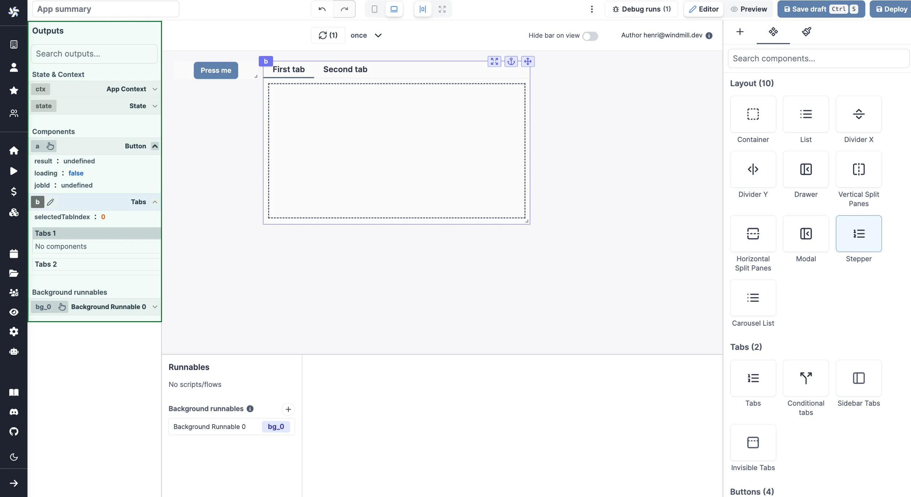
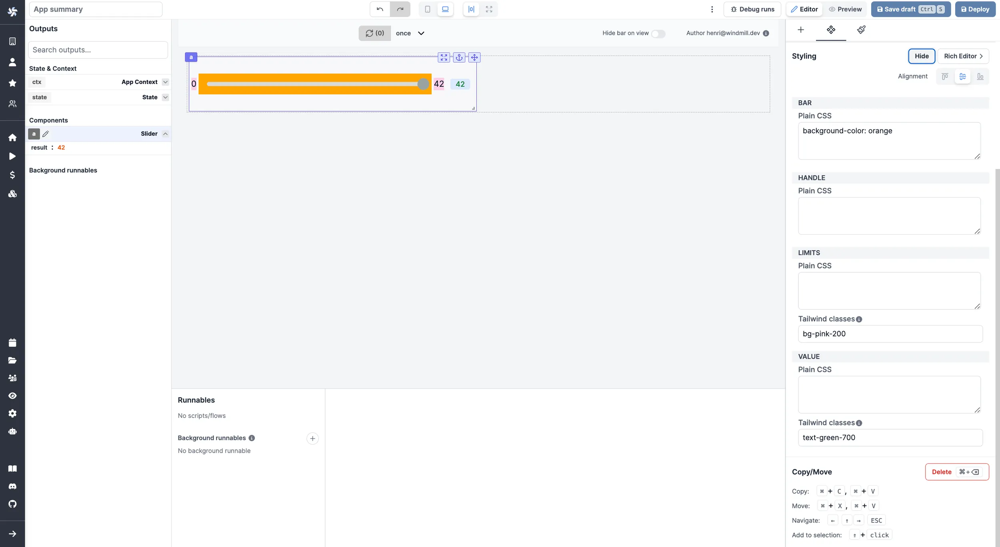
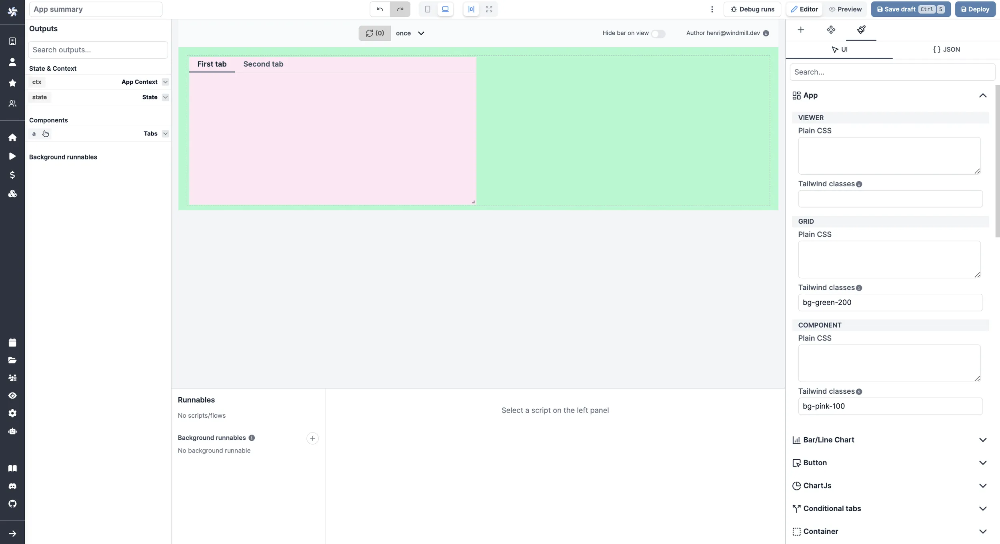
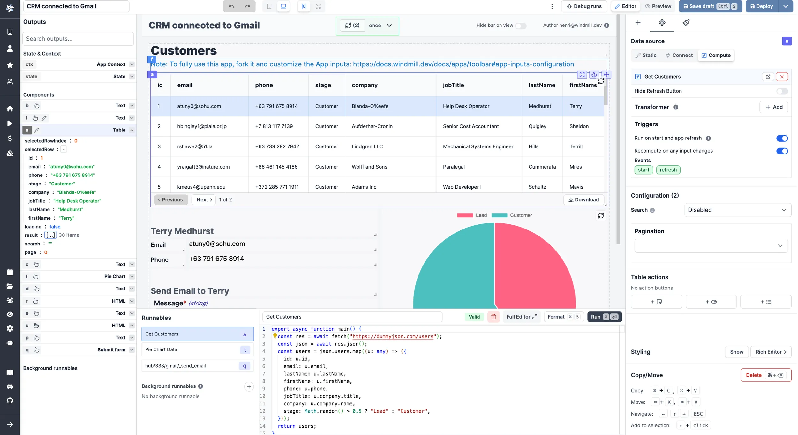
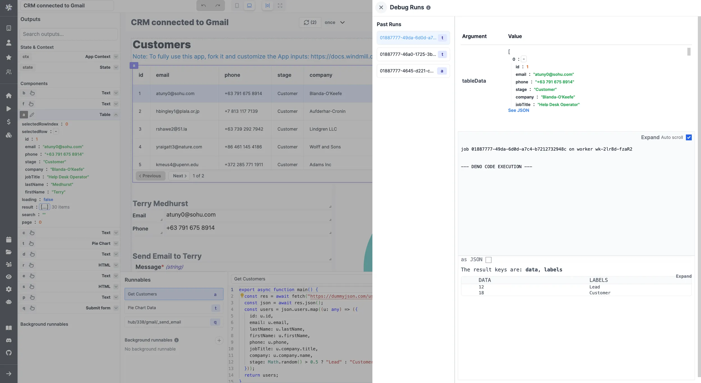

import DocCard from '@site/src/components/DocCard';
import { useColorMode } from '@docusaurus/theme-common';

# Apps quickstart

Welcome to the Apps quickstart! This page will provide you with the necessary knowledge to build your first applications in a matter of minutes.

If you're more into videos, you can check out our tutorial on the App editor:

<iframe
	style={{ aspectRatio: '16/9' }}
	src="https://www.youtube.com/embed/lxqdncP8XR4"
	title="App editor Tutorial"
	frameBorder="0"
	allow="accelerometer; autoplay; clipboard-write; encrypted-media; gyroscope; picture-in-picture; web-share"
	allowFullScreen
	className="border-2 rounded-lg object-cover w-full dark:border-gray-800"
></iframe>

 

Although Windmill provides [auto-generated UIs to scripts and flows](../../core_concepts/6_auto_generated_uis/index.mdx), you can build your own internal applications designed to your needs. Either with our integrated [app editor](../../apps/0_app_editor/index.mdx), or by [importing your own React/Vue/Svelte apps](../../react_vue_svelte_apps/index.mdx).

	<DocCard
		title="Auto-generated UIs"
		description="Windmill creates auto-generated user interfaces for scripts and flows based on their parameters."
		href="/docs/core_concepts/auto_generated_uis"
		color="orange"
	/>
	<DocCard
		title="App editor"
		description="Detailed section on Windmill's App editor"
		href="/docs/apps/app_editor"
		color="orange"
	/>
	<DocCard
		title="Example: E-commerce CRM app"
		description="Tutorial on how to build a CRM with Windmill."
		color="orange"
		hrefs="/docs/apps/app_e-commerce"
	/>

Windmill applications are customized UIs to interact with datasources (web, internal, data providers, etc). They are a great way to have non-technical users interact with custom-made workflows.

In short, what you need to remember about apps:

- They work on a what-you-see-is-what-you-get basis.
- You can connect apps and components to [datasources](../../integrations/0_integrations_on_windmill.mdx).
- Components can be empowered by Windmill [scripts](../../getting_started/0_scripts_quickstart/index.mdx) and [flows](../6_flows_quickstart/index.mdx).

:::tip

Follow our [detailed section](../../apps/0_app_editor/index.mdx) on the App editor for more information.

:::

To create your first app, you could pick one from our [Hub](https://hub.windmill.dev/apps) and fork it. Here, we're going to build our own app from scratch, step by step.

From <a href="https://app.windmill.dev/" rel="nofollow">Windmill</a>, click on `+ App`, and let's get started!

### Toolbar

Before jumping in, you should decide if you want to build a Desktop or a Mobile app. Just click on the appropriated icon on top.

Switch from Editor to Preview mode to take a step back on what you're building.

	<DocCard
		title="Toolbar"
		description="The app toolbar is located at the top of the app editor. It enables you to adjust app settings, toggle between desktop/mobile preview, and debug runs."
		href="/docs/apps/toolbar"
		color="orange"
	/>

### Components

The App editor works on a drag-and-drop basis. From the right-side menu, click on a component to create it on the [canvas](../../apps/1_canvas.mdx), move it maintaining a click on it and delete it clicking on `Delete component` at the bottom of the `Settings` tab. You can resize your components by dragging the resize handler on the bottom-right corner.

If you have numerous components you might need to Anchor some of them to have them unmovable by other components.

<video
	className="border-2 rounded-lg object-cover w-full h-full dark:border-gray-800"
	controls
	src="/videos/component_dd.mp4"
/>

 

Check out all of our components at [this page](../../apps/4_app_configuration_settings/1_app_component_library.mdx) or (better) directly from the app editor. Know that we can quickly add components to the library, just [reach out to us](../../misc/6_getting_help/index.mdx).

	<DocCard
		title="Component library"
		description="List of all available components."
		href="/docs/apps/app_configuration_settings/app_component_library"
		color="orange"
	/>

### Empower components with scripts

The beauty of Windmill App editor is the integrations of scripts & workflows to components.

<video
	className="border-2 rounded-lg object-cover w-full h-full"
	controls
	src="/videos/connecting_components.mp4"
/>

 

On the bottom of the app editor, you can find the [Runnable editor](../../apps/3_app-runnable-panel.mdx). It allows you to create, edit or manage the scripts or flows linked to components (Runnables), and [background runnables](../../apps/3_app-runnable-panel.mdx#background-runnables).

From a component, click on `Create an inline script` or `Select a script or flow` (from workspace or hub) and you're good!

The [Outputs](../../apps/2_outputs.mdx) of each component can be found on the left side menu. Each of them is associated with a component (see the component id).

[Inputs can be connected to any output](../../apps/2_connecting_components/index.mdx): on a component click on `Connect` and associate inputs to outputs.

<video
	className="border-2 rounded-lg object-cover w-full h-full dark:border-gray-800"
	controls
	src="/videos/connect_outputs.mp4"
/>

 

	<DocCard
		color="orange"
		title="Connecting components"
		description="The strength of Windmill's app editor is the ability to connect everything together."
		href="/docs/apps/connecting_components"
	/>

At any time, have a look at your app's Inputs associated with each component on the dedicated `App inputs` tab found in the `⋮` menu of the toolbar.

	<DocCard
		title="Runnable editor"
		description="Run Scripts and Flows from your Apps."
		href="/docs/apps/app-runnable-panel"
		color="orange"
	/>
	<DocCard
		title="Output guide"
		description="Manage the outputs of your components."
		href="/docs/apps/outputs"
		color="orange"
	/>

### Tailor the look of your app

At the [component level](../../apps/4_app_configuration_settings/4_app_styling.mdx#component-level), on the `Settings` tab, configure the style of each component (color, size, label, etc.) either directly in the boxes or using Custom CSS (on the Component Settings - Styling tab).

At the [app level](../../apps/4_app_configuration_settings/4_app_styling.mdx#global-styling), you can give a harmonized style to your app with CSS. On the `Global Styling` tab, give details in boxes or in JSON, for the whole app and per class of component.

	<DocCard
		title="Styling"
		description="Customize the styling of your App according to your own graphical standards."
		href="/docs/apps/app_configuration_settings/app_styling"
		color="orange"
	/>

### Time to test

While building your app, you can try each component clicking on refresh button.

You can do a refresh all for the whole app with the refresh button on top of the canvas, or schedule automatic refresh.

Most convenient solution to test your app might just be to [preview](../../apps/0_toolbar.mdx#preview-mode) it:

For possible bugs, there is a `Debug runs` tab to review past runs with details for each component.

	<DocCard
		title="Debugging"
		description="Manage bugs of your App."
		href="/docs/apps/app_debugging"
		color="orange"
	/>

### Then what?

When you're done with the editing of your app, [Save Draft](../../core_concepts/0_draft_and_deploy/index.mdx#draft) or [Deploy](../../core_concepts/0_draft_and_deploy/index.mdx#deployed-version) the current version to the relevant users/folders with a proper and explicit name. All additional changes can be seen and reversed in the [Diff Viewer](../../apps/0_toolbar.mdx#diff).

Once it's saved, it's ready to use! You can also `Publish` it, or even `Publish to Hub` and export it in JSON or Hub compatible JSON from the `⋮` tab.

Follow our [detailed section](../../apps/0_app_editor/index.mdx) on the App editor for more information.

	<DocCard
		title="Draft and deploy"
		description="Learn how to draft and deploy apps."
		href="/docs/core_concepts/draft_and_deploy"
		color="orange"
	/>
	<DocCard
		title="App editor"
		description="Detailed section on Windmill's App editor"
		href="/docs/apps/app_editor"
		color="orange"
	/>
	<DocCard
		title="Example: E-commerce CRM app"
		description="Tutorial on how to build a CRM with Windmill."
		color="orange"
		hrefs="/docs/apps/app_e-commerce"
	/>

