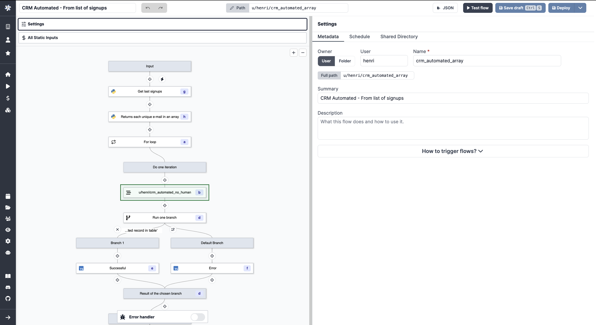
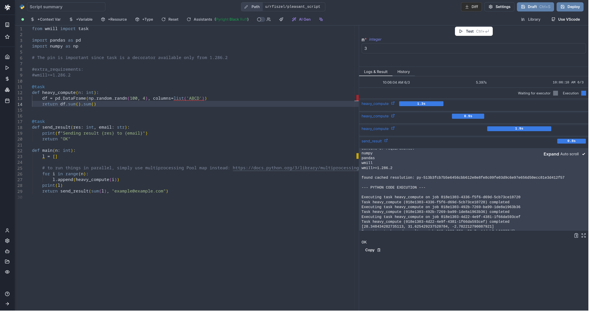
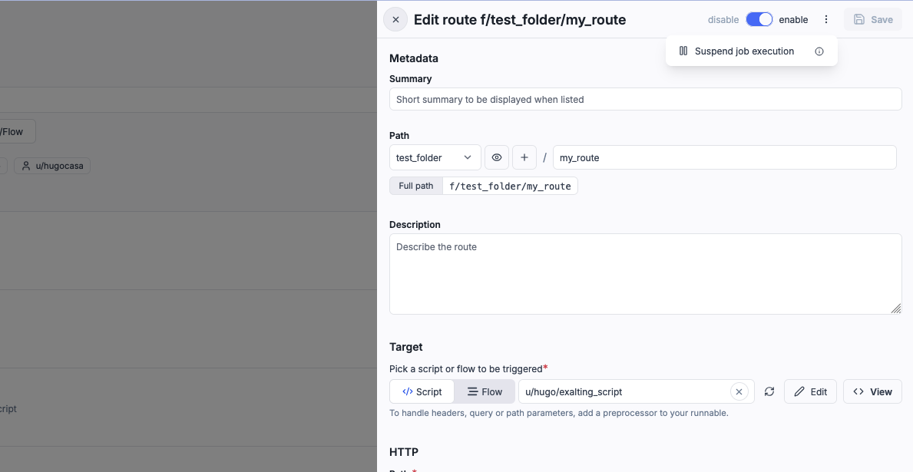
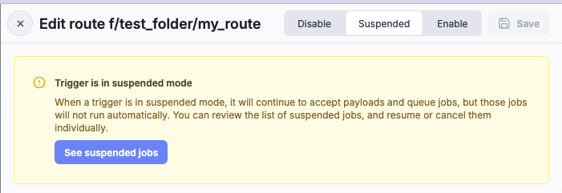
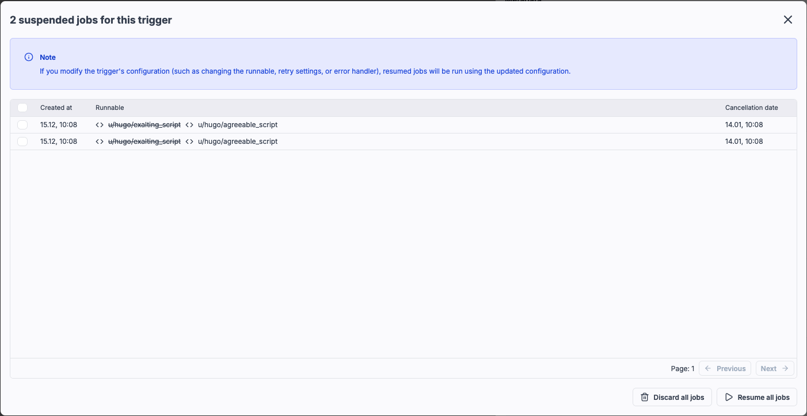

import DocCard from '@site/src/components/DocCard';

# Triggers

Windmill scripts and flows can be triggered in various ways.

On-demand triggers:

- [Auto-generated UIs](../8_triggers/index.mdx#auto-generated-uis)
- [Customized UIs with the App editor](#customized-uis-with-the-app-editor)
- [Trigger from flows](#trigger-from-flows)
- [Workflows as code](#workflows-as-code) (scripts only)
- [Schedule](#schedule)
- [Command-line interface (CLI)](#cli-command-line-interface)
- [Trigger from API](#trigger-from-api)
- [Trigger from LLM clients with MCP](#trigger-from-llm-clients-with-mcp)

Triggers from external events:

- [Webhooks](#webhooks), including from [Slack](#webhooks-trigger-scripts-from-slack)
- [Emails](#emails)
- [Custom HTTP routes](#custom-http-routes)
- [WebSocket triggers](#websocket-triggers)
- [Postgres triggers](#postgres-triggers)
- [Kafka triggers](#kafka-triggers)
- [NATS triggers](#nats-triggers)
- [SQS triggers](#sqs-triggers)
- [MQTT triggers](#mqtt-triggers)
- [GCP triggers](#gcp-triggers)
- [Scheduled polls](#scheduled-polls-scheduling--trigger-scripts)

:::info Scripts and Flows in Windmill
[Scripts](../0_scripts_quickstart/1_typescript_quickstart/index.mdx) are sequences of instructions that automate tasks or perform specific operations. [Flows](../../flows/1_flow_editor.mdx) are sequences of scripts that execute one after another or in parallel. Both are hosted in workspaces.
:::

## On-demand triggers

### Auto-generated UIs

Windmill automatically generates user interfaces (UIs) for scripts and flows based on their parameters.

By analyzing the main function parameters, it creates an input specification in the JSON Schema format, which is then used to render the UI. Users do not need to interact with the JSON Schema directly, as Windmill simplifies the process and allows for optional UI customization.

<video
	className="border-2 rounded-lg object-cover w-full h-full dark:border-gray-800"
	controls
	src="/videos/auto_generated_uis.mp4"
/>

 

This feature is also usable directly in the script editor to test a script in the making:

<video
	className="border-2 rounded-lg object-cover w-full h-full dark:border-gray-800"
	controls
	src="/videos/ui_from_script_editor.mp4"
/>

 

	<DocCard
		title="Auto-generated UIs"
		description="Windmill creates auto-generated user interfaces for scripts and flows based on their parameters."
		href="/docs/core_concepts/auto_generated_uis"
	/>

### Customized UIs with the App editor

Windmill provides a WYSIWYG app editor. It allows you to build your own UI with drag-and-drop components and to connect your data to scripts and flows in minutes.

<video
	className="border-2 rounded-lg object-cover w-full h-full dark:border-gray-800"
	controls
	src="/videos/app_editor_fast.mp4"
/>

 

	<DocCard
		title="App editor"
		color="orange"
		description="Detailed section on Windmill's App editor."
		href="/docs/apps/app_editor"
	/>

You can also [automatically generate](../../core_concepts/6_auto_generated_uis/index.mdx) a dedicated app to execute your script.

<video
	className="border-2 rounded-lg object-cover w-full h-full dark:border-gray-800"
	controls
	src="/videos/cowsay_app.mp4"
/>

### Trigger from flows

Flows are basically sequences of scripts that execute one after another or [in parallel](../../flows/13_flow_branches.md#branch-all).

<video
	className="border-2 rounded-lg object-cover w-full h-full dark:border-gray-800"
	controls
	src="/videos/crm-automation-execution.mp4"
/>

 

Flows themselves can be triggered from other flows. This is called inner flows.

	<DocCard
		title="Flow editor"
		color="teal"
		description="Detailed section on Windmill's Flow editor."
		href="/docs/flows/flow_editor"
	/>

### Workflows as code

Flows are not the only way to write distributed programs that execute distinct jobs. Another approach is to write a program that defines the jobs and their dependencies, and then execute that program within a [Python](../0_scripts_quickstart/2_python_quickstart/index.mdx) or [TypeScript](../0_scripts_quickstart/1_typescript_quickstart/index.mdx) script. This is known as workflows as code.

	<DocCard
		title="Workflows as code"
		description="Automate tasks and their flow with only code."
		href="/docs/core_concepts/workflows_as_code"
	/>

### Schedule

Windmill allows you to schedule scripts using a user-friendly interface and control panel, **similar to [cron](https://crontab.guru/)** but with more features.

You can create schedules by specifying a script or flow, its arguments, and a CRON expression to control the execution frequency, ensuring that your tasks run automatically at the desired intervals.

<video
	className="border-2 rounded-lg object-cover w-full h-full dark:border-gray-800"
	controls
	src="/videos/schedule-cron-menu.mp4"
/>

 

	<DocCard
		title="Schedules"
		description="Scheduling allows you to define schedules for Scripts and Flows, automatically running them at set frequencies."
		href="/docs/core_concepts/scheduling"
	/>

### CLI (Command-line interface)

The `wmill` CLI allows you to interact with Windmill instances right from your terminal.

<iframe
	style={{ aspectRatio: '16/9' }}
	src="https://www.youtube.com/embed/TXtmLrToxoI"
	title="YouTube video player"
	frameBorder="0"
	allow="accelerometer; autoplay; clipboard-write; encrypted-media; gyroscope; picture-in-picture; web-share"
	allowFullScreen
	className="border-2 rounded-lg object-cover w-full dark:border-gray-800"
></iframe>

 

	<DocCard
		title="Command-line interface"
		description="Interact with Windmill instances right from your terminal."
		href="/docs/advanced/cli"
	/>

### Trigger from API

Windmill provides a RESTful API that allows you to interact with your Windmill instance programmatically.

In particular, the operation [run script by path](https://app.windmill.dev/openapi.html#/operations/runScriptByPath) is designed to trigger a script by its path, passing the required arguments.

It's an efficient way to run a script from another script.

	<DocCard
		title="OpenAPI"
		description="Interact with Windmill."
		href="https://app.windmill.dev/openapi.html"
	/>

### Trigger from LLM clients with MCP

Windmill supports the [Model Context Protocol (MCP)](https://modelcontextprotocol.io/introduction) to trigger scripts and flows from LLM clients. All you need is an MCP URL to connect your LLM client to Windmill.

	<DocCard
		title="MCP"
		description="Trigger scripts and flows from LLM clients with MCP."
		href="/docs/core_concepts/mcp"
	/>

## Triggers from external events

### Webhooks

In Windmill, webhooks are autogenerated for each Script and Flow, providing either asynchronous or synchronous execution modes. You can use preprocessors to transform the incoming webhook payload before it reaches your script or flow.

These webhooks accept incoming HTTP requests, allowing users to easily trigger their Windmill scripts and flows from external services by simply sending a POST request to the appropriate authentified webhook URL (requires passing a [token](../../core_concepts/4_webhooks/index.mdx#webhook-specific-tokens) as Bearer or query arg). Their purpose is to have the script run when it receives an input from its associated webhook.

Using webhooks, you could also trigger a script from other scripts.

	<DocCard
		title="Webhooks"
		description="Trigger scripts and flows from webhooks."
		href="/docs/core_concepts/webhooks"
	/>

#### Webhooks: trigger scripts from Slack

One use case of webhooks is [building a Slackbot with Windmill](/blog/handler-slack-commands).

<video
	className="border-2 rounded-lg object-cover w-full h-full dark:border-gray-800"
	controls
	src="/videos/generated_email.mp4"
/>

 

Windmill uses Slack to trigger scripts and flows by establishing Slackbots and creating specific commands. By connecting Slack with Windmill, parsing incoming Slack commands, and leveraging Windmill workflows, operational teams can trigger complex automations directly from Slack.

	<DocCard
		title="Slack integration"
		description="Learn how to integrate Slack with Windmill."
		href="/docs/integrations/slack"
	/>

### Emails

Scripts and flows can be triggered by email messages sent to a specific email address, leveraging [SMTP](https://www.cloudflare.com/learning/email-security/what-is-smtp/). Preprocessors can be used to parse and transform the email content before it's processed by your script or flow.

	<DocCard
		title="Email triggers"
		description="Scripts and flows can be triggered by email messages sent to a specific email address."
		href="/docs/advanced/email_triggers"
	/>

### Custom HTTP routes

Windmill allows you to define custom HTTP routes for your scripts and flows. You can use preprocessors to transform incoming HTTP requests, handling headers, query parameters, and path parameters before they reach your script or flow.

	<DocCard
		title="Custom HTTP routes"
		description="Custom HTTP routes for your scripts and flows."
		href="/docs/core_concepts/http_routing"
	/>

### WebSocket triggers

Windmill can connect to WebSocket servers and trigger runnables (scripts, flows) when a message is received. Preprocessors can transform the websocket message data before it's passed to your script or flow.

	<DocCard
		title="WebSocket triggers"
		description="Trigger scripts and flows from WebSocket servers."
		href="/docs/core_concepts/websocket_triggers"
	/>

### Postgres triggers

Windmill can connect to a [Postgres](https://www.postgresql.org/) database and trigger runnables (scripts, flows) in response to database transactions (INSERT, UPDATE, DELETE) on specified tables, schemas, or the entire database.  

	<DocCard
		title="Postgres triggers"
		description="Trigger scripts and flows from postgres database servers."
		href="/docs/core_concepts/postgres_triggers"
	/>

### Kafka triggers

Windmill can connect to Kafka brokers and trigger scripts or flows when messages are received on specific topics. This enables real-time processing of events from your Kafka ecosystem. Preprocessors can transform the Kafka message data before it reaches your script or flow.

	<DocCard
		title="Kafka triggers"
		description="Trigger scripts and flows from Kafka messages."
		href="/docs/core_concepts/kafka_triggers"
	/>

### NATS triggers

Windmill can connect to NATS servers and trigger scripts or flows when messages are received on specific subjects. This enables real-time processing of events from your NATS ecosystem. Preprocessors can transform the NATS message data before it reaches your script or flow.

	<DocCard
		title="NATS triggers"
		description="Trigger scripts and flows from NATS messages."
		href="/docs/core_concepts/nats_triggers"
	/>

### SQS triggers

Windmill can connect to an Amazon SQS queues and trigger scripts or flows when messages are received. This enables event-driven processing from your AWS ecosystem. Preprocessors can transform the SQS message data before it reaches your script or flow.

	<DocCard
		title="SQS triggers"
		description="Trigger scripts and flows from Amazon SQS messages."
		href="/docs/core_concepts/sqs_triggers"
	/>

### MQTT triggers

Windmill can connect to an MQTT broker, subscribe to specific topics, and trigger scripts or flows when messages are received, enabling event-driven processing. Preprocessors can transform the MQTT message data before it reaches your script or flow.

	<DocCard
		title="MQTT triggers"
		description="Trigger scripts and flows from MQTT broker."
		href="/docs/core_concepts/mqtt_triggers"
	/>

### GCP triggers

Windmill can connect to Google Cloud Pub/Sub, subscribe to specific topics, and trigger scripts or flows when messages are published, enabling event-driven processing. Preprocessors can transform the Pub/Sub message data before it reaches your script or flow.

  <DocCard
    title="GCP Pub/Sub triggers"
    description="Trigger scripts and flows from Google Cloud Pub/Sub."
    href="/docs/core_concepts/gcp_triggers"
  />

### Scheduled polls (Scheduling + Trigger scripts)

A particular use case for schedules are [Trigger scripts](../../flows/10_flow_trigger.mdx).

Trigger scripts are used in [Flows](../../flows/1_flow_editor.mdx) and are designed to pull data from an external source and return all of the new items since the last run, without resorting to external webhooks. A trigger script is intended to be used as scheduled poll with [schedules](../../core_concepts/1_scheduling/index.mdx) and [states](../../core_concepts/3_resources_and_types/index.mdx#states) (rich objects in JSON, persistent from one run to another) in order to compare the execution to the previous one and process each new item in a [for loop](../../flows/12_flow_loops.md). If there are no new items, the flow will be skipped.

You could set your script in a flow after a Trigger script to have it run only when new data is available.

	<DocCard
		title="Trigger scripts"
		color="teal"
		description="Trigger scripts are designed to pull data from an external source and return all of the new items since the last run, without resorting to external webhooks."
		href="/docs/flows/flow_trigger"
	/>

## Test triggers

You can test your triggers in test mode:

<iframe
	style={{ aspectRatio: '16/9' }}
	src="https://www.youtube.com/embed/nI3P3q4Okx8"
	title="YouTube video player"
	frameBorder="0"
	allow="accelerometer; autoplay; clipboard-write; encrypted-media; gyroscope; picture-in-picture; web-share"
	allowFullScreen
	className="border-2 rounded-lg object-cover w-full dark:border-gray-800"
></iframe>

## Suspended mode

When a trigger is in suspended mode, it continues to accept payloads and queue jobs, but those jobs won't run automatically. This is useful for debugging your runnable or trigger logic without disabling the trigger entirely.

To enable suspended mode, toggle the "Suspend job execution" option in the trigger settings:

### Managing suspended jobs

You can review all suspended jobs by clicking the "See suspended jobs" button:

This opens a table showing all queued jobs for the trigger:

From this table, you can:
- Resume individual jobs to execute them
- Discard jobs that are no longer needed
- Resume all jobs at once
- Discard all jobs at once

### Updating trigger configuration

If you modify the trigger's configuration (such as changing the runnable, retry settings, or error handler) and save, resumed jobs will run using the updated configuration:

:::warning
If your old runnable had a preprocessor, the new one should have one too (and vice versa), as the arguments format differs based on whether a preprocessor is present.
:::
