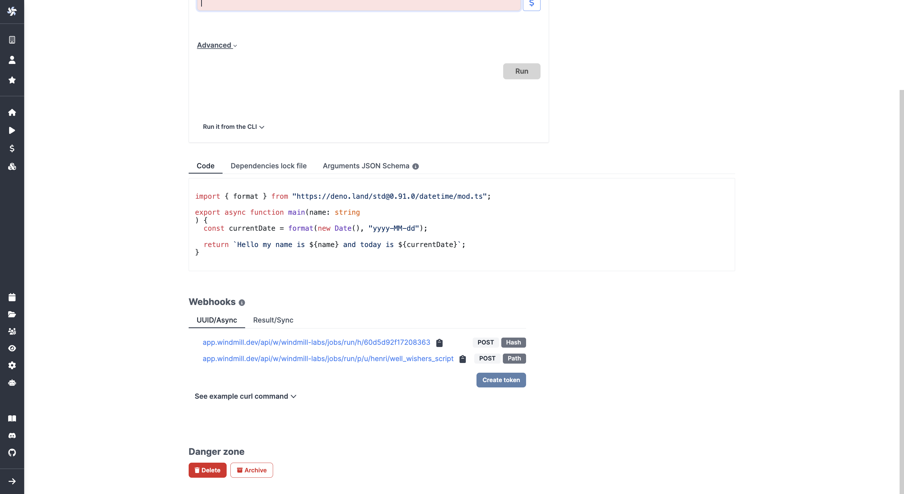
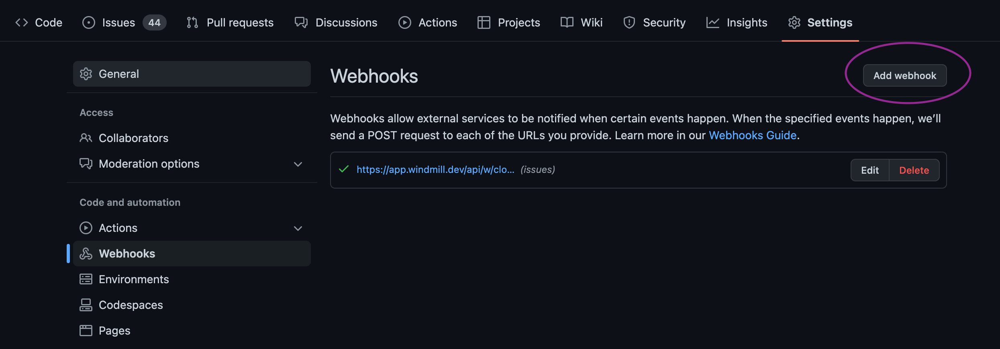

# Triggering Flows

Flows can be triggered in 6 ways.

On-demand triggers:
- [Auto-generated UIs](#auto-generated-uis)
- [Customized UIs with the App Editor](#customized-uis-with-the-app-editor)
- [Schedule the Execution of a Flow](#schedule-the-execution-of-a-flow)
- [Trigger Flows from CLI (Command Line Interface)](#trigger-flows-from-cli-command-line-interface)

Triggers from external events:
- [Scheduling + Trigger Scripts](#scheduling--trigger-scripts)
- [Trigger Flows from Webhooks](#trigger-flows-from-webhooks), including from [Slack](#webhooks-trigger-flows-from-slack) or [Emails](#webhooks-trigger-flows-from-emails)

## On-demand Triggers

### Auto-generated UIs

Windmill automatically generates user interfaces (UIs) for scripts and flows based on their parameters.

By analyzing the main function parameters, it creates an input specification in the JSON Schema format, which is then used to render the UI. Users do not need to interact with the JSON Schema directly, as Windmill simplifies the process and allows for optional UI customization.

<video
    className="border-2 rounded-xl object-cover w-full h-full"
    loop
    controls
    id="main-video"
    src="/videos/autogenerated_uis_flows.mp4"
/>

 

This feature is also usable directly in the script editor to **test a flow in the making**:

<video
    className="border-2 rounded-xl object-cover w-full h-full"
    loop
    controls
    id="main-video"
    src="/videos/ui_from_flow_editor.mp4"
/>

 

:::info

More details on our page dedicated to [Auto-generated UIs](../../core_concepts/6_auto_generated_uis/index.md).

:::

### Customized UIs with the App Editor

Windmill embeds a WYSIWYG app editor. It allows you to build your own UI with drag-and-drop components and to connect your data to scripts and flows in minutes.

<video
    className="border-2 rounded-xl object-cover w-full h-full"
    loop
    controls
    id="main-video"
    src="/videos/app_editor_fast.mp4"
/>

 

:::info

More details on our page dedicated to [Windmill App Editor](../../getting_started/7_apps_quickstart/index.md).

:::

### Schedule the Execution of a Flow

Windmill allows you to schedule scripts using a user-friendly interface and control panels, **similar to [cron](https://crontab.guru/)** but with more features.

You can create schedules by specifying a script or flow, its arguments, and a CRON expression to control the execution frequency, ensuring that your tasks run automatically at the desired intervals.

<video
    className="border-2 rounded-xl object-cover w-full h-full"
    loop
    controls
    id="main-video"
    src="/videos/schedule-cron-menu.mp4"
/>

 

:::info

More details on our page dedicated to [Scheduling jobs](../../core_concepts/1_scheduling/index.md).

:::

### Trigger Flows from CLI (Command Line Interface)

The `wmill` cli allows you to interact with Windmill instances right from your terminal.

:::info

More details on our pages dedicated to [CLI](../../advanced/3_cli/index.md).

:::

## Triggers from External Events

### Scheduling + Trigger Scripts

A particular use case of schedules are Trigger Scripts. Their purpose is to pull data from an external source and return all of the new items since the last run.

This type of Flow is meant to be scheduled regularly to reduce latency when reacting to new events. It will **trigger the rest of the Flow once per new item that is returned**. If there are no new items, the flow will be skipped.

:::info

More details on our page dedicated to [Trigger Scripts](../../flows/10_flow_trigger.md) and examples on the [Hub](https://hub.windmill.dev/triggers).

:::

### Trigger Flows from Webhooks

In Windmill, webhooks are autogenerated for each Script and Flow, providing either asynchronous or synchronous execution modes. 

These webhooks accept incoming HTTP requests, allowing users to easily trigger their Windmill workflows from external services by simply sending a POST request to the appropriate webhook URL. Their purpose is to have the flow run when it receives an input from its associated webhook.

:::tip Example of triggering Windmill through a webhook on Github

Each script and flow have their own webhooks on Windmill ...

 

 

... which you can trigger from service providers, like Github [here](https://docs.windmill.dev/blog/issue-triage-bot-flow):

 

:::

:::info

More details on our page dedicated to [Webhooks](../../core_concepts/4_webhooks/index.md).

:::

#### Webhooks: Trigger Flows from Slack

One use case of webhooks is [building a Slackbot with Windmill](/blog/handler-slack-commands).

<video
    className="border-2 rounded-xl object-cover w-full h-full"
    controls
    id="main-video"
    src="/videos/generated_email.mp4"
    alt="container component"
/>

 

Windmill uses Slack to trigger scripts and flows by establishing Slackbots and creating specific commands. By connecting Slack with Windmill, parsing incoming Slack commands, and leveraging Windmill workflows, operational teams can trigger complex automations directly from Slack.

#### Webhooks: Trigger Flows from Emails

One use case of webhooks is [triggering scripts via inbound emails using Mailchimp](../../integrations/mailchimp_mandrill.md).

<video
    className="border-2 rounded-xl object-cover w-full h-full"
    controls
    id="main-video"
    src="/videos/trigger_mandrill.mp4"
/>

 

Windmill leverages Mailchimp Mandrill's capabilities to initiate scripts and flows via email-triggered events. By parsing inbound emails and routing the content to Windmill through webhooks, scripts or flows are activated, enabling automation based on email content or just their arrival.

<!-- Resources -->

[schedule]: ../../core_concepts/1_scheduling/index.md
[webhook]: ../../core_concepts/4_webhooks/index.md