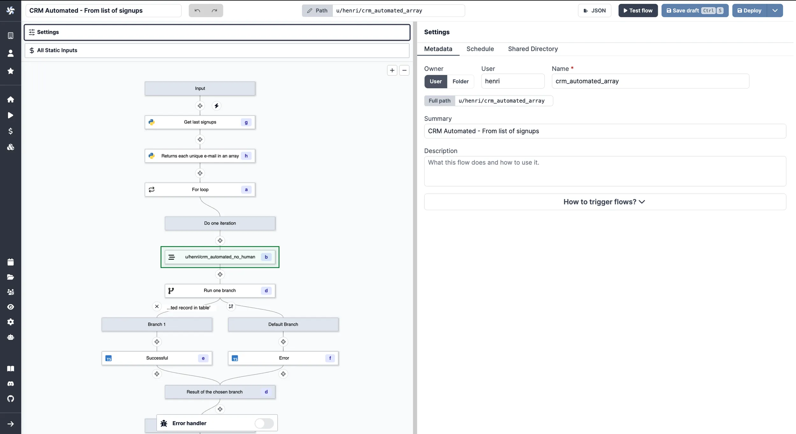

import DocCard from '@site/src/components/DocCard';

# Triggering Flows

Flows can be triggered in 7 ways.

On-demand triggers:

- [Auto-generated UIs](/docs/getting_started/trigger_flows#auto-generated-uis)
- [Customized UIs with the App Editor](#customized-uis-with-the-app-editor)
- [Schedule the Execution of a Flow](#schedule-the-execution-of-a-flow)
- [Trigger Flows from CLI (Command Line Interface)](#cli-command-line-interface)
- [Trigger a Flow from another Flow](#trigger-a-flow-from-another-flow)

Triggers from external events:

- [Scheduling + Trigger Scripts](#scheduling--trigger-scripts)
- [Trigger Flows from Webhooks](#webhooks), including from [Slack](#webhooks-trigger-flows-from-slack) or [Emails](#webhooks-trigger-flows-from-emails)

## On-demand Triggers

### Auto-generated UIs

Windmill automatically generates user interfaces (UIs) for scripts and flows based on their parameters.

By analyzing the main function parameters, it creates an input specification in the JSON Schema format, which is then used to render the UI. Users do not need to interact with the JSON Schema directly, as Windmill simplifies the process and allows for optional UI customization.

<video
	className="border-2 rounded-xl object-cover w-full h-full dark:border-gray-800"
	controls
	src="/videos/autogenerated_uis_flows.mp4"
/>

 

This feature is also usable directly in the script editor to test a flow in the making:

<video
	className="border-2 rounded-xl object-cover w-full h-full dark:border-gray-800"
	controls
	src="/videos/ui_from_flow_editor.mp4"
/>

 

	<DocCard
		title="Auto-generated UIs"
		description="Windmill creates auto-generated user interfaces for scripts and flows based on their parameters."
		href="/docs/core_concepts/auto_generated_uis"
	/>

### Customized UIs with the App Editor

Windmill provides a WYSIWYG app editor. It allows you to build your own UI with drag-and-drop components and to connect your data to scripts and flows in minutes.

<video
	className="border-2 rounded-xl object-cover w-full h-full dark:border-gray-800"
	controls
	src="/videos/app_editor_fast.mp4"
/>

 

	<DocCard
		title="App Editor"
		color="orange"
		description="Detailed section on Windmill's App Editor"
		href="/docs/apps/app_editor"
	/>

You can also [automatically generate](../../core_concepts/6_auto_generated_uis/index.mdx#automatically-generated-apps) a dedicated app to execute your flow.

<video
	className="border-2 rounded-xl object-cover w-full h-full dark:border-gray-800"
	controls
	src="/videos/cowsay_app.mp4"
/>

### Schedule the Execution of a Flow

Windmill allows you to schedule scripts using a user-friendly interface and control panels, **similar to [cron](https://crontab.guru/)** but with more features.

You can create schedules by specifying a script or flow, its arguments, and a CRON expression to control the execution frequency, ensuring that your tasks run automatically at the desired intervals.

<video
	className="border-2 rounded-xl object-cover w-full h-full dark:border-gray-800"
	controls
	src="/videos/schedule-cron-menu.mp4"
/>

 

	<DocCard
		title="Schedules"
		description="Scheduling allows you to define schedules for Scripts and Flows, automatically running them at set frequencies."
		href="/docs/core_concepts/scheduling"
	/>

### CLI (Command Line Interface)

The `wmill` CLI allows you to interact with Windmill instances right from your terminal.

<iframe
	style={{ aspectRatio: '16/9' }}
	src="https://www.youtube.com/embed/w2HVTlR2QDI?vq=hd1080"
	title="YouTube video player"
	frameBorder="0"
	allow="accelerometer; autoplay; clipboard-write; encrypted-media; gyroscope; picture-in-picture; web-share"
	allowFullScreen
	className="border-2 rounded-xl object-cover w-full dark:border-gray-800"
></iframe>

 

	<DocCard
		title="Command-Line Interface"
		description="Interact with Windmill instances right from your terminal."
		href="/docs/advanced/cli"
	/>

### Trigger a Flow from another Flow

Windmill supports inner flows. This allows you to call a flow from another workflow.

	<DocCard
		title="Flow Editor"
		color="teal"
		description="Detailed section on Windmill's Flow Editor."
		href="/docs/flows/flow_editor"
	/>

## Triggers from External Events

### Scheduling + Trigger Scripts

A particular use case for schedules are [Trigger Scripts](../../flows/10_flow_trigger.mdx).

Trigger scripts are designed to pull data from an external source and return all of the new items since the last run, without resorting to external webhooks. A trigger script is intended to be used with [schedules](../../core_concepts/1_scheduling/index.mdx) and [states](../../core_concepts/3_resources_and_types/index.mdx#states) (rich objects in JSON, persistent from one run to another) in order to compare the execution to the previous one and process each new item in a [for loop](../../flows/12_flow_loops.md). If there are no new items, the flow will be skipped.

By default, adding a trigger will set the schedule to 15 minutes.

	<DocCard
		title="Trigger Scripts"
		color="teal"
		description="Trigger scripts are designed to pull data from an external source and return all of the new items since the last run, without resorting to external webhooks."
		href="/docs/flows/flow_trigger"
	/>

### Webhooks

In Windmill, webhooks are autogenerated for each Script and Flow, providing either asynchronous or synchronous execution modes.

These webhooks accept incoming HTTP requests, allowing users to easily trigger their Windmill scripts and flows from external services by simply sending a POST request to the appropriate authentified webhook URL (requires passing a [token](../../core_concepts/4_webhooks/index.mdx#api-token) as Bearer or query arg). Their purpose is to have the flow run when it receives an input from its associated webhook.

Using webhooks, you could also trigger a flow from scripts.

	<DocCard
		title="Webhooks"
		description="Trigger scripts and flows from webhooks."
		href="/docs/core_concepts/webhooks"
	/>

#### Webhooks: Trigger Flows from Slack

One use case of webhooks is [building a Slackbot with Windmill](/blog/handler-slack-commands).

<video
	className="border-2 rounded-xl object-cover w-full h-full dark:border-gray-800"
	controls
	src="/videos/generated_email.mp4"
/>

 

Windmill uses Slack to trigger scripts and flows by establishing Slackbots and creating specific commands. By connecting Slack with Windmill, parsing incoming Slack commands, and leveraging Windmill workflows, operational teams can trigger complex automations directly from Slack.

	<DocCard
		title="Slack Integration"
		description="Learn how to integrate Slack with Windmill."
		href="/docs/integrations/slack"
	/>

#### Webhooks: Trigger Flows from Emails

One use case of webhooks is [triggering scripts via inbound emails using Mailchimp](../../integrations/mailchimp_mandrill.md).

<video
	className="border-2 rounded-xl object-cover w-full h-full dark:border-gray-800"
	controls
	src="/videos/trigger_mandrill.mp4"
/>

 

Windmill leverages [Mailchimp Mandrill](https://mailchimp.com/en/features/transactional-email/)'s capabilities to initiate scripts and flows via email-triggered events. By parsing inbound emails and routing the content to Windmill through webhooks, scripts or flows are activated, enabling automation based on email content or just their arrival.

	<DocCard
		title="Mailchimp Mandrill Integration"
		description="Learn how to integrate Mailchimp Mandrill with Windmill."
		href="/docs/integrations/mailchimp_mandrill"
	/>

<!-- Resources -->

[schedule]: ../../core_concepts/1_scheduling/index.mdx
[webhook]: ../../core_concepts/4_webhooks/index.mdx
