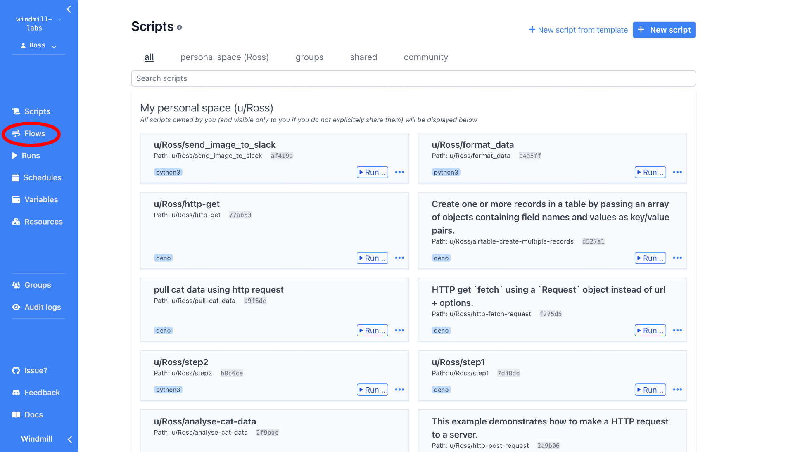
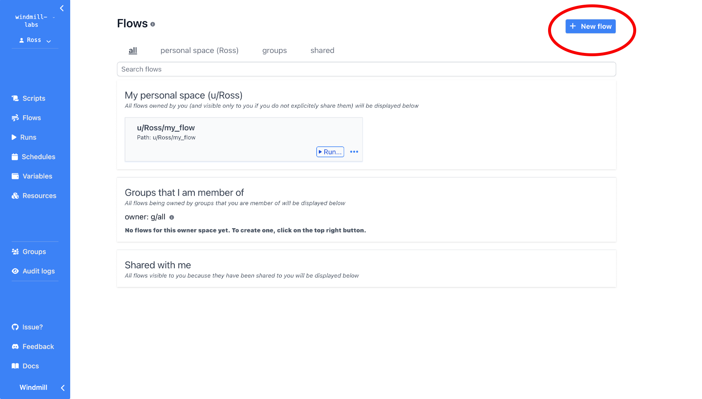
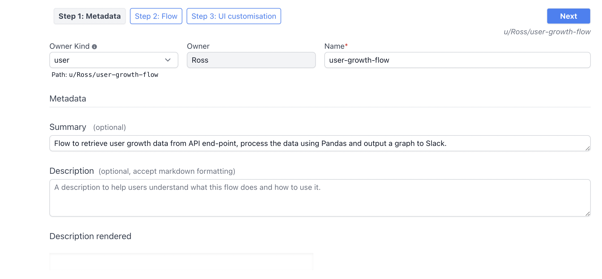
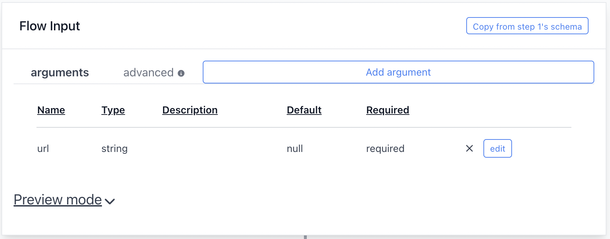
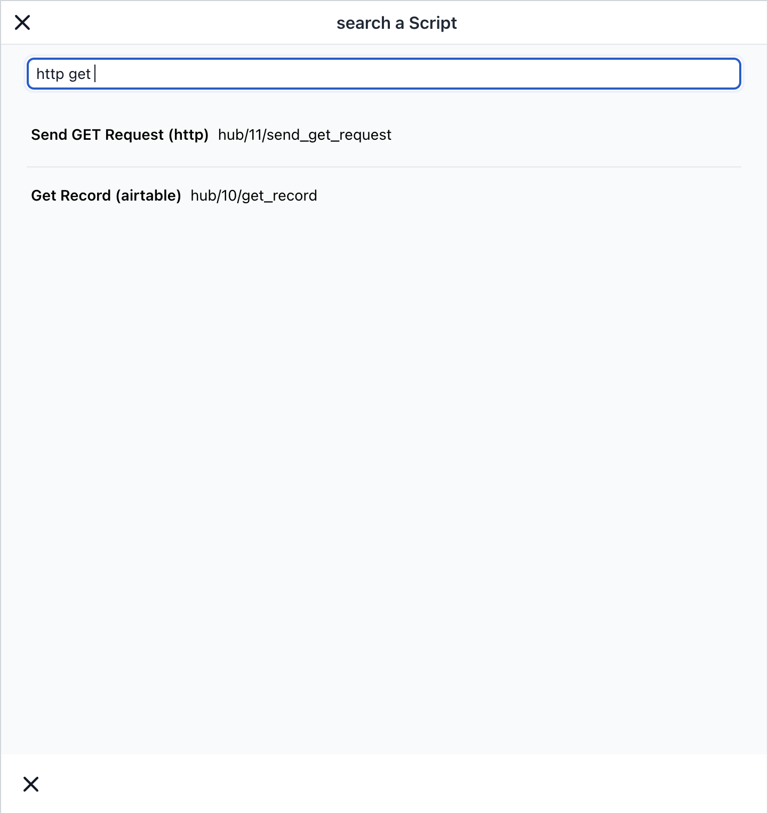
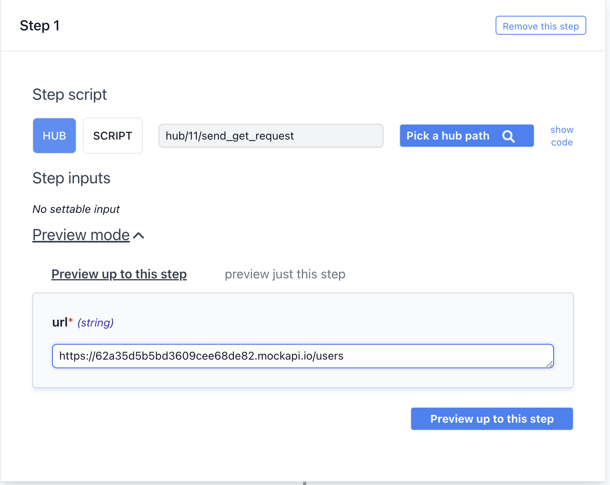
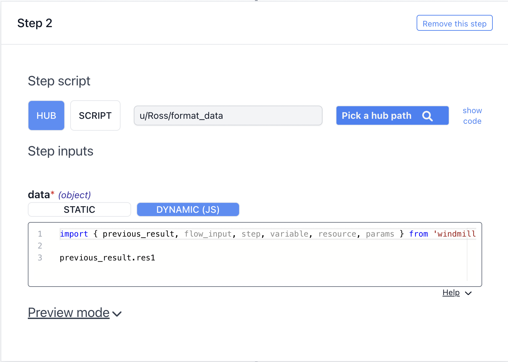
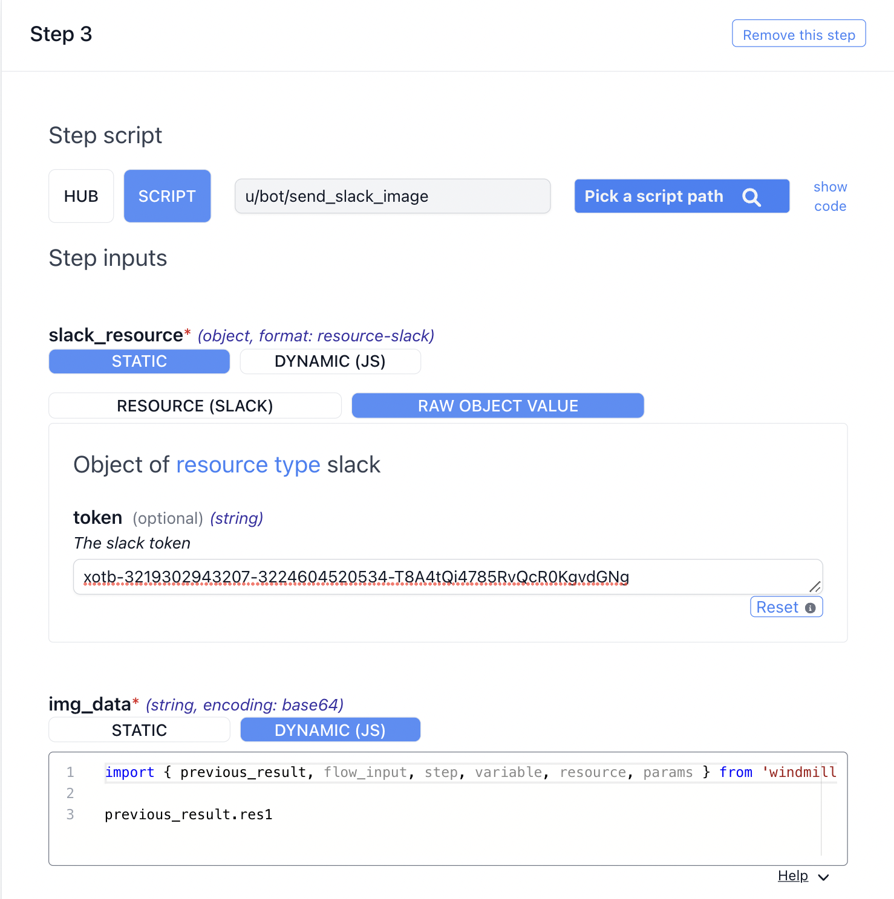
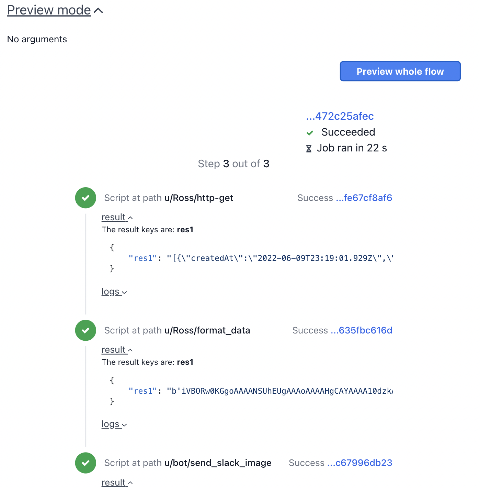
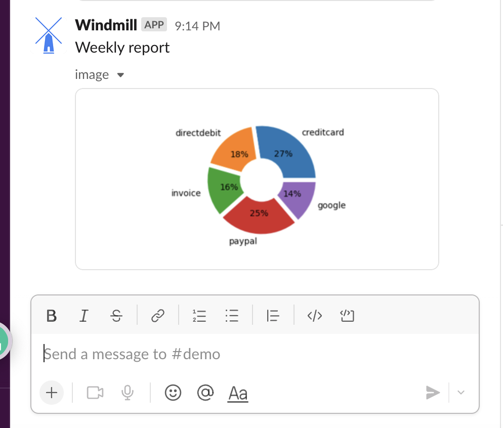

# Flows

**Flows** allow you to streamline complex processes and operations by chaining
together custom scripts. Each **Flow** is composed of one or more step scripts
that can accept inputs, execute a function and then produce an output which can
be used by subsequent step scripts. Flows contain all of the benefits of
Windmill Scripts, offering immediate functionality such as third party app
integrations, SQL queries, Slack, custom scripts and more!

:::tip

Signup at [app.windmill.dev](https://app.windmill.dev) then you can one-click
import any flows on [hub.windmill.dev](https://hub.windmill.dev). See
['Whenever an HN message contains a mention, publish it to slack'](https://hub.windmill.dev/flows/13/whenever-an-hn-message-contains-a-mention%2C-publish-it-to-slack)

 

:::

Flows in windmill follows the [OpenFlow Spec](/docs/openflow).

- **Flow Inputs** arguments for each flow can be edited using the flow input
  wizard or by editing their jsonschema.

- **Scripts** can be dynamically added to each flow by clicking the '+' button.
  Scripts can be automatically imported from
  [Windmil Hub](https://hub.windmill.dev/) selecting a Hub path or by using your
  own custom scripts created in Windmill by selecting a Script path.

- **Scripts Inputs** for each script correspond to the inputs as defined by the
  input spec of selected script and can be defined using static values or
  javascript expressions (and a mix of both using templates)

- **Raw Javascript Editor**: In most cases, the templating engine using
  `static value ${js.expr}` for mixing static strings and dynamic expression as
  string is sufficient. But in some cases, you need the full power of javascript
  and the Raw Javascript Editor does just that allowing each step script input
  to be a complex javscript expression inputs, variables, resources and outputs
  from other steps in the Flow.

- **Preview Mode** is available for each Step in a Flow, enabling you to see the
  output of each step script and how they interact with previous Steps.

## Getting Started with Flows

We're going to take a look at Flows and how we can create a Flow that allows us
to fetch data from an endpoint, process the data in Python using Pandas and then
output a graph to Slack.

### 1: Log in to Windmill

Log into your windmill instance, create or select a workspace and land on the
windmill dashboard. Select the Flows icon from the navigation bar on the left.

### 2: Select Flows

All previously created Flows can be accessed from the Flows dashboard. To create
a new Flow, click the **'New Flow'** button in the top right hand corner.

### 3: Create New Flow

Input a title for the Flow and optionally a brief summary of what the Flow will
do. A more detailed description of the flow can also be added.

### 4: Add Flow Inputs

Using the Flow input wizard or the json-schema, an arguments can be given to the
flow which can be accessed at any step of the flow.\

### 5: Add HTTP Get Request Step Script

To create the first step in the flow, a script can be added automatically from
either Windmill Hub or any custom script that you have previously made in
Windmill. In order to send a simple HTTP Get Request I will select the Hub icon,
'Pick a script path' and then search for a HTTP Get Request in Windmill Hub.
Once I've found the script, I can click select it and Windmill will
automatically populate it in the step script. I'll then add a static 'url'
argument of the end point I want to send a Get Request to in order to access the
User Growth Data. 

### 6: Add Python Graph Step Script with Dynamic JavaScript

Next, create a new step script by clicking the '+' button. In order to process
the data that we collected from the first step script, we'll use dynamic
JavaScript to take the output from the previous step and use it as an argument
in our current step script. The custom Python script uses pandas to create a pie
chart that will be converted to Bytes and output to the next step script. We
will use the **previous_result** object which contains the result of the
previous step. Windmill automatically assigns the fieldname **"res1"** for the
first output of the script if it is not specified.

### 7: Output Graph to Slack

To output the graph to Slack add one more step script using the Windmill Hub
'send_slack_image' path. Again, use the dynamic JavaScript to connect the output
of step script 2 to the input of step script 3.

### 8: Preview Flow

Now that the Flow is complete, use preview mode to see the output of each step
script and ensure that there are no errors.

### Deploy your Flow!

Click the Next button and then save your flow. You can run your newly created
flow from the Flows page or schedule your Flow on the schedules page.

