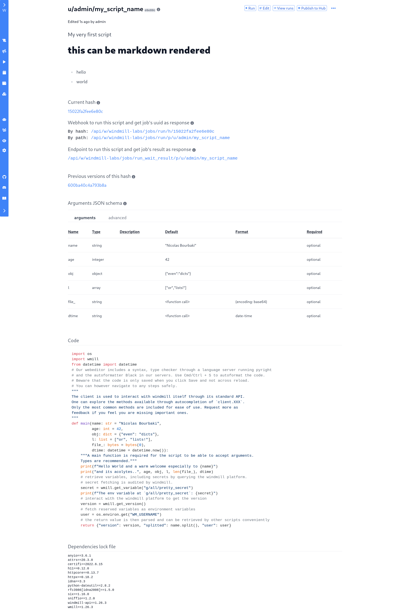

# Getting Started with Scripts

In this tutorial, we'll create a basic Hello world script, and cover some of the
Windmill's main concepts: scripts, accepting user input, and runs. Scripts can
be turned directly into standalone apps, but can also be composed together using
flows.

We will cover flows in a [separate intro](./intro_flows). In there, we will see
that in flows, while some of the steps are custom busiess logics scripts from
your workspace or inlined directly into the flow, most of the steps are generic
scripts made by the community in the [WindmillHub](https://hub.windmill.dev) and
directly pickable inside the flow builder when approved by the WindmillHub
moderators.

### Step 1: Login

Log into your windmill instance. You will land on the dashboard.

### Step 2: Create a script

Use the **Add script** button to create a new script. It'll open the create
page, with three sections:

#### Metadata

The **metadata section** contains information useful to the script's users:

- **path:** a unique identifier that consist of the script owner, and the script
  name. The path has an [ownership path prefix](../reference#owner). Select
  `user` (that means the script is private) and `hello` as your script's name.
- **summary:** a short summary of what the script does, that will be displayed
  on the dashboard. Make it clear and short so that your users know what this
  script is for: `Say hello to someone`.
- **description:** instructions or details on how to run the script, and what it
  does. Let's use `provide a username, and this script will greet them`.

#### Code

Let's move on to the **code** page. This is where we will write the script, and
define the arguments this script will prompt its user for. In Windmill, scripts
need to have a `main` function that will be the script entrypoint. A script
accepting arguments needs to provide a user interface for users to input
argument values and a main function accepting those arguments.

- The **code editor** is preloaded by default with a script: let's go through
  it. Every script in Windmill needs to have a **main** function that will be
  called at runtime. It's recommended to add type annotations to that main
  function: Windmill can infer arguments from the main's function signature.

Windmill parses the main function signature, infers argument names and types,
and pref-fills the arguments section. Read more about
[arguments](../reference#script-arguments).

All set! Save your work, and you'll land on the script page. Note that scripts
are [versioned](../reference#versioning), and each new edit creates a new script
version.

### Step 3: Run!

Now let's look at what users of this script will do. Click on the **run** button
to run this script. You'll see the user input form we defined earlier. Note what
happens if you don't provide input:

Fill in the fields, then hit run. You should see a run view, as well as your
logs. All script runs are also available in the **Runs** menu on the left.

This script is a minimal working example, but there's a few more steps we need
in a real-world use case:

- Pass [variables and secrets](../how-tos/variables_and_secrets) to a script
- Connect to [resources](../how-tos/create_resources)
- Run scripts or flows on a [schedule](../how-tos/schedule)
- Compose scripts in [flows](./intro_flows)
