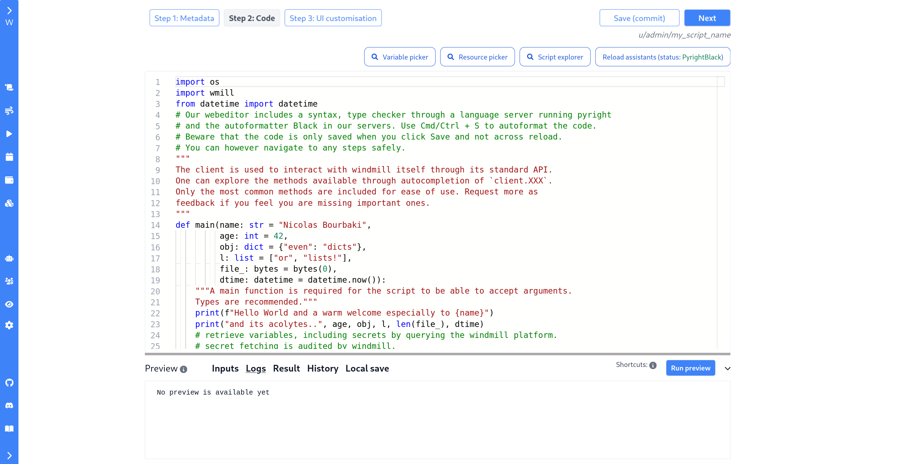

# Scripts

## Getting started

Scripts can act as standalone apps, but can also be chained together to 
create [Flows][flows].

They can also be shared on the [Windmill Hub][wm-hub], where once verified
by moderators, they become available to everyone, directly from within the
app. 

In Windmill, both Scripts and Flows consist of two parts: 

- **Metadata**, which contains information about the Script or Flow itself, such 
  as its path, description, and author, and;
- **Logic**, which in case of a Script is the code, and in case of a Flow is the 
  list of Scripts to be executed.

### Metadata

**Metadata** contains information useful to the script's users.

**Path** is the unique identifier that consist of the 
[script's owner](../reference#owner), and the script's name. The owner can be
either a user, or a group. This influences the permissions on the platform. 
Selecting user will keep the script *private* to the selected account, 
while selecting group will make it available to all users of the given group.

<!-- FIXME: Languages -> Runtimes ? -->
Windmill supports two **Languages**: JavaScript and TypeScript, executed by 
[Deno][deno] and [Python][python].

**Summary** and **Description** are both optional, but highly recommended.  
If the Summary is absent, the UI will use the `path` by default. That being
said, keep them short, as they are displayed throughout the UI.
Description supports Markdown formatting, and is where you should 
include examples on how to use your script.

### Code

In Windmill, scripts need to have a `main` function that will be the script
entrypoint. Parameters of the main function are used to compute the input
spec of that script. That input spec is used for both generating the
frontend form that you see when using that script as a standalone app, and for
the inputs that it takes when it is a step of a flow.

Type annotations are used to generate the UI form, and help pre-validate 
inputs. While not mandatory, they are highly recommended.

Don't worry, when creating a new Script, you always get a template you can
start from. 

## Creating a Script

In this tutorial, you will create a basic Hello world script, and understand
some of Windmill's main concepts: scripts, accepting user input, and runs. 

### Login
Log into your windmill instance. You will land on the dashboard.

### Create a script
Head over to the [Scripts][app-scripts] tab and use the **New script** button
in the top right corner to create a new script. It will open the create
page, with three sections:

#### Metadata
- **Path**: Select `user` (that means the script is private) and `hello` as 
  your script's name.

- **Language** Choose Typescript (Deno)

- **Summary:** Clear and short so that your users know what this
  script is for: `Say hello to someone`.

- **Description:** Instructions or details on how to run the script, and what it
  does. Let's use `provide a username, and this script will greet them`.

#### Code

The **code editor** is preloaded by default with a script: let's go through
it. Every script in Windmill needs to have a **main** function that will be
called at runtime. Even in python, it is extremely recommended to add type
annotations to that main function: Windmill can infer arguments from the
main's function signature.

Write and edit your typescript code in a powerful webeditor with autocompletion
and type inference.

It works with Python too.

#### UI Customization

Windmill parses the main function signature, infers argument names and types.

All set! Save your work, and you'll land on the script page. Note that scripts
are [versioned](../reference#versioning), and each new edit creates a new script
version.

### Run!

Now let's look at what users of this script will do. Click on the **Run** button
to run this script. You'll see the user input form we defined earlier. Note what
happens if you don't provide input:

Fill in the fields, then hit run. You should see a run view, as well as your
logs. All script runs are also available in the [Runs][app-runs] menu on the left.

This script is a minimal working example, but there's a few more steps we need
in a real-world use case:

- Pass [variables and secrets](../how-tos/variables_and_secrets) to a script
- Connect to [resources](../how-tos/create_resources)
- Run scripts or flows on a [schedule](../how-tos/schedule)
- Compose scripts in [flows][flows]

<!-- Resources -->
[app-runs]: https://app.windmill.dev/runs
[app-scripts]: https://app.windmill.dev/scripts
[deno]: https://deno.land/
[flows]: ./flows
[python]: https://www.python.org/
[wm-hub]: https://hub.windmill.dev