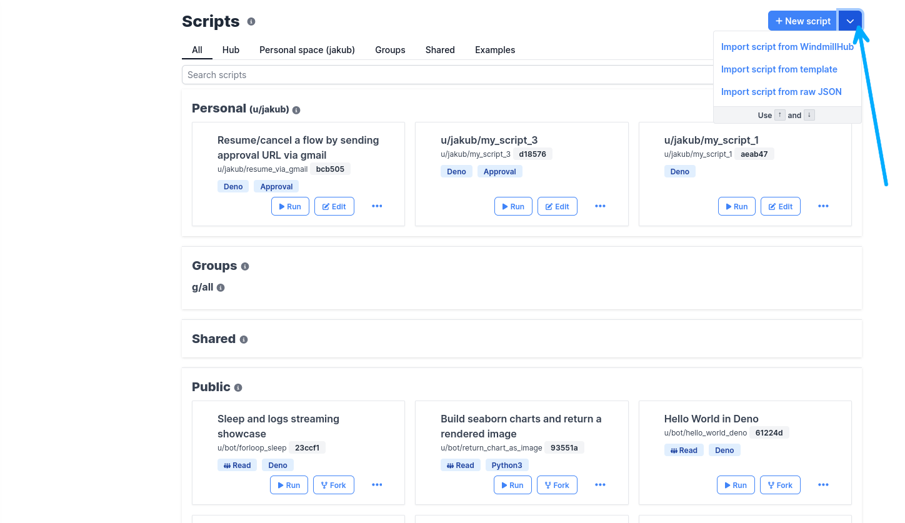
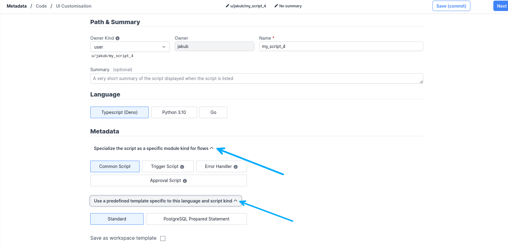
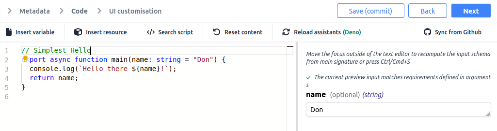
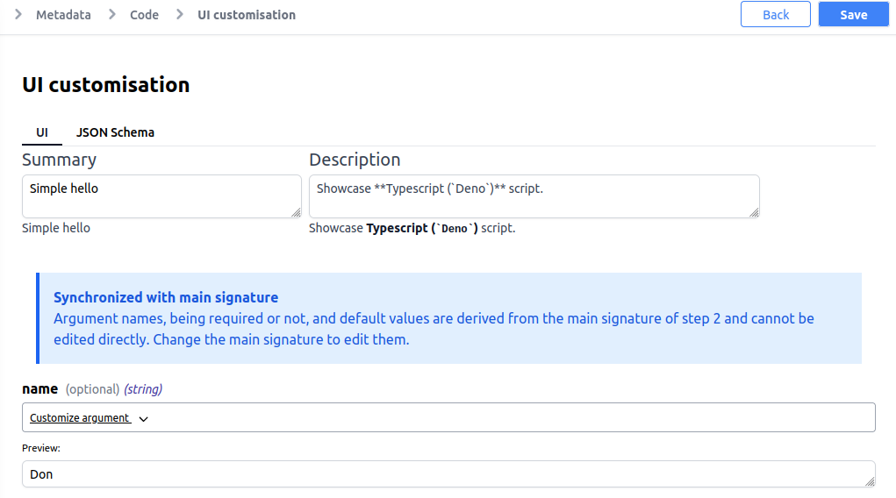
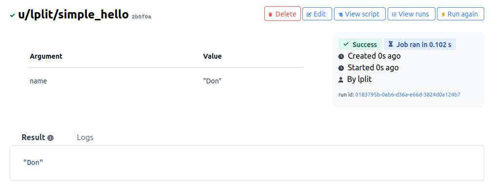

# Scripts

## Getting started

Scripts can act as standalone apps, and can also be chained together to create
[Flows][flows].

They can also be shared on the [Windmill Hub][wm-hub], where once verified by
moderators, they become available to everyone, directly from within Windmill.

In Windmill, both Scripts and Flows consist of two parts:

- **Metadata**, which contains information about the Script or Flow itself, such
  as its path, description, and author, and;
- **Logic**, which in case of a Script is the code, and in case of a Flow is the
  list of Scripts to be executed. For more information see the 
  [OpenFlow Spec.][openflow]

You can create new script from scratch or by importing it


Don't worry, when creating a new Script, you always get a template you can start
from.

### Metadata

**Metadata** contains information useful to the script's users.

**Path** is the unique identifier that consist of the
[script's owner](../reference#owner), and the script's name. The owner can be
either a user, or a group. This defines the permissions on the platform.
Selecting user will keep the script _private_ to the selected account, while
selecting group will make it available to all users of the given group.

Windmill supports three **Languages**: Python, TypeScript, and Go.

**Summary** and **Description** are both optional, but highly recommended.
If the Summary is absent, the UI will use the `path` by default. That being
said, keep them short, as they are displayed throughout the UI. Description
supports Markdown formatting, and is where you should include examples on how to
use your script.

#### Common Scripts

Common scripts are the basic building blocks for the flows.

#### Trigger Scripts

They are used as a first flow step most commonly with an internal state and a
schedule to watch for changes on an external system, and compare it to the
previously saved state. If there are changes, _trigger_ the rest of the flow,
i.e. subsequent scripts.

#### Approval Scripts

Use them in order to suspend a flow until it's approved. Main usecase for
approval scripts is to send an external notification with an URL that can be
used to resume or cancel a flow. For more details check [Suspend/Resume a flow
tutorial](../how-tos/6_suspend_resume_a_flow.md).

#### Error Handlers

Handle errors for flows after all retries attempts have been exhausted.

#### Template Scripts

In order to allow other users to rapidly write scripts, you can define
templates. This is particularly useful with resources for example: you can
define a template script that can be rapidly used with that resource.

When creating a script from a template, the script's code will be pre-filled
with the template code.

While you can create as many Template Scripts as you want, Windmill comes with a
few built-in types. One of the provided templates for TypeScript/Deno is the
PostgreSQL template. This template showcases how to quickly create a
parameterized statement for a PostgreSQL database. Template Scripts can be used
as a standalone Script, or as a part of a Flow. Visit the Postgres
[integration tutorial](../integrations/postgresql) to learn more.

Indeed, templates are just scripts!


### Code

In Windmill, scripts need to have a `main` function that will be the script's
entrypoint.
Parameters of the main function are used to compute the input spec
of that script. That input spec is in turn used for both generating the
frontend form that you see when using that script as a standalone app, and
for the inputs that it takes when it is a step of a flow.

Type annotations are used to generate the UI form, and help pre-validate inputs.
While not mandatory, they are highly recommended.

## Creating a Script

In this tutorial, you will create a basic Hello world script, and understand
some of Windmill's main concepts: scripts, accepting user input, and runs.

Head over to the [Scripts][app-scripts] tab and use the **New script** button in
the top right corner to create a new script. It will open the create page, with
three sections:



#### Metadata

- **Path**: Select `user` (that means the script is private) and `my_script` as your
  script's name.

- **Language** Choose Typescript (Deno)

- **Summary:** Clear and short so that your users know what this script is for:
  `Say hello to someone`.

- **Description:** Instructions or details on how to run the script, and what it
  does. Let's use `provide a username, and this script will greet them`.

#### Code

The **code editor** is preloaded by default with a script: let's go through it.
Every script in Windmill needs to have a **main** function that will be called
at runtime. Even in python, it is extremely recommended to add type annotations
to that main function: Windmill can infer arguments from the main's function
signature.



Write and edit your code in a powerful webeditor with autocompletion
and type inference.

:::tip 

It is possible to import other scripts into your script.

For now, this is only possible in TypeScript, and any script you have read
rights on can be imported:

```ts
import * as other from "<script_url>"`
```

The format for the import url is:

By path:

```
https://<instance>/api/w/<workspace>/scripts/raw/p/<path>.ts"
```

By hash:

```
https://<instance>/api/w/<workspace>/scripts/raw/h/<hash>.ts"
```

:::

#### UI Customization

Windmill parses the main function signature, infers argument names and types.



All set! Save your work, and you'll land on the script page. Note that scripts
are [versioned](../reference#versioning), and each new edit creates a new script
version.

### Run!

Now let's look at what users of this script will do. Click on the **Run** button
to load this script. You'll see the user input form we defined earlier. Note 

Fill in the fields, then hit run. You should see a run view, as well as your
logs. All script runs are also available in the [Runs][app-runs] menu on the
left.



This script is a minimal working example, but there's a few more steps we need
in a real-world use case:

- Pass [variables and secrets](../how-tos/variables_and_secrets) to a script
- Connect to [resources](../how-tos/create_resources)
- Run scripts or flows on a [schedule](../how-tos/schedule)
- Compose scripts in [flows][flows]

<!-- Resources -->

[app-runs]: https://app.windmill.dev/runs
[app-scripts]: https://app.windmill.dev/scripts
[deno]: https://deno.land/
[flows]: ./flows
[openflow]: ../openflow.md
[python]: https://www.python.org/
[wm-hub]: https://hub.windmill.dev
