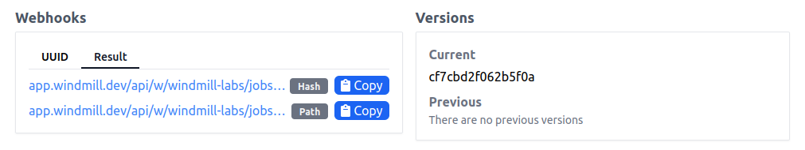
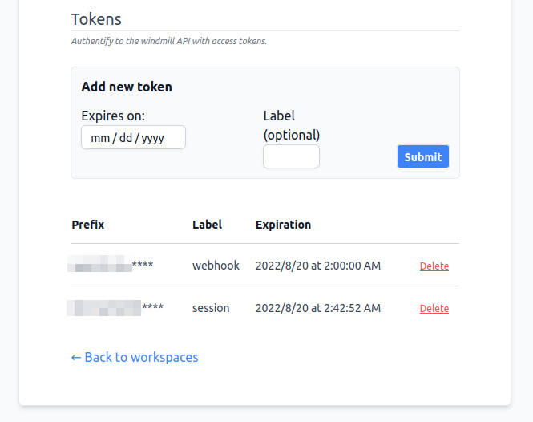

# Webhooks

:::tip

Snippet of a Deno/TypeScript script using only native JavaScript to trigger a
webhook can be found on [Windmill Hub][script].

:::

## Getting started

Webhooks are a way to interact with Windmill using standard web technologies.\
Each Script and Flow created in the app gets two types of autogenerated
webhooks, depending on how they are triggered, and what their return values are.
In all cases, webhooks are endpoints accepting `POST` requests with arguments as
body.

### Addresses



Webhooks links can be found in the Script/Flow's details page, for more
information about Scripts, refer to the
[Getting Started with Scripts](./scripts) section.

**Asynchronous**

Jobs can be triggered in **asynchronous** mode, meaning that the webhook is
triggered, and the returning value is the `uuid` of the job that was assigned
the execution of the underlying code. 

In addition to that, asynchronous mode comes with two urls: one with the path to
the script, i.e. `/u/<your_user>/<your_script_name>` and one with just a hash,
i.e. `/h/<hash>`, hiding potentially sensitive information and always
corresponding to that version of the script, even with overwrites.

These links are available in the UUID tab. 

**Synchronous**

The second type of autogenerated endpoint is the **synchronous** webhook.
This webhook triggers the execution, automatically extracts the underlying
code's return value and returns it as the response.

These links are available in the Result tab. 

:::caution
Caution advised for long-running jobs.
:::

### API token

To interact with Windmill you always need to use `Bearer` token authentication.

You can generate tokens for your own account on the
[User Settings][user-settings] page on the app. Labels are only used to allow
users to easily distinguish keys.

:::caution

You can only see the token once, when it's created. Make sure to store it
securely!

:::



## Triggering

Once you have a webhook url and a user token, issue a `POST` request to the
endpoint and you will get the appropriate return as response.

The bearer token must be passed as either an `Authorization: Bearer XXX` header,
or as a `token` query parameter: `https://<instance>/<route>?token=<token>`


:::caution

Because of security reasons it is highly recommended to pass token in the
header. If it's not possible, then URL that contains the token should be
treated as a secret (for more context please check [OWASP ref.1] and [OWASP
ref.2])

:::

e.g:

```console
# Header
curl -X POST \
    --data '{}'                            \
    -H "Content-Type: application/json"    \
    -H "Authorization: Bearer supersecret" \
    ".../w/demo/jobs/run_wait_result/p/u/bot/hello_world_deno"
```
```console
# Query parameter
curl -X POST                               \
    --data '{}'                            \
    -H "Content-Type: application/json"    \
    ".../w/demo/jobs/run_wait_result/p/u/bot/hello_world_deno?token=supersecret"
```

You can find an example using only standard Deno libraries on the
[Windmill Hub][script].

You can also verify that the job has been triggered and ran (or investigate any
encountered issues), by checking the [Audit Logs][audit-logs] tab on the app.

<!-- Resources -->

[audit-logs]: https://app.windmill.dev/audit_logs
[user-settings]: https://app.windmill.dev/user/settings
[script]: https://hub.windmill.dev/scripts/windmill/1325/trigger-windmill-webhook-with-native-fetch-api-windmill
[OWASP ref.1]: https://cheatsheetseries.owasp.org/cheatsheets/REST_Security_Cheat_Sheet.html#sensitive-information-in-http-requests
[OWASP ref.2]: https://github.com/OWASP/CheatSheetSeries/blob/083890d18ca40bcfc4bdfa80e04dd0a2245c34ea/cheatsheets_draft/Webhook_Security_Guidelines_CheatSheet.md#treat-webhooks-as-secrets
