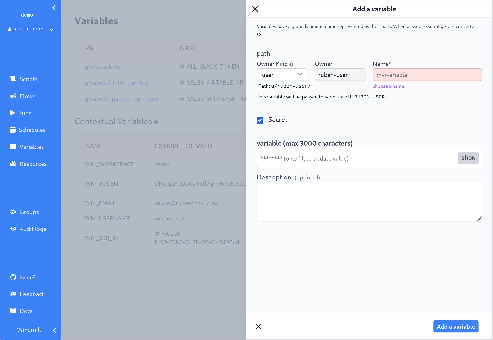

# Save variables and secrets

When writing scripts, you may want to reuse variables, or safely pass secrets to
scripts. You can do that with **Variables**. Windmill has user-defined variables
and reserved variables.

## Reserved variables

Reserved variables are automatically set by Windmill. See the 
[variables page](https://app.windmill.dev/variables) for
the list of reserved variables and what they are used for.

## Add a variable or secret

You can define variables from the **Variables** page. Like all objects in
Windmill, variable ownership is defined by the **path** (see
[ownership path prefix](../reference#owner)).

Variables also have a **name**, generated from the path, and names are used
to access variables from scripts.

A variable can be made **secret**. In that case, its value will not be visible
outside of a script (see [secrets security note](#secrets-security-note)).



## Access a variable from a script

At runtime, all the variables you have access to are set as environment
variables. They can be accessed using their name.

For example, a variable of path `u/alice/path/to/variable` will have the name
`U_ALICE_PATH_TO_VARIABLE`. A script can access it with:

```python
var = os.environ.get("U_ALICE_PATH_TO_VARIABLE")
```

## Secrets security note

Secrets are encrypted when stored on Windmill. From a usage standpoint, secrets
are kept safe in three different ways:

- Secrets can only be access by users with the right permissions, as defined by
  their path. In addition, secrets can be explicitly shared with users or
  groups. A secret in `u/alice/secret` will only be accessible by `alice`,
  unless explicitly shared.
- Secrets cannot be viewed outside of scripts. Note that a user could still
  `print` a secret they have access to from a script.
- However, each script run generates an audit log, and scripts are versioned.
  That means than you can audit, who accesses secrets. For example, a user
  writing a script to print all secrets would be traceable thanks to audit logs.
