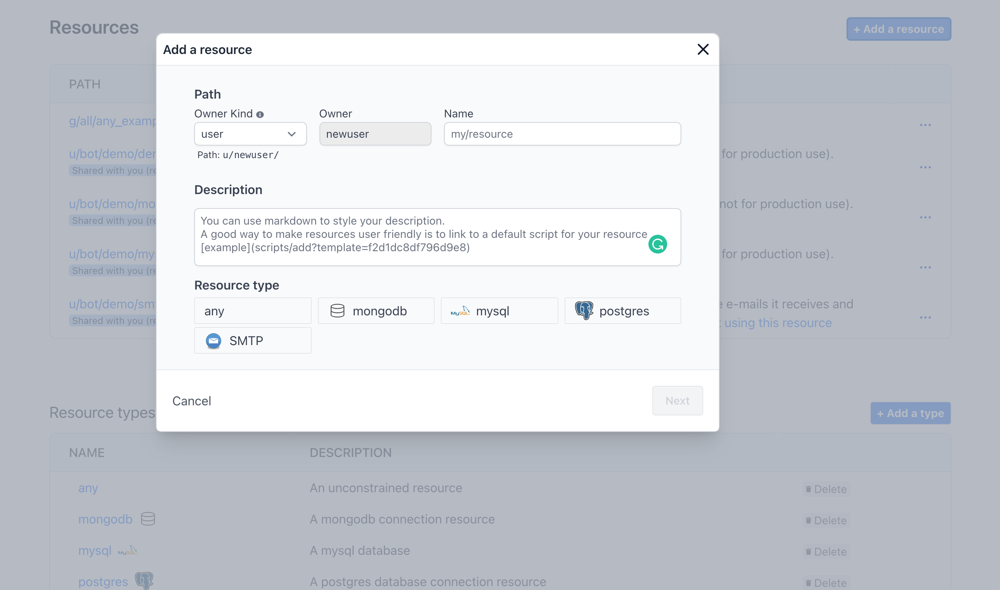
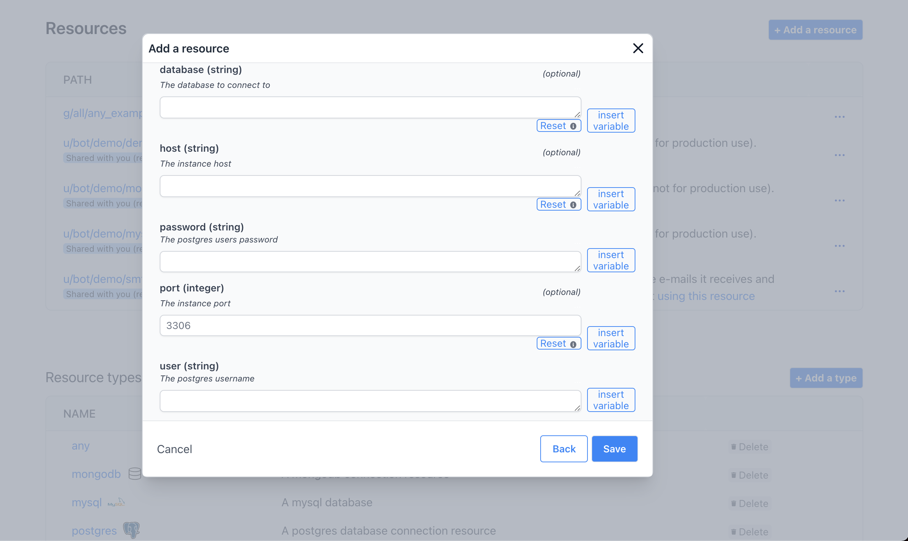
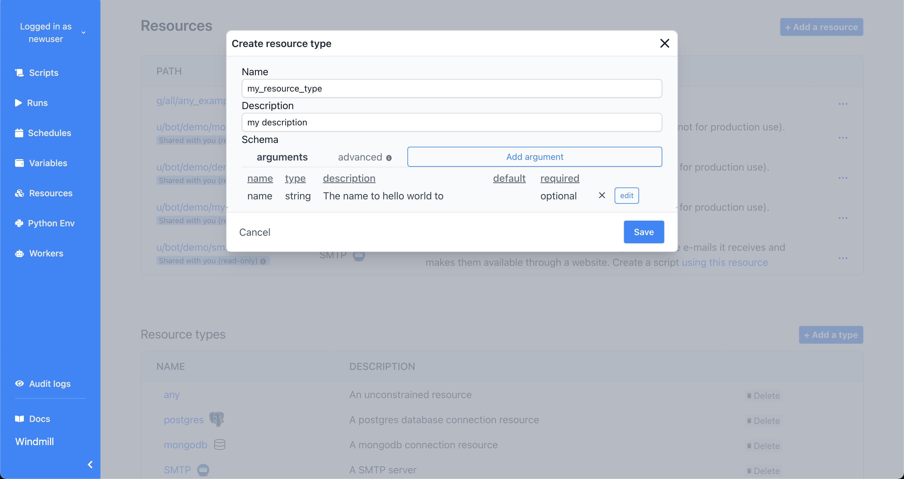
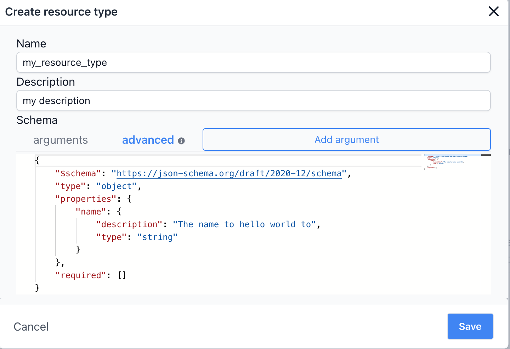

# Resources and Resource Types

Each resource has a **resource type** (for example MySQL, MongoDB, Slack, etc),
that defines the schema that any resource of this type needs to implement.
Schemas implement the [json-schema specification](https://json-schema.org/).

## Create a Resource

To create a resource using an existing type, go to the **Resources** page, then
**Add a resource**:



Just like most objects in Windmill, resources have a path that define their
permissions (also see [ownership path prefix](../reference#owner)).

Each resource has a **resource type**, that defines what fields that resource
contains.



Resources commonly need to access secrets or re-use
[variables](variables_and_secrets), for example password or API tokens. To
insert a variable into a resource, use **Insert variable** and select a
variable. A variable name will look like `$VAR:<NAME_OF_VAR>`. When resources
are called from a script, the variable reference will be replaced by its value.

Tip: It's a good practice to link a script template to resources, so that users
can easily get started with it. You can use markdown in the description field to
add a link, for example:

```md
[example script with this resource](/scripts/add?template=script/template/path)
```

## Create a Resource Type

Windmill comes preloaded with a few common resource types (databases, SMTP,
etc). Resource types can easily be defined using a wizard. From the **resources
page**, click Add type.



Use the Add arguments button to add a field to the resource type. You can
specify constraints for the field (a type, making it mandatory, specifying a
default, etc). You can also view the schema using the advanced tab:



## Using Resources

In Windmill, [resources](../reference#resource) represent connections to third
party systems. Resources are a good way to define a connection to a frequently
used third party system such as a database. Think of resources as a structured
way to store configuration and credentials, and access them from scripts.

Each resource has a **resource type** (for example MySQL, MongoDB, Slack, etc),
that defines the schema that any resource of this type needs to implement. To
learn how to define a new resource, see [create_resources.md](create_resources).
For example, a PostgreSQL resource needs to contain a `dbname`, a `username`, a
`host`, etc.


Provided you have the right permissions, you can access resources from scripts
using the Windmill client. For example, to access the `u/bot/demo/demodb`
posgtgres resource we would:

```python
psycopg2 # we want to connect to a PostgreSQL database, so we import the `psycopg2` connector
import wmill # the Windmill client, used to access resources


def main():
    client = wmill.Client()
    pg_con = client.get_resource(resource)
	# returns {'dbname': 'demo', 'host': 'demodb.delightool.xyz', 'password': 'demo', 'port': 6543, 'sslmode': 'disable', 'user': 'demo'}

    conn = psycopg2.connect(**pg_con) #unpack the resource and pass it to psycopg2
    cur = conn.cursor() 3 now query the database
    cur.execute(f"{query};")
    if cur.description:
        return cur.fetchall()
    else:
        return None
```

For each resource type that you use, you'll likely rely on a python library
(psycopg2 in this example). Windmill allows you to
[define resource types](create_resources) and use any dependencies.
