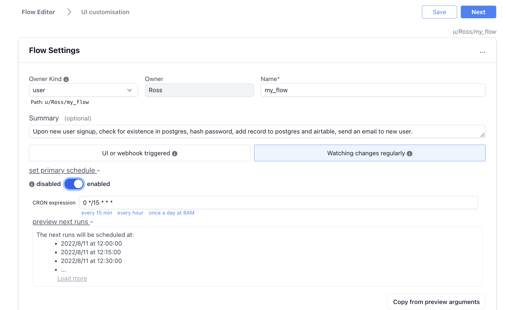
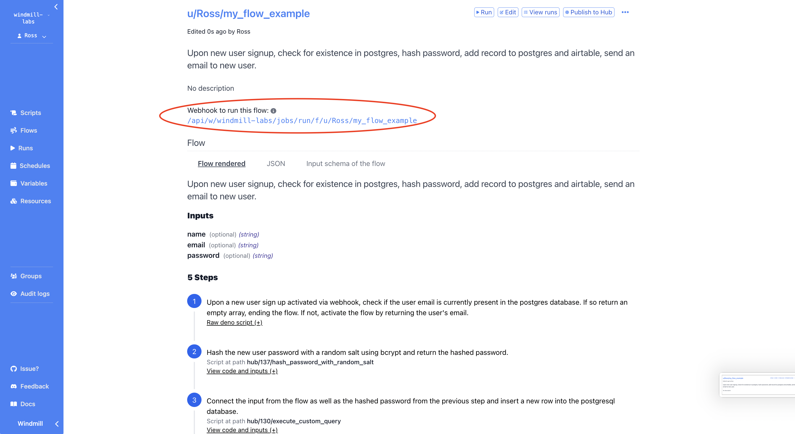

# Trigger flows based on external changes

There are two ways to trigger a Windmill Flow. Flows can be scheduled or flows can be triggered by Windmill's UI or through the flow's webhook.

## Scheduled

**Watching for changes regularly** - The first module of this type of flow is a
trigger script whose purpose is to pull data from an external source and return
all new items since the last run. This type of flow is meant to be scheduled
very regularly to reduce latency when reacting to new events. It will trigger
the rest of the flow once per new item that is returned. If there are no new
items, the flow will be skipped.

Flows can be scheduled through the flow UI using a cron expression and then
activating the schedule as seen in the image below.


The following is an example of the first module of a flow that pulls data
regularly from an external data source, in this case, through a fetch request to
an API endpoint that returns new user sign up data which is returned as a
dictionary of new entries.

```js
import * as wmill from "https://deno.land/x/windmill@v1.27.2/mod.ts";
import { Client } from "https://deno.land/x/postgres@v0.16.1/mod.ts";

export async function main(url: string, db: wmill.Resource<"postgresql">) {

    let resp = await fetch(
        url,
        {
            method: "GET",
        },
    );

    let data = await resp.json();

    let new_entries = {};
    for (let i in data) {
      db.database = db.dbname;
      db.hostname = db.host;
      const client = new Client(db);
      await client.connect();

      let check_user_query = `SELECT user_id FROM usr WHERE email='${data[i]["email"]}'`;
      let check_user = await client.queryObject(check_user_query);

      if(check_user["rows"]){      
        new_entries[data[i]["email"]] = {
          password: data[i]["password"],
          name: data[i]["name"],
          };
      }
    }
    
    return new_entries;
}
```

## Triggered


A flow that can be triggered always starts 
with a [trigger script](../reference#trigger-scripts).
It determines whether the remainder of the flow will be executed. 

The first module of this type of flow is a script who's
purpose is to run when it receives an input from it's associated webhook or when
it is run manually through the flow's automatically generated UI.

Webhooks can be retrieved once a flow is saved from the flow's summary page as
seen in the image below.


The following module is triggered by a webhook (obtained from the flow summary
page) that sends user sign up data (email, password, name) to the flow. The flow
could also be triggered by manually entering the user data through the user
generated interface or be setting up a schedule. The first module of the flow
takes in the user email from the flow input and begins the flow if the email is
not already present in the database.

```js
import * as wmill from "https://deno.land/x/windmill@v1.27.2/mod.ts";
import { Client } from "https://deno.land/x/postgres@v0.16.1/mod.ts";

export async function main(
  db: wmill.Resource<"postgresql">,
  email: string,
) {

  db.database = db.dbname;
  db.hostname = db.host;
  const client = new Client(db);
  await client.connect();

  const check_user_query = `SELECT user_id FROM usr WHERE email='${email}'`;
  let check_user = await client.queryObject(check_user_query);

  return (check_user["rows"] ? [`${email}`] : []);
}
```
