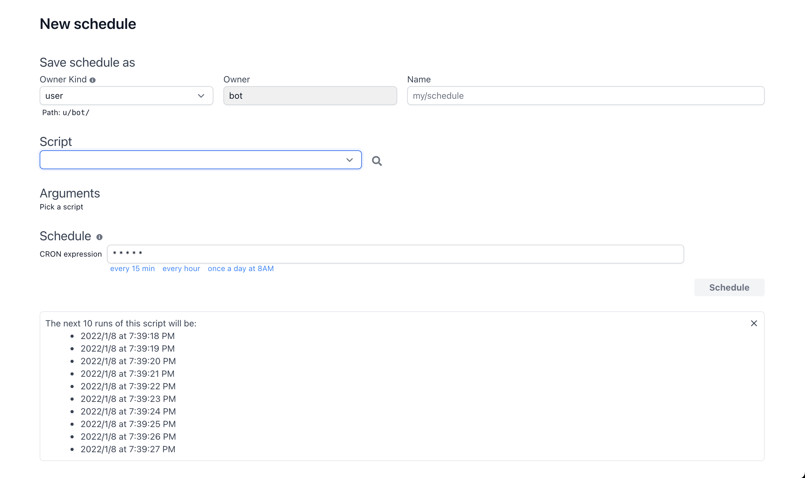
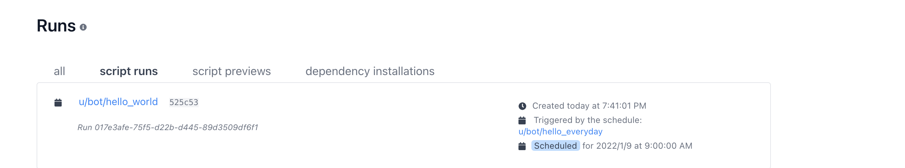
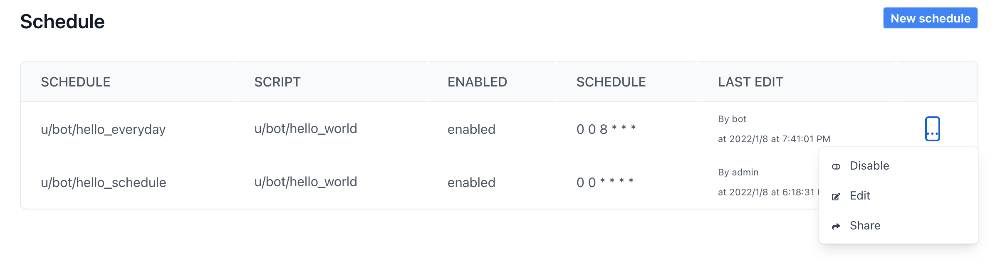

# Run a script on a schedule

Windmill allows you to define schedules for scripts. Once a schedule is defined,
it will automatically run the script at the set frequency. Think of it as an
easy-to-use cron scheduler that you can share with other users.

A schedule consists of a script, script arguments, and a CRON expression that
controls when to the script.

Once a schedule is defined, the next occurrence of the script will be listed out
in the Runs page:

Schedules can be disabled from the Schedules page. Once disabled, the schedule
will not run the script anymore and will clear any upcoming run:

