# Suspend/resume a flow

Flows can be suspended until resume or cancel event(s) are received. This
feature is most useful to implement approval steps but can be used flexibly for
other purpose.

You can think of a scenario where only specific people can resume (or cancel)
a flow. To achieve this they would need to receive personalized URL via some
external communication channel (like email, SMS or chat message).

Important thing to remember is that a number of required approvals can be
customized. This allows some flexibility for a cases where you either require
approvals from all authorized people or only from one.

## Approval script - Gmail example

#### Adding Gmail resource

Lets start with adding Gmail resource. From "Resources" view select "Connect an
API" and then let's sign in with Google

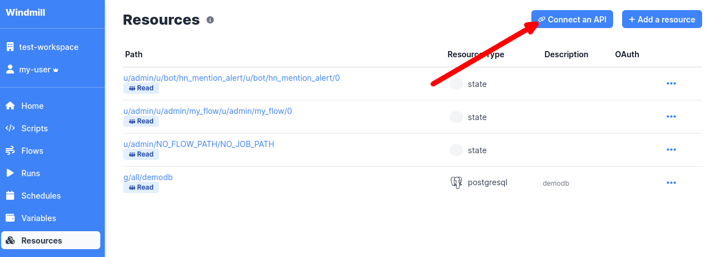

You will be redirected to Google Accounts and asked to log in. After
authentication you will be redirected back to Windmill.

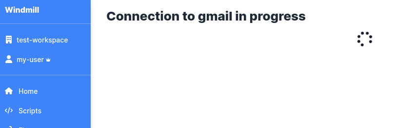

From now on, whenever you use this resource, Windmill script will send emails
via Gmail on your behalf.

#### Reusing script from WindmillHub

Let's create a flow as described in [getting started
section](../getting_started/flows.md#creating-a-flow). Our first step will be
approval script from WindmillHub

Make sure to fill required fields, especially choose Gmail resource and define
approver emails (this are email addresses of people that are authorized to
resume a flow and this is where Windmill job will send resume URL).

#### Check how it works!

For the sake of this example let's add a "dummy" hello world script as a 2nd
stop in our flow

We can test our flow now

You can notice that after first step flow is suspended and is waiting for
approval

Let's imagine that you are now the person that is authorized to resume a
suspended flow. You should receive an email with URL that leads to webpage like
this

You can now resume a flow and see that the flow finished with "Success" status.

Cool, isn't it?

## Notifying about approver(s) that resumed a flow - Slack example

In this example we're extending the flow with approval step from previous
example. Windmill will send a notification as a message in Slack channel about
approver(s) that resumed a flow.

#### Adding Slack resource

First lets add a Slack resource. From "Resources" view select "Connect an API"
and then select Slack

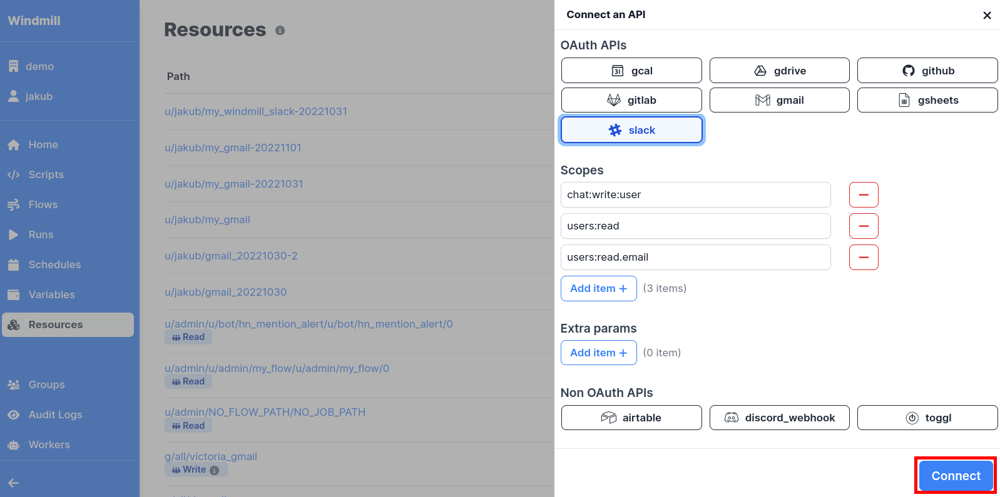

#### Re-using script from WindmillHub

Now let's extend our existing flow (that already has an approval step) with a
script that will use "The list of approvers" from the "Step Context"

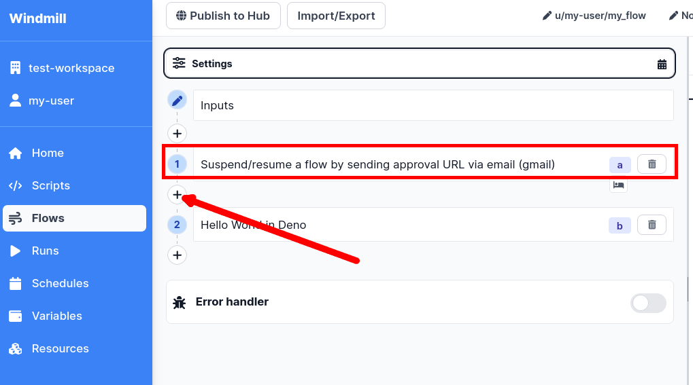

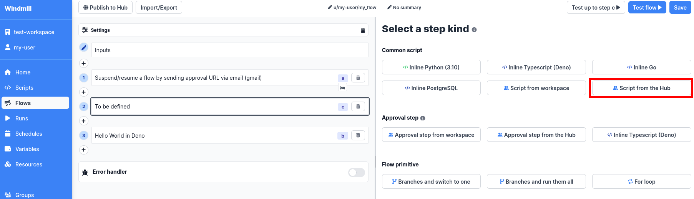

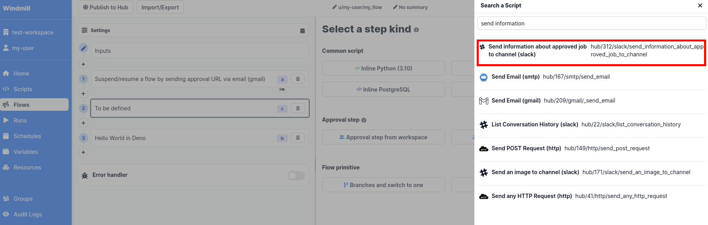

#### Step Context magic

This is where the magic begins - the "Step Context". You can notice that we
have access to the list of approves from previous approval step.

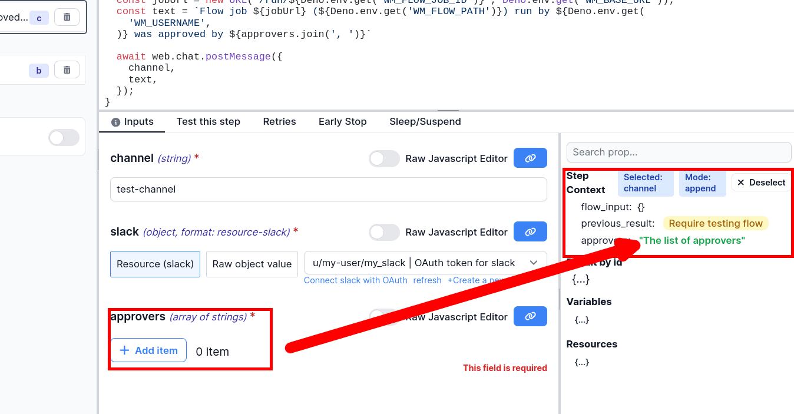

Now all we have to do is to inject this particular step context to the
"approvers" argument of our script! There is more than one way of doing this,
but this time we will use the UI feature. All you have to do is to click on
"link" icon and then select "approvers"

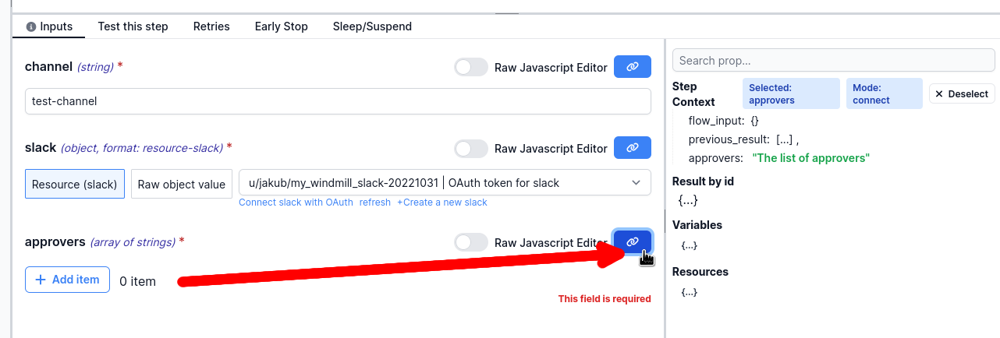

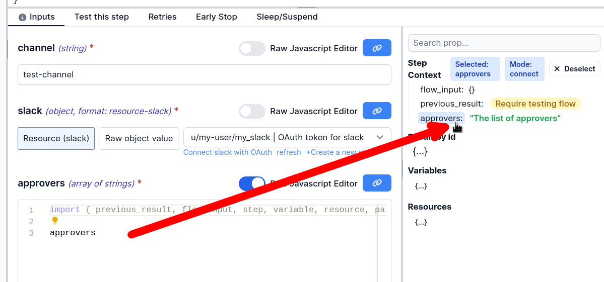

#### Lets test it

Run the flow. Resume it ...

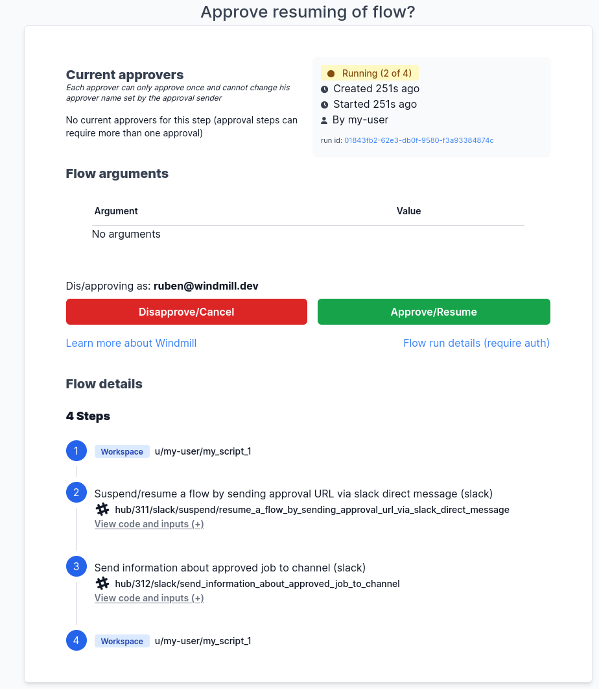

... and find the notification on Slack channel

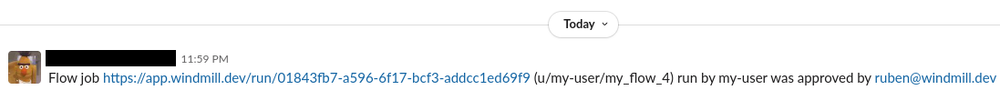
