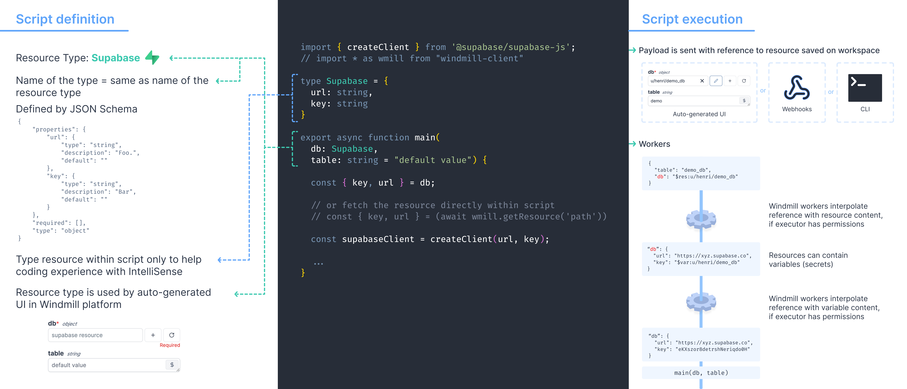

import DocCard from '@site/src/components/DocCard';

# Integrations on Windmill

Integrations are key on Windmill as they allow databases (internal & external) and service providers to interact.

Using Windmill, integrations are referred to as [resources and resource types](../core_concepts/3_resources_and_types/index.mdx). Each Resource has a Resource Type (RT for short) - for example MySQL, MongoDB, Slack, etc. - that defines the schema that the resource needs to implement.

We already have pre-set integrations (or resource types), the list is available on our [Hub](https://hub.windmill.dev/resources), [using Windmill](../intro.mdx) (most up-to-date version), and at the end of this article.

How resources and resource types work in Windmill:

	<DocCard
		title="Resources and resource types"
		description="Resources are structured configurations and connections to third-party systems, with Resource types defining the schema for each Resource."
		href="/docs/core_concepts/resources_and_types"
	/>

## Using integrations

Interacting with an integration means using a resource, see the dedicated doc part:

	<DocCard
		title="Using Resources"
		description="Resources can be used passed as script parameters or directly fetched within code."
		href="/docs/core_concepts/resources_and_types#using-resources"
	/>

 

<iframe
	style={{ aspectRatio: '16/9' }}
	src="https://www.youtube.com/embed/ggJQtzvqaqA"
	title="YouTube video player"
	frameBorder="0"
	allow="accelerometer; autoplay; clipboard-write; encrypted-media; gyroscope; picture-in-picture; web-share"
	allowFullScreen
	className="border-2 rounded-lg object-cover w-full dark:border-gray-800"
></iframe>

## You feel one integration is missing?

### Create one

You can [create a resource type](../core_concepts/3_resources_and_types/index.mdx#create-a-resource-type). Use the "Add Property" button to add a field to the resource type. You can specify constraints for the field (a type, making it mandatory, specifying a default, etc). You can also view the schema by toggling the "As JSON" option.

Once you're comfortable with the new integration, we would be super grateful if you could [share it on Hub](../misc/1_share_on_hub/index.md).

You will be asked to fill Name, Integration (the corresponding service it interacts with) and Schema (the JSON Schema of the Resource Type).

Verified Resource types on the Hub are directly added to the list of available Resource types on each new Windmill instance synced with the Hub.

	<DocCard
		title="Create a Resource Type"
		description="Resource types define the schema for each Resource."
		href="/docs/core_concepts/resources_and_types#create-a-resource-type"
	/>

### Ask for one

Just [reach out to us](../misc/6_getting_help/index.mdx), we'll be happy to listen to your needs and add your request to the list of integrations.

	<DocCard
		title="Contact / Getting help"
		description="Getting stuck using Windmill? Your problem can be quickly solved and reporting it is the best way to contribute!"
		href="/docs/misc/getting_help"
	/>

## List of integrations

### OAuth APIs

On [self-hosted instances](../advanced/1_self_host/index.mdx), integrating OAuth APIs will require [Setup OAuth and SSO](../misc/2_setup_oauth/index.mdx).

| Service Provider                        | Description                                              |
| --------------------------------------- | -------------------------------------------------------- |
| [Google Calendar (gcal)](./gcal.md)     | Time-management and scheduling web application           |
| [Google Drive (gdrive)](./gdrive.md)    | Cloud-based storage platform                             |
| [Gmail](./gmail.md)                     | Free email service provided by Google                    |
| [Google Sheets (gsheets)](./gsheets.md) | Online spreadsheet application                           |
| [GitHub](./github.mdx)                  | Web-based platform for version control and collaboration |
| [GitLab](./gitlab.mdx)                  | Web-based Git-repository manager with CI/CD capabilities |
| [LinkedIn](./linkedin.md)               | Professional networking and career development platform  |
| [Slack](./slack.mdx)                    | Instant messaging and collaboration platform             |
| [Microsoft Teams](./teams.mdx)           | Team collaboration and communication platform            |

### Non OAuth APIs & resources

| Service Provider                                  | Description                                                                                                               |
| ------------------------------------------------- | ------------------------------------------------------------------------------------------------------------------------- |
| [Airtable](./airtable.md)                         | Cloud collaboration platform for organizing and managing data                                                             |
| [Appwrite](./appwrite.md)                         | End-to-end backend server for web and mobile apps                                                                         |
| [AWS](./aws.md)                                   | Cloud computing platform offering various services like computing, storage and databases                                  |
| [AWS S3](./aws-s3.mdx)                            | Cloud storage service                                                                                                     |
| [BigQuery](./bigquery.mdx)                        | Cloud-based data warehousing platform                                                                                     |
| [ClickHouse](./clickhouse.md)                     | Open-source column-oriented database management system                                                                    |
| [Cloudflare R2](./cloudflare-r2.mdx)              | Cloud object storage service for data-intensive applications                                                              |
| [Datadog](./datadog.md)                           | Monitoring and analytics platform for cloud-scale infrastructure and applications                                         |
| [Discord](./discord.md)                           | Voice, video, and text communication platform for gamers                                                                  |
| [DuckDB](./duckdb.md)                             | Open-source, in-process SQL OLAP database management system                                                               |
| [FaunaDB](./faunadb.md)                           | Serverless, document-oriented database for modern applications                                                            |
| [Funkwhale](./funkwhale.md)                       | Open-source music streaming and sharing platform                                                                          |
| [Git repository](./git_repository.mdx)            | Remote git repository for distributed version control systems                                                             |
| [Google Cloud Platform (gcp)](./gcp.md)           | Suite of cloud computing services for building and deploying applications                                                 |
| [HubSpot](./hubspot.md)                           | Inbound marketing, sales, and customer service platform                                                                   |
| [Linear](./linear.md)                             | Project management tool for software development teams                                                                    |
| [Linkding](./linkding.md)                         | Self-hosted bookmark manager                                                                                              |
| [Mailchimp](./mailchimp.md)                       | All-in-one marketing platform for small businesses                                                                        |
| [Mailchimp Mandrill](./mailchimp_mandrill.md)     | Delivery service for transactional emails from websites and applications                                                  |
| [Mastodon](./mastodon.md)                         | Open-source, decentralized social network                                                                                 |
| [Matrix](./matrix.md)                             | Open standard for decentralized, real-time communication                                                                  |
| [Microsoft Azure Blob](./microsoft-azure-blob.md) | Microsoft's cloud storage service, an alternative to S3                                                                   |
| [Google Cloud Storage](./google-cloud-storage.mdx) | Google's cloud storage service, an alternative to S3                                                                     |
| [Microsoft Excel](./excel.mdx)                   | Microsoft's spreadsheet application                                                                                        |
| [MongoDB](./mongodb.md)                           | NoSQL document-oriented database                                                                                          |
| [MS SQL](./mssql.md)                              | Database management system                                                                                                |
| [MySQL](./mysql.md)                               | Open-source relational database management system                                                                         |
| [Neon](./neon.md)                                 | Serverless Postgres database                                                                                              |
| [Nextcloud](./nextcloud.md)                       | Suite of client-server software for creating and using file hosting services                                              |
| [Notion](./notion.md)                             | Productivity and note-taking web application                                                                              |
| [OpenAI](./openai.md)                             | Artificial Intelligence service provider                                                                                  |
| [PostgreSQL](./postgresql.md)                     | Open-source object-relational database management system                                                                  |
| [Raycast](./raycast.mdx)                          | Application launcher and productivity software developed for macOS                                                        |
| [Redis](./redis.md)                               | In-memory data structure store used as a database, cache, and message broker                                              |
| [Redshift](./redshift.mdx)                         | Fully managed, scalable data warehouse service designed for large-scale data storage and analytical processing.          |
| [RSS](./rss.md)                                   | Web feed that allows users and applications to access updates to websites                                                 |
| [S3 compatible APIs](./s3.mdx)                    | Cloud-based object storage service designed to store and retrieve any amount of data                                      |
| [SendGrid](./sendgrid.md)                         | Email API and delivery service                                                                                            |
| [SMTP](./smtp.md)                                 | Internet standard for electronic mail transmission                                                                        |
| [Snowflake](./snowflake.mdx)                      | Cloud-based data warehousing platform                                                                                     |
| [Square](./square.md)                             | Payment and financial services provider                                                                                   |
| [Stripe](./stripe.md)                             | Payment processing platform                                                                                               |
| [Supabase](./supabase.md)                         | Open-source Firebase alternative                                                                                          |
| [SurrealDB](./surrealdb.md)                       | Cloud-hosted NoSQL database                                                                                               |
| [Svix](./svix.mdx)                                 | Webhooks as a service                                                                                                    |
| [Telegram](./telegram.md)                         | Cloud-based instant messaging and voice over IP service                                                                   |
| [Toggl](./toggl.md)                               | Time tracking software                                                                                                    |
| [Upstash](./upstash.md)                           | Serverless and low-latency Redis-compatible data store for modern applications                                            |
| [MQTT](./mqtt.md)                                 | Lightweight messaging protocol for small sensors and mobile devices                                                       |
