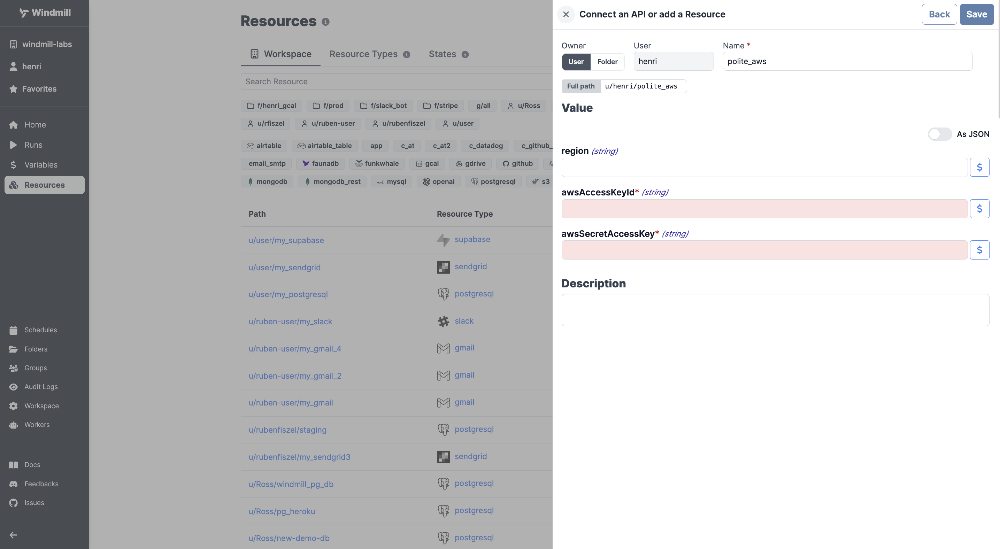

# AWS Integration

To integrate [AWS](https://aws.amazon.com/) to Windmill, you need to save the following elements as a [resource](../core_concepts/3_resources_and_types/index.mdx).

| Property           | Type   | Description                        | Default | Required | Where to Find                                                             |
| ------------------ | ------ | ---------------------------------- | ------- | -------- | ------------------------------------------------------------------------- |
| awsAccessKeyId     | string | AWS Access Key ID for your account |         | true     | AWS Management Console > IAM > Users > [Your User] > Security Credentials |
| awsSecretAccessKey | string | AWS Secret Access Key for account  |         | true     | AWS Management Console > IAM > Users > [Your User] > Security Credentials |
| region             | string | AWS Region for your resources      |         | false    | AWS Management Console > Top Right Corner (e.g., "N. Virginia")           |

  

:::tip

Find some pre-set interactions with AWS on the [Hub](https://hub.windmill.dev/integrations/aws_ecr).

Feel free to create your own AWS scripts on [Windmill](../getting_started/00_how_to_use_windmill/index.mdx).

:::
