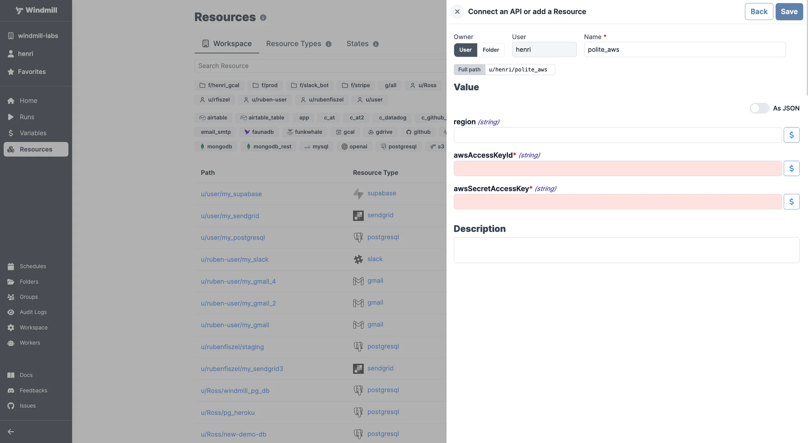

# AWS Integration

[AWS](https://aws.amazon.com/) is a cloud computing platform offering various services like computing, storage and databases.

To integrate AWS to Windmill, you need to save the following elements as a [resource](../core_concepts/3_resources_and_types/index.mdx).

:::info Self Host

If you're looking for a way to self-host Windmill using AWS, see [Self-Host Windmill](../advanced/1_self_host/index.mdx).

:::

| Property           | Type   | Description                        | Default | Required | Where to Find                                                             |
| ------------------ | ------ | ---------------------------------- | ------- | -------- | ------------------------------------------------------------------------- |
| awsAccessKeyId     | string | AWS Access Key ID for your account |         | true     | AWS Management Console > IAM > Users > [Your User] > Security Credentials |
| awsSecretAccessKey | string | AWS Secret Access Key for account  |         | true     | AWS Management Console > IAM > Users > [Your User] > Security Credentials |
| region             | string | AWS Region for your resources      |         | false    | AWS Management Console > Top Right Corner (e.g., "N. Virginia")           |

  

Your resource can be used [passed as parameters](../core_concepts/3_resources_and_types/index.mdx#passing-resources-as-parameters-to-scripts-preferred) or [directly fetched](../core_concepts/3_resources_and_types/index.mdx#fetching-them-from-within-a-script-by-using-the-wmill-client-in-the-respective-language) within [scripts](../script_editor/index.mdx), [flows](../flows/1_flow_editor.mdx) and [apps](../apps/0_app_editor/index.mdx).

<video
	className="border-2 rounded-xl object-cover w-full h-full dark:border-gray-800"
	controls
	src="/videos/add_resources_variables.mp4"
/>

 

:::tip

Find some pre-set interactions with AWS on the [Hub](https://hub.windmill.dev/integrations/aws_ecr).

Feel free to create your own AWS scripts on [Windmill](../getting_started/00_how_to_use_windmill/index.mdx).

:::
