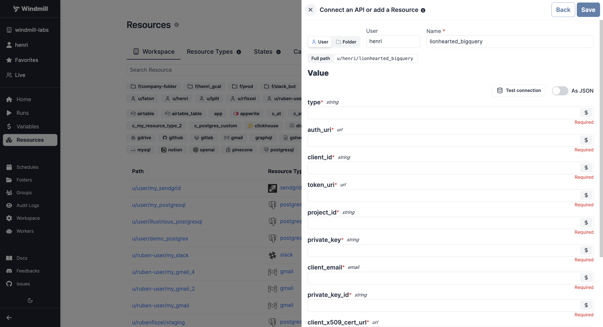

import DocCard from '@site/src/components/DocCard';

# BigQuery Integration

Windmill natively supports BigQuery scripts:

	<DocCard
		title="SQL (PostgreSQL, MySQL, BigQuery, Snowflake) Quickstart"
		description="Learn how to build your first script in PostgreSQL, MySQL, BigQuery, Snowflake."
		href="/docs/getting_started/scripts_quickstart/sql"
	/>

To integrate [BigQuery](https://cloud.google.com/bigquery) with Windmill, you need to gather the following information and save it as a [resource](../core_concepts/3_resources_and_types/index.mdx).

| Property                 | Type   | Description                                    | Default | Required | Where to Find                                            |
| ------------------------ | ------ | ---------------------------------------------- | ------- | -------- | -------------------------------------------------------- |
| auth_provider_x509_cert_url | string | Auth Provider X.509 Cert URL for your account |         | true     | Google Cloud Console > IAM & Admin > Service Accounts |
| client_x509_cert_url     | string | Client X.509 Cert URL for your account         |         | true     | Google Cloud Console > IAM & Admin > Service Accounts |
| private_key_id           | string | Private Key ID for your account                |         | true     | Google Cloud Console > IAM & Admin > Service Accounts |
| client_email             | string | Client Email for your account                  |         | true     | Google Cloud Console > IAM & Admin > Service Accounts |
| private_key              | string | Private Key for your account                   |         | true     | Google Cloud Console > IAM & Admin > Service Accounts |
| project_id               | string | Project ID for your BigQuery resources         |         | true     | Google Cloud Console > IAM & Admin > Project info     |
| token_uri                | string | Token URI for authentication                    |         | true     | Google Cloud Console > IAM & Admin > Service Accounts |
| client_id                | string | Client ID for your account                     |         | true     | Google Cloud Console > IAM & Admin > Service Accounts |
| auth_uri                 | string | Auth URI for your account                      |         | true     | Google Cloud Console > IAM & Admin > Service Accounts |
| type                     | string | Type of your BigQuery authentication            |         | true     | Google Cloud Console > IAM & Admin > Service Accounts |

  

:::tip

Find some pre-set interactions with BigQuery on the [Hub](https://hub.windmill.dev/integrations/bigquery).

:::