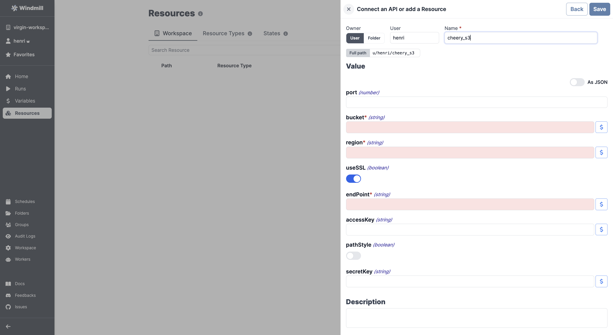

# Cloudflare Integration

[Cloudflare](https://www.cloudflare.com/products/r2/)'s API follows the same schema as any S3 compatible API.

To integrate Cloudflare to Windmill, you need to save the following elements as a [resource](../core_concepts/3_resources_and_types/index.md).

Here is [the information](https://developers.cloudflare.com/r2/api/s3/api/) on where to find the required details:

| Property  | Type    | Description                  | Default | Required | Where to Find                                                        | Additional Details                                                                       |
| --------- | ------- | ---------------------------- | ------- | -------- | -------------------------------------------------------------------- | ---------------------------------------------------------------------------------------- |
| bucket    | string  | S3 bucket name               |         | true     | R2 Dashboard                                                         | Name of the S3 bucket to access                                                          |
| region    | string  | AWS region for the S3 bucket |         | true     | [R2 documentation](https://developers.cloudflare.com/r2/api/s3/api/) | The region is specific to R2 and is set when creating the bucket                         |
| useSSL    | boolean | Use SSL for connections      | true    | false    | [R2 documentation](https://developers.cloudflare.com/r2/api/s3/api/) | SSL/TLS is required for Cloudflare R2                                                    |
| endPoint  | string  | S3 endpoint                  |         | true     | [R2 documentation](https://developers.cloudflare.com/r2/api/s3/api/) | Endpoint URL will be in the format `https://[bucket-id].r2.storage.cloud.cloudflare.com` |
| accessKey | string  | AWS access key               |         | false    | Not applicable for Cloudflare R2                                     | Access key ID is not required for R2                                                     |
| pathStyle | boolean | Use path-style addressing    | false   | false    | Not applicable for Cloudflare R2                                     | Virtual-hosted-style URLs are always used in R2                                          |
| secretKey | string  | AWS secret key               |         | false    | Not applicable for Cloudflare R2                                     | Secret access key is not required for R2                                                 |

  

:::tip

Find some pre-set interactions with S3 on the [Hub](https://hub.windmill.dev/integrations/s3).

Feel free to create your own S3 scripts on [Windmill](../getting_started/00_how_to_use_windmill/index.mdx).

:::
