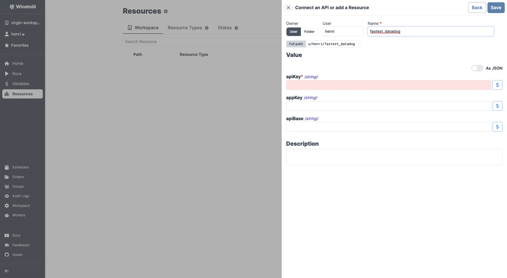

# Datadog Integration

[Datadog](https://www.datadoghq.com/) is a monitoring and analytics platform for cloud-scale infrastructure and applications.

To integrate Datadog to Windmill, you need to save the following elements as a [resource](../core_concepts/3_resources_and_types/index.mdx).

| Property | Type   | Description                         | Default | Required | Where to Find                                                                                    |
| -------- | ------ | ----------------------------------- | ------- | -------- | ------------------------------------------------------------------------------------------------ |
| apiKey   | string | Datadog API key for authentication  |         | true     | Datadog Dashboard > Integrations > APIs > API Keys                                               |
| appKey   | string | Datadog APP key for specific access |         | false    | Datadog Dashboard > Integrations > APIs > Application Keys                                       |
| apiBase  | string | Base URL for the Datadog API        |         | false    | Datadog API documentation (default: `https://api.datadoghq.com` or region-specific API base URL) |

  

Your resource can be used [passed as parameters](../core_concepts/3_resources_and_types/index.mdx#passing-resources-as-parameters-to-scripts-preferred) or [directly fetched](../core_concepts/3_resources_and_types/index.mdx#fetching-them-from-within-a-script-by-using-the-wmill-client-in-the-respective-language) within [scripts](../script_editor/index.mdx), [flows](../flows/1_flow_editor.mdx) and [apps](../apps/0_app_editor/index.mdx).

<iframe
	style={{ aspectRatio: '16/9' }}
	src="https://www.youtube.com/embed/ggJQtzvqaqA"
	title="YouTube video player"
	frameBorder="0"
	allow="accelerometer; autoplay; clipboard-write; encrypted-media; gyroscope; picture-in-picture; web-share"
	allowFullScreen
	className="border-2 rounded-lg object-cover w-full dark:border-gray-800"
></iframe>

 

> Example of a Supabase resource being used in two different manners from a script in Windmill.
 

:::tip

Find some pre-set interactions with Datadog on the [Hub](https://hub.windmill.dev/integrations/datadog).

Feel free to create your own Datadog scripts on [Windmill](../getting_started/00_how_to_use_windmill/index.mdx).

:::
