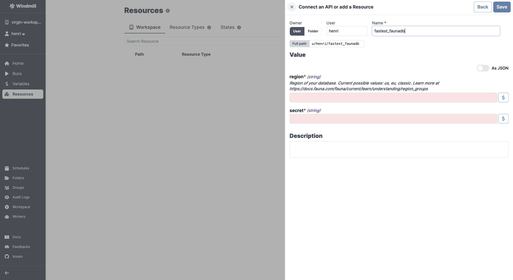

# FaunaDB Integration

To integrate [Fauna](https://fauna.com/) to Windmill, you need to save the following elements as a [resource](../core_concepts/3_resources_and_types/index.md).

| Property | Type    | Description                                                                                         | Default | Required | Where to Find                                              |
|----------|---------|-----------------------------------------------------------------------------------------------------|---------|----------|------------------------------------------------------------|
| region   | string  | Region of your database (us, eu, classic). [More info](https://docs.fauna.com/fauna/current/learn/understanding/region_groups) |         | true     | FaunaDB Dashboard > Database Settings                      |
| secret   | string  | FaunaDB secret key for authentication                                                               |         | true     | FaunaDB Dashboard > Security > Manage API Keys > New Key   |

  

:::tip

Find some pre-set interactions with Fauna on the [Hub](https://hub.windmill.dev/integrations/faunadb).

Feel free to create your own Fauna scripts on [Windmill](../getting_started/00_how_to_use_windmill/index.md).

:::