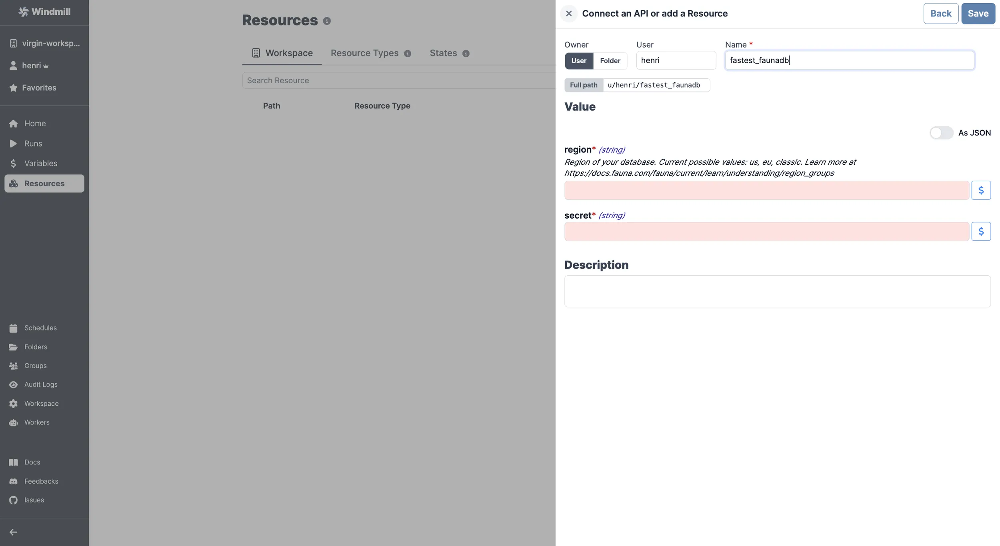

# FaunaDB integration

[FaunaDB](https://fauna.com/) is a serverless, document-oriented database for modern applications.

To integrate Fauna to Windmill, you need to save the following elements as a [resource](../core_concepts/3_resources_and_types/index.mdx).

| Property | Type   | Description                                                                                                                    | Default | Required | Where to Find                                            |
| -------- | ------ | ------------------------------------------------------------------------------------------------------------------------------ | ------- | -------- | -------------------------------------------------------- |
| region   | string | Region of your database (us, eu, classic). [More info](https://docs.fauna.com/fauna/current/learn/understanding/region_groups) |         | true     | FaunaDB Dashboard > Database Settings                    |
| secret   | string | FaunaDB secret key for authentication                                                                                          |         | true     | FaunaDB Dashboard > Security > Manage API Keys > New Key |

  

Your resource can be used [passed as parameters](../core_concepts/3_resources_and_types/index.mdx#passing-resources-as-parameters-to-scripts-preferred) or [directly fetched](../core_concepts/3_resources_and_types/index.mdx#fetching-them-from-within-a-script-by-using-the-wmill-client-in-the-respective-language) within [scripts](../script_editor/index.mdx), [flows](../flows/1_flow_editor.mdx), [low-code apps](../apps/0_app_editor/index.mdx) and [full-code apps](../full_code_apps/index.mdx).

<iframe
	style={{ aspectRatio: '16/9' }}
	src="https://www.youtube.com/embed/ggJQtzvqaqA"
	title="YouTube video player"
	frameBorder="0"
	allow="accelerometer; autoplay; clipboard-write; encrypted-media; gyroscope; picture-in-picture; web-share"
	allowFullScreen
	className="border-2 rounded-lg object-cover w-full dark:border-gray-800"
></iframe>

 

> Example of a Supabase resource being used in two different manners from a script in Windmill.
 

:::tip

Find some pre-set interactions with Fauna on the [Hub](https://hub.windmill.dev/integrations/faunadb).

Feel free to create your own Fauna scripts on [Windmill](../getting_started/00_how_to_use_windmill/index.mdx).

:::
