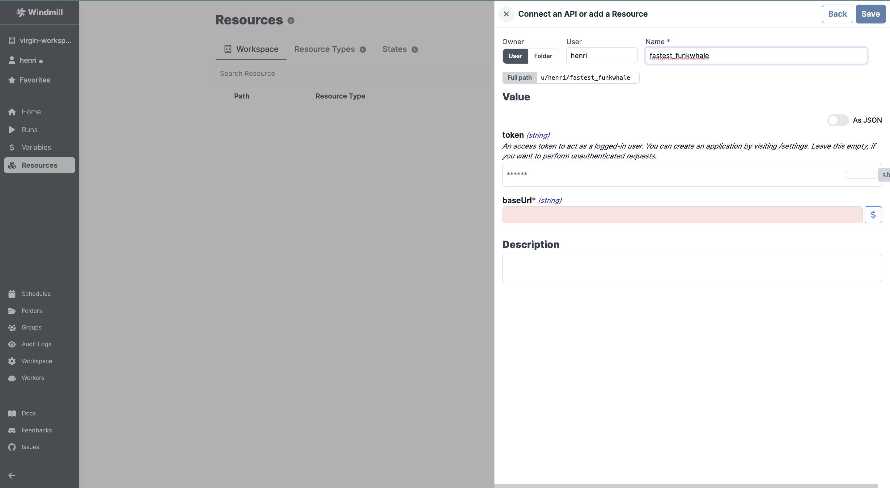

# Funkwhale Integration

To integrate [Funkywhale](https://funkwhale.audio/) to Windmill, you need to save the following elements as a [resource](../core_concepts/3_resources_and_types/index.md).

| Property | Type    | Description                                                                              | Default | Required | Where to Find                                      |
|----------|---------|------------------------------------------------------------------------------------------|---------|----------|----------------------------------------------------|
| baseUrl  | string  | Base URL of your Funkwhale instance                                                     |         | true     | Authorize URL is at /authorize       |
| token    | string  | Access token to act as a logged-in user (optional for unauthenticated requests)         |         | false    | Funkwhale > Settings > Applications > New Application |

  

:::tip

Find some pre-set interactions with Funkwhale on the [Hub](https://hub.windmill.dev/integrations/funkwhale).

Feel free to create your own Funkwhale scripts on [Windmill](../getting_started/00_how_to_use_windmill/index.md).

:::