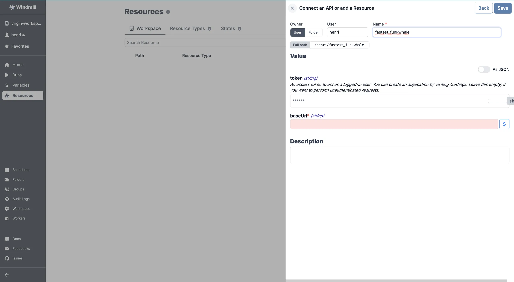

# Funkwhale Integration

[Funkwhale](https://funkwhale.audio/) is an open-source music streaming and sharing platform.

To integrate Funkwhale to Windmill, you need to save the following elements as a [resource](../core_concepts/3_resources_and_types/index.mdx).

| Property | Type   | Description                                                                     | Default | Required | Where to Find                                         |
| -------- | ------ | ------------------------------------------------------------------------------- | ------- | -------- | ----------------------------------------------------- |
| baseUrl  | string | Base URL of your Funkwhale instance                                             |         | true     | Authorize URL is at /authorize                        |
| token    | string | Access token to act as a logged-in user (optional for unauthenticated requests) |         | false    | Funkwhale > Settings > Applications > New Application |

  

Your resource can be used [passed as parameters](../core_concepts/3_resources_and_types/index.mdx#passing-resources-as-parameters-to-scripts-preferred) or [directly fetched](../core_concepts/3_resources_and_types/index.mdx#fetching-them-from-within-a-script-by-using-the-wmill-client-in-the-respective-language) within [scripts](../script_editor/index.mdx), [flows](../flows/1_flow_editor.mdx) and [apps](../apps/0_app_editor/index.mdx).

<video
	className="border-2 rounded-lg object-cover w-full h-full dark:border-gray-800"
	controls
	src="/videos/add_resources_variables.mp4"
/>

 

> Example of a Supabase resource being used in two different manners from a script in Windmill.

 

:::tip

Find some pre-set interactions with Funkwhale on the [Hub](https://hub.windmill.dev/integrations/funkwhale).

Feel free to create your own Funkwhale scripts on [Windmill](../getting_started/00_how_to_use_windmill/index.mdx).

:::
